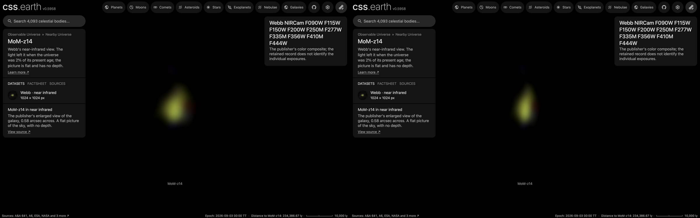

# MoM-z14 picture

A published picture of MoM-z14 stands at its place and distance as one flat image facing the Sun. It is a picture
of the sky: nothing in it has depth, and seen from the side it is a line.

## Sources

| Selected source | Input and meaning |
| --- | --- |
| [ESA/Webb weic2603a](https://esawebb.org/images/weic2603a/) | [Record](../../sources/esawebb-weic2603a.json). Webb NIRCam, ten filters from 0.9 to 4.4 µm, the shortest wavelengths blue and the longest red. A window of the publisher's Large JPEG (24567 × 10239 px), written at 1024 × 1024 px (`source/source.jpg`, made by [`picture-source.mts`](../../../packages/bake/authoring/far-destinations/picture-source.mts); not tracked). [CC BY 4.0](https://esawebb.org/copyright/), credit: NASA, ESA, CSA, STScI, R. Naidu (MIT), Image Processing: J. DePasquale (STScI). A display composite, not calibrated photometry. |
| [Naidu et al. (2025), A Cosmic Miracle: A Remarkably Luminous Galaxy at z = 14.44 Confirmed with JWST, Open Journal of Astrophysics](https://arxiv.org/abs/2505.11263) | [Record](../../sources/publication-naidu-2025-mom-z14.json). Position 150.0933°, 2.2732° and redshift 14.44 ± 0.02: RA 150.0933255°, Dec 2.2731627° (SIMBAD, coordinate reference arXiv:2505.11263); abstract: z_spec = 14.44 +0.02 -0.02. |
| [Planck Collaboration (2020)](https://arxiv.org/abs/1807.06209) | [Record](../../sources/planck-2018-cosmology.json). The cosmology that turns the redshift into a distance: comoving distance 10,382 Mpc, light travel time 13.50 billion years, age of the universe then 283 million years (Astropy 8.0.1, `Planck18`). |

## The picture

- **Placement:** The publisher's file carries no sky tags. Nine saturated stars of the field were matched to Gaia DR3 (least squares, rms 0.47 arcsec): 0.2453 arcsec per pixel at the 4,000 px Publication JPEG, 0.0399 arcsec per pixel at full size, north 90.1° left of vertical; the paper's position falls 0.4 arcsec from the centre of the small square the publisher draws on the field. That square is 22 px inside (0.879 arcsec) and the enlarged view 4,537 px inside, so one pixel of the enlarged view is 0.000194 arcsec, to about 5% (one pixel of the square). The window is 3,000 px of the enlarged view centred on the galaxy's light, clear of the publisher's label.
- **Plane:** the picture's own tangent plane, facing the Sun. The picture is centred on the object. The recipe's small inclination is not a measurement: the bake needs a plane with some depth along the sight line. This is where a sky picture lies, not a measured orientation of the object.
- **Size:** 0.58 arcsec across, 29.2 kpc × 29.2 kpc at the object's comoving distance (the angle times the distance). The page frames 14.6 kpc, half the picture's short side.
- **Sky:** light below 20 of 255 is taken as sky and left transparent, so the universe's own dots show through it. The floor is a presentation value set just above the frame's own background (its 75th percentile), so the frame does not show as a grey square; faint light below it is lost.
- **Edges:** the outer 4% of the frame fades out, so the picture has no hard rectangular edge.
- **Bytes:** one image at 1024 px on its long side (WebP quality 70, alpha quality 80), as the Milky Way's backing image is.

## Evidence

The MoM-z14 page in headless Chromium at 1440 × 900, device pixel ratio 2, on this branch on 2026-10-02: the default
arrival and the camera turned part of the way round.

## Measured, chosen and inferred

| Value | Kind |
| --- | --- |
| Position 150.0933°, 2.2732° and redshift 14.44 ± 0.02 | Measured: the papers above |
| Distance 10,382 Mpc | Derived: the redshift's comoving distance in the Planck 2018 cosmology |
| Field, scale and rotation of the picture | The publisher's or the service's own geometry, as the Placement note says |
| Flat plane facing the Sun | The geometry of a sky picture; no depth is measured or drawn |
| Window, sky floor, edge fade, 1,024 px, framing radius, 0.001° inclination | Presentation |

## Known problems

- The picture is flat: seen from the side it is a line, and from behind it is mirrored.
- Everything in the frame stands on the object's plane, whatever its own distance. A 3,000 px window of the publisher's enlarged view, centred on the galaxy; the publisher's label lies outside it. The enlarged view is the publisher's resampling of a few native pixels.
- The size is a comoving size: the angle times the comoving distance. The object's proper size at its redshift is smaller by 1 + z.
- The page opens with ecliptic north up, as every page does, so the picture arrives turned from the publisher's orientation.
- A flight from another page keeps the travelling camera's angle, so it can arrive seeing the picture from an oblique angle or
  nearly from the side. Opening the page directly faces the picture.
