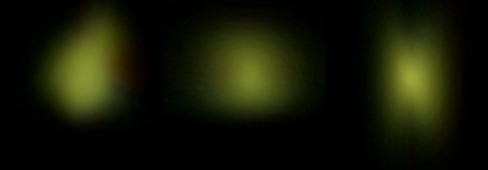

# MoM-z14

MoM-z14 drawn as a volume of light on its own page, [MoM-z14](../mom-z14/README.md). The galaxy is a few native pixels
of the telescope, so the volume is almost entirely a published model of its shape; the publisher's picture gives the
color and brightness. **Depth is modelled, not measured.**

## Sources

| Selected source | Input and meaning |
| --- | --- |
| [ESA/Webb weic2603a](https://esawebb.org/images/weic2603a/) | [Record](../../sources/esawebb-weic2603a.json). Webb NIRCam, ten filters from 0.9 to 4.4 µm. A 488 × 488 px window of the publisher's Publication JPEG (4000 × 1667 px), read by the lab recipe. [CC BY 4.0](https://esawebb.org/copyright/), credit: NASA, ESA, CSA, STScI, R. Naidu (MIT), Image Processing: J. DePasquale (STScI). A display composite, not calibrated photometry. |
| [Naidu et al. (2025)](https://arxiv.org/abs/2505.11263) | [Record](../../sources/publication-naidu-2025-mom-z14.json). Section 3.2 and Table 1, the forcepho fit to F200W, F277W and F356W: Sérsic index 1.0 ± 0.2, semi-major axis 147 (+19, −20) pc (45.0 mas at the paper's 98 pc per 30 mas), axis ratio 0.25 (+0.11, −0.06), circularized radius 74 (+15, −12) pc, "extended along the North-South direction". |
| [Planck Collaboration (2020)](https://arxiv.org/abs/1807.06209) | [Record](../../sources/planck-2018-cosmology.json). The cosmology that turns the redshift 14.44 ± 0.02 into the comoving distance 10,382 Mpc, as the [host](../mom-z14/README.md) records. |

The picture is the publisher's and not the telescope's science pixels: the lab recipe reads a display image by URL,
and a cutout of the archive's mosaics would need a display transfer of our own and a hosted file. The archive route is
recorded in the [ledger](investigations.json).

## Method

The Nebula Lab recipe is [labs/nebula/models/mom-z14/experiment.json](../../../labs/nebula/models/mom-z14/experiment.json);
`node labs/nebula/run.mts prepare-emission` runs it, and [delivery.json](source/delivery.json) places the result. It is
[M49's route](../m49-volume/README.md#method) without the cleaning steps.

1. **Window:** 488 px of the publisher's enlarged view, centred on the galaxy's light. The file carries no sky
   tags; the project measured 0.0011915″ per pixel (to about 5%; 0.000194 arcsec per pixel of the 24,567 px Large JPEG) and north 90.14° left of vertical
   ([record](../../sources/esawebb-weic2603a.json)), so the window is 0.58″ across and the delivery turns it by
   90.14°.
2. **Black level:** the channels lose 23, 22 and 29 of 255, at or above the brightest background of the window (23, 22 and 29), so no box or outline is drawn. A presentation choice: it keeps 51% of the light above the window's median background.
3. **Depth:** the light along each sight line is spread in depth by the deprojected density (Prugniel & Simien 1997) of
   Naidu et al.'s fit: index 1.0, half-light radius along the major axis 45.0 mas (2.3 kpc comoving; 147 pc proper), axis ratio 0.25. The major axis is put at position angle 0°, north to south: the paper states the direction in words and gives no angle. The spheroid's axis is the minor axis, placed in the plane of the sky; no intrinsic axis is measured.
   It ends at 12 half-light radii, outside all the light that is left (8.6 at most), so nothing is cut
   at its edge.

Values chosen here, not measured or published:

- The end of the spheroid and the black level, set together so that no light is cut and no background is drawn.
- The major axis at position angle 0°, a reading of "extended along the North-South direction"; the paper gives no number or error.
- The 64-cell grid (the nearby ellipticals use 150): the picture holds no finer detail, and the tracked inputs stay
  under 1 MB. Display exposure 1.5 is M87's.

## Evidence

The MoM-z14 page in headless Chromium at 1440 × 900, device pixel ratio 2, on this branch on 2026-10-02, zoomed in: the
arrival view, then the camera turned to the side and to above the galaxy.

- The volume reproduces the window above the black level along every sight line: under 0.1% of that light lies
  outside the spheroid.
- Soft edges: in five views (arrival, side, above and two oblique) zoomed until the object fills a third of the
  frame, the largest brightness step between neighbouring pixels on the outline is 4.4 of 255, and 6.4 anywhere in the scene.
- Tests: `labs/nebula/packages/reconstruction/src/methods/symmetry/shape-prior.test.ts` pins the Sérsic spheroid.

## Known problems

- The galaxy is a few native pixels. The picture is the publisher's enlargement of them, still blurred by the telescope,
  so what is drawn is almost entirely the published model, colored and scaled by the picture.
- The blur makes the picture wider than the published ellipse: the drawn shape is the blurred picture's extent on the
  published model's depth, not the deconvolved galaxy.
- The black level keeps 51% of the light above the window's median background; the faint outer light is not drawn.
- The paper notes a hint of a second component along the elongation; one spheroid is drawn.
- Sizes are comoving, the angle times the comoving distance; proper sizes at this redshift are smaller by 1 + z.
- The scale of the enlarged view is the project's measurement from the publisher's inset square, to about 5%; 0.000194 arcsec per pixel of the 24,567 px Large JPEG.
- The color is the publisher's display composite of infrared filters, not what an eye would see.
