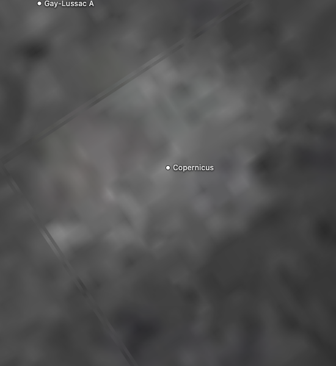
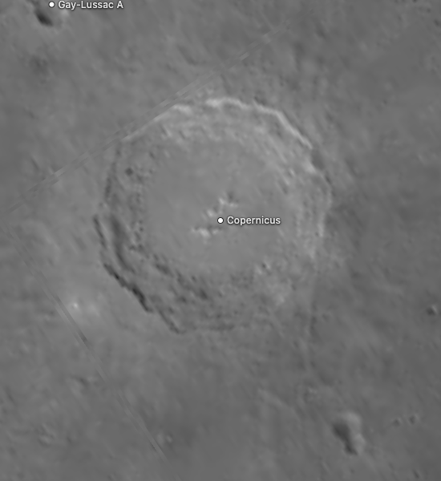

# Moon source and preparation record

The Moon combines LRO imagery and numeric science products with interpreted geology and a modeled crust-thickness display, prepared on the shared raster lane used by Mercury, Venus and Mars.

The navigation marker uses its existing source map as a stylized identifier. The [marker recipe](source/preparation/navigation.json) crops and resizes it, then prepares a circular alpha edge and the shared full-phase curvature shading (35% ambient, 65% diffuse). It is not an observer projection or a view at the scene epoch.

## Sources

| View or quantity | Source |
| --- | --- |
| Monochrome surface | [LROC WAC global morphologic mosaic v1.3](https://data.lroc.im-ldi.com/lroc/view_rdr_product/WAC_GLOBAL_E000N1800_032P), 643 nm photography, 11,520 × 5,760 pixels |
| Elevation | LRO LOLA LDEM16 v3.1 |
| Midnight temperature, heat anomalies, rock abundance | [LRO Diviner GHRM v1.0](https://pds-geosciences.wustl.edu/lro/urn-nasa-pds-lro_diviner_derived1/data_derived_ghrm/img/), 2009–2022, false-color thermal estimates within ±70° |
| Geology | [USGS Unified Geologic Map v2 (2020)](https://astrogeology.usgs.gov/search/map/unified_geologic_map_of_the_moon_1_5m_2020), 49 units |
| Silicate signature | [Lucey et al. (2021)](https://zenodo.org/records/4558194), Christiansen-feature wavelength |
| Crust thickness | [NASA GRAIL visualization](https://svs.gsfc.nasa.gov/4014/), based on gravity and topography models |
| Named features | [IAU/USGS Gazetteer of Planetary Nomenclature](https://planetarynames.wr.usgs.gov/Page/MOON/target) the Moon centre-point export, snapshot 2026-09-11, public domain. IAU-adopted names with centre, diameter, extent and name origin; labels appear at the closest zoom only, and a selected feature stays labelled. |

Source selections, recorded trials and open questions are in the [investigation ledger](investigations.json).

## Evidence

Photographic refresh, 12 September 2026, on base `3efdf2c9`: the new native
LROC map replaces the 2K CGI texture. These are actual Chrome captures at the
same Copernicus camera, 1280 × 720, DPR 1; the crops omit the sidebar. The
before atlas was reproduced with the exact `53b262bd` delivery hash.

| Before | Current |
| --- | --- |
|  |  |

The PDS reader's two focused checks cover pixel-centre registration, 180° output
origin, footprint integration, observed black and invalid samples. Preparation
build/type checks, source-record generation and unchanged scene/geometry checks
pass. Browser inspection covers Shadows on/off and the same canonical atlas at
DPR 1 and 2. The five photographic files total 17.54 MB, previously 2.28 MB;
the largest decoded atlas is 195 MiB. This is a photographic refresh, not a new
qualification of the scientific views. Seven unrelated scientific thumbnails
were unavailable in the local checkout; the cross-body search preview was
restricted to Moon, Europa and Io.

Earlier shared-lane migration (base `53b262bd`): the static-surface lane was retired for the Moon; the same pinned inputs and the same numeric interpretation (`observationRaster`) now feed the shared raster lane. Verified with the package, source-closure, minimap and browser conformance checks listed in the pull request; the three GHRM grids, LOLA, the Christiansen feature and the geology grid were re-anchored at the Copernicus, Tycho and Tsiolkovskiy cells after the lane change. No new science review is claimed.

[The September 2026 lunar thermal review](https://github.com/layoutit/cssEarth/blob/8666462797772dc50bbebecd8618014f5e7bd16c/docs/moons/b10-lunar-thermal/VISUAL-REVIEW.md) records source, reproduction, Chrome, installation and test results. All three numeric grids reproduce exactly; 507 independent original-to-atlas probes and eight separately fetched byte anchors pass. Browser captures cover DPR 1 and 2, close zoom and the narrow selector. The scene geometry and retained tree of that review belong to the retired static lane; the current tree is the shared raster-lane sphere. Aggregate readiness remains limited by the shared audit and missing unrelated build inputs.

[Earlier independent source anchors](source/validation/scientific-source-anchors.json) preserve LOLA and the superseded Diviner GDR L3 decoder evidence; they do not validate the new GHRM values.

## Known problems

The existing atlas seams can remain visible at extreme close zoom. This change
retains the geometry and its packing layout.

Named features: the IAU/USGS Gazetteer of Planetary Nomenclature centre-point shapefile for the Moon (retrieved 2026-09-11, public domain per its FGDC metadata) is pinned under `source/features/`. Preparation verifies the archive, reads the attribute table and datum, drops the albedo-feature type code and the 7,063 lettered satellite craters (“Tycho A” and the like, which repeat a parent name), folds repeated rows, converts each positive-east centre through `presentation/surface-map.json` with the map’s left edge at 180° E, and anchors it on the mesh; craters and faculae trace a rim circle, other types their published extent box. Outlines are not published nomenclature boundaries. The map edge was fixed by drawing Gazetteer rims under both edge hypotheses and keeping the one where Tycho and Copernicus coincide with the imagery. The replacement monochrome WAC map preserves that 180° E output edge.

Landing sites: 80 spacecraft landing, touchdown or impact sites and 2 published traverse paths are labelled beside the IAU names (`source/features/sites.json`). Each coordinate quotes the NASA NSSDCA, PDS, LROC, agency or paper page it was read from, with the stated latitude kind and longitude convention; sites are unsized points ranked like a 20 km feature and the caption shows the quoted source sentence with its publisher.

Feature notes: 1749 of the labelled names carry a caption note, the lead summary of their English Wikipedia article (CC BY-SA 4.0, retrieved 2026-09-12), joined through Wikidata's Gazetteer id property and pinned with the article link and revision in `source/features/notes.json`; the caption credits Wikipedia beside the IAU naming year.

- LOLA's 0.5 m quantization and map spacing are not terrain-accuracy estimates; geometry stays spherical.
- Diviner midnight maps combine 2009–2022 observations, not current temperatures. Unobserved polar caps and internal gaps stay neutral. Thermal-model anomalies retain terrain effects and do not establish geothermal activity. Rock abundance estimates area fraction, not boulder counts; values above 2% share the top display color. Per-cell uncertainty is not supplied.
- Christiansen-feature values are wavelengths, not mineral abundances. Coverage stops at ±70° and residual viewing effects remain.
- Geology colors are interpretations; the GRAIL display depends on model assumptions.
- The monochrome mosaic retains photographed crater shadows and differences between observation strips. The Shadows control adds spherical illumination; it cannot relight those shadows. Gray grid marks missing observations. The 947.6 m source grid is not an estimate of camera accuracy. Polar sprites retain their existing resolution.
- The scene now uses the shared physical frame: pole, prime meridian and Sun direction at the shared epoch come from the IAU/WGCCRE rotation model in `src/platform/solar-geometry.mts`, and the Shadows toggle drives a Lambert terminator bank. The retired lane showed limb curvature only.

[Inputs](source/manifest.json) · [Recipe](object.json) · [Credits](NOTICE.md) · [Contributor guide](../README.md)

Package records, physical facts and sky

The Moon is a first-class cssEarth object. It is not mounted inside Earth.

Authored geometry, observation-processing parameters, controls, legends and
physical source bindings live in `source/preparation/`, `source/presentation/`
and `source/content/object.json`, pinned by `object.json`. The generic authored
preparation (`tools/objects/prepare-authored.ts`: raster, celestial, scene,
content, composite presentation, features) compiles those records into
`prepared/*.json`. Each numeric scientific lens declares its interpretation in
the `science` block of `source/preparation/raster.json`; the shared observation
painter decodes source values and missing coverage before display colour is
chosen, at both prepared densities. Unit checks live under
`tests/objects/unit/moon/`; browser checks use the shared conformance suite.

## Physical and orbital facts

- NASA JPL Solar System Dynamics satellite physical parameters:
  <https://ssd.jpl.nasa.gov/sats/phys_par/sep.html>
- NASA JPL Solar System Dynamics satellite mean elements:
  <https://ssd.jpl.nasa.gov/sats/elem/sep.html>
- The checked `source/orbit/moon.json` records the extracted Moon values and
  exact authority-page hashes.

## Scene and sky

- The lighting model is a full-phase Lambert model with a cubic sky term,
  implemented in the repository; its formulation is adapted from the OpenSpace
  globe shader (MIT).
- The directional Sun follows the repository's clean-room directional-sun
  preparation standard. Its direction,
  the pole and the prime meridian at the shared epoch come from the IAU/WGCCRE
  rotation model through `src/platform/solar-geometry.mts`, as for every
  prepared body; the previous static lane claimed no epoch orientation.
- The prepared mesh is the shared sphere: 230 units, 16 latitude bands and 32
  longitude segments, the 50-pixel tile, 0.005 seam overlap, spin origin 0°
  and an 84-second visual rotation (an accelerated presentation choice). The
  6.68° obliquity and the 27.322-day rotation are recorded with the body from
  `source/orbit/moon.json`. Lighting is the Mercury-style Lambert bank (256
  frames, ambient 0.05, terminator smoothstep 0–0.1) with no atmosphere.

Visible surface and crust-thickness sources

The surface uses `WAC_GLOBAL_E000N1800_032P` v1.3, the original attached-label
PDS3 float map. Its label identifies observations from 7 November 2009 to
31 January 2011, a 1,737.4 km planetocentric sphere, east-positive longitude,
32 pixels/degree and a 0–360° extent. The file name describes the map centre;
the label's projection origin is 0°. Preparation reads the actual offsets,
then rotates the output's left edge to 180° E to retain the existing feature registration.

[LROC's native README](https://pds.lroc.im-ldi.com/data/LRO-L-LROC-5-RDR-V1.0/LROLRC_2001/DATA/BDR/WAC_GLOBAL/WAC_GLOBAL_README.TXT) documents the
GLD100/LOLA projection surfaces, LOLA/GRAIL ephemeris, camera calibration and
Hapke photometric correction. See [Speyerer et al. (2011), abstract 2387](https://www.lpi.usra.edu/meetings/lpsc2011/pdf/2387.pdf)
and [Wagner et al. (2015), abstract 1473](https://www.hou.usra.edu/meetings/lpsc2015/pdf/1473.pdf).

The float reader integrates the original pixel footprints into 4,096 × 2,048
and 8,192 × 4,096 display maps. Every contributing sample must be valid; the
PDS special values are withheld and observed zero stays black. Display brightness
is `255 × min(1, (4 × reflectance)^(1/2.2))`. No gaps are interpolated or painted
as terrain. The same interpretation supplies the atlas, polar sprites, thumbnail
and small sidebar map. Latitude bands, UV coordinates, geometry and lighting remain fixed.

The source survey compared the NASA CGI Moon Kit, the LROC Hapke v1.2 colour
tiles and this morphology product. The larger CGI map still fills gaps and uses
LOLA albedo at the poles. Native colour tiles avoid that fill but stop at ±70°
and showed less crater relief. The selected morphology map provides sharper
photographed terrain and polar observations; it is explicitly monochrome.
The old 2K Moon Kit remains the small navigation sprite's source.

Numeric lenses, missing data and qualification limits

## Numeric scientific lenses

The topography lens consumes `source/science/ldem_16.img`, the 5,760 × 2,880
LRO LOLA LDEM_16 V3.1 grid from the [NASA PDS release](https://pds-geosciences.wustl.edu/lro/lro-l-lola-3-rdr-v1/lrolol_1xxx/data/lola_gdr/cylindrical/img/ldem_16.xml).
David E. Smith and the GSFC LOLA team produced this global 16-pixel/degree
product from 2009–2016 observations. Signed little-endian 16-bit samples encode
height in half metres above the 1,737.4 km reference sphere. The label offset
1,737,400 m converts heights to planetary radii and is deliberately **not** added
to the displayed elevation. This is not height above a geoid. The source grid
includes interpolation and processing-band artifacts; its cell size is about
1.895 km at the equator, and 0.5 m quantization is not an accuracy estimate.
There is no per-cell uncertainty or no-data constant in the selected product.
The full array spans −8,981.5 to +10,685.5 m; the authored color scale spans
−12 to +12 km. Numeric color does not displace the retained spherical geometry.

The three nighttime lenses use the [LRO Diviner GHRM v1.0 float32 mosaics](https://pds-geosciences.wustl.edu/lro/urn-nasa-pds-lro_diviner_derived1/data_derived_ghrm/img/),
produced by Powell and the UCLA Diviner team from 2009–2022 observations.
The exact product labels, original hash pins, compact numeric grids and conversion
receipts live in `source/science/diviner-ghrm/`; candidate selection and independent
checks are recorded in the [lunar thermal source review](https://github.com/layoutit/cssEarth/blob/8666462797772dc50bbebecd8618014f5e7bd16c/docs/moons/b10-lunar-thermal/source-review/INDEPENDENT-SCIENCE-REVIEW.md).

The [shared converter](../../../tools/objects/acquisition/diviner-ghrm.py) runs
each `prepare-*.json` in that source directory. Use its `--source-directory` and
`--output-directory` options to reproduce the compact grid separately and compare
it with the pinned output.

- **Midnight temperature**: fitted bolometric temperature at local midnight,
  shown from 80 to 140 K. This combines many nights, not current temperatures.
- **Heat anomalies**: observed minus typical-regolith modeled bolometric
  temperature at slope-adjusted midnight, shown from −10 to +10 K. Negative
  anomalies remain valid. Terrain correction residuals remain; warm colors
  do not establish geothermal activity.
- **Rock abundance**: inferred rock-area fraction at slope-adjusted midnight,
  displayed in percent surface area from 0 to 2%. Values above 2% share the
  top color. This is a thermal-model estimate, not individual boulder counts.

Each original is 46,080 × 17,920 little-endian float32 cells with NaN gaps,
0–360° east-positive longitude and north-down rows between ±70°, on the
Moon_2000 reference sphere (radius 1,737.4 km), mean-Earth/polar-axis frame.
There is no DN scaling in the originals. The 128-pixel/degree spacing is about
237 m at the equator; the paper estimates effective resolving power around
330 m longitudinally and 700 m latitudinally there. Grid spacing is not accuracy.

Windowed preparation retains nearest native samples on a global 4096 × 2048
grid, packs temperature to 0.01 K and rock fraction to 0.00002, and never fills
missing cells. Maximum quantization error is 0.005 K or 0.001 percentage point.
Physically invalid rock fractions outside [0,1] are rejected before sampling;
none occurred in this selected product. Native valid area covers 93.9687% of
the sphere for midnight temperature, 93.8869% for anomalies and 93.8867% for
rock abundance. The two unobserved polar caps and internal gaps retain the
neutral coverage pattern. The original ranges exceed the selected display
scales; endpoint colors are saturation, not rejection or a scientific limit.

The older Bandfield GDR L3 32-pixel/degree rock map (2009–2010, ±60°) and its
independent raw-DN anchors remain archived for provenance but no longer drive
the rock-abundance lens. The expanded record and GHRM thermal model replace it.

Numeric output retains its −180° left-edge origin, established against the
previous SVS color map. The new LROC photograph uses the equivalent 180° E
left edge; the original PDS coordinates are not relabeled. Fixed
output-cell checks at USGS/IAU Copernicus, Tycho and Tsiolkovskiy coordinates
verify the corresponding source values through the numeric painter. These are
landform alignment anchors, not a claim of subpixel survey accuracy.

Nearest display sampling preserves selected numeric values and gaps: each
numeric lens is painted directly at 2,048 × 1,024 and 4,096 × 2,048 from the
source grid (no image resampling), latitude-band packing copies pixels, polar
tiles use nearest pixel-center samples, and thumbnails use nearest resizing.
Surface, pole and thumbnail WebPs of numeric lenses are lossless. This preserves
prepared palette colors, not a claim that browser-transformed screen pixels
are quantitative samples. The new monochrome photograph uses footprint integration and lossy WebP;
the unchanged GRAIL display uses Lanczos resampling and lossy WebP.
Independent B10 checks bind all original, compact and runtime hashes and verify
507 original-to-texture probes plus eight separately fetched raw-byte anchors.
The earlier LOLA numerical anchors remain in
`source/validation/scientific-source-anchors.json`.

The GRAIL crustal-thickness print remains unchanged at
`source/lenses/grail-crustal-thickness-print.jpg` from
[NASA SVS](https://svs.gsfc.nasa.gov/4014/). It is a gravity/topography-derived
interior model with assumed densities, shown with shaded relief. It has not
become a new numeric crust grid. The old LOLA press JPEG is no longer an active
input; its existing local file is not removed. All lenses use the same shared
sphere mesh and polar-tile topology; every lens legend is declared beside its
lens in `source/content/object.json` (colour stops, labels and units).

PDS publicly archives these NASA mission scientific products. Preserve the
named producers, exact product/version, original archive links and [PDS data
citation](https://pds.nasa.gov/datastandards/citing/) when reusing the derived
visualizations. The selected labels specify no separate Creative Commons
license; this package does not invent one or relicense a journal article.

## Qualification

The standalone Moon is a source-backed retained-DOM presentation on the
shared raster lane. Its mean heliocentric distance is catalogued as 1 AU for
navigation and its world frame comes from the shared solar geometry at the
shared epoch. The camera and background sky do not represent an observer at a
stated epoch, and no native camera parity is claimed.

Geologic units and silicate-signature measurements

## B6 mapped science

The geology view samples the 49 original units in Fortezzo, Spudis and Harrel's
[Unified Geologic Map v2 (2020)](https://astrogeology.usgs.gov/search/map/unified_geologic_map_of_the_moon_1_5m_2020), scale 1:5 million.
It preserves holes and withholds conflicting units. Its distinguishable palette
is authored for this display; colors are interpretations, not observed color.

The silicate-signature view uses the space-weathering-corrected Christiansen
feature from [Lucey et al. (2021)](https://zenodo.org/records/4558194), DOI
10.5281/zenodo.4558194, CC-BY-4.0. Measurements span July 2009–May 2016.
The published latitude and longitude TIFFs explicitly locate the samples; the
intake verifies every coordinate cell before nearest sampling. Coverage is
±70 degrees. Values are wavelengths in micrometers, not mineral abundances.
The fixed 8.0–8.5 µm display clips source outliers; gaps remain unavailable.
Residual viewing/topographic effects remain, especially above 50 degrees.
The older 2011 PDS noon map was inspected and rejected for its sparse coverage.

Exact bytes, coordinates and validity rules are in the intake plans and receipts.
See the [mapped-science conversion method](../../../tools/objects/acquisition/MAPPED-SCIENCE.md).

## Catalogue attribution

The GRAIL crustal-thickness print is attributed to the GRAIL mission. GRAIL-A (Ebb) and GRAIL-B (Flow) have separate vehicle records and are mission participants. The preserved print credit does not itself establish separate vehicle-level contribution edges. LRO-derived datasets retain their explicit LRO spacecraft/mission attribution. See the [shared catalogue contract](../../../docs/architecture/exploration-catalog.md) and this body’s [source manifest](source/manifest.json). Dataset bytes and rendering are unchanged by this metadata migration.
