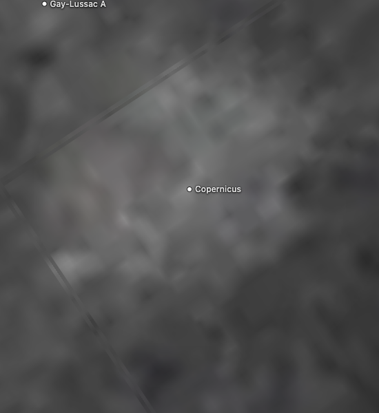
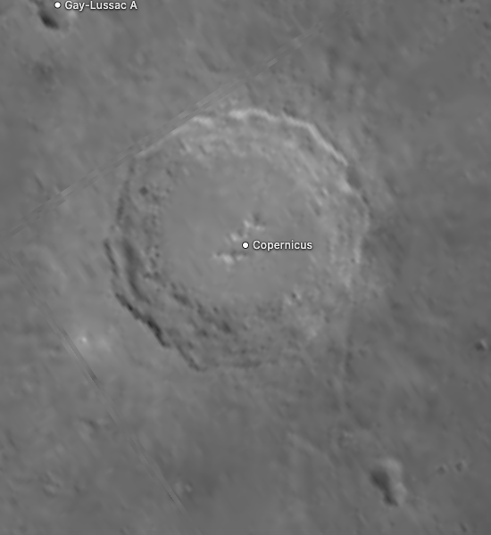

# Moon source and preparation record

The Moon combines LRO imagery and numeric science products with interpreted geology and a modeled crust-thickness display, prepared on the shared raster lane used by Mercury, Venus and Mars.

The navigation marker is a stylized identifier cropped from the existing source map by the [marker recipe](source/preparation/navigation.json), with a circular edge and the shared full-phase shading. It is not an observer projection.

## Sources

| View or quantity | Source |
| --- | --- |
| Monochrome surface | [LROC WAC global morphologic mosaic v1.3](https://data.lroc.im-ldi.com/lroc/view_rdr_product/WAC_GLOBAL_E000N1800_032P), 643 nm photography |
| Elevation | LRO LOLA LDEM16 v3.1 |
| Mineral estimates, FeO, metallic iron, optical maturity, grain size | [Kaguya MI derived maps, May 2016](source/science/usgs/), within ±50° latitude |
| Midnight temperature, heat anomalies, rock abundance | [LRO Diviner GHRM v1.0](https://pds-geosciences.wustl.edu/lro/urn-nasa-pds-lro_diviner_derived1/data_derived_ghrm/img/), 2009–2022, within ±70° |
| Geology | [USGS Unified Geologic Map v2 (2020)](https://astrogeology.usgs.gov/search/map/unified_geologic_map_of_the_moon_1_5m_2020), 49 units |
| Silicate signature | [Lucey et al. (2021)](https://zenodo.org/records/4558194), Christiansen-feature wavelength, CC-BY-4.0 |
| Crust thickness | [NASA GRAIL visualization](https://svs.gsfc.nasa.gov/4014/), based on gravity and topography models |
| Gravity, Bouguer gravity | [GRAIL GRGM1200A maps](https://pds-geosciences.wustl.edu/grail/grail-l-lgrs-5-rdr-v1/grail_1001/rsdmap/), NASA GSFC. See [GRAIL gravity views](#grail-gravity-views). |
| Thorium, potassium, FeO, TiO₂ | [Lunar Prospector GRS elemental abundance](https://pds-geosciences.wustl.edu/missions/lunarp/grs_elem_abundance.html), [Prettyman et al. (2006)](https://doi.org/10.1029/2005JE002656). See [Surface elements](#surface-elements). |
| Roughness | [LRO LOLA LDRM_16 V2.0](https://pds-geosciences.wustl.edu/lro/lro-l-lola-3-rdr-v1/lrolol_1xxx/data/lola_gdr/cylindrical/img/ldrm_16.lbl), citing [Zuber et al. (2012)](https://doi.org/10.1038/nature11216). See [Roughness](#roughness). |
| Maximum and noon temperature | [LRO Diviner Global Cumulative Products](https://pds-geosciences.wustl.edu/lro/urn-nasa-pds-lro_diviner_derived1/data_derived_gcp/), [Williams et al. (2017)](https://doi.org/10.1016/j.icarus.2016.08.012). See [Daytime temperature](#daytime-temperature). |
| Named features | [IAU/USGS Gazetteer of Planetary Nomenclature](https://planetarynames.wr.usgs.gov/Page/MOON/target), snapshot 2026-09-11, public domain |
| Lighting | The Hapke model of [Sato et al. (2014)](https://doi.org/10.1002/2013JE004580) at 643 nm. See [Lighting law](#lighting-law). |

Landing sites: 80 landing, touchdown or impact sites and 2 traverse paths are labelled (`source/features/sites.json`), each quoting the NASA NSSDCA, PDS, LROC, agency or paper page it was read from. 1749 feature names carry the lead summary of their English Wikipedia article (CC BY-SA 4.0, retrieved 2026-09-12), credited in the caption. Physical and orbital facts come from the NASA JPL [satellite physical parameters](https://ssd.jpl.nasa.gov/sats/phys_par/sep.html) and [mean elements](https://ssd.jpl.nasa.gov/sats/elem/sep.html).

PDS archives these NASA mission products without a separate Creative Commons license. Preserve the named producers, product versions, archive links and [PDS data citation](https://pds.nasa.gov/datastandards/citing/) when reusing the derived views. Source selections and open questions are in the [investigation ledger](investigations.json).

## Processing

The surface photograph is the WAC float map of observations from 7 November 2009 to 31 January 2011, which [LROC's README](https://pds.lroc.im-ldi.com/data/LRO-L-LROC-5-RDR-V1.0/LROLRC_2001/DATA/BDR/WAC_GLOBAL/WAC_GLOBAL_README.TXT) documents. The reader integrates the original pixel footprints into 4,096 × 2,048 and 8,192 × 4,096 maps. PDS special values are withheld and no gap is painted as terrain. It was chosen over the NASA CGI Moon Kit and the LROC colour tiles for sharper terrain and polar coverage.

Elevation reads the [LOLA LDEM_16 grid](https://pds-geosciences.wustl.edu/lro/lro-l-lola-3-rdr-v1/lrolol_1xxx/data/lola_gdr/cylindrical/img/ldem_16.xml) of David E. Smith and the GSFC LOLA team: height above the 1,737.4 km reference sphere, not a geoid, shown from −12 to +12 km. The night views read the Diviner GHRM mosaics of Powell and the UCLA Diviner team through the [shared converter](../../../packages/bake/src/objects/acquisition/diviner-ghrm.py). Midnight temperature spans 80 to 140 K, heat anomalies −10 to +10 K and rock abundance 0 to 2%. All numeric views are painted from the source grid with nearest sampling, stored lossless, and never filled.

Geology uses the units of Fortezzo, Spudis and Harrel with an authored palette. The silicate signature is shown from 8.0 to 8.5 µm; see the [mapped-science method](../../../packages/bake/src/objects/acquisition/MAPPED-SCIENCE.md). Eight Kaguya views use USGS products made from MI MAP level 02, described in the [original methods](https://www.hou.usra.edu/meetings/lpsc2016/pdf/2994.pdf) and [Lemelin's dissertation, chapter 3](https://www.soest.hawaii.edu/earthsciences/wp-content/uploads/2025/09/MLemelin_Dissertation.pdf). Their spectral-fit criterion gates coverage; the [shared acquisition method](../../../docs/usgs-numeric-surfaces.md) explains the reads.

Feature labels come from the Gazetteer, without albedo features or the 7,063 lettered satellite craters. Rim circles and extent boxes are not published boundaries. The globe is the shared 230-unit sphere. Its pole, prime meridian and Sun direction come from the IAU/WGCCRE model in `src/platform/solar-geometry.mts`.

### Lighting law

The globe is lit with the Hapke model of Sato et al. (2014) in the WAC 643 nm band, the model the mosaic was corrected with, relative to the flood-lit disc centre ([planet limbs](../../../docs/surface-preparation.md#planet-limbs-from-published-laws)). The values are recorded in [`source/photometry/sato-2014-hapke-643nm.json`](source/photometry/sato-2014-hapke-643nm.json); w, b and h_S are medians of the [PDS 643 nm parameter map](https://data.lroc.im-ldi.com/lroc/view_rdr/WAC_HAPKEPARAMMAP) over 30°S to 30°N. The fit saw emission only up to 30°, so toward the limb the law is held there.

### GRAIL gravity views

Gravity is the free-air anomaly ([GGGRX_1200A_ANOM_L660](https://pds-geosciences.wustl.edu/grail/grail-l-lgrs-5-rdr-v1/grail_1001/rsdmap/gggrx_1200a_anom_l660.lbl)). Bouguer gravity ([GGGRX_1200A_BOUG_L660](https://pds-geosciences.wustl.edu/grail/grail-l-lgrs-5-rdr-v1/grail_1001/rsdmap/gggrx_1200a_boug_l660.lbl)) removes LOLA topography as rock of 2,500 kg/m³. Both come from NASA Goddard's GRGM1200A field ([Lemoine et al. 2014](https://doi.org/10.1002/2014GL060027)) summed to degree 660, shown at ±400 and ±600 mGal. The Crust view is a model built one step past Bouguer gravity.

### Daytime temperature

Diviner's cumulative products, made by J.-P. Williams and the UCLA Diviner team, average temperature per 0.5° cell and quarter-hour from 2009 to 2015. Maximum is each cell's warmest quarter-hour. Noon averages the bins from 11:30 to 12:30, covering 98.64% of the area. The converter `packages/bake/cli/diviner-gcp-grid.mts` reads [`prepare-tbol.json`](source/science/diviner-gcp/prepare-tbol.json). Both views span 220 to 400 K.

### Surface elements

Thorium, potassium, FeO and TiO₂ come from the table [LPGRS_HIGH1_ELEM_ABUNDANCE_2DEG](https://pds-geosciences.wustl.edu/lunar/lp-l-grs-5-elem-abundance-v1/lp_9001/data/lpgrs_high1_elem_abundance_2deg.lbl), 2° equal-area pixels from 1998 spectra that blurred the surface over about 150 km. Its [data set description](https://pds-geosciences.wustl.edu/lunar/lp-l-grs-5-elem-abundance-v1/lp_9001/catalog/dataset.cat) gives the method. Nothing is interpolated, so pixel edges show as steps.

### Roughness

LDRM_16 gives the scatter of laser shots about a fitted plane over a 30 to 120 m baseline, per 1/16° pixel. Missing pixels (4.4% of the area) stay empty. The display spans 0.5 to 2 m.

## Evidence

The photograph replaced a 2K CGI texture; the same Copernicus camera before and after:

| Before | Current |
| --- | --- |
|  |  |

- Numeric grids are checked at Copernicus, Tycho and Tsiolkovskiy. These are alignment anchors, not subpixel accuracy.
- Against [Neumann et al. (2015)](https://www.ncbi.nlm.nih.gov/pmc/articles/PMC4646831/), the Bouguer contrast of 14 basins is 1.04 to 1.44 times theirs (median 1.13, correlation 0.987); they used an earlier, more filtered field.
- Near the equator the maximum's 5th to 95th percentile is 388 to 396 K; Williams et al. (2017) report about 387 to 397 K.
- Thorium peaks at 11.6 ppm beside Apollo 14 and titanium at 12.0% in Mare Tranquillitatis. [Lawrence et al. (2022)](https://doi.org/10.1029/2022JE007197) find more thorium at sharper resolution, as the footprint predicts.
- Tycho, the roughest large feature, lands at its IAU position (median 3.0 m).

## Known problems

- Atlas seams can show at extreme close zoom. The mosaic keeps photographed shadows and strip differences that the Shadows control cannot relight.
- Diviner night maps combine 2009–2022 observations. Anomalies keep terrain effects and do not show geothermal activity. Rock abundance is area fraction, not boulder counts.
- Christiansen values are wavelengths, not mineral abundances. Geology colours are interpretations; the crust display depends on model assumptions.
- Kaguya can assign too much plagioclase to mature soils; read mineral maps with OMAT.
- Gravity is in the principal-axis frame, about 1 km from the other views ([LRO coordinate white paper](https://science.nasa.gov/wp-content/uploads/2024/01/luncoordwhitepaper-10-08.pdf)). The Bouguer view assumes one density, so part of its mare signal is basalt fill.
- Daytime temperatures are many-day averages; noon gaps show as gray streaks. One PDS3 label swaps its latitude limits.
- The full text of Prettyman et al. (2006) could not be read, so no value was compared with its tables.
- Roughness is not measured at a fixed baseline. The newer LDRM_32 products showed interpolation speckle at display size.
- One set of lighting values covers the whole globe, and the limb beyond 30° emission follows no measurement.

GRAIL views are attributed to the GRAIL mission and LRO views to LRO ([catalogue contract](../../../docs/architecture/exploration-catalog.md)).

[Inputs](source/manifest.json) · [Recipe](object.json) · [Credits](NOTICE.md) · [Contributor guide](../README.md)
