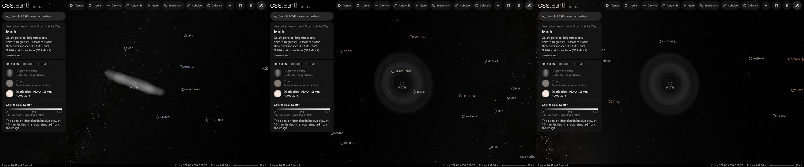
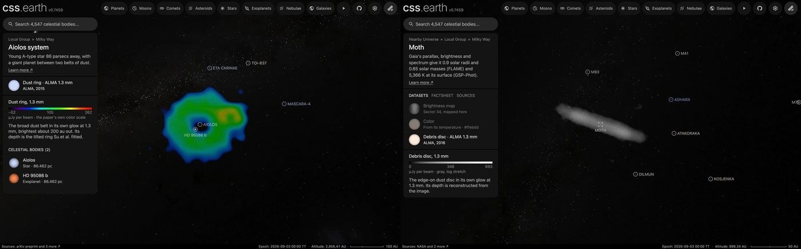

# HD 61005 debris disc

This package draws the debris disc of [the Moth (HD 61005)](../moth/README.md) as a prepared volume attached to the star, the way the [β Pictoris disc](../beta-pictoris-disc/README.md) is. It shares the star's frame and is listed among the star's datasets as "Debris disc · ALMA 1.3 mm". The star's page still opens on its brightness map.

## Sources

- **Image:** the band 6 continuum image of ALMA project 2015.1.00633.S (PI A. Weinberger), member OUS `uid://A001/X2f7/X1e5`, made by the ARI-L project (Massardi et al. 2021, PASP 133, 085001) for the public archive. The 12-m array observed once, on 18 June 2016, for 44 minutes on the star with 36 antennas. The image has 0.085″ pixels and a 0.516″ × 0.439″ beam (19 × 16 au), and is corrected for the primary beam. MacGregor et al. (2018, ApJ 869, 75; [arXiv:1812.05610](https://arxiv.org/abs/1812.05610)) published this observation together with two earlier, more compact ones, but deposited no image. Theirs has a 0.49″ × 0.43″ beam and 13 µJy per beam of noise.
- **Processing:** the image is read at its own beam, which is larger than the paper's, so it cannot be brought to it. Its noise is 21.3 µJy per beam, measured 6″ to 10″ from the star, where the level is −1.6 µJy per beam; that level is taken off. Nothing is removed at the star: MacGregor et al. model no point source there. Sky fainter than the noise is not drawn, and a column is drawn in full from three times the noise. This is a display choice, as on the β Pictoris disc.
- **Brightness:** one band in gray. MacGregor et al. show the image in a color scale without a bar, so there is no published scale to follow. The gray runs as log(1 + 10 u) / log 11, with u the brightness over 692.6 µJy per beam, the 99.5th percentile within 20 au of the midplane.
- **Recipe:** [`source/circumstellar.json`](source/circumstellar.json) names the image, the stretch, the stated conventions and the published geometry. [`author.mts`](../../../packages/telescope-cli/authoring/circumstellar/author.mts) writes everything else in `source/` from it and from the depth reconstruction; `--check` reproduces it byte for byte.

**The midplane is measured on this image.** It lies at position angle 70.34°, with a spread of 0.21° over the binnings tried, and the star is 0.9 au off the line. MacGregor et al. fit 70.3° ± 0.1° (Table 2). The disc is tilted 85.6° ± 0.1° in their fit to the visibilities, 4.4° from edge-on; they note that their uncertainties are likely underestimates. At that tilt the belt's near and far sides lie at most 5 au either side of the midline on the sky, a third of the beam, so the image does not measure the tilt.

**Depth is reconstructed, not measured.** An edge-on image sums the light along the whole disc plane. The nebula lab's axial-symmetry method (Wenger, Lorenz & Magnor 2013; [`reconstruct-circumstellar`](../../../labs/nebula/packages/lab/src/cli/commands/circumstellar/reconstruct.ts)) takes the disc to be symmetric about its own axis and solves the emission of each ring of radius and height so that the volume reprojects to the image. It does so to 4.2% (relative error). A midplane column 62 au from the star in projection has 67% of its emission within 20 au of its tangent point; pushing the image back evenly would put 31% there.

**Near side: south.** Esposito et al. (2016, AJ 152, 85; [arXiv:1605.06161](https://arxiv.org/abs/1605.06161), section 3.2) find the ring's south edge brighter than the north in all their scattered-light images and, assuming grains that scatter mostly forward, take it as the front edge. The ALMA image cannot tell.

One volume unit is one astronomical unit at the star's Gaia DR3 distance (36.45 pc; MacGregor et al. adopt 36.6). The cube (±170 au) is anchored on the star's scene origin. The star is placed at its Gaia DR3 position moved by its proper motion to the observing date, 0.04″ from the image's pointing centre.

## Evidence

- The page in the application on 2026-10-08 (image above, headless Chrome, no page errors), opened by a link that names the dataset (`/moth/?dataset=debris-disc`), which frames the whole disc: as it opens, then dragged 260 pixels up, then 300 pixels down from the opening view. Picked by hand from the page's opening view, the dataset leaves the camera at the star, 4.5 million km out, and the disc is outside the view until the reader zooms out.
- The two pages of this change as they show their discs: [HD 95086](../hd-95086-disc/README.md), a plain star, opens on its ring; the Moth keeps its opening view and shows its disc when a link names the dataset.

  
- The author's preview of the image as drawn, north up ([previews/dust.png](source/previews/dust.png)), to compare with MacGregor et al.'s [Figure 2](https://arxiv.org/abs/1812.05610).
- **The image against the paper's numbers:**

  | | This image | MacGregor et al. (2018) |
  | --- | --- | --- |
  | Position angle of the midplane | 70.34° ± 0.21° | 70.3° ± 0.1° |
  | Flux | 6.51 mJy in a box 200 au along the midplane and 40 au across, each way | 4.82 ± 0.29 (belt) + 1.54 ± 0.48 (halo) = 6.36 mJy |
  | The two bright ends | 703 µJy per beam at 56 au (north-east), 716 at 59 au (south-west) | a belt from 41.9 to 67.0 au |
  | Light along the midplane ends | 125 au (north-east), 130 au (south-west) | halo modelled to 188 ± 8 au |
  | Noise | 21.3 µJy per beam at 0.516″ × 0.439″ | 13 at 0.49″ × 0.43″ |

  The two halves of the disc hold the same light to 2%.
- [`author-sentences.test.mts`](../../../packages/telescope-cli/authoring/circumstellar/author-sentences.test.mts) checks that an edge-on dataset read from an archive image is described as one, and that the records of the discs that existed before are unchanged.

## What is this repository's, not a paper's

- **The gray scale and its top,** since no published scale exists.
- **The fade** between one and three times the noise.
- **The flux box** is a comparison, not the paper's method.

## Known problems

- **One of the paper's three observations.** The archive holds no image of all three. This one is noisier than the paper's, so the faint halo is drawn in full only to 125 au and fades out by the cube's edge at 170 au; the paper models it to 188 au.
- **An archive image, not the paper's own.** ARI-L images are meant to show what the data hold, not as final science images.
- **The depth rests on symmetry.** Anything the disc does that is not symmetric about its axis is kept only where the fit allows.
- **The swept-back wings seen in scattered light are not in this image.** MacGregor et al. report none at 1.3 mm either.
- **What is at the centre is drawn as observed.** MacGregor et al. report an unexplained peak 0.5″ north-east of the star in their residuals.
- The gray is brightness at one wavelength, not what an eye would see.

[Investigation ledger](investigations.json) · [Inputs](source/manifest.json) · [Recipe](source/circumstellar.json) · [Provenance](source/provenance.json)
