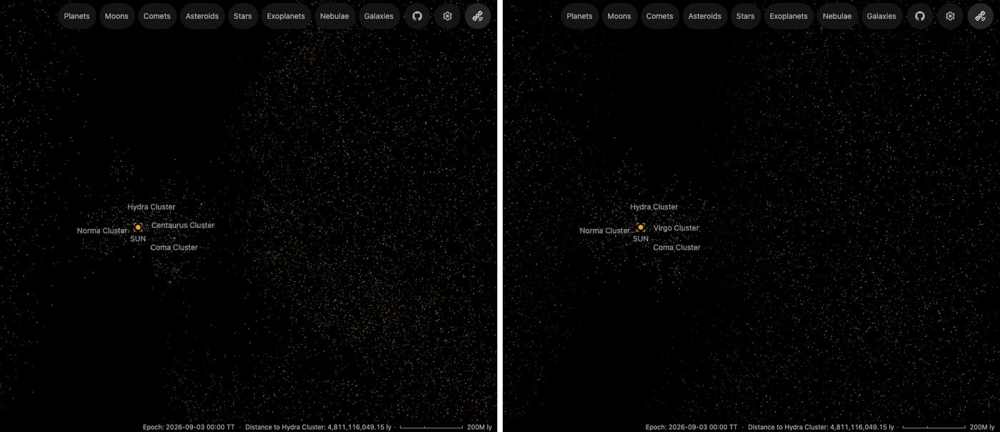
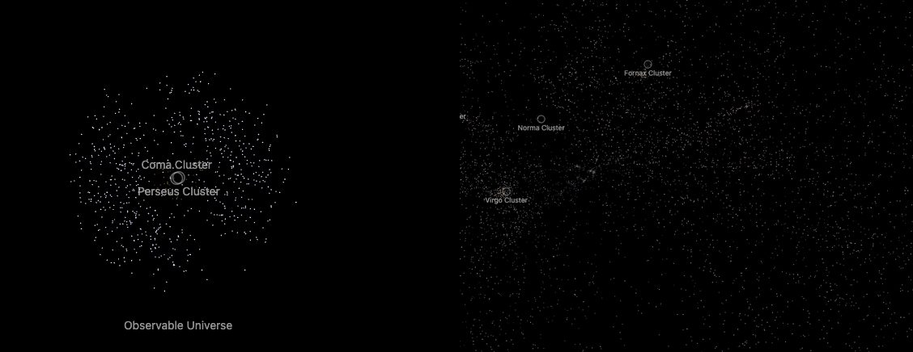

# Nearby Universe galaxy field

Every galaxy of Cosmicflows-4 between 3 and 200 Mpc, the 2MASS Redshift Survey galaxies Cosmicflows-4 lacks, and every Local Volume Database galaxy nearer than that, drawn as one sharp dot at its measured distance, in the colour of its morphological type. Galaxies in groups sit at their group's measured distance. The Cosmicflows-4 dots are thinned to an even density at every zoom, groups first, so the field traces its groups and clusters, never piles up around the Milky Way and never empties as you zoom in. No brightness, glow or cloud is drawn.

## Sources

| Source | Measurement used |
| --- | --- |
| [Cosmicflows-4, Tully et al. (2023)](https://cdsarc.cds.unistra.fr/viz-bin/cat/J/ApJ/944/94) | Table 2: PGC number, J2000 position, the distance modulus from all methods and the group (1PGC), for 27,277 of its 55,877 galaxies, those between 3 and 200 Mpc. Table 3: each group's distance modulus on the calibrated scale (DMzp). |
| [2MASS Redshift Survey, Huchra et al. (2012)](https://cdsarc.cds.unistra.fr/viz-bin/cat/J/ApJS/199/26) | Table 3: J2000 position, redshift (cz), ZCAT numerical type and extinction-corrected Ks magnitude of the 27,897 of its 44,599 galaxies that Cosmicflows-4 lacks, to redshift 0.05. |
| [WISE × SuperCOSMOS, Bilicki et al. (2016)](https://doi.org/10.3847/0067-0049/225/1/5) | The whole photometric-redshift catalogue (20.4 million rows, from the [SuperCOSMOS Science Archive](http://ssa.roe.ac.uk/WISExSCOS.html)): position, extinction-corrected R and bias-corrected photometric redshift, for the 58,213 galaxies it adds outside DESI's footprint. |
| [HyperLEDA, Makarov et al. (2014)](https://doi.org/10.1051/0004-6361/201423496) | The numerical morphological type T of 25,877 of those galaxies and the corrected total B magnitude (btc) of 26,310, joined by PGC number. |
| [Local Volume Database v1.1.1, Pace (2025)](https://doi.org/10.33232/001c.144859) | Through the [Local Group catalogue](../local-group/README.md): the 200 galaxies nearer than Cosmicflows-4's nearest (3.03 Mpc), with their adopted distances and apparent V magnitudes. |
| [Kinney et al. (1996)](https://doi.org/10.1086/177583) | The elliptical, S0, Sa, Sb and Sc template spectra from the STScI reference atlases. |
| [DESI Data Release 1 (2025)](https://arxiv.org/abs/2503.14745), clustering catalogues of [Ross et al. (2025)](https://arxiv.org/abs/2405.16593) | BGS BRIGHT-21.5 (300,043 galaxies, redshift 0.1 to 0.4, volume-limited to absolute r magnitude -21.5) with dereddened g, r and z fluxes; QSO (1,223,391 quasars, redshift 0.8 to 3.5). |
| [Quaia, Storey-Fisher et al. (2024)](https://doi.org/10.3847/1538-4357/ad1328) | The G < 20.0 catalogue from CDS/VizieR (J/ApJ/964/69): Gaia DR3 source id, ICRS position and redshift of its 619,961 quasars between redshift 0.8 and 3.5. |
| [Francis et al. (1991)](https://doi.org/10.1086/170066) | The Large Bright Quasar Survey composite spectrum, from the STScI reference atlases. |
| [Planck 2018 VI](https://arxiv.org/abs/1807.06209) | The cosmology that turns a redshift into a distance (Astropy's Planck18) and the redshift of last scattering, z* = 1089.80. |

The [galaxy recipe](source/galaxies/points.json) records both queries and the joins; [`cf4-groups.mts`](../../../packages/bake/authoring/nearby-universe/cf4-groups.mts) adds the two group columns from CDS's tables 2 and 3. The tracked table ([cf4-hyperleda.csv.gz](source/galaxies/cf4-hyperleda.csv.gz)) and the five templates are the inputs; the [manifest](source/manifest.json) binds them to their source records. The [investigation ledger](investigations.json) records what was used, replaced and left out.

## Processing

1. `packages/bake/cli/prepare-catalogue-points.mts` places each galaxy at 10^(DM/5 + 1) pc in its J2000 direction, in the Sun-centred frame, in Mpc. A galaxy's own distance modulus carries a median uncertainty of 0.5 mag (about 26%), which drew Coma as a spike: its members' own distances scatter by 21 Mpc (rms) along the line of sight, against 2 Mpc across the sky. So the 11,113 galaxies in groups of two or more sit at their group's distance instead, spread in depth as widely as the group spreads across the sky (`groupDistance`). That the group is as deep as it is wide is an assumption, not a measurement of any member's depth. It checks against one: Virgo comes out 0.64 Mpc deep (rms), and [Mei et al. (2007)](https://arxiv.org/abs/astro-ph/0702510) measured 0.6 ± 0.1 Mpc from the surface brightness fluctuation distances of 79 members. They also found Virgo slightly elongated, its long axis 20 to 40° from the line of sight, which the assumption leaves out.
2. It colours each galaxy by its type class: the template spectrum of that class through the CIE 1931 observer into sRGB, the route the app uses for star colours. The colours are E #ffdec0, S0 #ffdfc1, Sa #ffdcc7, Sb #ffe1cb and Sc #d9d7ff. The 1,400 galaxies HyperLEDA gives no type are white. Each colour is then darkened by the galaxy's absolute B magnitude: full at M_B −21.5, 30% at −17.5. The 967 galaxies without btc take the darkest tone.
3. [`local-group-sample.mts`](../../../packages/bake/authoring/nearby-universe/local-group-sample.mts) takes the Local Group catalogue's galaxies nearer than the field's nearest galaxy, leaving out those drawn as their own objects (M31, M33, the Magellanic Clouds). The same route places them and tones them by absolute V magnitude, LVDB having no B; nearly all are dwarfs and take the faintest tone. LVDB gives no type, so they are white.
4. [`twomrs-sample.mts`](../../../packages/bake/authoring/nearby-universe/twomrs-sample.mts) keeps the 2MRS galaxies more than 10 arcsec from every Cosmicflows-4 galaxy, with their redshifts moved to the cosmic microwave background's frame (Planck's dipole: 369.82 km/s toward l 264.021°, b 48.253°), and the same route places each at its Planck 2018 comoving distance ([recipe](source/galaxies-2mrs/points.json)). They reach down to 5° from the Milky Way's plane, where Cosmicflows-4's surveys stop at about 20°, and fill the southern sky Cosmicflows-4's northern SDSS sample leaves thin. A redshift distance carries the galaxy's own motion, so they sit less exactly than Cosmicflows-4's; 54% have no type in 2MRS and are white; they are toned by absolute Ks, ranked within the sample (full at −25.5, 30% at −22.5).
5. `packages/bake/cli/merge-catalogue-points.mts` thins the Cosmicflows-4 and 2MRS galaxies into four nested levels, counted in shells around the Sun; in the field and the 60 Mpc level each shell's room is split evenly over equal-area cells of the sky (32 and 8), so a direction one survey covers densely does not take another's room. The field allows 0.18 galaxies per 1,000 Mpc³ out to 200 Mpc, half what CF4 still holds at its edge. Around the Milky Way, levels out to 60, 20 and 10 Mpc bring that up to 5, 25 and 90. In each shell, group members take the room first, the richest group first, and as many again drawn at random from the rest fill the space between them (`groupsFirst`). Every member of a group of five or more is in the field, whatever the room, so a cluster far from the Milky Way is whole from anywhere. A fifth level holds the 200 Local Volume Database galaxies and every Cosmicflows-4 galaxy the other levels left out: from inside the Local Group the screen shows a narrow cone of the sky, and the thinned levels alone put a third as many dots there as the view from outside.
6. `packages/bake/cli/stack-catalogue-points.mts` joins the levels into [one bank](source/dots/stack.json) of 39,904 dots (13,960, 2,316, 348, 54 and 23,226; the innermost keeps one in 3 of the 2MRS galaxies the others leave, since a bank draws at most 40,000). The app draws a growing share of it as you zoom in, so a level's edge is never on screen and a dot you have seen stays. The 60 Mpc level fills as the view narrows from 100 to 20 Mpc across, over two wheel notches; the innermost level as it narrows from 3 to 1 Mpc.

## Beyond the Cosmicflows-4 field

Past 200 Mpc the view is DESI's first data release, drawn as the same dots, in two shells on DESI's footprint (about a quarter of the sky, north and south of the Milky Way's plane). WISE × SuperCOSMOS's galaxies fill the rest of the bright-galaxy shell and Quaia's quasars the rest of the quasar shell, so both are balls but for the band the Milky Way's disc hides. At the edge is the cosmic microwave background, which the [Observable Universe](../observable-universe/README.md) package draws.

- **Bright galaxies** ([DESI recipe](source/desi-bright-galaxies/points.json), [WISE × SuperCOSMOS recipe](source/wisescos-galaxies/points.json), [merge](source/bright-galaxies/merge.json)): one ball of 29,407 dots, one in 3 of each sample, since a bank draws at most 40,000.
  - [`wisescos-sample.mts`](../../../packages/bake/authoring/nearby-universe/wisescos-sample.mts) finds DESI's footprint from the tracked DESI sample as `quaia-sample.mts` does (9,992 deg²) and keeps the 5.5 million WISE × SuperCOSMOS galaxies outside it with photometric redshift 0.1 to 0.4 and brighter than absolute R −21.5 (DESI's cut, in R, not k-corrected), on the 20,409 deg² the catalogue covers well; in each redshift bin 0.02 wide it keeps DESI's count per sky cell (58,213 in all), so the ball's depth follows DESI's. Its galaxies take DESI's median colour in their redshift bin and are toned on DESI's scale by their R magnitude.
  - DESI: one in 10 of BGS BRIGHT-21.5 (30,005 galaxies, 670 to 1,575 Mpc for the 5th to 95th percentile), each at its comoving distance in the Planck 2018 cosmology. Each colour is its g, r and z fluxes drawn as the Legacy Surveys viewer draws them (legacypipe `sdss_rgb`), the colour its light arrives with, so galaxies at redshift 0.3 look orange. The sample is volume-limited, so it is drawn as a plain random share with no density cap.
- **Quasars** ([DESI recipe](source/desi-quasars/points.json), [Quaia recipe](source/quaia-quasars/points.json), [merge](source/quasars/merge.json)): one shell of 35,212 dots, 2.8 to 6.6 Gpc away, each in the colour of the Francis et al. composite stretched to its redshift.
  - On DESI's footprint, one in 100 of DESI's QSO catalogue (12,235).
  - Everywhere else, Quaia at the same density on the sky (22,977).
  - [`quaia-sample.mts`](../../../packages/bake/authoring/nearby-universe/quaia-sample.mts) finds DESI's footprint from the tracked DESI sample:
    - It cuts the sky into 7,200 equal-area cells of 5.73 deg².
    - A cell belongs to DESI when it holds at least half DESI's median count per cell. That covers 9,884 deg².
    - It keeps the 413,578 Quaia quasars outside those cells, one in 9 in source id order: the ratio of the two samples' median counts per cell (99 to 11).
  - A bank draws at most 40,000 dots, so the merge keeps one in 2 of each sample, and both stay at one density.

## Evidence

The same camera before (left) and after (right) the WISE × SuperCOSMOS and 2MRS fills: the bright galaxies' two cones become one ball, and the field around the Sun fills its southern and low-latitude sky. The dark wedge left of the Sun is the band the Milky Way's disc hides.

Browser captures of this version: the Observable Universe page's default view, where the quasars close into one shell, and the whole field from 100 Mpc, where the Virgo Cluster is a dense patch under its marker. The earlier thinned field drew 4 of Virgo's 175 catalogued galaxies there. The renderer's catalogue point tests (`packages/renderer/src/universe/catalogue-points.test.ts`) check that a stacked bank only adds dots as the view narrows. The [context lineage test](../../../site/test/context-lineage.test.mts) checks that its products read only its source records.

## Known problems

- DESI's galaxies cover only its footprint. The WISE × SuperCOSMOS fill closes its two cones into a ball, but its photometric redshifts are about 15% uncertain, so outside DESI's footprint the galaxies sit less sharply in depth, and each takes the median colour DESI's galaxies show at its redshift, not its own. Projected through 1.5 Gpc of depth, the cosmic web's filaments are faint.
- No survey sees through the Milky Way's disc at these distances: the bright galaxies and quasars are empty within about 17° of its plane (2MRS reaches 5° within 200 Mpc). Seen edge-on from far outside, that band shows as two dark wedges through the Sun.
- Quaia's redshifts come from Gaia's low-resolution spectra, less precise than DESI's, so its quasars sit less sharply in depth. Its G < 20.0 limit also keeps fewer faint, distant quasars than DESI. The footprint cells are 2.4° across, so the join between the two samples is uneven on that scale.
- The bright galaxies' tones have no k-correction, and their colours are observed-frame, redder than the galaxies' own light.
- The field is not a complete survey. CF4 is flux-limited, so it is denser near the Milky Way and thins toward 200 Mpc. The zone the Milky Way's disc hides is empty in the catalogue, not in space.
- Beyond about 150 Mpc only the SDSS fundamental-plane sample reaches, over part of the northern sky.
- The templates are spectra of galaxy centres, not whole-galaxy light, so every colour but Sc is a close warm white. Types later than Sc take the Sc template.
- Distance uncertainties (CF4's e_DM) are not drawn. A group member's depth within its group is assumed, not measured: each takes the sky offset of another member.
- The Local Group dots put V magnitudes on the field's B tone scale. Galaxies are brighter in V than in B, so a galaxy near the bright end can take a lighter tone than its B magnitude would give.
