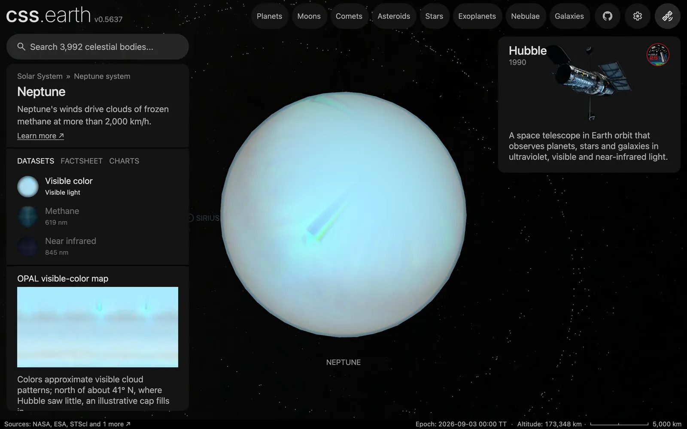

# Neptune's ring particles

600 dots along Neptune's rings, drawn while Neptune or one of its moons is selected. At their true opacity [Neptune's rings](../neptune/README.md) all but vanish, so the dots are most of what shows them. The position of a single dot is not a measurement.

## Sources

| Source | Measurement used |
| --- | --- |
| [PDS Rings Node Neptune ring table](https://pds-rings.seti.org/neptune/neptune_rings_table.html) | Each ring's radius, width and normal optical depth, through [Neptune's ring recipe](../neptune/source/preparation/rings.json). |

[Inputs](source/manifest.json) · [Recipe](source/dots/points.json)

## Processing

1. [`positions.mts neptune 600`](../../../packages/bake/authoring/ring-particles/positions.mts) reads the four rings of Neptune's recipe: Galle, Le Verrier, Lassell and Adams.
2. For each dot it picks a ring in proportion to the ring's opacity, 1 − exp(−τ), times its width times its radius. That gives Galle 110 dots, Le Verrier and the broad Lassell ring beside it 456 between them, and the narrow Adams ring 34.
3. The dot's place across its ring's width and its longitude come from a seeded generator (mulberry32, seed 20061012). Nothing else is authored.
4. The dots lie in Neptune's equatorial plane, from the IAU pole at the world's epoch, JD 2461286.5 TT. It writes [`positions.csv.gz`](source/dots/positions.csv.gz), and `packages/bake/cli/prepare-body-points.mts` writes the point bank.

## Evidence

A headless capture of this version's Neptune default view.

## Known problems

- **The dots overstate the rings.** Neptune's rings have about 54,000 times less opaque area than Saturn's (309 thousand against 16,600 million km²). At the density of Saturn's 4,000 dots Neptune would have none. The 600 are a display choice.
- **No dot is a measured particle.** Only each ring's share of the dots is measured. Their longitudes are drawn from a seed.
- **The Adams arcs are not drawn.** The table gives the arcs an optical depth near 0.1 but no longitudes at this epoch, so the Adams ring's dots are spread evenly around it at the ring's 0.003.
- The table gives Le Verrier's width as under 100 km; the recipe, and so the dots, use 100 km.
- The dots are `#9a9a9a`, the neutral gray; no ring color is measured.
- The dot layer sits behind the planet, and the dots do not orbit.
