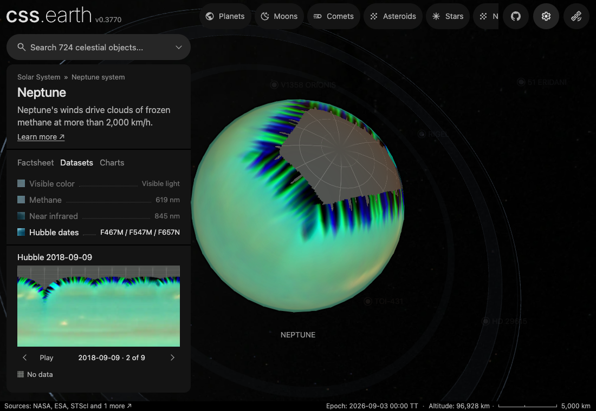

# Neptune

The [navigation marker](source/preparation/navigation.json) retains its existing source-map crop and silhouette, with the shared prepared full-phase curvature shading (35% ambient, 65% diffuse). It is a stylized identifier, not an observer projection or illumination at the scene epoch.

## Sources

Source selections, recorded trials and open questions are in the [investigation ledger](investigations.json).

The visible-detail globe is the 2025 Hubble OPAL Cycle 32 colour global map
assembled by the OPAL team from WFC3/UVIS F467M, F547M, and F657N exposures.
The OPAL readme declares that the TIFF is arbitrarily scaled and contrast
enhanced, so
the normal lens does not publish those display values as literal true colour.
Preparation matches the mean and channel variation of a checked equatorial OPAL
sample to the unobscured central region of the 2024 Irwin et al. true-colour
Neptune reconstruction distributed by the Royal Astronomical Society. The
calibration reference is committed under `source/color/` with CC BY 4.0
attribution. The methane lens uses the matching FQ619N global map and the
near-infrared lens uses F845M. Their checked FITS and TIFF products, plus the
OPAL readme, are in `source/opal/`. Preparation converts them to fixed runtime
rasters; the browser does not parse FITS, TIFF, or the calibration reference.

The prepared scene uses the 24,764 km equatorial and 24,341 km polar radii
(IAU 2015 report values), the same radii the OPAL readme gives for its limb
fits. JPL Solar System Dynamics discovery, mean-elements, and
physical-parameter tables supply the prepared 16-moon catalog. The PDS Rings
Node Neptune table supplies the prepared ring radii and widths, including the
Adams ring at 62,933 km. The four Adams arcs are schematic: that table lists five
arcs (Courage, Liberte, Egalite 1 and 2, Fraternite) but gives only relative
spacings and no arc lengths or absolute longitudes, so the drawn arc centres and
widths are not measured positions.

Two panel charts are prepared from the committed NASA GSFC Planetary Spectrum
Generator configuration and raw I/F response; the third uses the pinned
photometric phase coefficients. The panel prose and facts are prepared from
the committed NASA Science `Neptune: Facts` snapshot.

## Evidence

- **Normal polar source sampling, 12 September 2026:** the staged normal-pole
  refresh verified the OPAL TIFF, the Irwin et al. colour reference, the
  observation recipe, source manifest and retained scene pin. It applied only
  `neptune-poles-normal.webp`: the fixed 512 × 128 atlas changed from 4,538 to
  4,524 bytes, a 14-byte (0.31%) smaller download. The normal surface bands,
  thumbnail, material assets and retained geometry were not regenerated. This
  is preparation evidence, not a browser review.
- **Ring wedges, 19 September 2026:** the ring is 16 wedges in one atlas at the
  canonical density. Laid back into the ring plane, the wedges match the single
  ring image they replace to a mean alpha error of 1.03/255 inside a wedge and
  1.30/255 within 2 px of a wedge boundary. The package tests left from the
  earlier lane are retired and the rest pass.

## Known problems

Neptune's north pole was tilted away from Hubble in 2025. Measured on the pinned
OPAL maps, coverage ends near 71° N and the rows below it still carry dark swath
edges. We take the first row whose darkest pixel is back in the normal range of the
row median: at 619 and 845 nm that ratio climbs from 0.37 at 60° N to about 0.80 at
57° N (row 67 of 361); in the colour map near-black pixels reach down to 42° N and the
ratio settles at 0.87 from row 98 of 360 (41° N). Preparation starts the fill there,
at 57° N for the two bands and 41° N for colour, keeps every row below it and extends that row toward its longitudinal mean at the
pole, which supplies no storm or cloud detail. An earlier recipe continued from
30° N, overwriting observed cloud bands between 30° and 60° N, and flipped the two
narrow-band maps upside down; both are fixed. The treatment is recorded in
`source/preparation/observations.json` and happens only during preparation.

The normal OPAL map is a 720 × 360 global raster. Its declared high-latitude
coverage continuation and colour calibration run before the normal pole atlas
samples that grid directly. The existing 2,880 × 1,440 same-aspect resize still
serves the normal surface bands, but it is no longer an intermediate for the
pole atlas. The fixed direct-segment, bilinear-wrapped projection remains four
128-pixel pole tiles in a 512 × 128 file. This preserves the existing
projection and retained 722-leaf scene; it does not establish a new geographic
registration or recover unobserved polar features.

[Inputs](source/manifest.json) · [Preparation](source/preparation) · Provenance (`prepared/provenance.json`) · [Delivered files](inventory.json) · [Credits](NOTICE.md)

The lighting overlay has one colour and alpha per pixel, so its per-channel limb law is exact for the colour map's mean colour and approximate for colours far from it ([planet limbs](../../../docs/surface-preparation.md#planet-limbs-from-published-laws)). The FQ619N and F845M lenses share the colour map's bank; OPAL applied no Minnaert correction to those two maps, so their limb is not their own law.

Methods and source notes

**Planet surface and observation lenses**

Each lens is mapped across 722 surface leaves on the shared sphere lane: 720
longitude-latitude cells and two polar caps. The orientation is solved from
Neptune's pole and rotation at the scene epoch; the hand-typed rotations it
replaced were about 65° off. Lighting is one 256-frame bank indexed by the
Sun's direction in view and shared by every lens. Each frame puts back the limb
darkening OPAL removed from the colour map, with the 2025b README's Minnaert
coefficients: k 0.50 in F657N, 0.80 in F547M and 0.88 in F467M ([planet limbs](../../../docs/surface-preparation.md#planet-limbs-from-published-laws)). At
k 0.50 red does not darken at all under full light, so the limb loses its cyan
toward grey. No floor, ambient term or terminator ramp remains. The rings are 16 wedges drawn from the ring recipe, the Adams arcs
included, and each starts outside the planet so the planet hides their far side.
No ordinary image element or planet-sized background `
` is generated or
mounted. Runtime only selects and decodes prepared assets; it performs no
source projection, lighting, filtering, or raster work.

**Shape, satellites, and rings**

The scientific satellite catalog remains pinned source material. The shared
runtime mounts exactly one detailed object scene, so dormant moon-dot,
orbit-guide, and obsolete orbit-bank derivations are not part of its active
asset closure. `object.json` records the exact retired filenames; their source
snapshots remain available without treating an embedded moon system as the
active Neptune scene.

## Hubble dates

The existing dataset stepper now selects 9 dated [OPAL](https://archive.stsci.edu/hlsp/opal) visible-colour maps. One rotation is selected from each included observing cycle, preserving one observation instead of averaging weather from separate rotations. The opening Visible color view remains the established presentation.

| Observation starts (UTC) | Rotation | Release | Source pixels |
| --- | --- | --- | --- |
| 2017-10-06 | 2017a | [Cycle 24](https://archive.stsci.edu/hlsp/opal/opal-neptune-cycle-24) | 721 × 361 |
| 2018-09-09 | 2018a | [Cycle 25](https://archive.stsci.edu/hlsp/opal/opal-neptune-cycle-25) | 721 × 361 |
| 2019-09-28 | 2019a | [Cycle 26](https://archive.stsci.edu/hlsp/opal/opal-neptune-cycle-26) | 721 × 361 |
| 2020-08-19 | 2020a | [Cycle 27](https://archive.stsci.edu/hlsp/opal/opal-neptune-cycle-27) | 721 × 361 |
| 2021-09-06 | 2021a | [Cycle 28](https://archive.stsci.edu/hlsp/opal/opal-neptune-cycle-28) | 721 × 361 |
| 2022-09-18 | 2022a | [Cycle 29](https://archive.stsci.edu/hlsp/opal/opal-neptune-cycle-29) | 721 × 361 |
| 2023-09-22 | 2023a | [Cycle 30](https://archive.stsci.edu/hlsp/opal/opal-neptune-cycle-30) | 721 × 361 |
| 2025-06-28 | 2025a | [Cycle 31](https://archive.stsci.edu/hlsp/opal/opal-neptune-cycle-31) | 721 × 361 |
| 2025-08-24 | 2025b | [Cycle 32](https://archive.stsci.edu/hlsp/opal/opal-neptune-cycle-32) | 721 × 361 |

The RGB TIFF and its three component FITS files are recorded in [the source manifest](source/manifest.json) and restored by [the acquisition recipe](source/preparation/acquisition.json). These are publisher mosaics with contrast enhancement and arbitrary channel scaling, not calibrated colour comparisons between years. Each date combines exposures over a rotation, and the scene camera, Sun and rings do not reproduce the original observing geometry.

All selected releases place 360° west longitude at the left, decreasing to the right, matching the current surface. Their 721-column maps include the repeated longitude endpoint. Planetographic rows move onto the unchanged 24,764 / 24,341 km ellipsoid. The FITS headers in the 2021 release omit DATE-OBS; its date comes from the release README's rotation-1 interval. There is no 2024 release in this sequence; Cycle 31 was observed in June 2025 and Cycle 32 in August 2025. The selected releases use the existing colour-map Minnaert coefficients, red/green/blue 0.50 / 0.80 / 0.88. The examined 2015–16 maps used red 0.55 and remain deferred until a separate prepared lighting bank is selected for them. The 2015 map also has a 180° longitude origin.

[The observation recipe](source/preparation/observations.json) intersects finite component coverage and polar-connected zero fill before resampling; isolated dark observations remain valid. Declared fully unobserved rows also seed connected gaps. Missing neighbours never supply colour during interpolation. The shared gray graticule marks missing coverage in the surface, pole tiles and previews; the date views contain no polar continuation or feature inpainting. Publisher seam interpolation and edge artifacts inside valid coverage remain part of the source.

The existing observed-surface preparer writes these maps for the body's current texture layout, using the shared Jupiter coverage helpers. It remaps planetographic latitude, packs the retained bands and projects the pole tiles at preparation time. The browser selects prepared files through the existing date group; it does not interpret FITS, derive imagery or replace the mounted scene.

Source inspection compared the TIFF rows with the component FITS rows; all selected maps correlate more strongly in stored row order than after a north/south flip. This checks orientation, not absolute colour calibration. The unit check exercises component-mask intersection, a connected interior ring gap, retained isolated zero samples and longitude reversal. Browser and delivery evidence for this change is recorded below.

### Date sequence evidence

Checked on 27 September 2026 at `323a8c2f52803627462db448e52ccfa3c073363d`; subsequent changes add documentation and retained evidence only. Chrome exercised all 9 dates at 1100 × 760, checked the selected surface and pole URLs, wrapped the last date to the first, and paused without advancing. The same scene node stayed mounted and the runtime reported no error. The shared playback also passed on Jupiter.

[Source inspection](evidence/opal-source-inspection.json) retains the source dimensions, header dates, unobserved-row ranges and stored/reversed-row correlations. It also retains the two examined but deferred early releases. The component-coverage tests passed (13); shared playback tests passed (6), including slow loading, manual selection, hidden tabs and destruction. Source-lineage checks passed (19), including Saturn’s existing materials and the RGB map plus all three FITS masks.

The three packages restored 479 files (160.17 MB) into an empty directory, with every byte count and SHA-256 matching its inventory. This body adds 2.90 MB including metadata. The existing public textures match the base revision byte for byte; their default arrival previews remain unchanged. The source-cache upload contains all 116 new RGB/FITS inputs. These totals describe whole packages, not one page’s initial download.

A dated map was also inspected with Shadows enabled and flood lighting; both reused the unchanged material bank and reported no runtime error.
