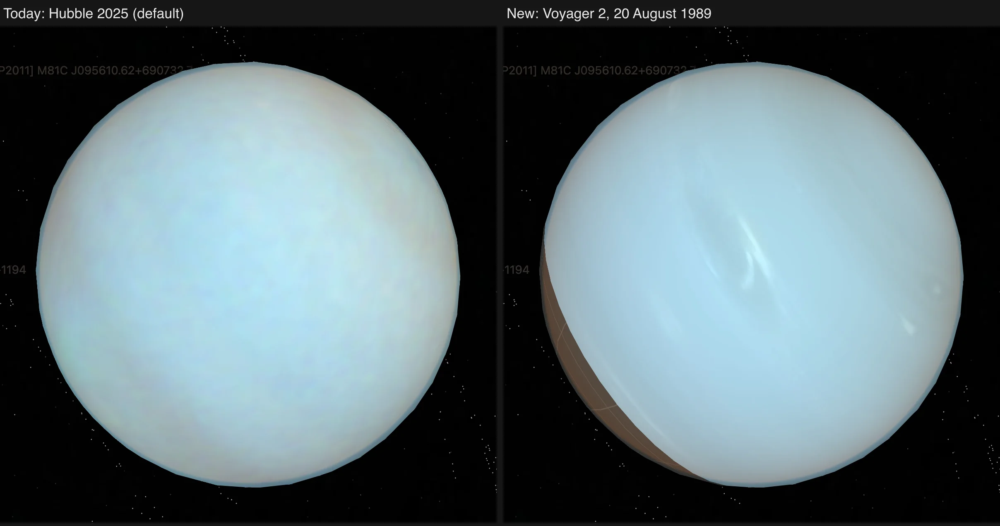

# Neptune

Neptune is shown as a Hubble OPAL global map on the shared sphere, with methane and near-infrared views, nine dated maps, a Voyager 2 map from 1989 and its rings.

The [navigation marker](source/preparation/navigation.json) retains its existing source-map crop and silhouette, with the shared prepared full-phase curvature shading (35% ambient, 65% diffuse). It is a stylized identifier, not an observer projection or illumination at the scene epoch.

## Sources

- The visible-color globe is the 2025 Hubble OPAL Cycle 32 color global map, assembled by the OPAL team from WFC3/UVIS F467M, F547M and F657N exposures. The methane dataset uses the matching FQ619N global map and the near-infrared dataset F845M. The products and the OPAL readme are in `source/opal/`.
- The OPAL readme says the TIFF is arbitrarily scaled and contrast enhanced, so its colors are calibrated against the 2024 Irwin et al. true-color Neptune reconstruction distributed by the Royal Astronomical Society. The reference is committed under `source/color/` with CC BY 4.0 attribution.
- The radii are 24,764 km equatorial and 24,341 km polar (IAU 2015 report values), the same the OPAL readme gives for its limb fits.
- JPL Solar System Dynamics discovery, mean-elements and physical-parameter tables supply the 16-moon catalog; the three moons without a page are drawn as plain dots at their JPL Horizons positions by [Neptune's moons without a page](../neptune-minor-moons/README.md). The [PDS Rings Node Neptune table](https://pds-rings.seti.org/neptune/neptune_rings_table.html) supplies the ring radii, widths and normal optical depths, including the Adams ring at 62,933 km. [Neptune's ring particles](../neptune-ring-particles/README.md) draws 600 dots along the rings; the position of a single dot is drawn from a seed.
- Two panel charts come from the committed NASA GSFC Planetary Spectrum Generator configuration and raw I/F response; the third uses the pinned photometric phase coefficients. Panel prose and facts come from the committed NASA Science `Neptune: Facts` snapshot.
- The dated maps are listed under [Hubble dates](#hubble-dates).
- The Voyager 2 dataset is built here from 89 calibrated narrow-angle frames of the 1989 approach, from the [PDS Ring-Moon Systems Node](https://pds-rings.seti.org/voyager/iss/): see [Voyager 2, August 1989](#voyager-2-august-1989).

Source selections, recorded trials and open questions are in the [investigation ledger](investigations.json).

## Processing

Preparation matches the mean and channel variation of a checked equatorial OPAL sample to the unobscured centre of the Irwin et al. reconstruction. The browser does not parse FITS, TIFF or the calibration reference.

Each dataset is mapped across 722 surface leaves on the shared sphere lane: 720 longitude-latitude cells and two polar caps. The orientation is solved from Neptune's pole and rotation at the scene epoch. Lighting is one 256-frame bank shared by every dataset. Each frame puts back the limb darkening OPAL removed from the color map, with the 2025b readme's Minnaert coefficients: k 0.50 in F657N, 0.80 in F547M and 0.88 in F467M ([planet limbs](../../../docs/surface-preparation.md#planet-limbs-from-published-laws)). No floor, ambient term or terminator ramp remains.

The rings are 16 wedges drawn from the ring recipe, each starting outside the planet so the planet hides their far side. Each ring's opacity is 1 − exp(−optical depth) and its color the neutral gray of a body without a measured color. Le Verrier and Adams (0.003) are one display level; Galle and Lassell (10⁻⁴) are below one and do not show, so the rings are all but invisible and the map marker carries no ring. Arago and the unnamed ring have no optical depth in the table and are not drawn. Until 2026-10-01 the rings were one blue with hand-set opacities.

## Hubble dates

The dataset stepper selects 9 dated [OPAL](https://archive.stsci.edu/hlsp/opal) visible-color maps, one rotation from each observing cycle, so no weather is averaged across rotations.

| Observation starts (UTC) | Rotation | Release | Source pixels |
| --- | --- | --- | --- |
| 2017-10-06 | 2017a | [Cycle 24](https://archive.stsci.edu/hlsp/opal/opal-neptune-cycle-24) | 721 × 361 |
| 2018-09-09 | 2018a | [Cycle 25](https://archive.stsci.edu/hlsp/opal/opal-neptune-cycle-25) | 721 × 361 |
| 2019-09-28 | 2019a | [Cycle 26](https://archive.stsci.edu/hlsp/opal/opal-neptune-cycle-26) | 721 × 361 |
| 2020-08-19 | 2020a | [Cycle 27](https://archive.stsci.edu/hlsp/opal/opal-neptune-cycle-27) | 721 × 361 |
| 2021-09-06 | 2021a | [Cycle 28](https://archive.stsci.edu/hlsp/opal/opal-neptune-cycle-28) | 721 × 361 |
| 2022-09-18 | 2022a | [Cycle 29](https://archive.stsci.edu/hlsp/opal/opal-neptune-cycle-29) | 721 × 361 |
| 2023-09-22 | 2023a | [Cycle 30](https://archive.stsci.edu/hlsp/opal/opal-neptune-cycle-30) | 721 × 361 |
| 2025-06-28 | 2025a | [Cycle 31](https://archive.stsci.edu/hlsp/opal/opal-neptune-cycle-31) | 721 × 361 |
| 2025-08-24 | 2025b | [Cycle 32](https://archive.stsci.edu/hlsp/opal/opal-neptune-cycle-32) | 721 × 361 |

The RGB TIFF and its three component FITS files are recorded in [the source manifest](source/manifest.json) and restored by [the acquisition recipe](source/preparation/acquisition.json). There is no 2024 release. The 2021 FITS headers omit DATE-OBS, so its date comes from the release readme. The 2015–16 maps used a different red coefficient and are deferred.

[The observation recipe](source/preparation/observations.json) removes polar-connected zero fill and unobserved rows before resampling; isolated dark observations stay valid. Missing neighbours never supply color. The shared gray graticule marks missing coverage, and the date views contain no polar continuation or inpainting.


## Voyager 2, August 1989

Hubble's pixel is 0.04″ and Neptune is about 2.3″ wide, so Hubble sees the planet about 58 pixels across; the 721-pixel OPAL maps are already enlargements. Voyager 2's frames of 20 August 1989, five days before closest approach, show it 840 to 1,030 pixels across. The Voyager 2 dataset is one color map of 2,880 × 1,440 pixels made from those frames by [the map command](../../../packages/bake/authoring/neptune/author-voyager-map.mts), from the frames [the map recipe](source/preparation/voyager-map.json) names:

```sh
node packages/bake/authoring/neptune/author-voyager-map.mts --write
```

The frames are GEOMED products: calibrated to reflectance and corrected for the camera's distortion by the PDS Ring-Moon Systems Node. No finished Voyager map of Neptune is published as a data product; the steps below are this repository's.

| Step | What is done | Measured on these frames |
| --- | --- | --- |
| Placement | The recorded pointing is off by up to 227 pixels, so the limb is found in each frame and fitted to the limb of the planet's flattened figure. Only the frame's position is solved. | Fit residual: median 0.45 px, largest 0.98 px over 89 frames |
| Camera marks | Dust rings and scars sit on the same detector pixels in every frame, and clouds do not. The mean of the frames over their own local mean is the camera's pattern; frames are divided by it. | Covers 63 % of the detector |
| Limb darkening | One Minnaert exponent per filter is fitted to the frames, each latitude band at its own level. What it leaves, by viewing and lighting angle, is measured against the mosaic and divided out. | Green 0.708, orange 0.684, blue 0.775 |
| Cloud drift | Clouds drift against the planet's rotation, so frames hours apart show them displaced. Each frame is carried along its latitude circles to one moment. The drift is the rate measured between frame pairs where their clouds correlate, and the [Voyager wind fit](https://arxiv.org/abs/1312.2676) of Sromovsky et al. (1993) elsewhere. | Table below |
| Mosaic | The 15 green frames span one day, a rotation and a half. Frames a rotation apart are not averaged, because clouds change shape: they form two groups, and a cell goes to the group that saw it more squarely. Where the drift changes steeply with latitude, frames taken far from the map's moment would shear a cloud, and count for little. | Groups of 9 and 6 frames; map moment 1989-08-20 11:58 UTC |
| Color | Blue was last taken on 18 August, so the color comes from 59 orange, green and blue frames of 17 and 18 August, 54 hours earlier and at 71 to 88 km per pixel. Their ratios to green are moved, band by band, to where the sharp map shows the same clouds, smoothed over 1.5°, and multiplied onto it. A band whose clouds could not be matched keeps only its mean ratio round the planet. | 13 of the 62 two-degree bands matched, 3 of them from their neighbours |
| Color tie | The map's mean reflectance between 45° S and 10° S becomes the mean color of the centre of the Irwin et al. true-color reconstruction, one gain per channel in linear light. The planet's own contrast is kept. | Gains 1.022, 1.382, 1.321; 0.009 % of samples clip |

Drift measured between pairs of the 30 green and clear frames of 20 August, eastward positive, against the 16.11 h radio rotation:

| Latitude | Degrees per hour | m/s | Wind fit, m/s | Frame pairs |
| --- | --- | --- | --- | --- |
| 3° N | −2.68 | −321 | −396 | 11 |
| 1° N | −2.67 | −320 | −398 | 7 |
| 17° S | −2.77 | −318 | −345 | 19 |
| 19° S | −2.83 | −322 | −332 | 17 |
| 21° S | −2.82 | −316 | −317 | 20 |
| 23° S | −2.82 | −313 | −302 | 22 |
| 25° S | −2.70 | −295 | −285 | 24 |
| 27° S | −2.78 | −298 | −267 | 29 |
| 41° S | −0.80 | −73 | −116 | 7 |
| 53° S | 0.28 | 21 | 35 | 15 |
| 55° S | 0.24 | 17 | 61 | 16 |

The bands from 17° S to 27° S hold the Great Dark Spot, 41° S the bright cloud called the Scooter, and 53° S to 55° S the second dark spot. Between the two epochs the color bands moved by 150° to 159° westward from 3° N to 27° S (correlation 0.29 to 0.90, three of them bridged from their neighbours), 44° to 46° westward at 41° S to 43° S (0.97, 0.65), 23° westward at 47° S (0.51) and 19° eastward at 55° S (0.75).



Every longitude is seen from 34.8° N to the south pole. Voyager approached from 28° S and the far north was in darkness; the gray grid marks it. The map shows 20 August 1989; the scene's lighting, rings and rotation are the existing presentation.

## Evidence

- Laid back into the ring plane, the 16 ring wedges match the single ring image they replaced to a mean alpha error of 1.03/255 inside a wedge and 1.30/255 within 2 px of a wedge boundary.
- For every dated map, the TIFF rows correlate with the component FITS rows more strongly in stored order than after a north/south flip. This checks orientation, not color calibration.
- The picture under [Voyager 2, August 1989](#voyager-2-august-1989) is two captures of the app in headless Chrome at 1,440 × 900 and 2 device pixels per pixel, from one camera, after the local bake of 2026-10-05. No other browser was captured.
- The Voyager map's arithmetic is tested in [the map tests](../../../packages/bake/authoring/neptune/voyager-map.test.mts): the limb of the flattened planet, drift measured from displaced clouds and not from a pattern that travels with the camera, the hand-over between rotations, camera marks, and color following its band. 12 of 12 passed on 2026-10-05.

## Known problems

- Neptune's north pole was tilted away from Hubble in 2025. On the pinned OPAL maps coverage ends near 71° N, and the rows below it still carry dark swath edges. Preparation starts the fill where the rows recover, at 57° N for the 619 and 845 nm maps and 41° N for color, and extends that row toward its longitudinal mean at the pole. The fill supplies no storm or cloud detail.
- The normal pole atlas samples the 720 × 360 OPAL grid directly. This keeps the existing projection and does not recover unobserved polar features.
- The lighting overlay has one color and alpha per pixel, so its limb law is exact only for the color map's mean color. The FQ619N and F845M maps share the color map's bank, so their limb is not their own law.
- The Adams arcs are not drawn. The Rings Node table lists five arcs (Courage, Liberte, Egalite 1 and 2, Fraternite) at an optical depth near 0.1 but gives only relative spacings, so their positions at the scene epoch are not published.
- The dated maps are publisher mosaics with contrast enhancement and arbitrary channel scaling, not calibrated color comparisons between years. The scene camera, Sun and rings do not reproduce the original observing geometry. Publisher seam artifacts inside valid coverage remain.
- The Voyager map's color in a band whose clouds could not be matched between 18 and 20 August is that band's mean color. The bright clouds near 70° S are in such bands and are not whitened.
- 51 of the 89 Voyager frames have no record in the pointing kernel and take the twist about the line of sight from the nearest frame that has one. The limb fixes a frame's position, not that twist, and the twist has no independent check.
- The Voyager map's detail is the green filter alone. The clear frames of 20 August only help measure drift; mixed into the mosaic they left a seam. The frames of 21 August are sharper still (37 to 48 km per pixel), but 62 of the 98 show no limb and cannot be placed this way.
- The lighting bank is the OPAL color map's limb law for every dataset, so the Voyager map is lit with Hubble's exponents (0.50, 0.80, 0.88), not the ones fitted to its own frames.

[Inputs](source/manifest.json) · [Preparation](source/preparation) · [Delivered files](inventory.json) · [Credits](NOTICE.md)
