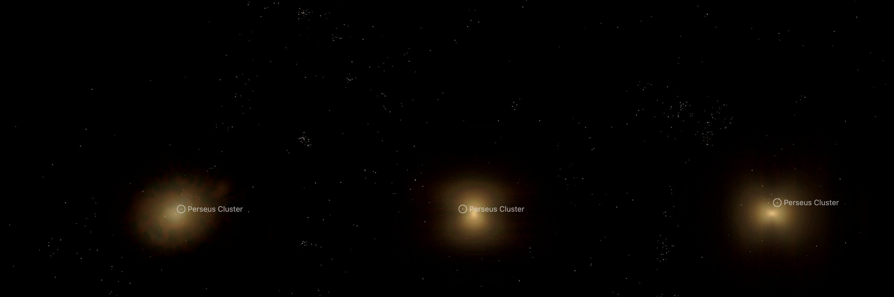

# NGC 1275

The giant galaxy NGC 1275 (Perseus A), at the centre of the Perseus Cluster. It is drawn as a volume of starlight on its own page, [NGC 1275](../ngc-1275/README.md). A survey image, cleaned of
the Milky Way stars and neighbouring galaxies, supplies the light along every sight line; the depth of that light
follows a published fit to NGC 1275's profile. **Depth is modelled, not measured.**

## Sources

| Selected source | Input and meaning |
| --- | --- |
| [Sloan Digital Sky Survey DR9](https://www.sdss.org/) | [Record](../../sources/sdss-dr9-color-hips.json). The survey's g, r, i color composite as the CDS HiPS `CDS/P/SDSS9/color`, cut out by the CDS hips2fits service: 1500 × 1500 px over 6.7 × 6.7 arcmin, tangent projection, north up. A display composite, not calibrated photometry. |
| [Sahu, Graham & Davis (2020)](https://arxiv.org/abs/2101.04895) | [Record](../../sources/sahu-2020-spheroid-sersic.json). Table A1, row 49, NGC 1275: the major-axis Sérsic fit to the spheroid in the Spitzer 3.6 μm image, n = 4.78, half-light radius 70.69″. |
| [2MASS Extended Source Catalog](https://cdsarc.cds.unistra.fr/viz-bin/cat/VII/233) (Skrutskie et al. 2006) | Row 2MASX J03194823+4130420: position 49.950981°, +41.511681°; K-band 3σ isophote axis ratio 0.83 and position angle −80°. Also the sizes (K-band 20 mag isophotal radius) of 14 masked neighbours. |
| [HyperLEDA PGC](https://cdsarc.cds.unistra.fr/viz-bin/cat/VII/237) (Paturel et al. 2003) | [Record](../../sources/paturel-2003-hyperleda-pgc.json). Positions and D25 sizes of 13 masked neighbouring galaxies. |
| [Gaia DR3](https://cdsarc.cds.unistra.fr/viz-bin/cat/I/355) | [Record](../../sources/gaia-2023-dr3.json). Positions and G magnitudes of the 11 masked stars brighter than G = 15. |
| [Cosmicflows-4](https://cdsarc.cds.unistra.fr/viz-bin/cat/J/ApJ/944/94) (Tully et al. 2023) | Table 3, group 1PGC 12429, whose dominant galaxy is NGC 1275: distance modulus DMzp = 34.185 ± 0.036, 68.7 Mpc (±1.1 Mpc from the modulus error). It is the distance the [Perseus Cluster's circle](../galaxy-clusters/README.md) and its member dots are drawn at, so NGC 1275 sits among them. |

## Method

The Nebula Lab recipe is [labs/nebula/models/ngc-1275/experiment.json](../../../labs/nebula/models/ngc-1275/experiment.json);
`node labs/nebula/run.mts prepare-emission` runs it, and [delivery.json](source/delivery.json) places the result. It is
[M49's route](../m49-volume/README.md#method) with NGC 1275's measurements.

1. **Stars:** NOX removes the Milky Way stars from the cutout.
2. **Masks:** 13 HyperLEDA galaxies are masked out to three times their D25 radius, 14 2MASS galaxies (which
   sizes those HyperLEDA gives no D25) to three times their K-band 20 mag radius, and 11 Gaia stars, whose haloes
   NOX leaves, to 45″ at G = 11, scaled with brightness. No mask reaches beyond half its distance from NGC 1275's
   centre. A masked pixel takes the median of the unmasked light on its isophote and never gains light.
3. **Compact leftovers:** each pixel is clamped to the median of the 75 px around it (20″, 6.7 kpc), so
   uncatalogued galaxies and faint haloes drop out and the smooth light stays.
4. **Black level:** each channel loses the median of the cleaned cutout on the isophote where the spheroid ends
   (0.059, 0.024, 0.020 for red, green, blue), so the light fades to nothing at that edge. The survey's i band, shown as red, has a brighter sky than g and r around NGC 1275; one level for the three left a red haze out to the edge.
5. **Depth:** the light along each sight line is spread in depth by the deprojected density (Prugniel & Simien 1997) of
   Sahu, Graham & Davis's fit: n = 4.78, half-light radius 70.69″ (23.5 kpc at 68.7 Mpc). The spheroid's axis is NGC 1275's minor axis (position angle 190°), placed in the plane of the sky,
   with the axis ratio 0.83; no intrinsic axis is measured. It ends at 200″ (66.6 kpc).

Values chosen here, not measured or published:

- The end of the spheroid, 200″: where the cleaned cutout reaches its sky level in 10″ elliptical annuli. The
  published fit runs on; the survey image does not.
- The mask sizes, the cap at half a neighbour's distance, the star mask scale and the median window.
- The display exposure 1.5 and the 150-cell grid are M87's.
- A black level per channel is new to the lab recipe (`blackLevel` takes three values).
- The median window, 75 px, also flattens NGC 1275's own light within about 7″ of the nucleus.

## Evidence

The NGC 1275 page in headless Chromium at 1440 × 900, device pixel ratio 2, on this branch on 2026-10-02: the default
arrival, then the camera turned to the side and to above the galaxy.

- The volume reproduces the cleaned image along every sight line it covers (the method conditions on it); 4% of the red and under 1% of the green and blue
  of the image's light lies outside the spheroid and is not drawn.
- The cutout's registration is its request: the brightest pixel of the core falls within 0.8″ (3 px) of the image
  centre, the 2MASS position.
- Tests: `labs/nebula/packages/reconstruction/src/methods/symmetry/processing.test.ts` pins the isophote fill and the
  per-channel black level; `shape-prior.test.ts` pins the Sérsic spheroid.

## Known problems

- NGC 1275's line-emitting filaments, its dust and the foreground high-velocity system are in the survey image. The median window removes most of them; what remains is spread in depth like the starlight.
- The survey's red (i band) sky is uneven here, 13° from the Galactic plane: about 4% of the red light lies outside the spheroid, and the outskirts are redder than the galaxy.
- West of the core, where the masks of a bright star and of NGC 1272 overlap, the fill is slightly darker than the light around it.
- Two small galaxies no catalogue sizes remain as faint smudges west of the core.
- One smooth spheroid about an axis in the plane of the sky: the true shape along the line of sight is unknown.
- The image is a stretched display composite, so the volume's brightness is not proportional to the starlight.
- The distance is the Perseus Cluster's group average, not a measurement of NGC 1275 itself.
- No globular clusters are drawn.
