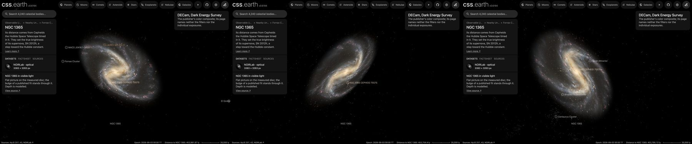

# NGC 1365

An observatory photograph of NGC 1365, cleaned of the Milky Way stars in front of it and color-tied to its measured integrated color, lies flat on its measured disc, with its bulge standing through it as a small volume and its catalogued planetary nebulae and supernova remnants as dots. Image brightness does not measure per-pixel distance.

## Sources

| Selected source | Input and meaning |
| --- | --- |
| [NOIRLab iotw2127a](https://noirlab.edu/public/images/iotw2127a/) | [Record](../../sources/noirlab-iotw2127a.json). Dark Energy Survey data from the Dark Energy Camera on the Blanco 4-metre telescope, processed by T. Rector, J. Miller, M. Zamani and D. de Martin: the publisher's Large JPEG, 3383 × 3263 px (`source/source.jpg`, restored from its origin). CC BY 4.0, credit Dark Energy Survey/DOE/FNAL/DECam/CTIO/NOIRLab/NSF/AURA. The page does not name the filters. A display composite, not calibrated photometry. |
| [Leroy et al. (2021)](https://cdsarc.cds.unistra.fr/viz-bin/cat/J/ApJS/257/43) | [Record](../../sources/leroy-2021-phangs-alma.json). Row NGC1365: centre 53.40167°, −36.14028°, inclination 55.4 ± 6.0°, position angle 201.1 ± 7.5°: the disc the image lies on. The same row gives the stellar scale length, 13.1 kpc at their 19.57 Mpc, 138.1″, which is 12.22 kpc at the distance used here. |
| [Gaia DR3](https://doi.org/10.1051/0004-6361/202243940) with [Ren et al. (2021)](https://doi.org/10.3847/1538-4357/abcda5) | The 278 Gaia DR3 sources within 0.18° of NGC 1365's centre that Ren et al.'s criterion marks as Milky Way stars (`source/gaia-dr3-foreground.csv`, restored by the query in the [Gaia record](../../sources/gaia-2023-dr3.json)). |
| [RC3](../../sources/rc3-1991.json) | NGC 1365's total B-V, 0.69 ± 0.01 as observed. |
| [Riess et al. (2016)](https://arxiv.org/abs/1604.01424) | [Record](../../sources/arxiv-1604-01424.json). Distance: table 5, row N1365, Cepheid distance modulus 31.307 ± 0.057, 18.26 Mpc, the distance its Cepheids are placed at. |
| [Kregel et al. (2002)](https://arxiv.org/abs/astro-ph/0204154) | [Record](../../sources/kregel-2002-disc-flattening.json). Discs are on average 7.3 ± 2.2 times longer than thick, so the scale length gives a 1674 pc scale height. The recipe carries six of them as the disc's thickness; a flat bank draws none of it. |

The bank has no parent: it is the picture of its host, [`ngc-1365`](../ngc-1365/README.md), named in `properties.host`. The host's README says which object the galaxy is inside.
| [Salo et al. (2015)](https://cdsarc.cds.unistra.fr/viz-bin/cat/J/ApJS/219/4) | [Record](../../sources/salo-2015-s4g-decompositions.json). S4G's 3.6 µm fit of NGC1365 (table 7, model `_bdbarfn`): a Sérsic bulge (25.0% of the light, magnitude 10.204, half-light radius 12.64″ = 1.12 kpc, n = 0.857, axis ratio 0.577, PA 33.31°) and an exponential disc (53.8% of the light, scale length 95.05″ = 8.41 kpc, axis ratio 0.588, PA 31.66°, face-on central surface brightness 21.251, 20.674 as projected on the sky) and a Ferrers bar (14.3% of the light, radius 90.00″ = 7.97 kpc, axis ratio 0.504, PA 88.51°, central surface brightness 19.892 on the sky) and a point nucleus (7.0% of the light), which is neither bulge nor disc: its light stays on the flat picture. |

## The image

- **Registration:** the page's centre (53.40417°, −36.14565°), field (14.82 × 14.30′) and orientation (north up) hold: 72 of the 90 Gaia stars brighter than G = 19 in the frame have a star within 4 px of their places, and a search over centre, scale, rotation and mirror finds nothing better than 73. That is 0.263″ per pixel. Leroy et al.'s centre lands in the bright central region, whose core is burned out in the photograph, so no nucleus peak can be measured against it.
- **Foreground stars:** 144 of the 162 Gaia foreground stars in the image are removed where they show; 0 on extended
  light are left.
- **Color:** tied to RC3's B-V of 0.69: red/green 1.063 and blue/green 1.01 against 1.148 and 0.873, so red × 1.08
  and blue × 0.864 in linear light.
- **Bulge:** the bulge takes the fit's own light, scaled to the photograph and never more than the photograph holds there, in an oblate spheroid through the disc with intrinsic axis ratio 0.12 (the one that projects to 0.577 at 55.4°) and the fit's deprojected Sérsic density. The flat picture keeps the rest, so the view from the Sun is unchanged and the photograph's own structure stays on the disc. The spheroid ends on its own surface at 8 half-light radii (8.95 kpc), where the fitted bulge is under about 1% of the display's range, fading from half that radius, so it shows no rim: a presentation choice.
- **Disc:** inclination 55.4°, line of nodes 201.1°, drawn as one flat image on the midplane. The support radius, 37.9 kpc (7.1′), is where the frame stops on its tightest side. The image's ring median is still 13 of 255 there, above its sky level of 4, so the frame cuts the faintest outer light; RC3's isophotal radius is 29.8 kpc.
- **Near side:** the catalogue gives the tilt, not which edge is nearer. The arms open counter-clockwise on the sky, so if they trail, as spiral arms do, the disc turns clockwise; with the receding side at position angle 201.1° that puts the near side at 291° (west-north-west). This is an inference from the photograph and the velocity field, not a published statement. It reads Leroy et al.'s position angle as the receding side's; [Lang et al. (2020)](https://cdsarc.cds.unistra.fr/viz-bin/cat/J/ApJ/897/122) fit 210.7° to the CO velocity field, the same side.
- **Sky:** the image's sky, (4, 3, 4) of 255, is subtracted as the background floor (4 of 255).
- **Bytes:** 85 images, 282 KB (WebP quality 70, alpha quality 80): the flat picture, 625 × 907 px, the scale of the Milky Way's own
  backing image, and the bulge's small slices. The disc is one flat plane, as the Milky Way's is: no slabs through its thickness.

## Evidence

The NGC 1365 page in headless Chromium at 1440 × 900, device pixel ratio 2, on this branch on 2026-10-03, with its bulge: the default
arrival, then the camera turned to the side and to above the disc. No page errors. It shows its planetary nebulae and supernova remnants as colored dots, and its SH0ES Cepheids, objects of
their own inside the galaxy, as white ones.

- The prepared bank's `approximation.limitations` records the foreground and color-tie counts quoted above.
- What was examined and left out is in the [investigation ledger](investigations.json).

## Measured, chosen and inferred

| Value | Kind |
| --- | --- |
| Centre, inclination 55.4° ± 6.0°, position angle 201.1° ± 7.5° | Measured: Leroy et al. (2021) |
| Distance 18.26 Mpc | Measured: Riess et al. (2016), from its Cepheids |
| Near side at 291° | Inferred: trailing arms and the receding side |
| B-V 0.69 | Measured: RC3 |
| Scale height 1674 pc | Inferred: the scale length over 7.3, the mean of other galaxies; not measured here. The picture draws none of it; the dots' heights are drawn from it |
| Support 37.9 kpc, fade from 28.4 kpc | Presentation: where the frame stops |
| One flat image, at most 1,024 px on its face, background floor | Presentation |

## Dots

| Catalogue | Drawn | Note |
| --- | --- | --- |
| [Planetary nebulae (Scheuermann et al. 2022)](https://cdsarc.cds.unistra.fr/viz-bin/cat/J/MNRAS/511/6087), [recipe](source/scheuermann-pne/points.json) | 29 | type PN |
| [Supernova remnants (Scheuermann et al. 2022)](https://cdsarc.cds.unistra.fr/viz-bin/cat/J/MNRAS/511/6087), [recipe](source/scheuermann-snr/points.json) | 5 | type SNR |

The catalogue tables are files of the CDS archive (each descriptor's `table.origin`); they are not tracked. Each dot is a catalogued object at its published sky position, placed where its sight line meets the disc. Its height above the disc is drawn from a 1674 pc layer, the scale length over 7.3 ([Kregel et al. 2002](https://arxiv.org/abs/astro-ph/0204154), [record](../../sources/kregel-2002-disc-flattening.json)); that height is not measured. Planetary nebulae near the centre can sit in the bulge, with the bulge's share of the fitted light there; that membership is drawn, not measured. Each dot takes its tone from the image's brightness under it and moves halfway from its kind's color to the image's color there.

Ionised nebulae (Groves et al. 2023) are not drawn yet: CDS's TAP service, the only route to that table short of a 43 MB file, did not answer on 2026-10-03.

## Known problems

- The bulge's depth is modelled, not measured: the paper fits light on the sky, and the spheroid is the one that shows its axis ratio at the disc's tilt.
- The fit is of the 3.6 µm image and the picture is visible light, so the bulge's share of the picture is not exactly the fit's.
- Where the fit's bulge is as bright as the photograph, the flat picture is empty under it; from the side the nucleus can show as a dark spot on the disc.
- The tilt and position angle are loosely measured (± 6° and ± 7.5°), so the disc's orientation in space is uncertain by about that much.
- The frame cuts the faintest outer light on its tightest side.
- The galaxy's core is burned out in the photograph.
- The field's stars and background galaxies inside the support radius are drawn on the disc's plane with the rest of the image.
- The PHANGS-MUSE nebular catalogue lists 1,449 ionised nebulae here ([Groves et al. 2023](https://cdsarc.cds.unistra.fr/viz-bin/cat/J/MNRAS/520/4902)); they are not drawn yet (see Dots).
- The scale length behind the recipe's thickness, 13.1 kpc, is the largest in Leroy et al.'s table; a flat bank does not draw it.
- The image is flat: seen edge-on it is a line. Nothing here has height.
