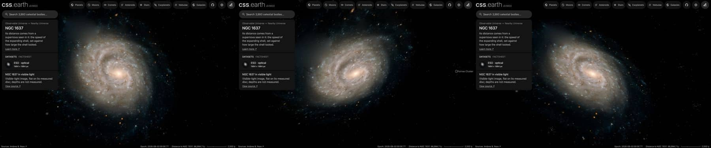

# NGC 1637

An observatory photograph of NGC 1637, cleaned of the Milky Way stars in front of it and colour-tied to its measured
integrated colour, lies flat on its measured disc. No catalogue of its nebulae or clusters was found, so it has no
dots. Image brightness does not measure per-pixel distance.

## Sources

| Selected source | Input and meaning |
| --- | --- |
| [ESO eso1315a](https://www.eso.org/public/images/eso1315a/) | [Record](../../sources/eso-eso1315a.json). FORS1 on the Very Large Telescope in B, V and R: the publisher's Large JPEG, 1964 × 1964 px (`source/source.jpg`, restored from its origin). CC BY 4.0, credit ESO. A display composite, not calibrated photometry. |
| [Leroy et al. (2021)](https://cdsarc.cds.unistra.fr/viz-bin/cat/J/ApJS/257/43) | [Record](../../sources/leroy-2021-phangs-alma.json). Row NGC1637: centre 70.3675°, −2.85806°, inclination 31.1 ± 5.0°, position angle 20.6 ± 10.0°: the disc the image lies on. The same row gives the stellar scale length, 1.8 kpc at their 11.7 Mpc, 31.7″, which is 1.43 kpc at the distance used here. |
| [Gaia DR3](https://doi.org/10.1051/0004-6361/202243940) with [Ren et al. (2021)](https://doi.org/10.3847/1538-4357/abcda5) | The 216 Gaia DR3 sources within 0.12° of NGC 1637's centre that Ren et al.'s criterion marks as Milky Way stars (`source/gaia-dr3-foreground.csv`, restored by the query in the Gaia record). |
| [RC3](../../sources/rc3-1991.json) | NGC 1637's total B-V, 0.64 ± 0.02 as observed. |
| [Local Volume Database](../../sources/lvdb-v1-1-1.json) | Distance: modulus 29.84 ± 0.11 ([Jones et al. 2009](https://ui.adsabs.harvard.edu/abs/2009ApJ...696.1176J), from the expanding photosphere of its supernova 1999em), 9.29 Mpc. |

## The image

- **Registration:** the page's field (7.19′), centre and rotation (north 6.2° right of vertical) do not match the Large
  JPEG. A blind match of the image's star peaks to Gaia DR3, over every rotation, both mirrors and pixel scales from 0.18″
  to 0.27″, finds one solution: north up at 0.2000″ per pixel, a field of 6.55′, centre 70.3678848°, −2.8606559°. On it
  27 of the 32 Gaia stars in the frame have a star within 4 px, and Leroy et al.'s centre lands on the nucleus.
- **Foreground stars:** 22 of the 41 Gaia foreground stars in the image are removed where they show; 18 on extended
  light are left.
- **Colour:** tied to RC3's B-V of 0.64: red/green 1.071 and blue/green 1.031 against 1.116 and 0.900, so red × 1.042
  and blue × 0.873 in linear light.
- **Disc:** inclination 31.1°, line of nodes 20.6°, drawn as one flat image on the midplane. The
  support radius, 8.5 kpc, is where the frame stops on its tightest side; the image's ring median reaches its sky level
  about 7 kpc out. No bulge component: S4G's fit of this galaxy (Salo et al. 2015, model `_dbarn`) is a disc, a bar and
  a nucleus, with no spheroid.
- **Near side:** the catalogue gives the tilt, not which edge is nearer. The arms open counter-clockwise on the sky, so
  if they trail, as spiral arms do, the disc turns clockwise; with the receding side at position angle 20.6° that puts
  the near side at 111° (east-south-east). This is an inference from the photograph and the velocity field, not a
  published statement; it reads Leroy et al.'s position angle as the receding side's, and that angle is uncertain by 10°.
- **Sky:** the image's sky, (12, 12, 11) of 255, is subtracted as the background floor (12 of 255).
- **Bytes:** one image, 849 × 942 px, 473 KB (WebP quality 70, alpha quality 80), the scale of the Milky Way's own
  backing image. It is one flat plane, as the Milky Way's is: no slabs through the disc's thickness.

## Evidence

The NGC 1637 page in headless Chromium at 1440 × 900, device pixel ratio 2, on this branch on 2026-10-01: the default
arrival, then the camera turned toward the side and to above the disc, by the same drags as the other galaxies; at
this tilt the side drag does not reach edge-on.

- The prepared bank's `approximation.limitations` records the foreground and colour-tie counts quoted above.

## Measured, chosen and inferred

| Value | Kind |
| --- | --- |
| Centre, inclination 31.1° ± 5°, position angle 20.6° ± 10° | Measured: Leroy et al. (2021) |
| Distance 9.29 Mpc | Measured: Jones et al. (2009), through the Local Volume Database |
| Near side at 111° | Inferred: trailing arms and the receding side |
| B-V 0.64 | Measured: RC3 |
| Support 8.5 kpc, fade from 6.4 kpc | Presentation: where the frame stops |
| One flat image, 1,024 px on its face, background floor | Presentation |

## Known problems

- The tilt and position angle are loosely measured (± 5° and ± 10°), so the disc's orientation in space is uncertain by
  about that much.
- The photograph is 1964 px across, the smallest of the disc galaxies here: up close it is soft.
- The faint outer arms reach the frame's edge, so the support radius cuts them.
- A faint green patch shows beside the disc's north-east edge in the app, and the field's stars and background
  galaxies inside the support radius are drawn on the disc's plane with the rest of the image. Neither was traced to
  its cause in this change.
- No dots: no published catalogue of the galaxy's nebulae or clusters was found on CDS.
- The image is flat: seen edge-on it is a line. Nothing here has height.
