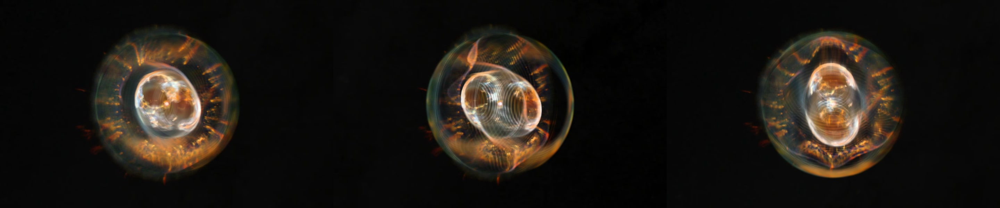
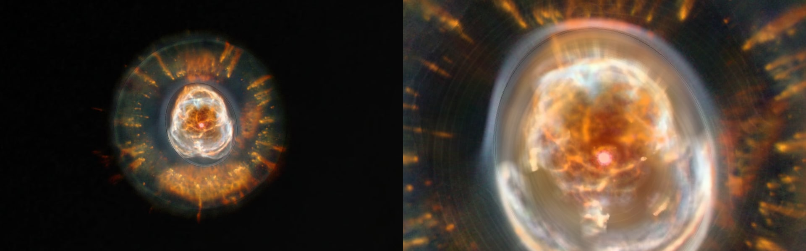

# NGC 2392

ESA/Hubble's photograph of NGC 2392, the planetary nebula long nicknamed the Eskimo Nebula, laid on the walls its spectra give: a fast inner bubble pointed almost at the Sun, inside a round outer shell. **The shells and their depths come from published expansion speeds. Which wall a feature of the bubble is on, and how the fur between the shells is bent, come from 536 measured speeds.**

## Sources

| Selected source | Input and meaning |
| --- | --- |
| [ESA/Hubble heic9910a](https://esahubble.org/images/heic9910a/) | [Record](../../sources/esahubble-heic9910a.json). NGC 2392: WFPC2 in He II 469, [O III] 502, H-alpha 656 and [N II] 658 nm; 1500 × 1500 px over 1.25 × 1.25 arcmin (`source/source.jpg`, the publisher's JPEG, restored from its origin). Credit: NASA, ESA, Andrew Fruchter (STScI), and the ERO team (STScI + ST-ECF). A display composite, not calibrated photometry. |
| Chornay & Walton (2021) | [Record](../../sources/chornay-walton-2021-pn-central-stars.json). Distance of the central star: 1,795 pc (1,666 to 1,942). |
| [García-Díaz et al. (2012)](https://arxiv.org/abs/1211.6717) | [Record](../../sources/publication-garcia-diaz-2012-eskimo-model.json). A model from 21 long-slit [N II] spectra. Sect. VI: the outer shell is close to a sphere of radius 23″ expanding at 16 km/s; the inner shell is a prolate spheroid expanding at 120 km/s along its axis, tilted 9° from the line of sight and pointing towards position angle 205°; each component has its own homologous law; cometary knots lie on an equatorial disc at about 17″; caps of knots lie at the edge of the outer shell, two behind (north and west) and one in front (south), at 55 km/s. |
| [García-Díaz et al. (2015)](https://arxiv.org/abs/1411.0042) | [Record](../../sources/publication-garcia-diaz-2015-eskimo-proper-motions.json). Sect. V: the inner shell's long axis is 1.8 times its short one. Table 3 ([CDS J/ApJ/798/129](https://cdsarc.cds.unistra.fr/viz-bin/cat/J/ApJ/798/129), `source/proper-motions.dat`, the table as CDS serves it): 536 structures with their place from the central star and their radial velocity from high-resolution spectra. |

## The picture

- **Registration:** the file's embedded sky tags give scale and direction, 0.0499″ per pixel and north 168.4° left of vertical. The tags alone put the central star 0.45″ from where the picture shows it, so the frame's centre is set where the star in the picture is at its Gaia place.
- **Outer shell:** a sphere of radius 23″ about the star; its law is 16 km/s at 23″. It holds the smooth light outside the inner shell, half on the wall in front of the star and half on the wall behind.
- **Inner shell:** a prolate spheroid on the same axis, tilted 9° from the sight line, its near end leaning to position angle 205°. Its outline is measured on the picture ([inner-shell-rim.mts](../../../packages/bake/authoring/ngc-2392/inner-shell-rim.mts)): the rim stands up to 11″ from the star toward the north-north-east and 7.5″ to 8.3″ to the east, south and west. The smallest ellipse about the star that holds it has semi-axes of 10.80″ and 9.15″; the wall's outline is 11.0″ by 9.2″, the long axis toward position angle 25°. Along its pole the shell is 1.8 times the short semi-axis: 16.6″ in front of the star and 16.6″ behind, which is 120 km/s under its own law.
- **Which wall, inside the inner shell:** one picture cannot tell the wall in front of the star from the wall behind it. The spectra can: a structure measured approaching is on the near wall, one receding on the far wall, and each place takes the mean of the speeds measured within about 1″. Where nothing is measured the detail is in front, as in the [Ring Nebula](../m57-layers/README.md). Both walls take half the smooth light ([shape-walls.ts](../../../packages/bake/src/image-layers/shape-walls.ts)).
- **The fur, between the shells:** the paper has cometary knots at rest on an equatorial disc and caps at 55 km/s on the outer shell, in front in the south and behind in the north and west. On the sky they lie side by side. The fine detail between the shells is drawn on one surface: the equatorial plane where the measured structures are at rest, bent toward the outer shell's near wall or far wall by their mean speed over about 3″, and on that wall where the mean reaches 55 km/s ([shape.ts](../../../packages/bake/src/image-layers/shape.ts)).
- **The star:** the central star's own light, out to 0.9″ in the picture and less and less to 1.8″, stays at the star.
- **Joins:** the inner shell's two walls are led onto the equatorial plane over the outer 10% of its outline, and the outer shell takes up its smooth light over 35% of the inner shell's size from that outline. Without them the edges of the walls show as lines around the bubble. Both are presentation choices.
- **Outside the outer shell:** the faint light beyond 23″ keeps no depth. It lies on one plane through the star, facing the Sun.
- **Drawing:** from the front, 56 terraces parallel to the picture at the picture's resolution; from the side, 56 and 56 curtains through its columns and rows, as the Ring Nebula's bank is drawn.
- **Size:** 1.25 × 1.25 arcmin, 0.65 pc wide at 1,795 pc; the outer shell is 0.40 pc across.
- **Rim:** the picture fades out on a round rim between 70% and 98% of half its side, so no straight edge shows.

## Evidence

The page in headless Chromium at 1440 × 900, device pixel ratio 2, on 2026-10-04, with the camera turned: the bubble inside the round shell, the fur between them. No page errors.

The same page as it opens, and from the nearest the camera comes.

The bake's tests ([shape.test.ts](../../../packages/bake/src/image-layers/shape.test.ts)) composite a small picture's terraces along the Sun's sight line and compare the sum with the flat bake of the same picture, and check that a knot measured approaching, receding or at rest stands where its speed puts it. The same sum over this bank's terraces differs from its flat bake by 0.6 of 255 levels per channel on average. The Ring Nebula's bank, baked again with this code, is the same as published, file for file.

The paper's tilt is in its own table: the inner shell's approaching structures lie toward position angle 201° from its receding ones, beside the model's 205°. Beyond 12″ from the star 187 structures are within 8 km/s of rest, 57 approach (38 to 49 km/s, in the south) and 31 recede (27 to 58 km/s, in the north and west). The [ledger](investigations.json) has the counts.

## Known problems

- The fur is one surface. Where knots at rest and a cap at 55 km/s lie side by side on the sky, as in the south, it stands between the plane and the wall, at their mean speed: neither is at its own place. Drawn each at its own depth, neighbouring patches came apart from the page's camera.
- The inner shell in the picture is not centred on the star: its rim is about 3″ farther out to the north than to the south. The wall is an ellipsoid about the star that holds the whole rim, so in the south the wall's edge lies outside the rim, over dark sky.
- The paper calls the inner shell deformed, peanut-like. It is drawn as a plain spheroid.
- The wall a feature of the inner shell is on is known at 259 places. Between them a place follows the nearest ones; where two neighbours differ, the light between them is shared by both walls.
- A structure on the inner shell is drawn on its wall, whatever its speed. The paper's model also has filaments inside the shell.
- The caps are bent toward the outer shell's walls, where the paper's model puts them. The paper says they may lie anywhere between the two shells.
- From the page's camera, nearer than the Sun, a thin line shows around the inner shell's outline, where its walls end.
- Turned far from the Sun's view, the terraces show as steps on the inner shell.
- The jet does not show in the picture and is not drawn.
- All three color channels take the [N II] speeds. He II and [O III] gas may lie at other depths, as it does in the Ring Nebula.
- The page stands at the central star's Gaia distance, 1,795 pc. The nebula's own expansion gives 1,300 pc (García-Díaz et al. 2015). The walls are set in arcseconds, so their shape is the same at either.
- Colors are the publisher's display composite, not a measurement.
- The bank is 3.2 MB, 2.8 MB of it the terraces for the view the page opens on.
