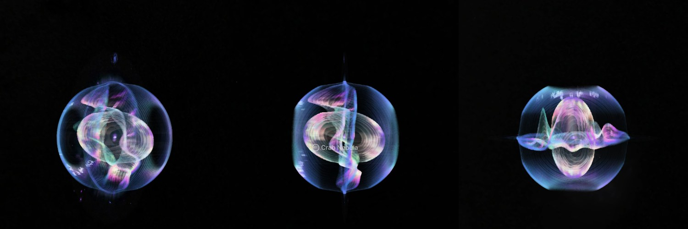
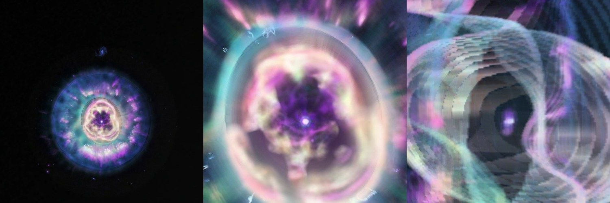

# NGC 2392, mid infrared

ESA/Webb's mid-infrared picture of the planetary nebula NGC 2392, on the walls its spectra give. It is the NGC 2392 page's third dataset, beside [Hubble's photograph](../ngc-2392-layers/README.md) and [Webb's infrared picture](../ngc-2392-webb-layers/README.md), and it was written and baked by `telescope new-object` from one spec entry ([guide](../../../packages/telescope-cli/README.md)). **The walls are the Hubble dataset's: two shells from published expansion speeds, and 536 measured structures that say which side a feature is on. No speed is measured in the dust's light this picture shows, so every color takes the speeds measured in [N II].**

## Sources

| Selected source | Input and meaning |
| --- | --- |
| [ESA/Webb weic2616b](https://esawebb.org/images/weic2616b/) | [Record](../../sources/esawebb-weic2616b.json). Lion Nebula (MIRI image): MIRI at 7.7, 10 and 15 µm; 984 × 717 px over 1.77 × 1.29 arcmin (`source/source.jpg`, the publisher's JPEG, restored from its origin). Credit: NASA, ESA, CSA, STScI. Image Processing: A. Pagan (STScI). A display composite, not calibrated photometry. |
| [García-Díaz et al. (2012)](https://arxiv.org/abs/1211.6717) | [Record](../../sources/publication-garcia-diaz-2012-ngc-2392-model.json). The two shells and their speeds, as in the Hubble dataset: an outer shell close to a sphere of 23″ expanding at 16 km/s, and an inner shell, a prolate spheroid at 120 km/s along its long axis, tilted 9° from the sight line; caps at 55 km/s and cometary knots at rest on an equatorial disc. |
| [García-Díaz et al. (2015)](https://arxiv.org/abs/1411.0042) | [Record](../../sources/publication-garcia-diaz-2015-ngc-2392-proper-motions.json). Table 3 (`source/proper-motions.dat`, the CDS file, a copy of the Hubble bank's): 536 structures with their place from the central star and their radial velocity, from two Hubble pictures 7.7 years apart and high-resolution spectra. |

## The picture

- **Registration:** the file's embedded sky tags give scale and direction, 0.1081″ per pixel and north 167.5° left of vertical. The star gives the place: the largest patch of saturated pixels within 1″ of where the tags put the central star, 3 pixels, is set at the star's place, where the page stands. The tags alone put it 0.24″ away.
- **What the colors show:** by ESA/Webb's release and its table, PAH at 7.7 µm in blue, silicate dust at 10 µm in green and 15 µm in red. The cyan ring is the inside of the shell of dust around the bubble, lit by the star, and the purple clumps toward its edge are dust. No paper on these observations was found on 2026-10-05 (`telescope papers "NGC 2392" --instrument JWST`).
- **The walls:** the Hubble dataset's, unchanged; [its README](../ngc-2392-layers/README.md) has the method. The outer shell is a sphere of 23″ whose law is 16 km/s at 23″. The inner shell is a prolate spheroid tilted 9° from the sight line, its outline 11.0″ by 9.2″. Inside it a structure measured approaching is on the wall in front of the star and one receding on the wall behind. Between the shells the fine detail lies on the equatorial plane where the measured structures are at rest, and toward the outer shell's wall where they move at the caps' speed.
- **Which speed each color takes:** all of them the [N II] speeds, the only ones measured. The clumps of the dust shell are where the model has its cometary knots.
- **The rim, not measured here:** the Hubble bank's script ([inner-shell-rim.mts](../../../packages/bake/authoring/ngc-2392/inner-shell-rim.mts) `ngc-2392-miri-layers`) does not find the bubble's rim in this picture. At 0.108″ a pixel, and with the dust shell brighter than the bubble, it stops on the dust at several position angles and gives 12.02″ by 10.45″. The wall keeps the outline measured on the two sharper pictures.
- **The star:** the star's own light ends 2.1″ from it in this picture: past its saturated middle, the brightest channel's middle value in rings 0.1″ wide stops falling there. All of the light within 1.05″, and less and less of it out to 2.1″, stays at the star.
- **Drawing:** from the front, 56 terraces parallel to the picture; from the side, 56 and 56 curtains through its columns and rows. The face is the picture's own pixels.
- **Size:** 1.77 × 1.29 arcmin, 0.93 pc wide at 1,795 pc; the outer shell is 0.40 pc across.
- **Rim:** the picture fades out between 33.2″ and 36.9″ from the star, the largest circle the frame holds.

## Evidence

The page with this dataset selected, in headless Chromium at 1440 × 900, device pixel ratio 2, on 2026-10-05, with the camera turned: the bubble inside the round shell. No page errors. The label over the middle view is the Crab Nebula's marker, an object in that direction.

The same dataset as the page opens on it, from the nearest the camera comes, and from there turned.

The terraces of this bank, composited along the Sun's sight line, differ from a flat bake of the picture by 0.70 of 255 levels per channel on average. No bake code changes with this dataset.

## Known problems

- No speed is measured in this picture's light, and most of it is dust. The dust is drawn at the depths of the ionised gas where it lies on the sky.
- The picture is 0.11″ a pixel, three and a half times coarser than Webb's infrared picture of the nebula.
- The measured structures' places are from Hubble pictures of 2000 and 2007. Even at the inner shell's 120 km/s, a structure moves under 0.3″ across the sky in the twenty years since, inside the 1″ a measurement reaches.
- The star's diffraction spikes are the telescope's, not the nebula's. Past 2.1″ they lie on the walls they cross.
- Everything the [Hubble dataset's known problems](../ngc-2392-layers/README.md#known-problems) say of the walls holds here: the fur is one surface, the inner shell is a plain spheroid about the star, and the wall a feature is on is known only where it was measured.
- Turned far from the Sun's view, the terraces show as steps.
- Colors are the publisher's display composite, not a measurement.
- The bank is 1.8 MB: 1.0 MB of it the terraces for the view the dataset opens on, 0.4 MB the curtains, 0.3 MB the leaf records and 0.1 MB the dataset's preview picture. Headless Chromium draws it; Safari is not measured yet.
