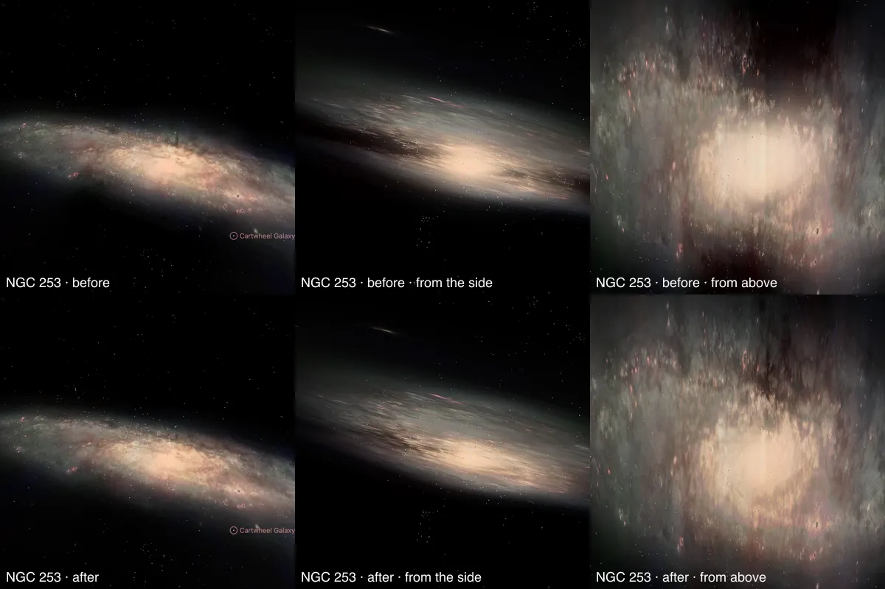

# Sculptor Galaxy (NGC 253)

A ground-based photograph of NGC 253, cleaned of the Milky Way stars in front of it and color-tied to its measured
integrated color, is spread through a modelled disc and a round bulge. Published catalogues of its planetary nebulae,
globular clusters and young star groups are drawn as dots on the same disc. NGC 253 is seen nearly edge-on, so its
face-on views are modelled more than seen; image brightness does not measure per-pixel distance.

## Sources

| Selected source | Input and meaning |
| --- | --- |
| [Spiral galaxy NGC 253](https://www.eso.org/public/images/eso0902c/) | [Record](../../sources/eso-eso0902c.json). The MPG/ESO 2.2-metre WFI view in [O III], V, R and H-alpha, 8285 × 7510 px over 32.87 × 29.79 arcmin (`source/source.jpg`, the Large JPEG, restored from its origin). The same field as eso0902a, which carries an inset drawn over the sky. Found with `telescope explore "ngc 253"`. |
| [Lucero et al. (2015)](https://arxiv.org/abs/1504.04082) | [Record](../../sources/lucero-2015-ngc253-hi.json). Sect. 5: the H I disc at inclination 76° and position angle 235°, the disc the photograph and dots lie on. |
| [Salo et al. (2015)](https://cdsarc.cds.unistra.fr/viz-bin/cat/J/ApJS/219/4) | [Record](../../sources/salo-2015-s4g-decompositions.json). S4G's 3.6 µm bulge-plus-disc fit: a Sérsic bulge (half-light radius 103.93″ = 1.75 kpc, n = 3.872, axis ratio 0.586, PA 66.65°, 28% of the light) and an exponential disc (scale length 185.12″ = 3.11 kpc, axis ratio 0.193, PA 51.29°, central surface brightness 19.835 face-on, 18.049 as projected on the sky). |
| [Kregel et al. (2002)](https://arxiv.org/abs/astro-ph/0204154) | [Record](../../sources/kregel-2002-disc-flattening.json). Sect. 4.3: discs are on average 7.3 ± 2.2 times longer than thick, so the 3.11 kpc scale length gives a 426 pc scale height. |
| [Gaia DR3](https://doi.org/10.1051/0004-6361/202243940) with [Ren et al. (2021)](https://doi.org/10.3847/1538-4357/abcda5) | The 910 Gaia DR3 sources within 0.38° of the photograph's centre that Ren et al.'s criterion marks as Milky Way stars (`source/gaia-dr3-foreground.csv`, restored by the query in the Gaia record). |
| [RC3](../../sources/rc3-1991.json) | NGC 253's total B-V, 0.85 ± 0.05 as observed. |
| [Local Volume Database](../../sources/lvdb-v1-1-1.json) | Centre and distance: distance modulus 27.70 (Radburn-Smith et al. 2011), 3.47 Mpc. |
| [Congiu et al. (2025)](https://cdsarc.cds.unistra.fr/viz-bin/cat/J/A+A/700/A125) | [Planetary nebulae](source/congiu-pne/points.json): 571 from MUSE mosaics of the inner disc. |
| [Cantiello et al. (2018)](https://cdsarc.cds.unistra.fr/viz-bin/cat/J/A+A/611/A21) | [Globular clusters](source/cantiello-gc/points.json): the 82 of 347 candidates the authors class as bona fide. |
| [Rodríguez et al. (2018)](https://cdsarc.cds.unistra.fr/viz-bin/cat/J/MNRAS/479/961) | [Young star groups](source/rodriguez-groups/points.json): 875 from HST imaging of parts of the disc. |
| [Bailin et al. (2011)](https://arxiv.org/abs/1105.0005) | [Stellar extent](source/stellar-extent.json): the resolved stellar halo mapped out to 30 kpc; inside it NGC 253's caption hides. |

The catalogue tables are TAP queries of CDS (the query is each descriptor's `table.origin`); they are not tracked.

## The photograph

- **Registration:** the publisher's orientation (1.6° right of vertical) is off by 1.5°: two bright Gaia stars on
  opposite sides of the galaxy fit at 0.09°, with the centre moved 5 px. Their images then fall within a pixel.
- **Foreground stars:** 501 of the 574 Gaia foreground stars in the image are removed where they show; 5 on extended
  light are left.
- **Color:** tied to RC3's B-V of 0.85: red/green 1.203 and blue/green 0.952 against 1.251 and 0.815, so red × 1.040 and
  blue × 0.857 in linear light.
- **Bulge:** at 76° the photograph's centre is thicker on the sky than S4G's bulge, and a share of it spread through the
  bulge made a box and a band seen from above. So the bulge takes the fit's own light, scaled to the photograph
  (`lightFrom: fit`), in an oblate spheroid with intrinsic axis ratio 0.55, fading out between 3 and 6 kpc on the spheroid's own outline; the disc
  keeps the rest. Where the photograph is saturated (11,380 pixels) the fit's light stands in.
- **Disc:** inclination 76°, line of nodes 55°, support 19.9 kpc (where the frame stops on its tightest side), 32 slabs
  with an exponential of 426 pc over ±3 scale heights.

## Dots

| Catalogue | Drawn | Left out |
| --- | --- | --- |
| Planetary nebulae (Congiu et al. 2025) | 571, 84 of them in the bulge | none |
| Globular clusters (Cantiello et al. 2018) | 21, 1 of them in the bulge | 61 beyond the photograph |
| Young star groups (Rodríguez et al. 2018) | 875 | none |

Dots keep their place in the disc and rise along its axis to heights drawn from the 426 pc layer; old objects near the
centre are bulge members. Colors are the Milky Way's and M31's for each kind; each dot takes its tone from the photograph's brightness under it (never below 15%) and moves halfway from its kind's color to the photograph's color there, so dots sit in the galaxy's light instead of on it; flat tints read as dark specks on the bright bulge. Most globular clusters lie in the halo, far off the disc: placed on it they land beyond the photograph.

## Evidence

The NGC 253 page in headless Chromium at 1440 × 900, device pixel ratio 2, zoomed in, on 2026-10-03: before (top) and after (bottom) the disc's central brightness was taken as projected on the sky and the bulge was ended on its own spheroid; as the page opens, from the side and from above. An unchanged rebake reproduced the published bytes first, so the difference is the correction alone.

- Dots from the photograph: the default view (left) and tilted (right), in the app with each dot's tone and color taken from the photograph. Captured on 2026-09-29, before the correction above; the dots' tones and colors are made the same way since.
- The prepared bank's `approximation.limitations` records the foreground, color-tie and saturation counts quoted above.
- Bytes: 166 layer images, 1.67 MB.
- Tests: `packages/bake/src/image-layers/bulge.test.mts` pins the bulge model and its fade (`extentKpc.fadeFrom`), on M81's fit.

## Known problems

- Until 2026-10-03 the disc's central brightness was taken face-on, as S4G tabulates it, where the bulge model needs it as projected on the sky (1.79 mag brighter for a disc this steep). The bulge's share was too large: 74% of the light at 1 kpc where the fit gives 35%. Corrected, and the dots replaced. The bulge also ended on the box of its slices and on a circle on the sky; it now ends on its own spheroid.
- Nearly edge-on: seen from above, the disc's light near the minor axis is thin and its outer edge smears; the bar and
  the starburst wind are not modelled.
- The planetary nebulae cover the MUSE mosaic and the young groups the HST fields only.
- Depth is modelled: slabs and bulge are the photograph along our sight lines, so side views are approximate.
