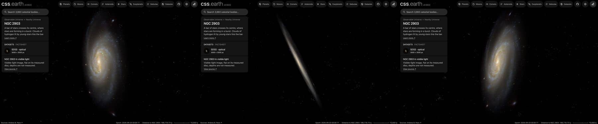

# NGC 2903

A survey image of NGC 2903, cleaned of the Milky Way stars in front of it and color-tied to its measured integrated
color, lies flat on its measured disc. Published catalogues of the HII regions of its bar and of its supernova
remnants are drawn as dots on the same disc. Image brightness does not measure per-pixel distance.

## Sources

| Selected source | Input and meaning |
| --- | --- |
| [Sloan Digital Sky Survey](https://www.sdss.org/) | [Record](../../sources/sdss-dr9-color-hips.json). The survey's g, r, i color composite as the CDS HiPS `CDS/P/SDSS9/color`, cut out by the CDS hips2fits service: 3000 × 3000 px over 20 × 20 arcmin, tangent projection, north up (`source/source.jpg`, restored from its origin). A display composite, not calibrated photometry. No observatory publishes a photograph of the whole disc under an attribution licence; the DESI Legacy Surveys image is deeper but its display stretch saturates the bar, and its DR10 color HiPS has a corrupt band across the disc. |
| [Walter et al. (2008)](https://cdsarc.cds.unistra.fr/viz-bin/cat/J/AJ/136/2563) | [Record](../../sources/walter-2008-things.json). THINGS Table 1, row NGC 2903: centre 143.04208°, +21.50111°, inclination 65°, position angle 204° (from de Blok et al. 2008): the disc the image and dots lie on. |
| [Salo et al. (2015)](https://cdsarc.cds.unistra.fr/viz-bin/cat/J/ApJS/219/4) | [Record](../../sources/salo-2015-s4g-decompositions.json). S4G's 3.6 µm fit: an exponential disc with scale length 54.89″ (2.44 kpc), 90% of the light; a bar with 3%; and a central Sérsic component with 7% (half-light radius 7.29″ = 0.32 kpc, n = 0.50). |
| [Kregel et al. (2002)](https://arxiv.org/abs/astro-ph/0204154) | [Record](../../sources/kregel-2002-disc-flattening.json). Sect. 4.3: discs are on average 7.3 ± 2.2 times longer than thick, so the 2.44 kpc scale length gives a 334 pc scale height. |
| [Gaia DR3](https://doi.org/10.1051/0004-6361/202243940) with [Ren et al. (2021)](https://doi.org/10.3847/1538-4357/abcda5) | The 477 Gaia DR3 sources within 0.24° of NGC 2903's centre that Ren et al.'s criterion marks as Milky Way stars (`source/gaia-dr3-foreground.csv`, restored by the query in the Gaia record). |
| [RC3](../../sources/rc3-1991.json) | NGC 2903's total B-V, 0.67 ± 0.01 as observed. |
| [Local Volume Database](../../sources/lvdb-v1-1-1.json) | Distance: modulus 29.81 ([Tully et al. 2009](https://ui.adsabs.harvard.edu/abs/2009AJ....138..323T), tip of the red giant branch), 9.16 Mpc; the catalogue gives no error. |
| [Popping et al. (2010)](https://cdsarc.cds.unistra.fr/viz-bin/cat/J/A+A/521/A8) | [HII regions](source/popping-hii/points.json): 67, in the bar zone. |
| [Vučetić et al. (2015)](https://cdsarc.cds.unistra.fr/viz-bin/cat/J/MNRAS/446/943) | [Supernova remnants](source/vucetic-snr/points.json): 5 optically identified remnants, from Sonbaş et al. (2009). |

The catalogue tables are TAP queries of CDS (the query is each descriptor's `table.origin`); they are not tracked.

## The image

- **Registration:** the cutout's registration is its request. 108 of the 121 Gaia stars brighter than G = 18.5 in it fall
  within 2.5 px of their requested places (median 0.5 px).
- **Foreground stars:** 97 of the 294 Gaia foreground stars in the image are removed where they show; 190 on
  extended light are left, most of them the galaxy's own knots that the criterion takes for stars.
- **Color:** tied to RC3's B-V of 0.67: red/green 1.18 and blue/green 0.615 against 1.137 and 0.882, so red × 0.963
  and blue × 1.434. in linear light. The survey's composite ran yellow.
- **Disc:** inclination 65°, line of nodes 204°, drawn as one flat image on the midplane. The support
  radius, 20 kpc, is where the image's ring median reaches its sky level, 7.3′ from the centre; the frame reaches 28.5 kpc.
  No bulge: S4G's central component is the 0.32 kpc star-forming centre (n = 0.50), not a spheroid, and holds 7% of the
  light.
- **Near side:** the catalogue gives the tilt, not which edge is nearer. The arms open counter-clockwise on the sky, so if they trail, as
  spiral arms do, the disc turns clockwise; with the receding side at position angle 204° that puts the near side at 294° (west-north-west).
  This is an inference from the photograph and the velocity field, not a published statement.
- **Sky:** the image's sky, (8, 7, 5) of 255, is subtracted as the background floor (8 of 255).
- **Bytes:** one image, 418 × 693 px, 137 KB (WebP quality 70, alpha quality 80), the scale of the Milky Way's own
  backing image. It is one flat plane, as the Milky Way's is: no slabs through the disc's thickness.

## Dots

| Catalogue | Drawn | Left out |
| --- | --- | --- |
| HII regions (Popping et al. 2010) | 67 | none |
| Supernova remnants (Vučetić et al. 2015) | 5 | none |

Dots keep their place in the disc and rise along its axis to heights drawn from the 334 pc layer. Colors are the Milky
Way's and M31's for each kind; each dot takes its tone from the image's brightness under it (never below 15%) and moves
halfway from its kind's color to the image's color there.

## Evidence

The NGC 2903 page in headless Chromium at 1440 × 900, device pixel ratio 2, on this branch on 2026-10-01: the default
arrival, then the camera turned to the side and to above the disc.

- The prepared bank's `approximation.limitations` records the foreground and color-tie counts quoted above.

## Measured, chosen and inferred

| Value | Kind |
| --- | --- |
| Centre, inclination 65°, position angle 204° | Measured: THINGS Table 1 |
| Distance 9.16 Mpc | Measured: Tully et al. (2009), through the Local Volume Database |
| Scale length 54.89″ | Measured: S4G (Salo et al. 2015) |
| Scale height 334 pc | Inferred: the scale length over 7.3, the mean of other galaxies (Kregel et al. 2002); not measured in NGC 2903 |
| Near side at 294° | Inferred: trailing arms and the receding side |
| B-V 0.67 | Measured: RC3 |
| Support 20 kpc, fade from 15.0 kpc | Presentation: where the image's light reaches its sky level |
| One flat image, 1,024 px on its face, background floor, dot colors and tones | Presentation |

## Known problems

- The survey image is shallow: the outer arms are faint and grainy, and the survey's sky subtraction removes some of the
  galaxy's faint outer light.
- The dot catalogues are small: the HII regions cover the bar zone only, and five supernova remnants are known.
- A few foreground stars remain, with the survey's colored rings around the brightest.
- The image is flat: seen edge-on it is a line. Only the dots have height, and that height is drawn from the modelled
  thickness, not measured.
