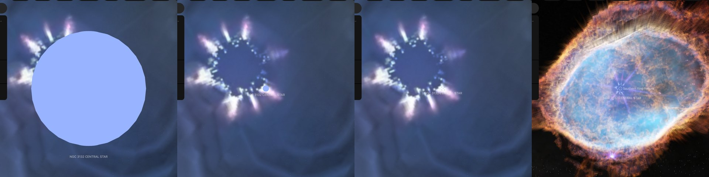

# NGC 3132 central star

## Sources

The central star of the [Southern Ring Nebula](../ngc-3132/README.md), 754 parsecs away, is the faint hot star whose light makes the nebula glow. It stands 1.7 arcsec from the bright A2 V star in the middle of every picture of the nebula, its companion (De Marco et al. 2022). It is an object of its own, inside the nebula: a zoom in on the nebula goes on into the star, and the star's page keeps the nebula's walls drawn around it. **What is drawn is a sphere of the size that radiates the luminosity, at the temperature, that a model of the nebula's light needs of its star (De Marco et al. 2022), in the color of a black body at that temperature. No paper prints its radius.**

**Star.** Placement: Gaia DR3 source 5420219732233481472, distance 754 pc from Monteiro et al. (2025), MNRAS 539, 1756: 754 pc (+18, -15), the Gaia DR3 geometric distance of the bright star beside it, the distance its nebula's page stands at; this star's own Gaia DR3 parallax, 0.51 +/- 0.19 mas, is too weak to place it; Gaia DR3's parallax, 0.512 ± 0.194 mas (2.6 standard errors), is not used. Radius 0.0389 solar radii from De Marco et al. (2022), arXiv:2301.02775, Results: the star their model of the nebula needs has 110 kK and 200 Lsun; the paper prints no radius, and 0.0389 solar radii is the sphere that radiates that luminosity at that temperature (Stefan-Boltzmann law) (https://arxiv.org/abs/2301.02775). No mass is measured, so GM is 0, the records' unpublished value. Temperature 110,000 K from De Marco et al. (2022), arXiv:2301.02775, Results: a model of the nebula's light with a central star of effective temperature 110 kK and luminosity 200 Lsun matches the observations. No surface gravity of this star is published.

**Color.** A Planck spectrum at 110,000 K, because no archive holds a spectrum of this star (stis-ngsl: no HD number in SIMBAD; gaia-xp: Gaia DR3 published no sampled BP/RP spectrum of it; pulkovo: no HR number; kiehling: no HR number; kharitonov: no HR number; burnashev: no HR (BS) number), through the CIE 1931 2° observer: #98b3ff. Routes tried in order: stis-ngsl: no HD number in SIMBAD; gaia-xp: Gaia DR3 published no sampled BP/RP spectrum of it; pulkovo: no HR number; kiehling: no HR number; kharitonov: no HR number; burnashev: no HR (BS) number; planck: used.

**Limb.** No limb darkening is drawn: no surface gravity is known: the mass is unmeasured, no spectroscopic log g is published and the spec gives no range for its class.

## Evidence

Generated 2026-10-05 by [new-object-cli.mts](../../../packages/telescope-cli/src/new-object/new-object-cli.mts) from Gaia DR3, SIMBAD and the archives named above; each choice was read with the dataset's own reader.

Headless Chromium at 1440 × 900, device pixel ratio 2, on 2026-10-05, no page errors. The star's own page as it opens, 105,926 km from the star; 6 and 12 wheel steps out, at 2,456,028 km and 46,557,000 km, with the walls of the nebula's picture ([its image layers](../ngc-3132-layers/README.md)) drawn around it; and the Southern Ring Nebula's page after 4 wheel steps in, no click, where the view has handed over to the star, 1.21 ly from it.

## Known problems

- **Assumptions of the frame.** The axis's position angle and the rotation phase are conventions.
- **A derived radius.** No paper prints this star's radius. It is the sphere that radiates the published luminosity at the published temperature (Stefan-Boltzmann law), so it carries the errors of both.
- **A flat disc.** No limb darkening is drawn: neither the star's gravity nor the kind of its atmosphere is published, so no model can be chosen for it (see Limb above).
- **Not shown.** The temperature and luminosity are those of the star a model of the nebula's light needs, not a measurement of the star itself (De Marco et al. 2022, https://arxiv.org/abs/2301.02775).
- **Not shown.** The star's mass is not measured. Evolutionary tracks give 0.58 solar masses for its temperature and luminosity, and its companion's mass implies a star that began with 2.86 solar masses and should have ended nearer 0.66 (De Marco et al. 2022, https://arxiv.org/abs/2301.02775).
- **Not shown.** The bright star in the middle of every picture of the nebula is not this one: it is its companion HD 87892, an A2 V star 1.7 arcsec away, about 1,300 au on the sky (De Marco et al. 2022, https://arxiv.org/abs/2301.02775). The companion is not drawn as a body.
- **Not shown.** Webb found warm dust around the star, read as a disc (De Marco et al. 2022, https://arxiv.org/abs/2301.02775). It is not drawn.

[Investigation ledger](investigations.json) · [Inputs](source/manifest.json) · [Preparation](source/preparation) · [Delivered files](inventory.json) · [Credits](NOTICE.md)
