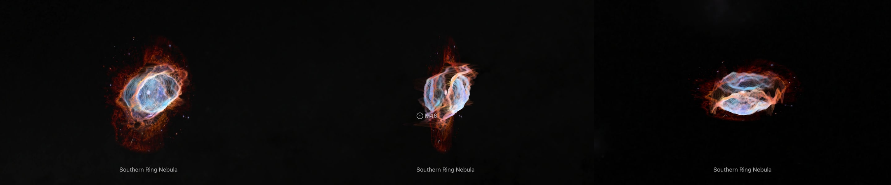
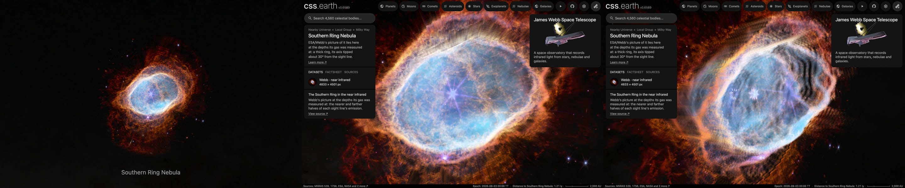

# Southern Ring Nebula

ESA/Webb's picture of the Southern Ring Nebula (NGC 3132), laid at the depths its gas was measured at. **Where the gas is along each sight line comes from the density grid Monteiro et al. (2025) published. How that grid lies on the picture is not published: it is measured here.**

## Sources

| Selected source | Input and meaning |
| --- | --- |
| [ESA/Webb weic2207b](https://esawebb.org/images/weic2207b/) | [Record](../../sources/esawebb-weic2207b.json). Southern Ring Nebula (NIRCam Image): 0.90, 1.87, 2.12, 3.56, 4.05 and 4.70 µm; 4833 × 4501 px over 2.42 × 2.25 arcmin (`source/source.jpg`, the publisher's JPEG, restored from its origin). Credit: NASA, ESA, CSA, STScI, and the Webb ERO Production Team. A display composite, not calibrated photometry. |
| [Monteiro et al. (2025)](https://arxiv.org/abs/2503.20640) | [Record](../../sources/publication-monteiro-2025-ngc-3132-model.json). Sect. 3.1: velocity cubes of H-alpha and [N II] 6584 from the SAM-FP Fabry-Perot on SOAR, turned into gas density. The gas is taken to move at a speed in proportion to its distance from the star, so a speed along the sight line is a depth; a line's intensity goes as the density squared. Sect. 1: the distance, 754 pc (+18, −15), is the Gaia DR3 distance of the bright central star. |
| [NGC3132_model](https://github.com/hektor-monteiro/NGC3132_model) | [Record](../../sources/github-ngc3132-model.json). The paper's files. `structure_visualization/ngc3132_density_structure_101.dat` is the density on a grid of 101 cells a side, 1.015 × 10¹⁶ cm a cell (`source/ngc3132_density_structure_101.dat`, restored from its origin, not republished). The repository states no licence. |
| [Kastner et al. (2024)](https://arxiv.org/abs/2402.11850) | [Record](../../sources/publication-kastner-2024-ngc-3132-exoskeleton.json). SMA CO maps of the molecular gas. Sect. 3: the main ring's major axis lies at position angle about 330°; its eastern edge approaches and its western edge recedes. Used here as two checks of the grid's placement. |
| [SIMBAD, NGC 3132](https://simbad.cds.unistra.fr/simbad/sim-id?Ident=NGC+3132) | [Record](../../sources/simbad-ngc-3132.json). The place of the bright central star, from Gaia EDR3. |

## The picture

- **Registration:** the file's embedded sky tags give scale and direction, 0.0300″ per pixel and north 111.99° right of vertical. The star gives the place: the middle of the bright central star's saturated pixels is set at SIMBAD's place for NGC 3132. The tags alone put it 0.3″ away.
- **The grid:** a cell is 0.8998″ on the sky at 754 pc, thirty times a pixel of the picture. The gas spans 78″ by 64″.
- **The grid on the sky:** the file gives its cells' places in centimetres and nothing of their directions. [grid-fit.mts](../../../packages/bake/authoring/ngc-3132/grid-fit.mts) measures them:
  - *The sight line* is the file's first axis: detail a cell wide is 0.55% of the density along it, against 2.5% and 3.1% along the other two. An emission line is 26.8 km/s wide in the instrument, many cells of depth, so no such detail survives along the sight line.
  - *The turn:* the grid's emission, summed along the sight line, is laid on the picture for both handednesses and every turn about the star, after the mean in rings about the star is taken off both. The best has the second axis at position angle 325.5° and the third at 55.5°, the grid's middle 1″ west and 0.5″ south of the star. It correlates 0.673 with the picture; half a turn on gives 0.094 and the other handedness 0.328 at best.
  - *Which end is near:* along position angle 60° the gas east of the star stands toward the high end of the first axis and the gas west of it toward the low end. Kastner et al. find the ring's eastern edge approaching, so the high end is toward the Sun.
  - *A printed check:* Kastner et al. measure the main ring's major axis at about 330°, beside the 325.5° found here for the grid's long axis.
  - *A second picture:* run on the [mid-infrared picture](../ngc-3132-miri-layers/README.md), the same fit gives 324.5° and 54.5°, with the grid's middle 0.5″ west and 1″ south of the star.
- **The walls:** on each sight line the nearer half of the gas's emission and the farther half each stand at their own middle ([density-grid.ts](../../../packages/bake/src/image-layers/density-grid.ts)). Those two depths are the sight line's walls. Each holds half of the picture's smooth light, and the fine detail is on the nearer one, as in the [Ring Nebula](../m57-layers/README.md) ([shape-walls.ts](../../../packages/bake/src/image-layers/shape-walls.ts)). The walls reach 41″ along the sight line: the nebula is about as deep as it is wide, as the paper's two-lobed shape seen nearly along its axis is.
- **The star:** the same script measures where the bright star's own light ends in the picture: past its saturated middle, the brightness in rings about the star falls until, 3.2″ out, a ring is no brighter than the arcsecond past it. All of the light within half of that, and less and less of it out to 3.2″, stays at the star.
- **Joins:** over the outer tenth of the way from the star to the gas's outline the walls are led onto the picture's plane, where the picture outside the outline lies. A presentation choice.
- **Outside the grid:** the faint molecular hydrogen around the ionised gas, out to the frame's edge, has no published depth here. It lies on one plane through the star, facing the Sun.
- **Drawing:** from the front, 56 terraces parallel to the picture; from the side, 56 and 56 curtains through its columns and rows, as the Ring Nebula's bank is drawn. The face is 1,500 px across the picture.
- **Size:** 2.42 × 2.25 arcmin, 0.53 pc wide at 754 pc.
- **Rim:** the picture fades out between 57.0″ and 63.3″ from the star, the largest circle the frame holds.
- **Far view:** from afar, while another body is selected, the bank is one image on a plane fixed in its frame, drawn as the Milky Way's backing is. [`prepare-galaxy-backing.mts`](../../../packages/bake/cli/prepare-galaxy-backing.mts) reads the [backing recipe](source/backing/recipe.json) and composites the bank's flat source-facing slices as seen from the Sun, the picture its camera-facing billboard drew, onto the slices' own plane through the frame's centre. The plane therefore lies where the layered model's picture plane does, and turns and foreshortens as the model does. After a rebake of the bank, run `node packages/bake/cli/prepare-galaxy-backing.mts src/objects/ngc-3132-layers backing` again. From afar NGC 3132 is drawn by one of its banks at a time: the bank of its selected dataset, or this bank while none is selected. The others draw nothing there, so two far images of the same nebula never overlap.

## Evidence

The page in headless Chromium at 1440 × 900, device pixel ratio 2, on 2026-10-04, with the camera turned. No page errors.

The same page as it opens, from the nearest the camera comes, and from there turned.

The bake's tests ([density-grid.test.ts](../../../packages/bake/src/image-layers/density-grid.test.ts)) read a grid file and refuse a miscounted or misordered one by name; find the two halves' middles on a ball of even gas and on two sheets of unequal gas; place a lump of gas by the grid's position angles, its near end and its middle; and check that the walls are led onto the plane at the gas's outline and that a star's own light stays at the star. The terraces of this bank, composited along the Sun's sight line, differ from the flat bake of the picture by 0.72 of 255 on average. The Ring Nebula's, NGC 2392's, Cassiopeia A's and the Homunculus's banks, baked again with this code, are the same as published, file for file.

## Known problems

- The far picture holds only the flat slices' light: the walls' patches are left out, as they were from the billboard it replaced, so from afar the bank looks fainter than its layers do once selected. Edge-on the plane vanishes.
- The depths are far coarser than the picture. A grid cell is thirty picture pixels, and the instrument's 26.8 km/s line width is some 15″ of depth at the age the paper fits (2,061 years), before its deconvolution. The walls are smooth surfaces; a filament's own depth is not known.
- The gas is drawn as two surfaces, not as a volume: a thick ring shows as two sheets with nothing between them.
- The grid rests on the paper's assumption that speed grows in proportion to distance from the star. The paper notes it fits less well in the faint outer parts.
- How the grid lies on the picture is measured here, not published. The search steps are half a degree of turn and half an arcsecond of place.
- The fine detail is all on the nearer wall. Knots and filaments of molecular hydrogen are not placed by any measurement.
- The molecular halo outside the grid is flat.
- Stars and galaxies inside the gas's outline lie on the nearer wall with the rest of the detail, as do the bright star's diffraction spikes beyond 3.2″.
- The bright central star is a companion. The faint star that made the nebula is beside it and is not treated apart.
- Turned far from the Sun's view, the terraces show as steps.
- Colors are the publisher's display composite, not a measurement.
- The bank is 2.8 MB: 2.2 MB of it the terraces for the view the page opens on, 0.25 MB the curtains and 0.3 MB the leaf records. Headless Chromium draws it; Safari is not measured yet.
