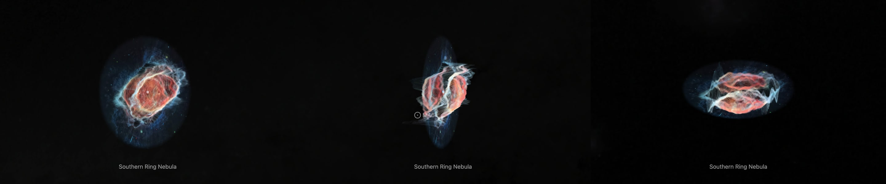
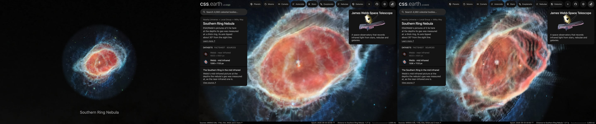

# Southern Ring Nebula, mid infrared

ESA/Webb's mid-infrared picture of the Southern Ring Nebula (NGC 3132), at the depths its gas was measured at. It is the page's second dataset, on the same walls as the [near-infrared picture](../ngc-3132-layers/README.md). **The walls are that dataset's: the density grid Monteiro et al. (2025) published, placed on the sky as measured there. This picture checks that placement a second time.**

## Sources

| Selected source | Input and meaning |
| --- | --- |
| [ESA/Webb weic2207c](https://esawebb.org/images/weic2207c/) | [Record](../../sources/esawebb-weic2207c.json). Southern Ring Nebula (MIRI Image): 7.7, 11.3, 12 and 18 µm (the page prints the second as 1.13 µm); 1306 × 1133 px over 2.39 × 2.07 arcmin (`source/source.jpg`, the publisher's JPEG, restored from its origin). Credit: NASA, ESA, CSA, STScI, and the Webb ERO Production Team. A display composite, not calibrated photometry. |
| [Monteiro et al. (2025)](https://arxiv.org/abs/2503.20640) and [NGC3132_model](https://github.com/hektor-monteiro/NGC3132_model) | Records: [paper](../../sources/publication-monteiro-2025-ngc-3132-model.json), [files](../../sources/github-ngc3132-model.json). The gas density on a grid of 101 cells a side, made from velocity cubes (`source/ngc3132_density_structure_101.dat`, restored from its origin, not republished). The [near-infrared bank's README](../ngc-3132-layers/README.md) has the method and the grid's placement. |
| [SIMBAD, NGC 3132](https://simbad.cds.unistra.fr/simbad/sim-id?Ident=NGC+3132) | [Record](../../sources/simbad-ngc-3132.json). The place of the bright central star, from Gaia EDR3. |

## The picture

- **Registration:** the file's embedded sky tags give scale and direction, 0.1099″ per pixel and north 124.65° right of vertical. The star gives the place: the largest patch of saturated pixels within 1″ of where the tags put SIMBAD's place, 29 pixels, is set at that place. The tags alone put it 0.26″ away.
- **The walls:** the near-infrared dataset's, unchanged: the grid's first axis the sight line with its high end toward the Sun, its second axis at position angle 325.5°, its third at 55.5°, its middle 1″ west and 0.5″ south of the star. On each sight line the nearer half of the gas's emission and the farther half each stand at their own middle, and share the picture's smooth light.
- **A second check of the placement:** [grid-fit.mts](../../../packages/bake/authoring/ngc-3132/grid-fit.mts), run on this picture, finds the grid's second axis at 324.5° and its third at 54.5°, its middle 0.5″ west and 1″ south of the star. The grid's emission correlates 0.580 with this picture; half a turn on gives 0.136 and the other handedness 0.316 at best. Another instrument, other wavelengths, the same turn within a degree.
- **The gas and this light:** the grid is the ionised gas, from H-alpha and [N II]. Whatever makes this picture's light, dust and molecules included, takes the same depths here.
- **The star:** the bright star's own light ends 2.1″ from it in this picture, by the same script. All of the light within half of that, and less and less of it out to 2.1″, stays at the star. A second star, 1.8″ away in this picture, lies in that light.
- **Joins and the halo:** as in the near-infrared dataset: the walls are led onto the picture's plane over the outer tenth of the way to the gas's outline, and the light outside the grid lies on that plane.
- **Drawing:** from the front, 56 terraces parallel to the picture; from the side, 56 and 56 curtains through its columns and rows. The face is the picture's own 1,306 px.
- **Size:** 2.39 × 2.07 arcmin, 0.52 pc wide at 754 pc.
- **Rim:** the picture fades out between 54.7″ and 60.8″ from the star, the largest circle the frame holds.

## Evidence

The page with this dataset selected, in headless Chromium at 1440 × 900, device pixel ratio 2, on 2026-10-04, with the camera turned. No page errors.

The same dataset as the page opens on it, from the nearest the camera comes, and from there turned.

The terraces of this bank, composited along the Sun's sight line, differ from the flat bake of the picture by 0.69 of 255 on average.

## Known problems

- Everything the [near-infrared dataset](../ngc-3132-layers/README.md#known-problems) lists about the walls holds here: they are far coarser than the picture, two surfaces and not a volume, and rest on the paper's expansion law.
- The grid is the ionised gas. Dust and molecular light in this picture are drawn at the ionised gas's depths.
- The picture is nearly four times coarser than the near-infrared one, 0.11″ a pixel.
- The second star is not treated apart: it lies in the bright star's light, at the star.
- Stars and galaxies inside the gas's outline lie on the nearer wall.
- Turned far from the Sun's view, the terraces show as steps.
- Colors are the publisher's display composite, not a measurement.
- The bank is 2.1 MB: 1.55 MB of it the terraces for the view the dataset opens on, 0.2 MB the curtains and 0.3 MB the leaf records. Headless Chromium draws it; Safari is not measured yet.
