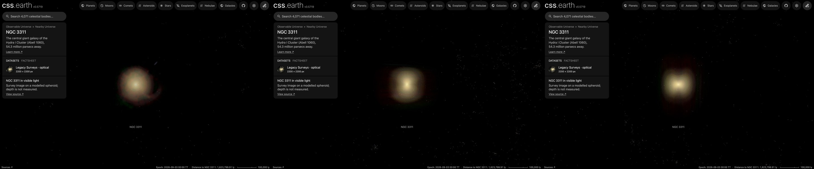

# NGC 3311

The giant galaxy NGC 3311 at the centre of the Hydra I Cluster, drawn as a volume of starlight on its own page,
[NGC 3311](../ngc-3311/README.md). A survey image, cleaned of the Milky Way stars and neighbouring galaxies, supplies
the light along every sight line; the depth of that light follows a published fit to NGC 3311's light. Its globular
clusters and ultra-compact dwarfs are drawn as dots through the same volume.
**Depth is modelled, not measured. Its close neighbour NGC 3309 is masked out and not drawn.**

## Sources

| Selected source | Input and meaning |
| --- | --- |
| [DESI Legacy Imaging Surveys DR10](https://www.legacysurvey.org/dr10/) | [Record](../../sources/desi-legacy-surveys-dr10-color-hips.json). The surveys' g, r, i, z color composite as the CDS HiPS `CDS/P/DESI-Legacy-Surveys/DR10/color`, cut out by the CDS hips2fits service: 2200 × 2200 px over 9.3 × 9.3 arcmin (0.255″ per pixel), tangent projection, north up. A display composite, not calibrated photometry. |
| [Arnaboldi et al. (2012)](https://arxiv.org/abs/1205.5289) | [Record](../../sources/arnaboldi-2012-hydra-core.json). Table 2, column "allmask": the two-dimensional Sérsic fit to NGC 3311 in a VLT/FORS1 V-band image with the north-east excess masked, n = 4.8 ± 0.02, effective radius 198.8 ± 2.2″, axis ratio 0.93, major axis at position angle 32°. Fitted with NGC 3309's own Sérsic model (Table 1) over a 6.8 × 6.4′ field. |
| [HyperLEDA PGC](https://cdsarc.cds.unistra.fr/viz-bin/cat/VII/237) (Paturel et al. 2003) | [Record](../../sources/paturel-2003-hyperleda-pgc.json). Positions and D25 sizes of the 16 neighbouring galaxies masked in the image. |
| [Cosmicflows-4](https://cdsarc.cds.unistra.fr/viz-bin/cat/J/ApJ/944/94) (Tully et al. 2023) | Table 3, group 1PGC 31478: 54.3 Mpc. Position from the 2MASS Extended Source Catalog. See the [host](../ngc-3311/README.md). |
| [Misgeld et al. (2011)](https://cdsarc.cds.unistra.fr/viz-bin/cat/J/A+A/531/A4) | [Record](../../sources/misgeld-2011-hydra-compact-objects.json). [Globular clusters and ultra-compact dwarfs](source/misgeld-gc/points.json) that their VIMOS spectra place in the Hydra I Cluster by velocity: 118 in Table A1, of which the 85 inside the volume are drawn. |
| [Mirabile et al. (2026)](https://cdsarc.cds.unistra.fr/viz-bin/cat/J/A+A/705/A117) | [Record](../../sources/mirabile-2026-hydra-globular-clusters.json). [Globular cluster candidates](source/mirabile-gc/points.json): the 423 sources of their NGC 3311 master catalogue (Table B1), compact sources in three MUSE fields on the galaxy whose brightness and size match its spectroscopically confirmed clusters (their Sect. 4.1.2). Their photometry includes VISTA H-band imaging. |

## Method

The Nebula Lab recipe is [src/objects/ngc-3311-volume/source/experiment.json](../../../src/objects/ngc-3311-volume/source/experiment.json);
`node labs/nebula/run.mts prepare-emission` runs it, and [delivery.json](source/delivery.json) places the result. It is
[M49's route](../m49-volume/README.md#method) with NGC 3311's measurements.

1. **Stars:** NOX removes the Milky Way stars from the cutout.
2. **Neighbours:** the 16 HyperLEDA galaxies whose masks reach the cutout are masked out to three times their D25
   radius, never more than half their distance from the centre: at M49's rule alone the mask of the spiral NGC 3312
   covered NGC 3311's eastern halo and cut it along a straight edge. A masked pixel takes the median of the unmasked
   light on its isophote and never gains light.
3. **NGC 3309:** the elliptical 103″ west-north-west of the centre lies inside NGC 3311's light and is as large
   (HyperLEDA D25 radius 125″). It is masked to 95″ with the same isophote fill: as far as a mask reaches without
   covering NGC 3311's innermost isophotes whole. At half its distance its own outer light stayed as a bright ring
   around a dark disc; at its D25 radius the fill failed and left a hole over the core.
4. **Compact leftovers:** each pixel takes the median of the 37 px around it (9.4″, 2.5 kpc, about two and a half of
   the grid's cells), raised as well as lowered (`compactClamp.fillDark`, see [NGC 4696](../ngc-4696-volume/README.md#method)),
   so the survey's saturation trails are not drawn.
5. **Depth:** the light along each sight line is spread in depth by the deprojected density (Prugniel & Simien 1997) of
   Arnaboldi et al.'s fit: n = 4.8, half-light radius 198.8″ (52.3 kpc at 54.3 Mpc), axis ratio 0.93. The spheroid's
   axis is the minor axis (position angle 122°), placed in the plane of the sky; no intrinsic axis is measured. It ends
   at 1.409 half-light radii, 280.2″ (73.8 kpc).
6. **Dots:** each object sits along its sight line at a depth drawn from the same density
   (`frame.placement: spheroid` in [prepare-catalogue-points](../../../packages/bake/cli/prepare-catalogue-points.mts)).
   No object is in both catalogues: the nearest pair is 1.7″ apart.

Values chosen here, not measured:

- The end of the spheroid: the half-diagonal of the field the fit was made on. The fit is not extended beyond it.
- The two mask limits (half the distance from the centre; 95″ for NGC 3309).
- The black level, 25 of 255: the median of the cutout's bottom-right corner and bottom edge. The other corners hold
  NGC 3312, the galaxies around NGC 3308 and a bright star's ghost.
- The display exposure 1.5 and the 150-cell grid are M87's; the median window is M87's rule.
- The dots' color is the Milky Way globular clusters'.

## Evidence

The NGC 3311 page in headless Chromium at 1440 × 900, device pixel ratio 2, on this branch on 2026-10-02: the default
arrival, then the camera turned to the side and to above the galaxy.

- The volume reproduces the cleaned image along every sight line it covers (the method conditions on it); 0.7 to 3.8%
  of the image's light, by color channel, lies outside the spheroid and is not drawn (the red is a star's ghost in
  the north-east corner).
- The cutout's registration is its request: the centroid of the bright core falls within 1 px (0.2″) of the image
  centre, the 2MASS position.

## Known problems

- The candidates fill only three MUSE fields on the centre, within 139″ of it, so the dots are far denser there than
  the velocity members around them. A candidate is not a confirmed cluster.
- NGC 3309 is not drawn, and an arc of its outer light remains west of its mask, plain to see at arrival. Inside the mask NGC 3311 is the
  median of its other sides, which is fainter than the light there: the galaxy is brighter to the north-east
  (Arnaboldi et al.'s off-centred envelope) than to the south-west.
- The spheroid is symmetric and the galaxy is not. The north-east envelope and the tidal tails around HCC 026 and
  HCC 007 keep their place on the sky and are spread in depth like the rest.
- The spheroid ends at 1.4 half-light radii, where the fit's field ends; the survey's sky subtraction ends the light
  at about the same radius, 200″ to 250″.
- Arnaboldi et al. give three fits. The one used masks the north-east excess. Their "maximal symmetric" model
  (n = 10.5, effective radius 850″) is fitted along one side only and reaches far beyond the image.
- Seen from the side or from above, the volume looks boxy and its core shows a cross, more than M49's does. The
  image is a compressed display stretch: its outer sight lines carry more light, relative to the centre, than the
  fitted profile gives them, so the depth they are spread over shows as a block.
- The image is a stretched display composite, so the volume's brightness is not proportional to the starlight.
- No globular clusters are drawn; see the [ledger](investigations.json).
