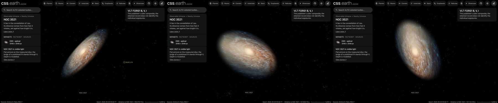

# NGC 3521

An observatory photograph of NGC 3521, cleaned of the Milky Way stars in front of it and color-tied to its measured
integrated color, lies flat on its measured disc. No catalogue of its nebulae or clusters was found, so it has no dots. Image brightness does not measure per-pixel distance.

## Sources

| Selected source | Input and meaning |
| --- | --- |
| [ESO eso1129a](https://www.eso.org/public/images/eso1129a/) | [Record](../../sources/eso-eso1129a.json). FORS1 on the Very Large Telescope in B, V and I: the publisher's Large JPEG, 2046 × 2046 px over 6.82 arcmin (`source/source.jpg`, restored from its origin). CC BY 4.0, credit ESO/O. Maliy. A display composite, not calibrated photometry. |
| [Walter et al. (2008)](https://cdsarc.cds.unistra.fr/viz-bin/cat/J/AJ/136/2563) | [Record](../../sources/walter-2008-things.json). THINGS Table 1, row NGC 3521: centre 166.45250°, −0.03583°, inclination 73°, position angle 340°: the disc the image lies on. |
| [Gaia DR3](https://doi.org/10.1051/0004-6361/202243940) with [Ren et al. (2021)](https://doi.org/10.3847/1538-4357/abcda5) | The 117 Gaia DR3 sources within 0.12° of NGC 3521's centre that Ren et al.'s criterion marks as Milky Way stars (`source/gaia-dr3-foreground.csv`, restored by the query in the Gaia record). |
| [RC3](../../sources/rc3-1991.json) | NGC 3521's total B-V, 0.81 ± 0.01 as observed. |
| [Local Volume Database](../../sources/lvdb-v1-1-1.json) | Distance: modulus 30.15 ([Karachentsev et al. 2013](https://ui.adsabs.harvard.edu/abs/2013AJ....145..101K), from the Tully-Fisher relation), 10.7 Mpc; the catalogue gives no error. |
| [Salo et al. (2015)](https://cdsarc.cds.unistra.fr/viz-bin/cat/J/ApJS/219/4) | [Record](../../sources/salo-2015-s4g-decompositions.json). S4G's 3.6 µm fit of NGC3521 (table 7, model `_bdd`): a Sérsic bulge (10.4% of the light, magnitude 10.566, half-light radius 8.31″ = 0.43 kpc, n = 2.866, axis ratio 0.678, PA 163.21°) and an exponential disc (67.4% of the light, scale length 39.05″ = 2.03 kpc, axis ratio 0.514, PA 162.82°, face-on central surface brightness 18.491, 17.768 as projected on the sky) and an exponential disc (22.2% of the light, scale length 108.98″ = 5.66 kpc, axis ratio 0.453, PA 162.31°, face-on central surface brightness 21.908, 21.048 as projected on the sky). |

## The image

- **Registration:** the page's field, centre and rotation match the Large JPEG. A blind match of its star peaks to Gaia DR3 gives north
  90.08° right of vertical at 0.2000″ per pixel, centre 166.4526949°, −0.0375137°; 19 of the 21 Gaia stars in the frame have
  a star within 4 px, and the catalogued centre lands on the nucleus.
- **Foreground stars:** 28 of the 29 Gaia foreground stars in the image are removed where they show; 0 on extended
  light are left.
- **Color:** tied to RC3's B-V of 0.81: red/green 1.234 and blue/green 1.028 against 1.227 and 0.825, so red × 0.994
  and blue × 0.803. in linear light.
- **Bulge:** the bulge takes the fit's own light, scaled to the photograph and never more than the photograph holds there, in an oblate spheroid through the disc with intrinsic axis ratio 0.64 (the one that projects to 0.678 at 73°) and the fit's deprojected Sérsic density. The flat picture keeps the rest, so the view from the Sun is unchanged and the photograph's own structure stays on the disc. The spheroid ends on its own surface at 8 half-light radii (3.45 kpc), where the fitted bulge is under about 1% of the display's range, fading from half that radius, so it shows no rim: a presentation choice.
- **Disc:** inclination 73°, line of nodes 160°, drawn as one flat image on the midplane. The support radius, 10.9 kpc, is where the frame stops on its tightest side.
- **Near side:** the catalogue gives the tilt, not which edge is nearer. The dust lanes stand out against the bulge on the west
  side of the minor axis, so that side is taken as the nearer one: position angle 250°. This is an inference from the
  photograph, not a published statement.
- **Sky:** the frame does not reach clean sky; its corners, (12, 12, 13) of 255, are subtracted as the background floor.
- **Bytes:** 83 images, 252 KB (WebP quality 70, alpha quality 80): the flat picture, 963 × 457 px, the scale of the Milky Way's own
  backing image, and the bulge's small slices. The disc is one flat plane, as the Milky Way's is: no slabs through its thickness.

## Evidence

The NGC 3521 page in headless Chromium at 1440 × 900, device pixel ratio 2, on this branch on 2026-10-03, with its bulge: the default
arrival, then the camera turned to the side and to above the disc. No page errors.

- The prepared bank's `approximation.limitations` records the foreground and color-tie counts quoted above.

## Measured, chosen and inferred

| Value | Kind |
| --- | --- |
| Centre, inclination 73°, position angle | Measured: THINGS Table 1 |
| Distance 10.715 Mpc | Measured: through the Local Volume Database |
| Near side at 250° | Inferred: the side whose dust lanes cross the bulge |
| B-V 0.81 | Measured: RC3 |
| Support 10.9 kpc | Presentation: where the frame stops |
| One flat image, 1,024 px on its face, background floor | Presentation |

## Known problems

- The bulge's depth is modelled, not measured: the paper fits light on the sky, and the spheroid is the one that shows its axis ratio at the disc's tilt.
- The fit is of the 3.6 µm image and the picture is visible light, so the bulge's share of the picture is not exactly the fit's.
- Where the fit's bulge is as bright as the photograph, the flat picture is empty under it; from the side the nucleus can show as a dark spot on the disc.
- The disc is tilted 73°, so laying the photograph flat stretches it about 3.4 times along the minor axis: seen from
  above, the far and near sides are smeared into streaks.
- The photograph covers 6.8′ of a disc about 11′ long, so the frame cuts the outer disc along the major axis and the
  background floor is taken where the galaxy's light has not ended.
- No dots: no published catalogue of the galaxy's nebulae or clusters was found on CDS, and it is not in the PHANGS-MUSE
  sample.
- The image is flat: seen edge-on it is a line. Nothing here has height.
- A few foreground stars remain.
