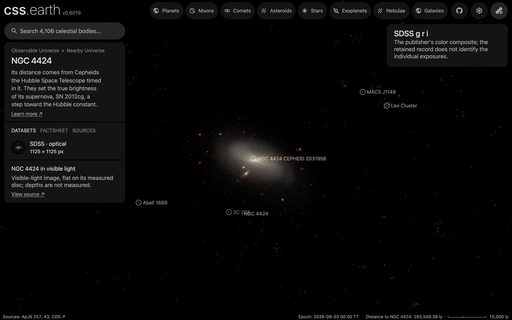

# NGC 4424

A survey image of NGC 4424, cleaned of the Milky Way stars in front of it where they show and color-tied to its measured integrated color, lies flat on its measured disc. It has no dots. Image brightness does not measure per-pixel distance.

## Sources

| Selected source | Input and meaning |
| --- | --- |
| [Sloan Digital Sky Survey](https://www.sdss.org/) | [Record](../../sources/sdss-dr9-color-hips.json). The survey's g, r, i color composite as the CDS HiPS `CDS/P/SDSS9/color`, cut out by the CDS hips2fits service: 1125 × 1125 px over 7.5 × 7.5 arcmin (0.40″ per pixel, the HiPS's own scale), tangent projection, north up (`source/source.jpg`, restored from its origin). SDSS images are CC BY; the HiPS distribution is ODbL-1.0. A display composite, not calibrated photometry. |
| [Leroy et al. (2021)](https://cdsarc.cds.unistra.fr/viz-bin/cat/J/ApJS/257/43) | [Record](../../sources/leroy-2021-phangs-alma.json). Row NGC4424: centre 186.79833°, 9.42056°, inclination 58.2 ± 6.0°, position angle 88.3 ± 2.0°: the disc the image lies on. The same row gives the stellar scale length, 2.2 kpc at their 16.2 Mpc, 28.0″, which is 2.23 kpc at the distance used here. |
| [Gaia DR3](https://doi.org/10.1051/0004-6361/202243940) with [Ren et al. (2021)](https://doi.org/10.3847/1538-4357/abcda5) | The 67 Gaia DR3 sources within 0.09° of NGC 4424's centre that Ren et al.'s criterion marks as Milky Way stars (`source/gaia-dr3-foreground.csv`, restored by the query in the [Gaia record](../../sources/gaia-2023-dr3.json)). |
| [RC3](../../sources/rc3-1991.json) | NGC 4424's total B-V, 0.68 ± 0.05 as observed. |
| [Riess et al. (2016)](https://arxiv.org/abs/1604.01424) | [Record](../../sources/arxiv-1604-01424.json). Distance: table 5, row N4424, Cepheid distance modulus 31.080 ± 0.292, 16.44 Mpc, the distance its Cepheids are placed at. |
| [Kregel et al. (2002)](https://arxiv.org/abs/astro-ph/0204154) | [Record](../../sources/kregel-2002-disc-flattening.json). Discs are on average 7.3 ± 2.2 times longer than thick, so the scale length gives a 306 pc scale height. The recipe carries six of them as the disc's thickness; a flat bank draws none of it. |

The bank has no parent: it is the picture of its host, [`ngc-4424`](../ngc-4424/README.md), named in `properties.host`. The host's README says which object the galaxy is inside.

## The image

- **Registration:** the cutout's registration is its request. 17 of the 17 Gaia stars brighter than G = 19 in it have a star within 4 px of their requested places. The brightest spot of the centre is 0.6″ from Leroy et al.'s centre.
- **Foreground stars:** 11 of the 36 Gaia foreground stars in the image are removed where they show; 25 on extended
  light are left.
- **Color:** tied to RC3's B-V of 0.68: red/green 1.123 and blue/green 0.663 against 1.137 and 0.873, so red × 1.013
  and blue × 1.318 in linear light.
- **Disc:** inclination 58.2°, line of nodes 88.3°, drawn as one flat image on the midplane. The support radius, 17.9 kpc (3.7′), is where the frame stops on its tightest side. The image's ring median is within 1 of 255 of its sky level from 16 kpc out.
- **Near side:** not determined. The catalogue gives the tilt, not which edge is nearer; the galaxy shows no spiral arms to read a rotation sense from, and [Lang et al. (2020)](https://cdsarc.cds.unistra.fr/viz-bin/cat/J/ApJ/897/122), the kinematic fits Leroy et al. name first among their orientation sources, has no row for it, so 88.3° is not known to be the receding side. The bank draws the near side at 178° (south), one of the two the tilt allows.
- **Sky:** the image's sky, (8, 8, 5) of 255, is subtracted as the background floor (8 of 255).
- **Bytes:** one image, 955 × 527 px, 264 KB (WebP quality 70, alpha quality 80), the scale of the Milky Way's own
  backing image. It is one flat plane, as the Milky Way's is: no slabs through the disc's thickness.

## Evidence

The NGC 4424 page's opening view in headless Chromium at 1440 × 900, device pixel ratio 2, on this branch on 2026-10-02. The white dots on the disc are
its SH0ES Cepheids, objects of their own inside the galaxy.

- The prepared bank's `approximation.limitations` records the foreground and color-tie counts quoted above.
- What was examined and left out is in the [investigation ledger](investigations.json).

## Measured, chosen and inferred

| Value | Kind |
| --- | --- |
| Centre, inclination 58.2° ± 6.0°, position angle 88.3° ± 2.0° | Measured: Leroy et al. (2021) |
| Distance 16.44 Mpc | Measured: Riess et al. (2016), from its Cepheids |
| Near side at 178° | Not measured or inferred: one of the two edges the tilt allows |
| B-V 0.68 | Measured: RC3 |
| Scale height 306 pc | Inferred: the scale length over 7.3, the mean of other galaxies; not measured here, and not drawn |
| Support 17.9 kpc, fade from 13.4 kpc | Presentation: where the frame stops |
| One flat image, at most 1,024 px on its face, background floor | Presentation |

## Known problems

- Which edge of the disc is nearer is not known; the one drawn is a choice between two.
- The distance modulus has the largest error of the SH0ES hosts (± 0.292 mag), so the distance is uncertain by about 2.2 Mpc.
- The survey image is shallow, and the frame stops where the faintest outer light still shows.
- Most catalogued foreground stars stay: on this small, smooth galaxy the removal reads them as extended light.
- No dots: the PHANGS-MUSE nebular catalogue (Groves et al. 2023) has no rows for this galaxy, and no other catalogue was searched for in this change.
- The image is flat: seen edge-on it is a line. Nothing here has height.
