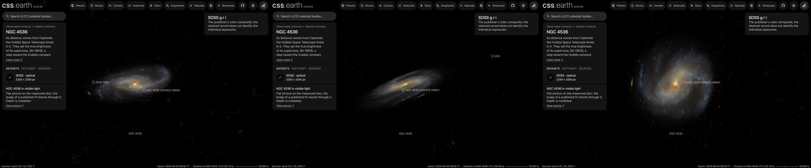

# NGC 4536

A survey image of NGC 4536, cleaned of the Milky Way stars in front of it where they show and color-tied to its measured integrated color, lies flat on its measured disc, with its bulge standing through it as a small volume. It has no dots. Image brightness does not measure per-pixel distance.

## Sources

| Selected source | Input and meaning |
| --- | --- |
| [Sloan Digital Sky Survey](https://www.sdss.org/) | [Record](../../sources/sdss-dr9-color-hips.json). The survey's g, r, i color composite as the CDS HiPS `CDS/P/SDSS9/color`, cut out by the CDS hips2fits service: 2250 × 2250 px over 15 × 15 arcmin (0.40″ per pixel, the HiPS's own scale), tangent projection, north up (`source/source.jpg`, restored from its origin). SDSS images are CC BY; the HiPS distribution is ODbL-1.0. A display composite, not calibrated photometry. |
| [Leroy et al. (2021)](https://cdsarc.cds.unistra.fr/viz-bin/cat/J/ApJS/257/43) | [Record](../../sources/leroy-2021-phangs-alma.json). Row NGC4536: centre 188.61292°, 2.18833°, inclination 66.0 ± 2.9°, position angle 305.6 ± 2.3°: the disc the image lies on. The same row gives the stellar scale length, 2.7 kpc at their 16.25 Mpc, 34.3″, which is 2.52 kpc at the distance used here. |
| [Gaia DR3](https://doi.org/10.1051/0004-6361/202243940) with [Ren et al. (2021)](https://doi.org/10.3847/1538-4357/abcda5) | The 261 Gaia DR3 sources within 0.18° of NGC 4536's centre that Ren et al.'s criterion marks as Milky Way stars (`source/gaia-dr3-foreground.csv`, restored by the query in the [Gaia record](../../sources/gaia-2023-dr3.json)). |
| [RC3](../../sources/rc3-1991.json) | NGC 4536's total B-V, 0.61 ± 0.02 as observed. |
| [Riess et al. (2016)](https://arxiv.org/abs/1604.01424) | [Record](../../sources/arxiv-1604-01424.json). Distance: table 5, row N4536, Cepheid distance modulus 30.906 ± 0.053, 15.18 Mpc, the distance its Cepheids are placed at. |
| [Kregel et al. (2002)](https://arxiv.org/abs/astro-ph/0204154) | [Record](../../sources/kregel-2002-disc-flattening.json). Discs are on average 7.3 ± 2.2 times longer than thick, so the scale length gives a 345 pc scale height. The recipe carries six of them as the disc's thickness; a flat bank draws none of it. |

The bank has no parent: it is the picture of its host, [`ngc-4536`](../ngc-4536/README.md), named in `properties.host`. The host's README says which object the galaxy is inside.
| [Salo et al. (2015)](https://cdsarc.cds.unistra.fr/viz-bin/cat/J/ApJS/219/4) | [Record](../../sources/salo-2015-s4g-decompositions.json). S4G's 3.6 µm fit of NGC4536 (table 7, model `_bd`): a Sérsic bulge (35.0% of the light, magnitude 10.99, half-light radius 5.84″ = 0.43 kpc, n = 1.466, axis ratio 0.451, PA 124.86°) and an exponential disc (65.0% of the light, scale length 50.68″ = 3.73 kpc, axis ratio 0.435, PA 125.48°, face-on central surface brightness 20.837, 19.933 as projected on the sky). |

## The image

- **Registration:** the cutout's registration is its request. 70 of the 74 Gaia stars brighter than G = 19 in it have a star within 4 px of their requested places. The brightest spot of the centre is 3.4″ from Leroy et al.'s centre.
- **Foreground stars:** 135 of the 146 Gaia foreground stars in the image are removed where they show; 6 on extended
  light are left.
- **Color:** tied to RC3's B-V of 0.61: red/green 1.043 and blue/green 0.703 against 1.095 and 0.91, so red × 1.05
  and blue × 1.295 in linear light.
- **Bulge:** the bulge takes the fit's own light, scaled to the photograph and never more than the photograph holds there, in an oblate spheroid through the disc with intrinsic axis ratio 0.21 (the one that projects to 0.451 at 66.0°) and the fit's deprojected Sérsic density. The flat picture keeps the rest, so the view from the Sun is unchanged and the photograph's own structure stays on the disc. The spheroid ends on its own surface at 8 half-light radii (3.44 kpc), where the fitted bulge is under about 1% of the display's range, fading from half that radius, so it shows no rim: a presentation choice.
- **Disc:** inclination 66.0°, line of nodes 305.6°, drawn as one flat image on the midplane. The support radius, 25 kpc (5.7′), is where the image's ring median reaches its sky level; the frame reaches 39.1 kpc.
- **Near side:** the catalogue gives the tilt, not which edge is nearer. The arms open counter-clockwise on the sky, so if they trail, as spiral arms do, the disc turns clockwise; with the receding side at position angle 305.6° that puts the near side at 36° (north-east). This is an inference from the image and the velocity field, not a published statement. The position angle is the kinematic one: [Lang et al. (2020)](https://cdsarc.cds.unistra.fr/viz-bin/cat/J/ApJ/897/122) fit 305.5° to the CO velocity field.
- **Sky:** the image's sky, (8, 8, 6) of 255, is subtracted as the background floor (8 of 255).
- **Bytes:** 83 images, 179 KB (WebP quality 70, alpha quality 80): the flat picture, 637 × 504 px, the scale of the Milky Way's own
  backing image, and the bulge's small slices. The disc is one flat plane, as the Milky Way's is: no slabs through its thickness.

## Evidence

The NGC 4536 page in headless Chromium at 1440 × 900, device pixel ratio 2, on this branch on 2026-10-03, with its bulge: the default
arrival, then the camera turned to the side and to above the disc. No page errors. The marked star is one of its SH0ES Cepheids, an object of
its own inside the galaxy.

- The prepared bank's `approximation.limitations` records the foreground and color-tie counts quoted above.
- What was examined and left out is in the [investigation ledger](investigations.json).

## Measured, chosen and inferred

| Value | Kind |
| --- | --- |
| Centre, inclination 66.0° ± 2.9°, position angle 305.6° ± 2.3° | Measured: Leroy et al. (2021) |
| Distance 15.18 Mpc | Measured: Riess et al. (2016), from its Cepheids |
| Near side at 36° | Inferred: trailing arms and the receding side |
| B-V 0.61 | Measured: RC3 |
| Scale height 345 pc | Inferred: the scale length over 7.3, the mean of other galaxies; not measured here, and not drawn |
| Support 25 kpc, fade from 18.8 kpc | Presentation: where the image's light reaches its sky level |
| One flat image, at most 1,024 px on its face, background floor | Presentation |

## Known problems

- The bulge's depth is modelled, not measured: the paper fits light on the sky, and the spheroid is the one that shows its axis ratio at the disc's tilt.
- The fit is of the 3.6 µm image and the picture is visible light, so the bulge's share of the picture is not exactly the fit's.
- Where the fit's bulge is as bright as the photograph, the flat picture is empty under it; from the side the nucleus can show as a dark spot on the disc.
- The survey image is shallow: the outer arms are faint and grainy.
- At 66° the disc is seen well away from face-on, so the image laid flat on it is stretched 2.5 times across its minor axis; anything with height (the bulge, dust lanes seen in projection) is smeared with it.
- A few foreground stars remain.
- No dots: the PHANGS-MUSE nebular catalogue (Groves et al. 2023) has no rows for this galaxy, and no other catalogue was searched for in this change.
- The image is flat: seen edge-on it is a line. Nothing here has height.
