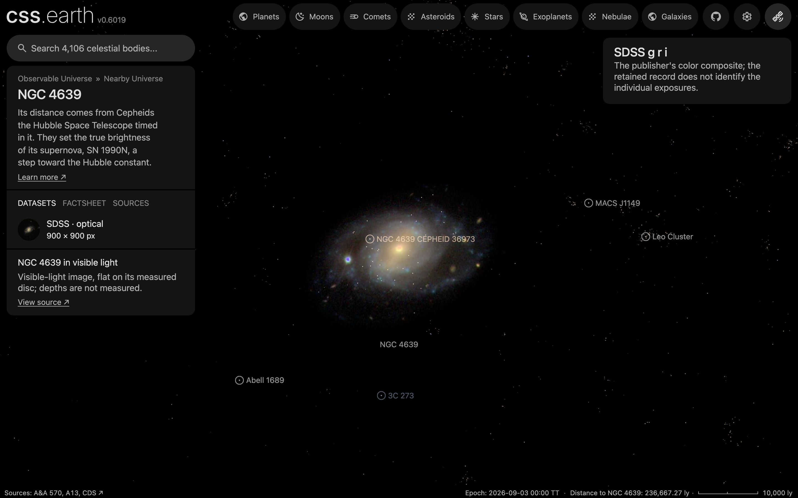

# NGC 4639

A survey image of NGC 4639, cleaned of the Milky Way stars in front of it where they show and color-tied to its measured integrated color, lies flat on its measured disc. It has no dots. Image brightness does not measure per-pixel distance.

## Sources

| Selected source | Input and meaning |
| --- | --- |
| [Sloan Digital Sky Survey](https://www.sdss.org/) | [Record](../../sources/sdss-dr9-color-hips.json). The survey's g, r, i color composite as the CDS HiPS `CDS/P/SDSS9/color`, cut out by the CDS hips2fits service: 900 × 900 px over 6 × 6 arcmin (0.40″ per pixel, the HiPS's own scale), tangent projection, north up (`source/source.jpg`, restored from its origin). SDSS images are CC BY; the HiPS distribution is ODbL-1.0. A display composite, not calibrated photometry. |
| [HyperLEDA](http://atlas.obs-hp.fr/hyperleda/) | [Record](../../sources/hyperleda-2014.json). Meandata row PGC 42741: centre 190.71834°, 13.25724°, inclination 51.02°, position angle 138.01°: the disc the image lies on. NGC 4639 is not in Leroy et al.'s (2021) PHANGS table. |
| [Salo et al. (2015)](https://cdsarc.cds.unistra.fr/viz-bin/cat/J/ApJS/219/4) | [Record](../../sources/salo-2015-s4g-decompositions.json). Table 7, NGC4639 (model `_bdbarf`): exponential disc with axis ratio 0.653 at position angle −45.49° (134.5°), in line with HyperLEDA's tilt and angle, and scale length 17.53″, 1.72 kpc at the distance used here. |
| [Gaia DR3](https://doi.org/10.1051/0004-6361/202243940) with [Ren et al. (2021)](https://doi.org/10.3847/1538-4357/abcda5) | The 33 Gaia DR3 sources within 0.075° of NGC 4639's centre that Ren et al.'s criterion marks as Milky Way stars (`source/gaia-dr3-foreground.csv`, restored by the query in the [Gaia record](../../sources/gaia-2023-dr3.json)). |
| [RC3](../../sources/rc3-1991.json) | NGC 4639's total B-V, 0.70 ± 0.01 as observed. |
| [Riess et al. (2016)](https://arxiv.org/abs/1604.01424) | [Record](../../sources/arxiv-1604-01424.json). Distance: table 5, row N4639, Cepheid distance modulus 31.532 ± 0.071, 20.25 Mpc, the distance its Cepheids are placed at. |
| [Kregel et al. (2002)](https://arxiv.org/abs/astro-ph/0204154) | [Record](../../sources/kregel-2002-disc-flattening.json). Discs are on average 7.3 ± 2.2 times longer than thick, so the scale length gives a 236 pc scale height. The recipe carries six of them as the disc's thickness; a flat bank draws none of it. |

The bank has no parent: it is the picture of its host, [`ngc-4639`](../ngc-4639/README.md), named in `properties.host`. The host's README says which object the galaxy is inside.

## The image

- **Registration:** the cutout's registration is its request. 8 of the 10 Gaia stars brighter than G = 19 in it have a star within 4 px of their requested places. The brightest spot of the centre is 0.9″ from HyperLEDA's centre.
- **Foreground stars:** 7 of the 21 Gaia foreground stars in the image are removed where they show; 13 on extended
  light are left.
- **Color:** tied to RC3's B-V of 0.70: red/green 1.107 and blue/green 0.671 against 1.159 and 0.872, so red × 1.046
  and blue × 1.3 in linear light.
- **Disc:** inclination 51.02°, line of nodes 138.01°, drawn as one flat image on the midplane. The support radius, 12 kpc (2.0′), is where the image's ring median reaches its sky level; the frame reaches 20.7 kpc.
- **Near side:** not determined. HyperLEDA's position angle is the major axis of the light, measured from 0° to 180°, and says nothing of which half recedes; no kinematic position angle was found (the galaxy is not in Leroy et al. 2021 or Lang et al. 2020). The bank draws the near side at 228° (south-west), one of the two the tilt allows.
- **Sky:** the image's sky, (7, 7, 5) of 255, is subtracted as the background floor (7 of 255).
- **Bytes:** one image, 490 × 505 px, 102 KB (WebP quality 70, alpha quality 80), the scale of the Milky Way's own
  backing image. It is one flat plane, as the Milky Way's is: no slabs through the disc's thickness.

## Evidence

The NGC 4639 page's opening view in headless Chromium at 1440 × 900, device pixel ratio 2, on this branch on 2026-10-02. The white dots on the disc are
its SH0ES Cepheids, objects of their own inside the galaxy.

- The prepared bank's `approximation.limitations` records the foreground and color-tie counts quoted above.
- What was examined and left out is in the [investigation ledger](investigations.json).

## Measured, chosen and inferred

| Value | Kind |
| --- | --- |
| Centre, inclination 51.02°, position angle 138.01° | Measured: HyperLEDA |
| Distance 20.25 Mpc | Measured: Riess et al. (2016), from its Cepheids |
| Near side at 228° | Not measured or inferred: one of the two edges the tilt allows |
| B-V 0.70 | Measured: RC3 |
| Scale height 236 pc | Inferred: the scale length over 7.3, the mean of other galaxies; not measured here, and not drawn |
| Support 12 kpc, fade from 9.0 kpc | Presentation: where the image's light reaches its sky level |
| One flat image, at most 1,024 px on its face, background floor | Presentation |

## Known problems

- Which edge of the disc is nearer is not known; the one drawn is a choice between two.
- No error is recorded here for HyperLEDA's inclination or position angle; its inclination follows from the axis ratio of the light, not from the gas motions.
- The G = 13.2 foreground star 56″ south-east of the centre (Gaia DR3 3929165622890055808) stays: the survey draws its saturated core as a purple ring, which the removal reads as extended light.
- The survey image is shallow: the outer arms are faint and grainy.
- No dots: the PHANGS-MUSE nebular catalogue (Groves et al. 2023) has no rows for this galaxy, and no other catalogue was searched for in this change.
- The image is flat: seen edge-on it is a line. Nothing here has height.
