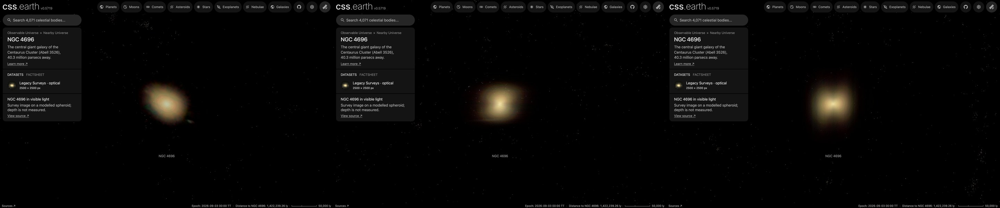

# NGC 4696

The giant elliptical galaxy NGC 4696, the brightest galaxy of the Centaurus Cluster, drawn as a volume of starlight on
its own page, [NGC 4696](../ngc-4696/README.md). A survey image, cleaned of the Milky Way stars and neighbouring
galaxies, supplies the light along every sight line; the depth of that light follows a published fit to NGC 4696's
profile. **Depth is modelled, not measured.**

## Sources

| Selected source | Input and meaning |
| --- | --- |
| [DESI Legacy Imaging Surveys DR10](https://www.legacysurvey.org/dr10/) | [Record](../../sources/desi-legacy-surveys-dr10-color-hips.json). The surveys' g, r, i, z colour composite as the CDS HiPS `CDS/P/DESI-Legacy-Surveys/DR10/color`, cut out by the CDS hips2fits service: 2500 × 2500 px over 11.0 × 11.0 arcmin (0.263″ per pixel, the survey's own scale), tangent projection, north up. A display composite, not calibrated photometry. |
| [Gao et al. (2020)](https://arxiv.org/abs/2001.00331) | [Record](../../sources/gao-2020-cgs-ellipticals.json). Table 2 ([CDS J/ApJS/247/20](https://cdsarc.cds.unistra.fr/viz-bin/cat/J/ApJS/247/20)), row NGC 4696: single-Sérsic fit to the Carnegie-Irvine Galaxy Survey's R-band image, n = 2.99 ± 0.13, effective radius 16.65 ± 1.46 kpc, ellipticity 0.219. |
| [Ho et al. (2011)](https://cdsarc.cds.unistra.fr/viz-bin/cat/J/ApJS/197/21) | [Record](../../sources/ho-2011-cgs.json). The same survey's row NGC 4696: scale 10.94 kpc per arcmin (37.6 Mpc), diameter at 26.5 B mag per square arcsec 10.96′, photometric major axis at position angle 92.1 ± 1.3°. |
| [HyperLEDA PGC](https://cdsarc.cds.unistra.fr/viz-bin/cat/VII/237) (Paturel et al. 2003) | [Record](../../sources/paturel-2003-hyperleda-pgc.json). Positions and D25 sizes of the 7 neighbouring galaxies masked in the image. |
| [Cosmicflows-4](https://cdsarc.cds.unistra.fr/viz-bin/cat/J/ApJ/944/94) (Tully et al. 2023) | Table 3, group 1PGC 43296: 40.3 Mpc. Position from the 2MASS Extended Source Catalog. See the [host](../ngc-4696/README.md). |

## Method

The Nebula Lab recipe is [labs/nebula/models/ngc-4696/experiment.json](../../../labs/nebula/models/ngc-4696/experiment.json);
`node labs/nebula/run.mts prepare-emission` runs it, and [delivery.json](source/delivery.json) places the result. It is
[M49's route](../m49-volume/README.md#method) with NGC 4696's measurements.

1. **Stars:** NOX removes the Milky Way stars from the cutout. The field is 22° from the Galactic plane and crowded.
2. **Neighbours:** the 7 HyperLEDA galaxies whose masks reach the cutout are masked out to three times their D25 radius,
   never more than three quarters of their distance from the centre. A masked pixel takes the median of the unmasked
   light on its isophote and never gains light.
3. **Compact leftovers:** each pixel takes the median of the 41 px around it (10.8″, 2.1 kpc, about two and a half of
   the grid's cells). M49's recipe only lowers a pixel to that median. Here a pixel darker than it is raised too
   (`compactClamp.fillDark`), because the survey leaves a dark saturation trail 47″ north of the core and dark holes at
   bright stars, and a clamp that only lowers kept them as a dark streak through the volume.
4. **Depth:** the light along each sight line is spread in depth by the deprojected density (Prugniel & Simien 1997) of
   Gao et al.'s fit: n = 2.99, half-light radius 91.3″ (16.65 kpc at their survey's scale; 17.8 kpc at 40.3 Mpc), axis
   ratio 0.781. The spheroid's axis is NGC 4696's minor axis (position angle 2.1°), placed in the plane of the sky; no
   intrinsic axis is measured. It ends at 3.601 half-light radii, 328.8″ (64.2 kpc).

Values chosen here, not measured:

- The end of the spheroid. Gao et al.'s fit runs to infinity; it is stopped at half of Ho et al.'s 26.5 B mag diameter.
- The position angle. Gao et al.'s table gives none, so the survey's own isophotal angle (Ho et al.) is used with their
  ellipticity.
- The half-light radius in arcseconds assumes Gao et al. used their survey's tabulated scale; the paper gives kpc only.
- The display exposure 1.5 and the 150-cell grid are M87's; the mask radius and the median window are M87's rules.

## Evidence

The NGC 4696 page in headless Chromium at 1440 × 900, device pixel ratio 2, on this branch on 2026-10-02: the default
arrival, then the camera turned to the side and to above the galaxy.

- The volume reproduces the cleaned image along every sight line it covers (the method conditions on it); 0.2 to 1.7%
  of the image's light, by colour channel, lies outside the spheroid and is not drawn.
- The cutout's registration is its request: the centroid of the bright core falls within 1 px (0.2″) of the image
  centre, the 2MASS position.
- The core is not saturated beyond 3″ (490 px at 250 of 255 or above), against M49's 35″.

## Known problems

- The survey's sky subtraction removes NGC 4696's faint outer light: the image fades into the sky about 200″ (39 kpc)
  from the centre, well inside the 329″ spheroid. Where the survey's coadded tiles meet, that subtraction changes
  level along straight lines, most visibly east and north-west of the core.
- The dust lane that crosses the core is narrower than the median window and is not drawn.
- One smooth spheroid from one fit. Gao et al. warn that a single Sérsic function describes an elliptical less well
  than several; NGC 4696's outer envelope is spread through it.
- Seen from the side or from above, the volume looks boxy and its core shows a cross, more than M49's does. The
  image is a compressed display stretch: its outer sight lines carry more light, relative to the centre, than the
  fitted profile gives them, so the depth they are spread over shows as a block.
- The image is a stretched display composite, so the volume's brightness is not proportional to the starlight.
- No globular clusters are drawn; see the [ledger](investigations.json).
