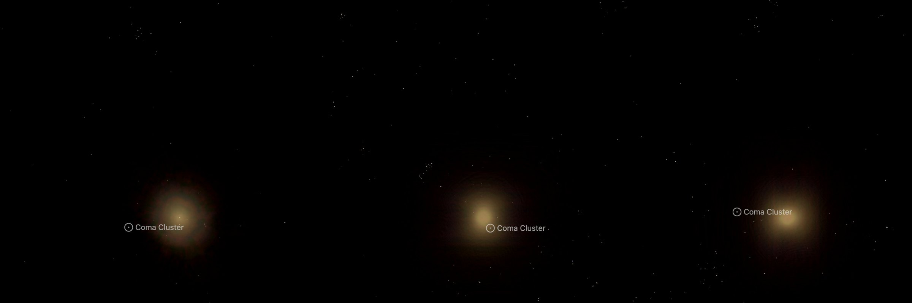

# NGC 4874

The giant galaxy NGC 4874, one of the two giants at the centre of the Coma Cluster, with the cluster's diffuse light around it. It is drawn as a volume of starlight on its own page, [NGC 4874](../ngc-4874/README.md). A survey image, cleaned of
the Milky Way stars and neighbouring galaxies, supplies the light along every sight line; the depth of that light
follows a published fit to NGC 4874's profile. **Depth is modelled, not measured.**

## Sources

| Selected source | Input and meaning |
| --- | --- |
| [Sloan Digital Sky Survey DR9](https://www.sdss.org/) | [Record](../../sources/sdss-dr9-color-hips.json). The survey's g, r, i colour composite as the CDS HiPS `CDS/P/SDSS9/color`, cut out by the CDS hips2fits service: 1800 × 1800 px over 8.0 × 8.0 arcmin, tangent projection, north up. A display composite, not calibrated photometry. |
| [Kluge et al. (2020)](https://cdsarc.cds.unistra.fr/viz-bin/cat/J/ApJS/247/43) | [Record](../../sources/publication-kluge2020apjs-247-43k.json). Table 4, row A1656: the single Sérsic fit to the semimajor-axis g′ profile of NGC 4874 and the intracluster light, n = 9.00 ± 0.90, r_e = 784 (+291, −228) kpc at their 0.469 kpc per arcsec (Table 1), 1671.6″. |
| [2MASS Extended Source Catalog](https://cdsarc.cds.unistra.fr/viz-bin/cat/VII/233) (Skrutskie et al. 2006) | Row 2MASX J12593570+2757338: position 194.898788°, +27.959389°; K-band 3σ isophote axis ratio 0.94 and position angle 55°. Also the sizes (K-band 20 mag isophotal radius) of 20 masked neighbours. |
| [HyperLEDA PGC](https://cdsarc.cds.unistra.fr/viz-bin/cat/VII/237) (Paturel et al. 2003) | [Record](../../sources/paturel-2003-hyperleda-pgc.json). Positions and D25 sizes of 33 masked neighbouring galaxies. |
| [Gaia DR3](https://cdsarc.cds.unistra.fr/viz-bin/cat/I/355) | [Record](../../sources/gaia-2023-dr3.json). Positions and G magnitudes of the 3 masked stars brighter than G = 15. |
| [Cosmicflows-4](https://cdsarc.cds.unistra.fr/viz-bin/cat/J/ApJ/944/94) (Tully et al. 2023) | Table 3, group 1PGC 44715 (NGC 4889's group; Table 2 puts NGC 4874, PGC 44628, in it): distance modulus DMzp = 34.891 ± 0.025, 95.1 Mpc (±1.1 Mpc from the modulus error). It is the distance the [Coma Cluster's circle](../galaxy-clusters/README.md) and its member dots are drawn at, so NGC 4874 sits among them. |

## Method

The Nebula Lab recipe is [labs/nebula/models/ngc-4874/experiment.json](../../../labs/nebula/models/ngc-4874/experiment.json);
`node labs/nebula/run.mts prepare-emission` runs it, and [delivery.json](source/delivery.json) places the result. It is
[M49's route](../m49-volume/README.md#method) with NGC 4874's measurements.

1. **Stars:** NOX removes the Milky Way stars from the cutout.
2. **Masks:** 33 HyperLEDA galaxies are masked out to three times their D25 radius, 20 2MASS galaxies (which
   sizes those HyperLEDA gives no D25) to three times their K-band 20 mag radius, and 3 Gaia stars, whose haloes
   NOX leaves, to 45″ at G = 11, scaled with brightness. No mask reaches beyond half its distance from NGC 4874's
   centre. A masked pixel takes the median of the unmasked light on its isophote and never gains light.
3. **Compact leftovers:** each pixel is clamped to the median of the 75 px around it (20″, 9.2 kpc), so
   uncatalogued galaxies and faint haloes drop out and the smooth light stays.
4. **Black level:** each channel loses the median of the cleaned cutout on the isophote where the spheroid ends
   (0.039, 0.039, 0.027 for red, green, blue), so the light fades to nothing at that edge.
5. **Depth:** the light along each sight line is spread in depth by the deprojected density (Prugniel & Simien 1997) of
   Kluge et al.'s fit: n = 9.00, half-light radius 1671.6″ (770.7 kpc at 95.1 Mpc). The spheroid's axis is NGC 4874's minor axis (position angle 145°), placed in the plane of the sky,
   with the axis ratio 0.94; no intrinsic axis is measured. It ends at 240″ (110.7 kpc).

Values chosen here, not measured or published:

- The end of the spheroid, 240″: where the cleaned cutout reaches its sky level in 10″ elliptical annuli. The
  published fit runs on; the survey image does not.
- The mask sizes, the cap at half a neighbour's distance, the star mask scale and the median window.
- The display exposure 1.5 and the 150-cell grid are M87's.
- A black level per channel is new to the lab recipe (`blackLevel` takes three values).

## Evidence

The NGC 4874 page in headless Chromium at 1440 × 900, device pixel ratio 2, on this branch on 2026-10-02: the default
arrival, then the camera turned to the side and to above the galaxy.

- The volume reproduces the cleaned image along every sight line it covers (the method conditions on it); under 0.8%
  of the image's light lies outside the spheroid and is not drawn.
- The cutout's registration is its request: the brightest pixel of the core falls within 0.4″ (2 px) of the image
  centre, the 2MASS position.
- Tests: `labs/nebula/packages/reconstruction/src/methods/symmetry/processing.test.ts` pins the isophote fill and the
  per-channel black level; `shape-prior.test.ts` pins the Sérsic spheroid.

## Known problems

- The fit's half-light radius is seven times the radius drawn, so the spheroid ends at 0.14 of it, and the lab holds the density flat inside a hundredth of the half-light radius, 17″ (5 grid cells): the core is less peaked in depth than the image is on the sky.
- More than twenty galaxies sit inside NGC 4874's light. They are masked and filled from the isophote; faint patches remain where a neighbour's light exceeds its capped mask.
- One smooth spheroid about an axis in the plane of the sky: the true shape along the line of sight is unknown.
- The image is a stretched display composite, so the volume's brightness is not proportional to the starlight.
- The distance is the Coma Cluster's group average, not a measurement of NGC 4874 itself.
- No globular clusters are drawn.
