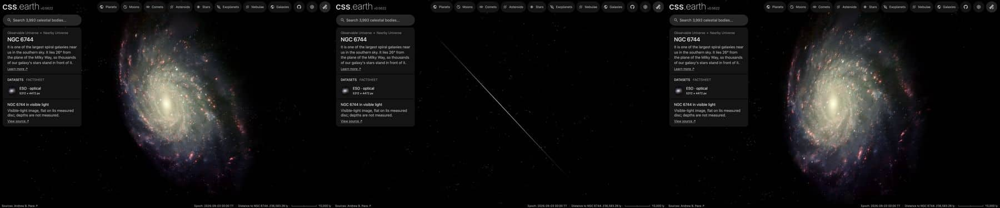

# NGC 6744

An observatory photograph of NGC 6744, cleaned of the Milky Way stars in front of it and colour-tied to its measured
integrated colour, lies flat on its measured disc. No catalogue of its nebulae or clusters was found, so it has no
dots. Image brightness does not measure per-pixel distance.

## Sources

| Selected source | Input and meaning |
| --- | --- |
| [ESO eso1118a](https://www.eso.org/public/images/eso1118a/) | [Record](../../sources/eso-eso1118a.json). The Wide Field Imager on the MPG/ESO 2.2-metre telescope, in B, V, a red filter and Hα: the publisher's Large JPEG, 5312 × 4472 px over 21.07 × 17.74 arcmin (`source/source.jpg`, restored from its origin). CC BY 4.0, credit ESO. A display composite, not calibrated photometry. |
| [Lang et al. (2020)](https://cdsarc.cds.unistra.fr/viz-bin/cat/J/ApJ/897/122) | [Record](../../sources/lang-2020-phangs-kinematics.json). Table 1, row NGC6744: centre 287.44208°, −63.85754°, inclination 53.5°, position angle 15.4°, from the CO velocity field: the disc the image lies on. |
| [Leroy et al. (2021)](https://cdsarc.cds.unistra.fr/viz-bin/cat/J/ApJS/257/43) | [Record](../../sources/leroy-2021-phangs-alma.json). Row NGC6744: stellar scale length 4.8 kpc at their 9.39 Mpc, 105.4″, which is 4.86 kpc at the distance used here. The same row gives inclination 52.7 ± 2.2° and position angle 14.0 ± 0.2°, within a degree and a half of Lang et al.'s. |
| [Gaia DR3](https://doi.org/10.1051/0004-6361/202243940) with [Ren et al. (2021)](https://doi.org/10.3847/1538-4357/abcda5) | The 5,768 Gaia DR3 sources within 0.3° of NGC 6744's centre that Ren et al.'s criterion marks as Milky Way stars (`source/gaia-dr3-foreground.csv`, restored by the query in the Gaia record). |
| [Ho et al. (2011)](https://cdsarc.cds.unistra.fr/viz-bin/cat/J/ApJS/197/21) | [Record](../../sources/ho-2011-cgs.json). The Carnegie-Irvine Galaxy Survey's total magnitudes, B = 9.87 ± 0.21 and V = 9.25 ± 0.11 as observed: a B-V of 0.62. RC3 has no B-V for this galaxy. |
| [Local Volume Database](../../sources/lvdb-v1-1-1.json) | Distance: modulus 29.89 ± 0.14 ([Tully et al. 2009](https://ui.adsabs.harvard.edu/abs/2009AJ....138..323T), tip of the red giant branch), 9.51 Mpc. |

## The image

- **Registration:** the page gives a centre, a field and "north is 90° right of vertical". The stars of this photograph
  are saturated discs, so the registration is fitted to the image's brightness at the predicted places of 1,741 Gaia
  stars (G 16 to 18.5): centre 287.4409719°, −63.8465870°, 0.2380″ per pixel, north 89.99° right of vertical. The fit's
  score halves 8 px off, and the disc centre of Lang et al. lands on the nucleus.
- **Foreground stars:** NGC 6744 lies 26° from the Galactic plane. 1,381 of the 2,119 Gaia foreground stars in the
  image are removed where they show; 563 on extended light are left.
- **Colour:** tied to a B-V of 0.62: red/green 1.118 and blue/green 1.186 against 1.105 and 0.909, so red × 0.989 and
  blue × 0.767 in linear light. The publisher's composite ran blue.
- **Disc:** inclination 53.5°, line of nodes 195.4°, drawn as one flat image on the midplane. The
  support radius, 27.9 kpc, is where the frame stops on its tightest side. No bulge component: no published
  bulge-plus-disc fit was found (the galaxy is outside S4G, which kept to Galactic latitudes above 30°).
- **Near side:** the catalogue gives the tilt, not which edge is nearer. The arms open clockwise on the sky, so if they
  trail, as spiral arms do, the disc turns counter-clockwise; with the receding side at position angle 15.4° that puts
  the near side at 285° (west-north-west). This is an inference from the photograph and the velocity field, not a
  published statement, and it reads Lang et al.'s position angle as the receding side's.
- **Sky:** the image's sky, (18, 14, 16) of 255 at the frame's edge, is subtracted as the background floor (18 of 255).
- **Bytes:** one image, 932 × 609 px, 281 KB (WebP quality 70, alpha quality 80), the scale of the Milky Way's own
  backing image. It is one flat plane, as the Milky Way's is: no slabs through the disc's thickness.

## Evidence

The NGC 6744 page in headless Chromium at 1440 × 900, device pixel ratio 2, on this branch on 2026-10-01: the default
arrival, then the camera turned to the side and to above the disc.

- The prepared bank's `approximation.limitations` records the foreground and colour-tie counts quoted above.

## Measured, chosen and inferred

| Value | Kind |
| --- | --- |
| Centre, inclination 53.5°, position angle 15.4° | Measured: Lang et al. (2020) Table 1 |
| Distance 9.51 Mpc | Measured: Tully et al. (2009), through the Local Volume Database |
| Near side at 285° | Inferred: trailing arms and the receding side |
| B-V 0.62 | Measured: the difference of two total magnitudes of Ho et al. (2011), uncertain by about 0.24 |
| Support 27.9 kpc, fade from 20.9 kpc | Presentation: where the frame stops |
| One flat image, 1,024 px on its face, background floor | Presentation |

## Known problems

- Many Milky Way stars remain: 563 catalogued ones on the galaxy's light, and every star too faint for the criterion.
  Removed stars leave smooth pale patches up close.
- The colour tie rests on a B-V uncertain by about 0.24 magnitudes.
- The companion NGC 6744A, in the frame's corner, is spread into the disc's plane like the rest of the image.
- No dots: no published catalogue of the galaxy's nebulae or clusters was found on CDS.
- The image is flat: seen edge-on it is a line. Nothing here has height.
