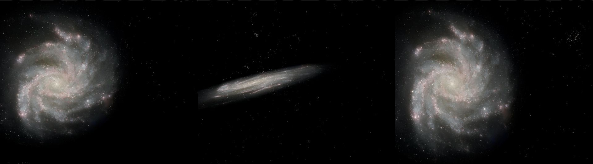

# Fireworks Galaxy (NGC 6946)

A ground-based photograph of NGC 6946, cleaned of the Milky Way stars in front of it and colour-tied to its measured
integrated colour, is spread through a modelled disc. Published catalogues of its supernova remnant candidates and HII
regions are drawn as dots on the same disc. Image brightness does not measure per-pixel distance.

## Sources

| Selected source | Input and meaning |
| --- | --- |
| [Spiral Galaxy NGC 6946](https://noirlab.edu/public/images/noao-ngc6946kpno/) | [Record](../../sources/noirlab-noao-ngc6946kpno.json). T.A. Rector and H. Schweiker's Mayall 4-meter Mosaic view in U, B, V, R, I, H-alpha, [O III] and [S II], 5430 × 3757 px over 23.57 × 16.31 arcmin (`source/source.jpg`, the Large JPEG, restored from its origin). Found in the NOIRLab image archive. |
| [Walter et al. (2008)](https://cdsarc.cds.unistra.fr/viz-bin/cat/J/AJ/136/2563) | [Record](../../sources/walter-2008-things.json). THINGS Table 1, row NGC 6946: centre 308.7175°, +60.15389°, inclination 33°, position angle 243° (from de Blok et al. 2008): the disc the photograph and dots lie on. |
| [Leroy et al. (2008)](https://cdsarc.cds.unistra.fr/viz-bin/cat/J/AJ/136/2782) | [Record](../../sources/leroy-2008-things-star-formation-efficiency.json). Table 4, row NGC 6946: stellar scale length 2.5 kpc at their 5.9 Mpc, which is 87.4″ and 3.27 kpc at 7.73 Mpc. S4G does not cover NGC 6946 (it lies 12° from the Galactic plane). |
| [Kregel et al. (2002)](https://arxiv.org/abs/astro-ph/0204154) | [Record](../../sources/kregel-2002-disc-flattening.json). Sect. 4.3: discs are on average 7.3 ± 2.2 times longer than thick, so the 3.27 kpc scale length gives a 449 pc scale height. |
| [Gaia DR3](https://doi.org/10.1051/0004-6361/202243940) with [Ren et al. (2021)](https://doi.org/10.3847/1538-4357/abcda5) | The 7,379 Gaia DR3 sources within 0.28° of NGC 6946's centre that Ren et al.'s criterion marks as Milky Way stars (`source/gaia-dr3-foreground.csv`, restored by the query in the Gaia record). |
| [RC3](../../sources/rc3-1991.json) | NGC 6946's total B-V, 0.80 ± 0.04 as observed. |
| [Schlafly & Finkbeiner (2011)](https://arxiv.org/abs/1012.4804) | [Record](../../sources/schlafly-2011-sfd-recalibration.json). The Milky Way's reddening on this sight line, E(B-V) = 0.2945, from the [IRSA dust service](https://irsa.ipac.caltech.edu/cgi-bin/DUST/nph-dust?locstr=308.7175+60.15388889+equ+j2000). |
| [Local Volume Database](../../sources/lvdb-v1-1-1.json) | Distance: modulus 29.44 ± 0.13 from the tip of the red giant branch ([Anand et al. 2018](https://ui.adsabs.harvard.edu/abs/2018AJ....156..105A)), 7.73 Mpc. |
| [Long et al. (2019)](https://cdsarc.cds.unistra.fr/viz-bin/cat/J/ApJ/875/85) | [Supernova remnant candidates](source/long-snr/points.json): 147 over the whole galaxy. |
| [Cedrés et al. (2012)](https://cdsarc.cds.unistra.fr/viz-bin/cat/J/A+A/545/A43) | [HII regions](source/cedres-hii/points.json): 226. The table gives offsets from the centre; the positions are VizieR's conversion. |

The catalogue tables are TAP queries of CDS (the query is each descriptor's `table.origin`); they are not tracked.

## The photograph

- **Registration:** the publisher's centre, scale and orientation match the Large JPEG. Fitted to 284 Gaia stars, the
  centre is 308.7365699°, +60.1407805° (within a pixel of the page's), the scale 0.2604″ per pixel and north 90.08° left of
  vertical; the stars fall 1.6 px (median) from their images.
- **Foreground stars:** NGC 6946 lies behind the Milky Way's disc. 2,239 of the 3,219 Gaia foreground stars in the image
  are removed where they show; 448 on the galaxy's light are left, and stars too faint for Gaia's parallaxes and
  proper motions remain.
- **Colour:** tied to B-V 0.51: RC3's 0.80 as observed, less the Milky Way's reddening of 0.29, so the galaxy has its own
  colour and not our dust's. Red/green 0.947 and blue/green 1.165 against 1.027 and 0.947, so red × 1.084 and
  blue × 0.813. in linear light. Removing the reddening is a choice; the other galaxies sit at high latitudes, where it is
  within RC3's error.
- **Disc:** inclination 33°, line of nodes 243°, support 17.5 kpc (where the frame stops on its tightest side), 32 slabs with
  an exponential of 449 pc over ±3 scale heights. No bulge: [Kormendy et al. (2010)](https://arxiv.org/abs/1009.3015) find a pseudobulge of
  under 3% of the stars in NGC 6946 and no classical bulge.
- **Near side:** the catalogue gives the tilt, not which edge is nearer. The arms open counter-clockwise on the sky, so if they trail, as
  spiral arms do, the disc turns clockwise; with the receding side at position angle 243° that puts the near side at 333° (north-north-west).
  This is an inference from the photograph and the velocity field, not a published statement.
- **Sky:** the photograph's sky, (2, 3, 5) of 255 at its edges, is subtracted as the background floor (5 of 255).
- **Bytes:** 78 layer images, 2.12 MB. WebP alpha quality 80 changes no alpha value by more than 1 of 255 against lossless
  alpha; at 70 the error jumps to 10 and the faint disc shows contours.

## Dots

| Catalogue | Drawn | Left out |
| --- | --- | --- |
| Supernova remnant candidates (Long et al. 2019) | 147 | none |
| HII regions (Cedrés et al. 2012) | 226 | none |

Dots keep their place in the disc and rise along its axis to heights drawn from the 449 pc layer. Colours are the Milky
Way's and M31's for each kind; each dot takes its tone from the photograph's brightness under it (never below 15%) and
moves halfway from its kind's colour to the photograph's colour there.

## Evidence

The NGC 6946 page in headless Chromium at 1440 × 900, device pixel ratio 2, on this branch on 2026-10-01: the default
arrival, then the camera turned to the side and to above the disc.

- The prepared bank's `approximation.limitations` records the foreground and colour-tie counts quoted above.

## Measured, chosen and inferred

| Value | Kind |
| --- | --- |
| Centre, inclination 33°, position angle 243° | Measured: THINGS Table 1 |
| Distance 7.73 Mpc | Measured: Anand et al. (2018), through the Local Volume Database |
| Scale length 87.4″ | Measured: Leroy et al. (2008) |
| Scale height 449 pc | Inferred: the scale length over 7.3, the mean of other galaxies (Kregel et al. 2002); not measured in NGC 6946 |
| Near side at 333° | Inferred: trailing arms and the receding side |
| B-V 0.51 | Measured values combined: RC3's 0.80 less Schlafly & Finkbeiner's 0.29; removing the reddening is a choice |
| Support 17.5 kpc, fade from 13.1 kpc | Presentation: where the frame stops |
| 32 slabs over ±3 scale heights, background floor, dot colours and tones | Presentation |

## Known problems

- The frame stops at 17.5 kpc, where the photograph still holds light; the outer arms and the far larger HI disc are cut.
- Foreground stars remain: the faint ones Gaia cannot tell from the galaxy's own, and 448 on the galaxy's light. One
  bright star west of the centre keeps its spikes. Seen at a slant they stretch into dashes, and removed stars leave
  smooth patches.
- One flat disc with no bulge, bar or warp. THINGS rounds the tilt to whole degrees; de Blok et al. give 32.6° and 242.7°.
- The HII regions' positions come from offsets, so they can sit a few arcseconds from their nebulae.
- Depth is modelled: slabs are the photograph along our sight lines, so side views are approximate.
