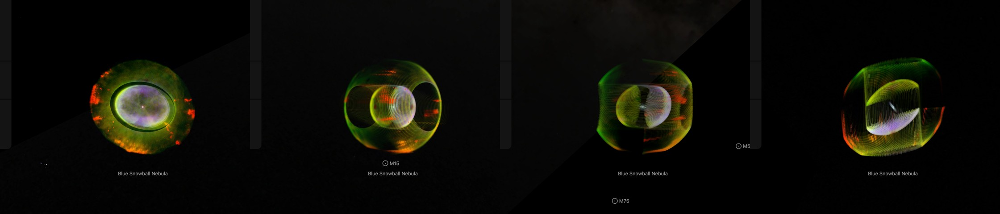
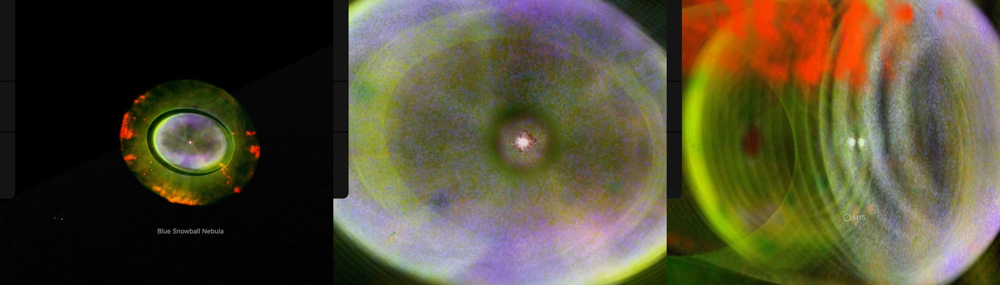

# Blue Snowball Nebula

ESA/Hubble's picture of the Blue Snowball Nebula (NGC 7662) on the walls of its two shells. **The shells' shape, tilt and speed are those Guerrero, Jaxon & Chu (2004) fit to the nebula's spectra: two stretched shells, one inside the other, their long axis 50° from our sight line with its north-east end toward us. The outer shell's tilt is not measured: the paper assumes it is the inner shell's. No knot in the picture has a depth of its own.**

## Sources

| Selected source | Input and meaning |
| --- | --- |
| [ESA/Hubble opo9738c20](https://esahubble.org/images/opo9738c20/) | [Record](../../sources/esahubble-opo9738c20.json). NGC 7662: WFPC2, H-alpha 656 nm in green, [N II] 658 nm in red and [O I] 631 nm in magenta, as ESA's page lists them; 737 × 737 px over 33.3 × 33.3″, released 17 December 1997. The bank draws the publisher's JPEG unchanged (`source/source.jpg`, restored from its origin). Credit: Bruce Balick and Jason Alexander (University of Washington), Arsen Hajian (S. Naval Observatory), Yervant Terzian (Cornell University), Mario Perinotto (University of Florence), Patrizio Patriarchi (Arcetri Observatory) and NASA/ESA. A display composite, not calibrated photometry. |
| [Guerrero, Jaxon & Chu (2004)](https://arxiv.org/abs/astro-ph/0407029) | [Record](../../sources/publication-guerrero-2004-ngc-7662-structure.json). AJ 128, 1705. Echelle spectra of the [O III] lines from the 4 m telescope at Kitt Peak, fitted with ellipsoidal shells in homologous expansion (Sect. 3.2). Table 1: the inner shell is 13 × 19.7″ and expands at 35 km/s at its equator and 53 km/s along its pole; the outer shell is 28 × 33.6″, at 50 and 60 km/s; the major axis of each is tilted 50° against the line of sight along position angle 45°, the north-east end toward us. |
| [Chornay & Walton (2021)](https://cdsarc.cds.unistra.fr/viz-bin/cat/J/A+A/656/A110) | [Record](../../sources/chornay-walton-2021-pn-central-stars.json). The central star, Gaia EDR3 1924818288379268736, and its distance: 1,740 pc (1,648 to 1,842). |

## The picture

- **Registration:** the file's embedded sky tags for scale and direction, 0.0452″ per pixel and north 106.92° right of vertical, and the central star for place: its peak, pixel 361.0, 350.6, is set at the star's Gaia EDR3 place. The tags alone put the star 0.32″ from there.
- **The shells:** each is an ellipsoid of revolution about one axis, with the paper's sizes: the inner one 6.5″ at its equator and 9.85″ along its pole, the outer one 14″ and 16.8″. The axis is 50° from the sight line, its near end leaning to position angle 45°. The speeds set how deep a wall stands: 53 km/s at 9.85″ for the inner shell, 60 km/s at 16.8″ for the outer one ([shape.ts](../../../packages/bake/src/image-layers/shape.ts)).
- **A check:** seen at that tilt the two ellipsoids are 17.3 × 13.0″ and 31.4 × 28.0″ on the sky. The paper measures 17.9 × 12.4″ and 30.8 × 27.2″ on Hubble's images (Sect. 3.1).
- **The light on them:** inside the inner shell's outline each sight line's light lies on that shell's near wall and its far wall; between the two outlines, on the outer shell's ([shape-walls.ts](../../../packages/bake/src/image-layers/shape-walls.ts)). The walls share the picture's smooth light. Its fine detail, what stands above the picture blurred over 8 px (0.36″), is on the near wall inside the inner shell and on the shells' equatorial plane outside it: presentation choices, as on the [Ring](../m57-layers/README.md) and [NGC 2392](../ngc-2392-layers/README.md).
- **The star:** its own light ends 1.5″ from it in this picture ([star-light.mts](../../../packages/bake/authoring/m1-67/star-light.mts)). All of it within half that, and less and less out to it, stays at the star.
- **Size:** the picture is drawn at its own 737 px, 0.045″ a pixel: 33.3″ across, 0.28 pc at 1,740 pc.
- **Rim:** the picture fades out between 15.2″ and 15.8″ from the star, the largest circle the frame holds, so no straight edge shows.

## Evidence

The page in headless Chromium at 1440 × 900, device pixel ratio 2, on 2026-10-05: as it opens, then with the camera turned by drags of 160 px and 300 px sideways and of 300 px down. No page errors.

The same page as it opens, and eight wheel steps in, from the Sun's side and turned.

The bake's tests of shells and their walls ([shape.test.ts](../../../packages/bake/src/image-layers/shape.test.ts)) cover what draws this bank; it adds no code.

## Known problems

- The outer shell's tilt is assumed, not measured: its spectra show no clear tilt, so it is either nearly round or seen along its pole.
- The frame is barely larger than the nebula. The outer shell's long axis reaches 15.7″ on the sky and the picture ends 15.8″ from the star: the shell's two ends lie in the rim's fade, and the frame cuts the red knots at one edge.
- The red knots, the nebula's fast low-ionisation regions, have no depth of their own: the paper leaves them out of its fit and prints no speed for them. They lie on the walls with the rest.
- All three display channels take the [O III] shells. The picture shows H-alpha, [N II] and [O I], which the paper did not fit.
- The far wall repeats nothing new: one picture cannot tell a shell's near wall from its far one, so the two share the light.
- Inside the inner shell's outline the outer shell has no light: the picture's light there is all the inner shell's. The outer shell's near wall is nearer the camera than the inner shell, so its hole looks larger than the inner shell: as the page opens, a dark ring stands around the inner shell that the photograph does not have. [NGC 2392's](../ngc-2392-layers/README.md) page has the same ring, fainter.
- The walls are drawn as slices, which show as steps when turned far.
- The paper's sizes in parsecs and its ages assume 800 pc; the page stands at the Gaia distance, 1,740 pc. The shells' sizes are used in arcseconds.
- The faint halo, 134″ across, is outside the picture.
- Colors are the publisher's display composite, not a measurement.
- The bank is 2.7 MB of images in 169 files and 300 kB of leaf records, in 171 slices over three stacks. Frames in Safari are not measured.
