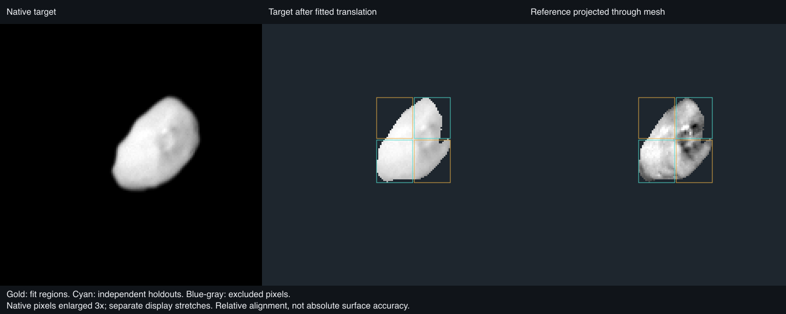
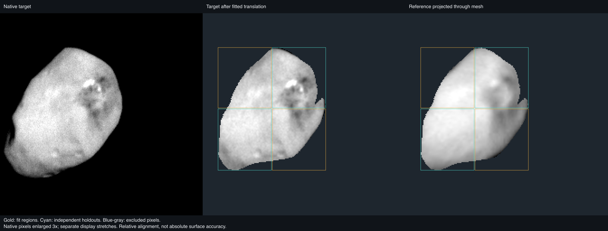

# Nix

## Sources

**Draft experiment; photographic release is deferred.** The PDS camera/orientation products have been recovered, but the exact released STL-to-PCK frame binding remains unverified. The experimental Monochrome view is not a qualified surface. All selected photographs, labels and orientation kernels are now retrieved; the remaining issue is measured registration, not archive access.

The **Monochrome** lens uses the native, calibrated New Horizons LORRI product
[`LOR_0299174134_0X636_SCI`](https://pdssbn.astro.umd.edu/holdings/nh-p-lorri-3-pluto-v3.0/data/20150714_029917/lor_0299174134_0x636_sci.fit), acquired on 14 July 2015. It is panchromatic calibrated DN, displayed as a monochrome photograph; it is not a color or albedo map. The photograph keeps its original illumination. A global 1st–99.8th-percentile stretch makes its recorded DN/sec legible without photometric normalization.

Geometry is Simon Porter’s [2021 released Nix model](https://doi.org/10.6084/m9.figshare.12779948.v1), CC BY 4.0: the unchanged 40,002-vertex, 80,000-triangle STL. The file declares no units. Its 48.414469 × 33.828977 × 31.495628 km extent matches the paired publication’s 48.4 × 33.8 × 31.4 km model dimensions when cssEarth uses an explicitly inferred 500 m per source unit.

The camera uses the PDS New Horizons [`nh_pcnh_010.tpc`](https://naif.jpl.nasa.gov/pub/naif/pds/data/nh-j_p_ss-spice-6-v1.0/nhsp_1000/data/pck/nh_pcnh_010.tpc) (2024-03-12). Its active values are the restored V008-derived Nix pole, RA 349.1°, Dec −37.7°, and prime meridian 243.5722888° + 197.01579° per TDB day past J2000. The V009 alternatives are in comments because the release explicitly says they need further checking; they are not used.

Source selections and alternative products are recorded in the [investigation ledger](investigations.json).

## Evidence

The source mesh remains fixed. Its existing source-versus-display check retains 800 prepared PolyCSS triangles with 84.859 m mean, 181.121 m 95th-percentile, and 299.678 m maximum sampled radial error across 2,000 equal-area directions. Those checks concern display simplification, not measurement uncertainty.

The retained PDS FITS WCS/TAN-SIP camera, active PCK pose at target emission time, source range, and original STL XYZ axes were fixed. The only fitted values were two detector translations, [+16.875, +0.5] pixels. The fixed 70-point spatial limb holdout is 1.192 px RMS; its 59 still-lit points alone are 0.761 px RMS. Both populations are retained in the report. The independent `LOR_0299174108_0X636_SCI` exposure, taken 26 seconds earlier and never used for fitting, has 2.007 px RMS across all 141 selected points, and 1.501 px RMS for its 56 lit matches. See [registration evidence](evidence/photography/registration.json) and [the source-bound recipe](source/preparation/photography.json).

The additional `LOR_0299167039_0X630_SCI` image, taken at 08:05:20.781, changes the body-fixed observer direction by 24.121°. Projecting the selected native photograph through the unchanged mesh into that view gives a measurable interior check. Two diagonal regions fit a relative [+2, +2] pixel detector translation; the other two are withheld. Their normalized correlations are 0.877 and 0.901, and their independently optimal shifts differ by 0.25 and 0.50 native target pixels. One fitting region has a weaker 0.674 correlation. These are relative image-alignment measurements, not absolute surface accuracy. After removing a separate fitted brightness plane from each comparison region, the withheld correlations remain 0.879 and 0.764. This diagnostic changes no delivered pixels.

Reversing the transfer exposes a limitation. Using the measured correction for the earlier image and fitting the reverse translation in two new diagonal regions, the two held regions prefer shifts 1.414 and 5.099 pixels away at the finer, 300 m/pixel scale. Their correlations remain substantial, so these peaks are alignment-sensitivity measurements rather than surveyed ground-position errors. The forward result alone does not establish uniform surface control. No residual threshold is used as an automatic photographic-publication gate.

Only contributions within 1.5 source footprints are accepted, and a sample needs at least half of its bilinear weight from them; incidence and emission are each limited to 70°. Gray marks unobserved or rejected coverage. It is not dark terrain, color, or albedo.

The serial body preparation completed and the experimental view was inspected and rotated in the local browser. All 31 existing delivered assets remain byte-identical; the photographic view adds three images. The updated Nix/Hydra source checks pass (four tests), as do the camera tools’ TypeScript check and source-catalogue refresh. The source cameras, input pins and evidence were regenerated together; the camera matrices did not change. These checks do not qualify registration. DPR, mobile and publication validation were not completed because the source-frame gate remains unresolved.

The [browser preview](evidence/photography/browser-preview.png) was captured on 13 September 2026 from the draft with the experimental-placement caption visible, using [this saved view](http://127.0.0.1:4284/nix/?v=MAZAVnCRfWLN7UFCxzNAAAAAAAAAAAAAAAAAAAAAAAAAAD_RLTRHVRz2AAA). It shows the existing mesh and photographic assets with registration still unqualified. The later caption-only update changes neither camera matrices nor image data; the numerical checks above remain applicable.

### Registration

<!-- registration-report:begin -->
Measured by the registration stage when the body was last prepared; the numbers are read from `prepared/surfaces.json`, not typed.

| Lens | Frames | Scored | Limb RMS | Noise floor | Systematic | Reference | Decisive | Median offset | Relief | Refined | Seams | Verdict |
| --- | --- | --- | --- | --- | --- | --- | --- | --- | --- | --- | --- | --- |
| `monochrome` | 1 | 1 | 1.00° | — | — | none (one frame and no reference observation) | 0 of 0 | — | 0 of 1 | — | — | no verdict |

Limb columns: the position-angle residual between the projected limb and the photographed contour over the frames whose outline is elongated enough to define one, the floor set by exposures minutes apart, and what remains after removing that floor in quadrature. Reference columns: each frame turned about the pole against the named reference, the frames whose peak clears both mirrors (by the strong rule, or by standing four times above them), and their median offset from the stated camera, stated only over three or more decisive frames. Relief: the same sweep against the mesh's own shading with no map and no other frame, decisive frames and their median offset. Refined: the turn a named reference applied to every camera of the lens, or why it declined; the other columns then measure the turned lens. Seams: the largest brightness ratio left between overlapping frames after level matching, and the frame groups no accepted overlap joins, whose relative brightness is unmeasured. Verdict: registered when every measurement that reached one (the outline over three scored frames, the reference or the relief over three decisive frames whose offsets agree with each other to within three degrees) is within three degrees; a sweep whose decisive offsets disagree by more reaches no verdict, because its median is a location rather than a measurement. A conflict ships only when named in the known conflicts of `report-registration.test.mts`, or when the lens ships on its paper’s comparison figure, which its observer-cameras record names.
<!-- registration-report:end -->

## Known problems

The PDS image header’s body-fixed convenience fields are unavailable, but that does not mean PDS lacks orientation: the separately released PCK supplies it. The selected PCK and Porter 2021 fit have strong source-frame evidence—the PCK cites the same 2021 dimensions and pole fit, and the frozen-pose independent silhouette agrees—but neither release explicitly declares that STL XYZ/longitude zero is the `IAU_NIX` frame. The new interior transfer provides spatially withheld relative alignment evidence in addition to the limb check. It does not recover an absolute prime meridian or a phase at another epoch. The forward detail check is useful, but the reverse disagreement leaves uniform image-to-mesh control unresolved. The photographic view remains a local experiment.

The lens has one LORRI view. It does not establish global coverage, a photometric correction, natural color, or scientific surface units. There is no color lens: New Horizons' only MVIC color scan of Nix resolves it across 24 × 17 pixels at 1.99 km per pixel, too coarse to register or to show its red region (see the [investigation ledger](investigations.json)). The published model is an image-constrained shape fit, not a global measured elevation raster.

[Inputs](source/manifest.json) · [Preparation](source/preparation) · Provenance (`prepared/provenance.json`) · [Delivered files](inventory.json) · [Credits](NOTICE.md) · [Investigation ledger](investigations.json)

Method and source details

`SPCSCET` is the spacecraft mid-exposure TDB receive time. The camera remains at that receive time; the target orientation uses `SPCSCET − light time`, following the apparent `LT+S` convention of the archived New Horizons geometry. The selected image’s light time is 0.201755 s. The two detector translations were bounded to 32 pixels; no shape vertex, PCK pole/phase, range, or camera-model parameter was fitted. Alternating 12-row crop blocks reserve the selected-image holdout.

The PCK comments identify the active Nix values as V008-derived after moving V009 values to comments. They also reproduce Porter et al. (2021) Table 2’s 48.4 × 33.8 × 31.4 km dimensions and flyby pole. Porter’s release describes a joint forward fit of shape and pole from LORRI WCS/timing and New Horizons SPICE geometry. Those sources justify the tested frame inference; their omission of an explicit STL-to-IAU axis declaration remains the stated limit.

