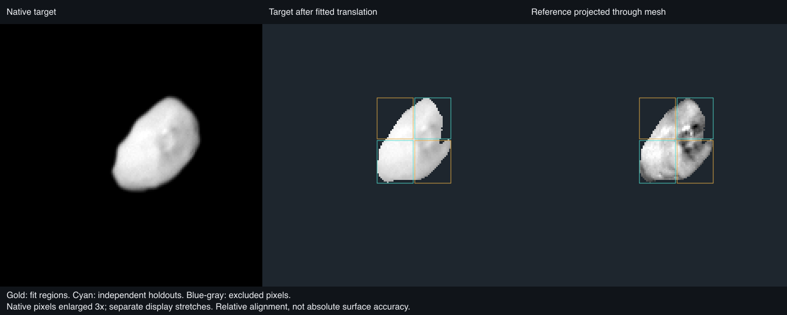
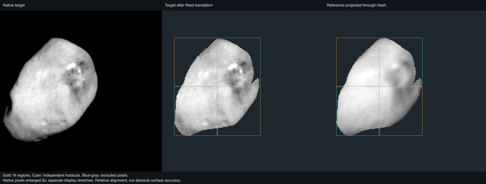

# Nix

Nix is shown on Simon Porter's released shape model with one New Horizons LORRI
photograph. **This is a draft experiment; photographic release is deferred.**
The exact released STL-to-PCK frame binding remains unverified, so the
experimental Monochrome view is not a qualified surface. The remaining issue is
measured registration, not archive access.

## Sources

- **Monochrome:** the native, calibrated New Horizons LORRI product [`LOR_0299174134_0X636_SCI`](https://pdssbn.astro.umd.edu/holdings/nh-p-lorri-3-pluto-v3.0/data/20150714_029917/lor_0299174134_0x636_sci.fit), acquired on 14 July 2015. It is panchromatic calibrated DN, displayed as a monochrome photograph; it is not a color or albedo map.
- **Shape:** Simon Porter’s [2021 released Nix model](https://doi.org/10.6084/m9.figshare.12779948.v1), CC BY 4.0: the unchanged 40,002-vertex, 80,000-triangle STL. The file declares no units. Its extent matches the paired publication’s 48.4 × 33.8 × 31.4 km model dimensions with an explicitly inferred 500 m per source unit.
- **Orientation:** the PDS New Horizons [`nh_pcnh_010.tpc`](https://naif.jpl.nasa.gov/pub/naif/pds/data/nh-j_p_ss-spice-6-v1.0/nhsp_1000/data/pck/nh_pcnh_010.tpc). Its active values are the V008-derived Nix pole, RA 349.1°, Dec −37.7°, and prime meridian 243.5722888° + 197.01579° per TDB day past J2000. The V009 alternatives in its comments need further checking and are not used.

Source selections and alternative products are recorded in the [investigation ledger](investigations.json).

## Processing

The photograph keeps its original illumination, with a global 1st–99.8th-percentile
stretch and no photometric normalization. The camera uses the PDS FITS
WCS/TAN-SIP model, the active PCK pose at target emission time and the source
range. The only fitted values were two detector translations, [+16.875, +0.5]
pixels; no shape vertex, pole, phase or range was fitted. Only contributions
within 1.5 source footprints are accepted, and incidence and emission are each
limited to 70°. Gray marks unobserved or rejected coverage; it is not dark
terrain, color, or albedo. The mesh is reduced to 476 PolyCSS triangles, the fewest within its 500 m error allowance with a
181.121 m 95th-percentile sampled radial error. See the
[source-bound recipe](source/preparation/photography.json).

## Evidence

- **Limb holdout:** 1.192 px RMS over 70 points, 0.761 px for the 59 lit points. The independent `LOR_0299174108_0X636_SCI` exposure, never used for fitting, has 2.007 px RMS across 141 points. See [registration evidence](evidence/photography/registration.json).
- **Interior transfer:** projecting the photograph through the mesh into `LOR_0299167039_0X630_SCI`, a view 24.121° away, gives withheld-region correlations of 0.877 and 0.901. These are relative image-alignment measurements, not absolute surface accuracy.

- **Reverse transfer:** in the other direction, the two held regions prefer shifts 1.414 and 5.099 pixels away at the finer 300 m/pixel scale. The forward result alone does not establish uniform surface control.

### Registration

<!-- registration-report:begin -->
Measured by the registration stage when the body was last prepared; the numbers are read from `prepared/surfaces.json`, not typed.

| Dataset | Frames | Scored | Limb RMS | Noise floor | Systematic | Reference | Decisive | Median offset | Relief | Refined | Seams | Verdict |
| --- | --- | --- | --- | --- | --- | --- | --- | --- | --- | --- | --- | --- |
| `monochrome` | 1 | 1 | 1.00° | — | — | none (one frame and no reference observation) | 0 of 0 | — | 0 of 1 | — | — | no verdict |

Limb columns: the position-angle residual between the projected limb and the photographed contour over the frames whose outline is elongated enough to define one, the floor set by exposures minutes apart, and what remains after removing that floor in quadrature. Reference columns: each frame turned about the pole against the named reference, the frames whose peak clears both mirrors (by the strong rule, or by standing four times above them), and their median offset from the stated camera, stated only over three or more decisive frames. Relief: the same sweep against the mesh's own shading with no map and no other frame, decisive frames and their median offset. Refined: the turn a named reference applied to every camera of the dataset, or why it declined; the other columns then measure the turned dataset. Seams: the largest brightness ratio left between overlapping frames after level matching, and the frame groups no accepted overlap joins, whose relative brightness is unmeasured. Verdict: registered when every measurement that reached one (the outline over three scored frames, the reference or the relief over three decisive frames whose offsets agree with each other to within three degrees) is within three degrees; a sweep whose decisive offsets disagree by more reaches no verdict, because its median is a location rather than a measurement. A conflict ships only when named in the known conflicts of `report-registration.test.mts`, or when the dataset ships on its paper’s comparison figure, which its observer-cameras record names.
<!-- registration-report:end -->

## Known problems

- The PCK and Porter's fit have strong source-frame evidence: the PCK cites the same 2021 dimensions and pole fit, and the independent silhouette agrees. Neither release explicitly declares that STL XYZ/longitude zero is the `IAU_NIX` frame. The checks do not recover an absolute prime meridian, and the reverse disagreement leaves uniform image-to-mesh control unresolved.
- The dataset has one LORRI view. It does not establish global coverage, a photometric correction, natural color, or scientific surface units.
- There is no color dataset: New Horizons' only MVIC color scan of Nix resolves it across 24 × 17 pixels at 1.99 km per pixel, too coarse to register or to show its red region (see the [investigation ledger](investigations.json)).
- The published model is an image-constrained shape fit, not a global measured elevation raster.

[Inputs](source/manifest.json) · [Preparation](source/preparation) · [Delivered files](inventory.json) · [Credits](NOTICE.md) · [Investigation ledger](investigations.json)
