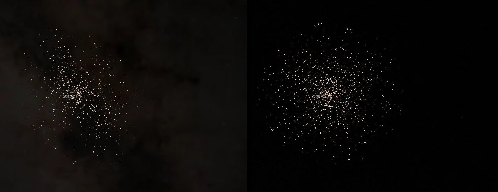

# Nuclear star cluster

The star cluster around [Sagittarius A*](../sgr-a-star/README.md), one dot per star, drawn while Sgr A* or one of its stars is selected. Each star is at its measured position on the sky. **Its depth is modelled, not measured.** The bank is written in parsecs around the black hole, so its stars and the S-stars share a frame.

## Sources

| Source | Measurement used |
| --- | --- |
| [GALACTICNUCLEUS, Nogueras-Lara et al. (2019)](https://cdsarc.cds.unistra.fr/viz-bin/cat/J/A+A/631/A20) | Central catalogue: J2000 position and H and Ks magnitudes of the 155,866 stars within 6 arcminutes of Sgr A* brighter than Ks 16. |
| [Gallego-Cano et al. (2020)](https://arxiv.org/abs/2001.08182) | The cluster's Sérsic fit: half-light radius 5.1 ± 1.0 pc, index 2.2 ± 0.7, axis ratio 0.71 ± 0.10, flattened along the Galactic plane. |
| [GRAVITY Collaboration (2022)](https://arxiv.org/abs/2112.07478) | Sgr A*'s distance, 8277 pc. |

## Processing

1. [`sample.mts`](../../../packages/bake/authoring/nuclear-star-cluster/sample.mts) keeps the stars brighter than Ks 14 and redder than H − Ks 1.3. Fainter, the survey loses stars in the crowded centre: the innermost half arcminute holds 7.9 times the stars per square arcminute of the 5 to 6 arcminute ring at Ks 13 to 14, but 4.0 times at Ks 14 to 15. Redder than 1.3 are the Galactic centre's own stars, behind its dust; 1,218 bluer stars in front are left out.
2. The stars toward the cluster also belong to the nuclear stellar disc and the bulge around it, and no measurement tells them apart star by star. The script takes their density from the ring 5 to 6 arcminutes out and keeps each star nearer in with the chance that it is the cluster's: 0.88 at the centre, 0.11 at two half-light radii, where the sample ends. Rings are ellipses flattened 0.71 along the Galactic plane. The draw is by position, so every run keeps the same 5,610 stars, in a shuffled order.
3. `packages/bake/cli/prepare-catalogue-points.mts` places each star along its sight line at a depth drawn from the Sérsic fit's density ([recipe](source/dots/points.json)), around Sgr A*'s world origin, to 0.0001 pc. Tone follows Ks as observed, through the dust; the color is the app's for a red giant. The bank is 53 KB.

The bank is whole within 100 pc of Sgr A*. Seen from outside its reach the app draws about one dot per 8 px.

## Evidence

The Sgr A* page zoomed out to a 10 light-year scale bar, before and after a quarter turn. Captured on 2026-10-01, when the bank belonged to the Milky Way package; the stars' sky positions are the same.

## Known problems

- Depth is drawn from the cluster's measured shape, not measured for any star.
- Dust clouds in front of the cluster hide its stars south-west of Sgr A*: 1 to 3 arcminutes out, the survey lists a third as many there as on the other sides. Because depth is drawn along each sight line, those gaps run through the cluster as empty lanes when it is seen from the side.
- Only the cluster is drawn. The nuclear stellar disc and the bulge it sits in are not, so it looks like an isolated ball; the sample ends at two half-light radii.
- Stars of the disc and bulge that the thinning keeps are drawn inside the cluster. The survey saturates on the brightest stars, so they are missing. The cluster holds millions of stars; these are the bright giants.

[Inputs](source/manifest.json) · [Delivered files](inventory.json)
