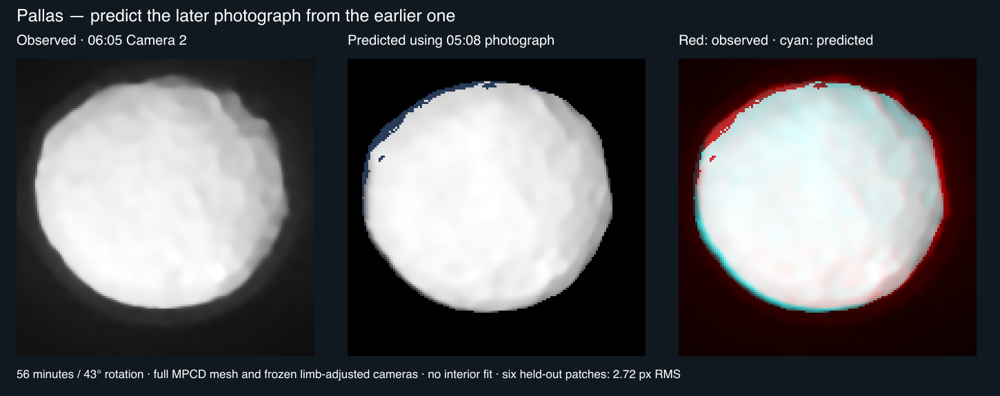
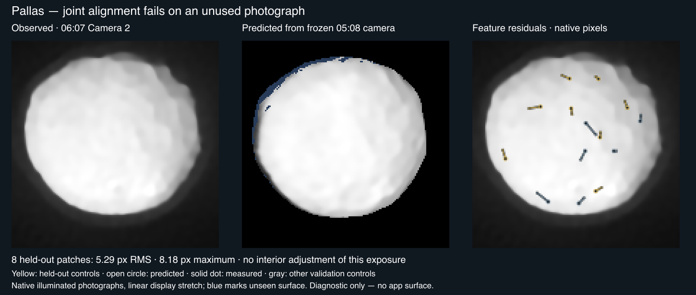

# Pallas

Shape-only views use the shared neutral gray (#808080 sRGB). This is a display convention, not a measurement of surface color or albedo; gaps within photographic and scientific datasets retain the missing-data grid.

## Sources

<a id="selected-data"></a>

| Input | Selected source |
| --- | --- |
| Shape | [Released reconstruction](https://observations.lam.fr/astero/3Dshape/2_Pallas_mpcd.obj) |
| Size and pole | [Vernazza et al. (2021), Tables 1 and A.1](https://doi.org/10.1051/0004-6361/202141781) |
| SPHERE photograph | [30 deconvolved VLT/SPHERE/ZIMPOL frames, camera 1, 4 nights from 2017-10-08 to 2017-11-03](https://observations.lam.fr/astero/Data/2Pallas/Deconv/) on the [ADAM reconstruction](https://observations.lam.fr/astero/3Dshape/2_Pallas_adam.obj) |
| Photograph cameras | [Release rotation record](https://observations.lam.fr/astero/3Dshape/2_Pallas_param.txt), read longitude-first, and JPL Horizons geometry from Paranal |
| Photograph registration | [Vernazza et al. (2021), Figure B.2](https://doi.org/10.1051/0004-6361/202141781) |

Pallas is a large, heavily cratered main-belt asteroid. Its reconstructed shape preserves broad impact features seen by VLT/SPHERE.

- [Vernazza et al. (2021), final VLT/SPHERE survey](https://doi.org/10.1051/0004-6361/202141781), Table 1 and Table A.1: volume-equivalent diameter 511 km, ecliptic J2000 pole (42°, -15°), sidereal period 7.81321 h. The original article is pinned and restorable.

- [Original MPCD mesh](https://observations.lam.fr/astero/3Dshape/2_Pallas_mpcd.obj): 22530 vertices, 45056 triangles, unmodified Cartesian coordinates in kilometers. Its measured volume-equivalent radius is 254.078241 km. The survey's diameter averages ADAM and MPCD; the original coordinates are not rescaled to that average. Maximum Cartesian extents are 562.208 × 528.846 × 429.081 km; these are not best-fit ellipsoid axes.

## Evidence

### SPHERE photograph

<!-- published-comparison:begin -->
Measured by `tools/objects/published-comparison.mts` against [Figure B.2](https://doi.org/10.1051/0004-6361/202141781), the survey's comparison of these frames with its models. The numbers are read from [`evidence/published-comparison.json`](evidence/published-comparison.json), not typed; [the paper's photographs with its model's outline and ours](evidence/published-comparison.webp) show them.

| Figure column | Overlap with the paper's model | With the paper's photograph | Same shape at both pixel sizes | Best turn | Image turn onto the model, the photograph | Spin axis, ours against the figure's |
| --- | --- | --- | --- | --- | --- | --- |
| 2017-10-08 04:56:05 | 0.972 | 0.972 | 0.991 | 0° | -1°, 1° | 72.7° against 71.3° |
| 2017-10-11 05:08:49 | 0.976 | 0.971 | 0.995 | 0° | -1°, 2° | 74.2° against 72.1° |
| 2017-10-11 06:05:07 | 0.974 | 0.976 | 0.982 | 10° | -6°, -4° | 74.2° against 71.8° |
| 2017-10-11 06:55:36 | 0.969 | 0.972 | 0.990 | 0° | -2°, -1° | 74.3° against 71.6° |
| 2017-10-28 08:32:24 | 0.963 | 0.961 | 0.986 | 0° | -2.5°, 2° | 82.9° against 81.4° |
| 2017-11-03 03:22:08 | 0.980 | 0.974 | 0.991 | 0° | 0°, 0.5° | 85.7° against 83.6° |

Overlaps are scale-free. Read each against the same-shape column, which is what the measure gives one outline drawn at both pixel sizes. The best turn is the rotational phase, in 10° steps, at which our outline best overlaps the paper's model. The image turn is how far our outline must turn in the picture, counter-clockwise and in half degrees, to best overlap the paper's model and its photograph. The outline residual in the 30 native frames after the centre fit is 1.826 px at our phase, the lowest of a ±30° sweep.
<!-- published-comparison:end -->

### Registration

<!-- registration-report:begin -->
Measured by the registration stage when the body was last prepared; the numbers are read from `prepared/surfaces.json`, not typed.

| Lens | Frames | Scored | Limb RMS | Noise floor | Systematic | Reference | Decisive | Median offset | Relief | Refined | Seams | Verdict |
| --- | --- | --- | --- | --- | --- | --- | --- | --- | --- | --- | --- | --- |
| `zimpol` | 30 | 0 | — | — | — | its other 30 frames | 0 of 30 | — | 27 of 30, 2.00° | — | ×1.03 | no verdict |

`zimpol` ships on its paper’s comparison, [Figure B.2](https://doi.org/10.1051/0004-6361/202141781), measured in [`evidence/published-comparison.json`](evidence/published-comparison.json); its verdict is reported, not a gate.

Limb columns: the position-angle residual between the projected limb and the photographed contour over the frames whose outline is elongated enough to define one, the floor set by exposures minutes apart, and what remains after removing that floor in quadrature. Reference columns: each frame turned about the pole against the named reference, the frames whose peak clears both mirrors (by the strong rule, or by standing four times above them), and their median offset from the stated camera, stated only over three or more decisive frames. Relief: the same sweep against the mesh's own shading with no map and no other frame, decisive frames and their median offset. Refined: the turn a named reference applied to every camera of the lens, or why it declined; the other columns then measure the turned lens. Seams: the largest brightness ratio left between overlapping frames after level matching, and the frame groups no accepted overlap joins, whose relative brightness is unmeasured. Verdict: registered when every measurement that reached one (the outline over three scored frames, the reference or the relief over three decisive frames whose offsets agree with each other to within three degrees) is within three degrees; a sweep whose decisive offsets disagree by more reaches no verdict, because its median is a location rather than a measurement. A conflict ships only when named in the known conflicts of `report-registration.test.mts`, or when the lens ships on its paper’s comparison figure, which its observer-cameras record names.
<!-- registration-report:end -->

### Shape

The [asteroid validation report](https://github.com/layoutit/cssEarth/blob/cc01831f595e0b73ab6699d6235cf7b466f76cfc/docs/asteroids-validation.md) records the earlier source, preparation and browser checks. Some raw captures cited there have local `output/` paths.

Source and output are each one closed component with Euler characteristic 2. Meshoptimizer estimates 4391.2 m error; the authored stopping threshold is 4500 m. This estimate is not a Hausdorff bound. Independent nearest-triangle sampling (8192 area-stratified samples each way) measured p95 2436.2 m and maximum 4617.6 m.

Full source face-centroid checks and 8192 sphere directions found no repeated radial intersection; this supports the radial-height lens, with the sampling limits stated. Reduction softens small features.

Photographic placement remains unqualified. The [initial native-frame trial](evidence/photographic-projection.json)
checked four SPHERE views and their source models; the [crater-control replay](evidence/projected-controls.json)
retains discrepancies against tentative identifications, not verified ground truth.
The [full-sequence investigation](evidence/sequence-orientation.json) inspected all
ten October 11 images and identified 05:08:49 Camera 2 as the closest match to
Vernazza et al. (2021), Figure B.2 (withheld image correlation 0.9986).
That identifies the published photograph; it does not establish 3D placement.
The earlier tentative crater picks and 1.44–2.41° raster pole-marker differences
remain unresolved. The image panels and full measurements remain in those records.

The [camera-transfer investigation](evidence/camera-transfer.json) tests native
photographs directly, including simultaneous exposures and a later view after
43° of rotation. The selected MPCD results are:

| Comparison | Withheld patches | RMS / maximum residual, native pixels |
| --- | ---: | ---: |
| Same image, identity check | 17 | 0.10 / 0.22 |
| Simultaneous Camera 1 and Camera 2, fitted center and roll | 10 | 1.17 / 2.06 |
| Four minutes apart, fitted center and roll | 12 | 1.47 / 3.16 |
| 56 minutes apart, limb-adjusted cameras with no interior fit | 6 | 2.72 / 3.23 |
| Same 56-minute pair, fitted center and roll | 6 | 4.37 / 7.52 |

The simultaneous pair shows that these residuals include disagreement between
detectors, processing and feature measurement, even without body rotation.
They are not absolute camera errors. Selecting reference patches that repeat
within one pixel in the simultaneous pair leaves only five matches in the later
frame, too few for six separate fit and six withheld controls. These trials do
not qualify a photographic surface. The one-pixel criterion inherited from the
spacecraft filter matcher is not an established SPHERE uncertainty; the telescope
resolution cannot simply replace it as a camera-error bound either.



Offline prediction from the 05:08:49 Camera 2 photograph into the 06:05:07 view,
using the full MPCD shape. Linear display stretches retain observed lighting;
blue marks surface unseen in the earlier image. The overlay compares appearance,
including illumination differences, and is not a reflectance or camera-error map.
No app surface was prepared. The record preserves input hashes, cameras, measured
patch positions and failures. Residuals were replayed against the retained camera
formulas; the exploratory feature-search drivers remain in ignored `output/`.

[Schmid et al. (2018)](https://doi.org/10.1051/0004-6361/201833620),
§2.2.1, Equation 2, documents an approximately 2° counterclockwise offset of
celestial north in preprocessed ZIMPOL images, dependent on camera and requested
field angle. Applying that hypothesis did not improve this transfer. Its exact
application to the released Pallas images remains unverified. The separate
DAMIT IAU rotation record and a quadratic illumination-removal trial likewise
failed to qualify the later-frame correspondence. No correction was adopted.

The final bounded attempt jointly fitted detector centers and rolls for the
05:04, 05:08 and 06:05 photographs against their lit outlines and interior
matches. The published mesh, spin, range and focal scale stayed fixed; reference
pixels were intersected with the mesh again at every fit step. Equally weighted
native-pixel residuals used the existing limb fitter's robust loss. Previously
examined withheld matches in the 06:05 image still differed by 2.61 pixels RMS,
with a 5.46-pixel maximum.

That solution was frozen before testing the unused 06:07:17 Camera 2 photograph.
The new image received only the existing limb adjustment, with no interior fit.
Its eight held-out matches differed by **5.29 pixels RMS, maximum 8.18 pixels**.
All fourteen accepted matches in that image were evaluation data; the six in the
matcher's usual fit partition were not fitted either. The
[retained joint-fit result](evidence/camera-transfer.json) includes the frozen
cameras, objective, input pins, matched pixels and numerical replay checks.



This attempt is closed without a photographic surface. The result rejects this
camera solution, not the possibility of mapping Pallas. Reopen it with new
registration evidence, such as producer-controlled image geometry or independently
verified surface correspondences and their measurement precision. Further fits
to these same uncertain controls would not provide that evidence.

## Known problems

Shape uses the shared neutral-gray material. It is not photographed color, reflectance, regolith or inferred composition. Elevation samples the original mesh radius minus a 255.5 km reference sphere, with a -60 to 40 km legend. This includes global shape, not height above a gravitational equipotential.

Source constraints are uneven and ground-based; a 4096 × 2048 display map does not add observational resolution. The existing scientific preparer samples 721 × 361 source directions and applies its recorded cartographic hillshade. Both views retain the shared Shadows control and flood lighting.

Rotation has an explicitly arbitrary display meridian, not an absolute rotational phase.

The SPHERE photograph is photographed illumination from the survey's deconvolved frames, with matched relative frame levels, averaged where frames overlap, each fading out toward its disc edge. It is not albedo or colour. The frames see Pallas from 63° to 70° south, so surface the survey did not see keeps the missing-imagery grid.

[Investigation ledger](investigations.json) · [Inputs](source/manifest.json) · [Object definition](object.json) · [Preparation](source/preparation/) · Provenance (`prepared/provenance.json`) · [Credits](NOTICE.md)

## Methods and source notes

<details>
<summary>Selected data</summary>

- [Original ADAM comparison](https://observations.lam.fr/astero/3Dshape/2_Pallas_adam.obj): radius 256.359287 km. Excluded as a second lens: it is an alternative reconstruction of the same shape. The selected MPCD refinement uses resolved SPHERE detail; see survey section 3 and Appendix B.

- [Released SPHERE images](https://observations.lam.fr/astero/Data/2Pallas/): individual, illuminated, resolved telescope images. They constrain the selected reconstruction. A photographic surface remains under investigation; the native-frame trial and remaining registration checks are recorded in the ledger.

- [Individual research](https://observations.lam.fr/astero/Papers/Marsset2020.pdf): complementary interpretation and model/image comparisons.

</details>

<a id="shape-elevation-and-lighting"></a>

<details>
<summary>Shape, elevation and lighting</summary>

The original connected surface is simplified with meshoptimizer 1.2.0, ErrorAbsolute and RegularizeLight, to 800 native PolyCSS u triangles. Each raster leaf is 128 × 128 px in a 2048 × 6400 atlas. Geometry and per-texel flood/directional lighting are prepared ahead of runtime.

No radial substitute, runtime triangulation, fabricated texture or additional renderer is used.

</details>

<a id="frame-and-ephemeris"></a>

<details>
<summary>Frame and ephemeris</summary>

The original Cartesian frame is retained with +Z north and east-positive longitude. The published ecliptic pole is converted to equatorial J2000 with obliquity 23.439291111°. The release's unlabeled parameter file is preserved as evidence and is not read as an IAU W model.

Original JPL Horizons elements and independent vectors are pinned at JD 2461286.5 (2026-09-03). Heliocentric ICRF conics serve the existing fixed-date context, not long-term perturbation ephemerides. The independent vectors at ±30 days have measured regression guards in the astronomy package.

TDB is approximated as TT within 2 ms.

</details>

<a id="reproduction"></a>

<details>
<summary>Reproduction</summary>

Source pins live in [source/manifest.json](source/manifest.json); source/preparation/acquisition.json restores the ignored OBJ. LAM's ordinary public-site cookie is explicitly recorded. Generated context.png is force-tracked as a pinned intermediate and regenerated/verified by the existing radial snapshot recipe.  Title provenance remains in its source directory.

</details>

<details>
<summary>Reproduce the native crater comparison</summary>

The [diagnostic recipe](evidence/photographic-controls.json) pins the exact FITS
image, ADAM and MPCD meshes, frozen cameras, published coordinates and tentative
native picks. It uses the shared preparation tool
[check-projected-controls.mts](../../../tools/objects/surface-features/check-projected-controls.mts).
The tool verifies input bytes before decoding, checks source-mesh visibility and
reports each discrepancy without fitting or certifying the camera. It replays the
retained candidate cameras; it does not yet reproduce their derivation as a full
photographic preparation recipe.

Place the three files named in the recipe in `output/pallas-photographic-projection/`.
Their original download URLs, byte counts and SHA-256 hashes are in the recipe;
the LAM downloads require the public-site header
`Cookie: CesAM_LAM_opens_the_door=1`. The existing investigation cache already
contains all three, so no new downloads are needed there.

```sh
node tools/objects/surface-features/check-projected-controls.mts \
  src/objects/pallas/evidence/photographic-controls.json \
  output/pallas-photographic-projection \
  output/pallas-photographic-projection/control-check
```

The command writes `projected-controls.json` and `projected-controls.png`.
Five focused tests cover coordinate direction, visibility, uncorrected residuals,
invalid controls and changed input pins. The preparation TypeScript project also
passes. These checks prove the inspection tool, not Pallas surface registration.

</details>
