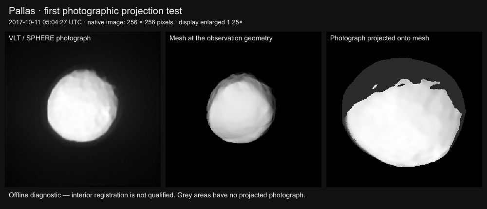
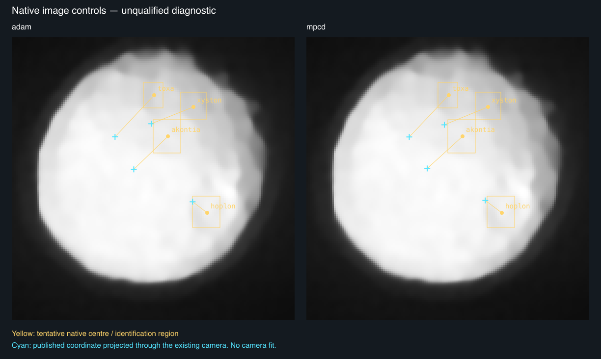

# Pallas

## Sources

<a id="selected-data"></a>

| Input | Selected source |
| --- | --- |
| Shape | [Released reconstruction](https://observations.lam.fr/astero/3Dshape/2_Pallas_mpcd.obj) |
| Size and pole | [Vernazza et al. (2021), Tables 1 and A.1](https://doi.org/10.1051/0004-6361/202141781) |

Pallas is a large, heavily cratered main-belt asteroid. Its reconstructed shape preserves broad impact features seen by VLT/SPHERE.

- [Vernazza et al. (2021), final VLT/SPHERE survey](https://doi.org/10.1051/0004-6361/202141781), Table 1 and Table A.1: volume-equivalent diameter 511 km, ecliptic J2000 pole (42°, -15°), sidereal period 7.81321 h. The original article is pinned and restorable.

- [Original MPCD mesh](https://observations.lam.fr/astero/3Dshape/2_Pallas_mpcd.obj): 22530 vertices, 45056 triangles, unmodified Cartesian coordinates in kilometers. Its measured volume-equivalent radius is 254.078241 km. The survey's diameter averages ADAM and MPCD; the original coordinates are not rescaled to that average. Maximum Cartesian extents are 562.208 × 528.846 × 429.081 km; these are not best-fit ellipsoid axes.

## Evidence

The [asteroid validation report](https://github.com/layoutit/cssEarth/blob/cc01831f595e0b73ab6699d6235cf7b466f76cfc/docs/asteroids-validation.md) records the earlier source, preparation and browser checks. Some raw captures cited there have local `output/` paths.

Source and output are each one closed component with Euler characteristic 2. Meshoptimizer estimates 4391.2 m error; the authored stopping threshold is 4500 m. This estimate is not a Hausdorff bound. Independent nearest-triangle sampling (8192 area-stratified samples each way) measured p95 2436.2 m and maximum 4617.6 m.

Full source face-centroid checks and 8192 sphere directions found no repeated radial intersection; this supports the radial-height lens, with the sampling limits stated. Reduction softens small features.

The [September 2026 photographic projection trial](evidence/photographic-projection.json) examined four native SPHERE frames and the LAM/DAMIT model correspondence. Outline fits on three separated views reached 0.63–1.33 pixels withheld RMS, but cross-observation interior registration did not qualify. The record keeps the cameras, source hashes, matcher trials and their limitations; this was an offline investigation, not a prepared or browser-tested photographic view. See the [ledger](investigations.json) for the remaining source decisions.



Diagnostic from the LAM SPHERE release, Marsset et al. (2020); observation 2017-10-11 05:04:27 UTC. Linear display stretch retains observed illumination. Grey marks omitted photographic samples. The right panel uses a different viewing direction and scale; it is not an app capture or a pixel-difference comparison.

The [native crater check](evidence/projected-controls.json) now replays four
published crater coordinates against frozen cameras for both source models.
Three tentative native identifications differ by 23–29 pixels from their projected
positions; Hoplon differs by 9–11 pixels. The yellow regions below are visual
identification ranges, not confidence intervals. This does **not** establish an
absolute camera error: the feature identities and the published coordinate-to-model
correspondence still need to be resolved. Switching between ADAM and MPCD does
not remove the discrepancy. No camera correction was adopted from these picks.
An exploratory quadratic illumination correction, following the method class in
[Fétick et al. (2019), section 4.4](https://arxiv.org/pdf/1902.01287), did not
make the crater identifications unambiguous; it is not reflectance calibration.



October 11 SPHERE image, LAM release / Marsset et al. (2020). Yellow marks tentative
native-image identifications; cyan marks projected published coordinates. Both
panels use the same native pixels, linear stretch and nearest-neighbour enlargement.
They are source-space diagnostics, not app captures or qualified surface imagery.

## Known problems

Shape uses the shared no-imagery grid. It is not photographed color, reflectance, regolith or inferred composition. Elevation samples the original mesh radius minus a 255.5 km reference sphere, with a -60 to 40 km legend. This includes global shape, not height above a gravitational equipotential.

Source constraints are uneven and ground-based; a 4096 × 2048 display map does not add observational resolution. The existing scientific preparer samples 721 × 361 source directions and applies its recorded cartographic hillshade. Both views retain the shared Shadows control and flood lighting.

Rotation has an explicitly arbitrary display meridian, not an absolute rotational phase.

[Investigation ledger](investigations.json) · [Inputs](source/manifest.json) · [Object definition](object.json) · [Preparation](source/preparation/) · [Provenance](prepared/provenance.json) · [Credits](NOTICE.md)

## Methods and source notes

<details>
<summary>Selected data</summary>

- [Original ADAM comparison](https://observations.lam.fr/astero/3Dshape/2_Pallas_adam.obj): radius 256.359287 km. Excluded as a second lens: it is an alternative reconstruction of the same shape. The selected MPCD refinement uses resolved SPHERE detail; see survey section 3 and Appendix B.

- [Released SPHERE images](https://observations.lam.fr/astero/Data/2Pallas/): individual, illuminated, resolved telescope images. They constrain the selected reconstruction. A photographic surface remains under investigation; the native-frame trial and remaining registration checks are recorded in the ledger.

- [Individual research](https://observations.lam.fr/astero/Papers/Marsset2020.pdf): complementary interpretation and model/image comparisons.

</details>

<a id="shape-elevation-and-lighting"></a>

<details>
<summary>Shape, elevation and lighting</summary>

The original connected surface is simplified with meshoptimizer 1.2.0, ErrorAbsolute and RegularizeLight, to 800 native PolyCSS u triangles. Each raster leaf is 128 × 128 px in a 2048 × 6400 atlas. Geometry and per-texel flood/directional lighting are prepared ahead of runtime.

No radial substitute, runtime triangulation, fabricated texture or additional renderer is used.

</details>

<a id="frame-and-ephemeris"></a>

<details>
<summary>Frame and ephemeris</summary>

The original Cartesian frame is retained with +Z north and east-positive longitude. The published ecliptic pole is converted to equatorial J2000 with obliquity 23.439291111°. The release's unlabeled parameter file is preserved as evidence and is not read as an IAU W model.

Original JPL Horizons elements and independent vectors are pinned at JD 2461286.5 (2026-09-03). Heliocentric ICRF conics serve the existing fixed-date context, not long-term perturbation ephemerides. The independent vectors at ±30 days have measured regression guards in the astronomy package.

TDB is approximated as TT within 2 ms.

</details>

<a id="reproduction"></a>

<details>
<summary>Reproduction</summary>

Source pins live in [source/manifest.json](source/manifest.json); source/preparation/acquisition.json restores the ignored OBJ, original article, ESO sky panorama and Inter font. LAM's ordinary public-site cookie is explicitly recorded. Generated context.png is force-tracked as a pinned intermediate and regenerated/verified by the existing radial snapshot recipe.  Shared sky and title provenance remain in their source directories.

</details>

<details>
<summary>Reproduce the native crater comparison</summary>

The [diagnostic recipe](evidence/photographic-controls.json) pins the exact FITS
image, ADAM and MPCD meshes, frozen cameras, published coordinates and tentative
native picks. It uses the shared preparation tool
[check-projected-controls.mts](../../../tools/objects/surface-features/check-projected-controls.mts).
The tool verifies input bytes before decoding, checks source-mesh visibility and
reports each discrepancy without fitting or certifying the camera. It replays the
retained candidate cameras; it does not yet reproduce their derivation as a full
photographic preparation recipe.

Place the three files named in the recipe in `output/pallas-photographic-projection/`.
Their original download URLs, byte counts and SHA-256 hashes are in the recipe;
the LAM downloads require the public-site header
`Cookie: CesAM_LAM_opens_the_door=1`. The existing investigation cache already
contains all three, so no new downloads are needed there.

```sh
node tools/objects/surface-features/check-projected-controls.mts \
  src/objects/pallas/evidence/photographic-controls.json \
  output/pallas-photographic-projection \
  output/pallas-photographic-projection/control-check
```

The command writes `projected-controls.json` and `projected-controls.png`.
Five focused tests cover coordinate direction, visibility, uncorrected residuals,
invalid controls and changed input pins. The preparation TypeScript project also
passes. These checks prove the inspection tool, not Pallas surface registration.

</details>
