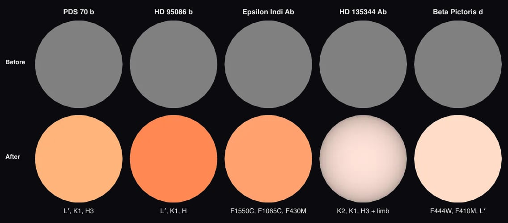

# PDS 70 b

The [navigation marker](source/preparation/navigation.json) adds a prepared curvature cue to the existing neutral gray placeholder. It remains a schematic identifier without resolved surface imagery; the shading is a display convention, not measured limb darkening or surface detail.

PDS 70 b is a gas giant still forming inside the gap of [PDS 70](../pds-70/README.md)'s disc. Found in 2018 in VLT/SPHERE images (Keppler et al. 2018, [arXiv:1806.11568](https://arxiv.org/abs/1806.11568)).

## Sources

**Orbit.** Trevascus et al. (2025, A&A 698, A19; [arXiv:2504.11210](https://arxiv.org/abs/2504.11210)), Table 3, the "Stable (incl. N-body)" column: the posterior medians of an orbitize! fit to all published astrometry of b and c with their new VLTI/GRAVITY epochs, keeping only orbits that do not cross and stay stable. a 20.7 au, e 0.16, i 130.6° (clockwise on the sky), ω 190° (the planet's; stored as the star's), Ω 176° east of north, periastron τ 0.355 of a period after MJD 58849; the period, 96.5 years, follows from a³ = (M* + M) P² with the column's own stellar mass 0.952 solar masses. Of the paper's three columns this one fits their eight GRAVITY positions best (4.2 mas RMS, against 4.7 for the other two; [ledger](../pds-70/investigations.json)). Every element is in [`pds-70-b.json`](../../../packages/astronomy/data/bodies/pds-70-b.json).

**Checked against GRAVITY and the disc.** [hostedOrbits.test.ts](../../../packages/astronomy/src/hostedOrbits.test.ts) puts the planet 11.6 mas from its one GRAVITY position of 24 February 2022 (Trevascus et al. 2025, Table 2). Astrometry alone cannot say which half of an orbit is nearer us; as published, the near half lies west, the side of the disc Keppler et al. (2018) find nearer, and the planet moves clockwise, as the disc turns.

**Radius, temperature and mass.** 1.96 +0.20/−0.17 Jupiter radii and 1,392 K from the atmosphere model with the most support in Wang et al. (2021, AJ 161, 148; [arXiv:2101.04187](https://arxiv.org/abs/2101.04187)), Table 4: BT-SETTL with ISM extinction and a second blackbody (Bayes factor 147 against a plain blackbody). It is a model radius, and the models disagree: the paper's other fits give 1.3 to 3.6 Jupiter radii. The mass is dynamical, 1.4 +2.1/−1.0 Jupiter masses, from the same Trevascus et al. column.

**Its own light.** The planet is drawn self-luminous, as the other imaged planets are: its glow is its own heat.

**Infrared color dataset.** The default dataset paints the sphere one false color from its measured flux in three infrared bands: red NACO L′ 3.77 µm (329.3 ± 73 µJy), green SPHERE K1 2.102 µm (148.5 ± 5.5 µJy), blue SPHERE H3 1.666 µm (63.72 ± 11 µJy) (Stolker et al. (2020), A&A 644, A13; zero points from the SVO Filter Profile Service; [record](source/photometry/band-color.json)). Display range: this planet alone, from zero to its brightest band (NACO L′), so the color shows its band ratios; brightness is not compared across planets at different distances. Not a natural color; nobody has resolved its disc.

**Limb.** The disc is dimmed toward the limb by the quadratic law fitted to the SPHERE K1 intensity PICASO 4.1 (Batalha et al. 2019, ApJ 878, 70) computes from Exo-REM cloudy (Charnay et al. 2018, ApJ 854, 172; 1 times solar metallicity, C/O 0.60) model atmospheres at 1,234 K and log g 3.89, read between the models YGP_1200K_logg3.5, YGP_1200K_logg4.0, YGP_1250K_logg3.5, YGP_1250K_logg4.0 (u1 0.300, u2 0.245; the law fits each model's eight angles within 0.49% of the centre): a cloudy model, the one Wang et al. (2021), AJ 161, 148 fit to this planet, because no table reaches a planet this cold and nobody has resolved its disc ([nodes](source/photometry/picaso-exo-rem-k1-quadratic.tsv)). The temperature and gravity are that fit's (Table 4, Exo-REM with interstellar extinction: Teff 1234 +95/-78 K, radius 2.88 +0.44/-0.35, log g 3.89 +0.42/-0.35, [M/H] 0.01 +0.44/-0.37, C/O 0.61 +0.12/-0.21, A_V 8.3 +1.5/-2.2, Bayes factor 46; the plain Exo-REM fit (1051 K) has the lowest Bayes factor of the table; [record](source/photometry/atmosphere-fit.json)), not the 1,392 K of its measurements record. The fit dims the model by an extinction that is the same over the whole disc, so the law is the model atmosphere's. It is not the fit with the highest evidence in that table (DRIFT-PHOENIX, Bayes factor 96): it is the adequate fit whose models are public with their clouds.

**Rotation.** None measured. The display axis is the orbit normal ([rotation.json](source/preparation/rotation.json)).

## Evidence

Run of 2026-09-23:

- [`hostedOrbits.test.ts`](../../../packages/astronomy/src/hostedOrbits.test.ts) checks the GRAVITY positions, the near side and the direction of motion (above); the astronomy package's 857 tests pass.

Run of 2026-10-04, when the color was added. The orbit test above still applies: the orbit record did not change.

- The app's arrival pictures of five imaged planets that were gray spheres, before and after their infrared color from printed photometry:

- Each magnitude or flux is a printed table value, read in the paper and recorded with its table in [the color record](source/photometry/band-color.json); PDS 70 b's L′ flux from its magnitude and the SVO zero point, 329 µJy, agrees within 5% with the 7.21e-17 W m⁻² µm⁻¹ the paper prints.

## Known problems

- The radius and temperature are model values, and the models disagree (above).
- The orbit is the median of a posterior, not one fitted orbit; the dynamical mass is wide.
- No spin is measured; the axis shown is the orbit normal.
- **Model limb.** The limb darkening is computed from the cloudy model a paper fitted to the planet, in the middle band of its color, not a measurement of this planet; another model grid would give another law. Among the 4 models it is read between, the disc near its edge (the lowest of the eight angles) is 56% to 60% as bright as the centre. PICASO finds 102% to 105% of the band flux the release states for those models.

[Investigation ledger](investigations.json) · [Inputs](source/manifest.json) · [Preparation](source/preparation) · [Delivered files](inventory.json) · [Credits](NOTICE.md)
