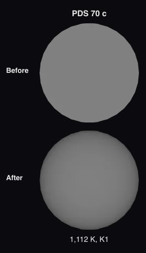

# PDS 70 c

The [navigation marker](source/preparation/navigation.json) adds a prepared curvature cue to the existing neutral gray placeholder. It remains a schematic identifier without resolved surface imagery; the shading is a display convention, not measured limb darkening or surface detail.

PDS 70 c is a gas giant still forming inside the gap of [PDS 70](../pds-70/README.md)'s disc. ALMA sees a compact source of dust co-located with it, a disc of its own less than about 1.2 au in radius (Benisty et al. 2021, [arXiv:2108.07123](https://arxiv.org/abs/2108.07123)); the pipeline image drawn in the [dust ring](../pds-70-disc/README.md) is too noisy to show it.

## Sources

**Orbit.** Trevascus et al. (2025, A&A 698, A19; [arXiv:2504.11210](https://arxiv.org/abs/2504.11210)), Table 3, the "Stable (incl. N-body)" column: the posterior medians of an orbitize! fit to all published astrometry of b and c with their new VLTI/GRAVITY epochs, keeping only orbits that do not cross and stay stable. a 33.9 au, e 0.042, i 129.8° (clockwise on the sky), ω 77° (the planet's; stored as the star's), Ω 158.0° east of north, periastron τ 0.521 of a period after MJD 58849; the period, 201.6 years, follows from a³ = (M* + M) P² with the column's own stellar mass 0.952 solar masses. Of the paper's three columns this one fits their eight GRAVITY positions best (4.2 mas RMS, against 4.7 for the other two; [ledger](../pds-70/investigations.json)). Every element is in [`pds-70-c.json`](../../../packages/astronomy/data/bodies/pds-70-c.json).

**Checked against GRAVITY and the disc.** [hostedOrbits.test.ts](../../../packages/astronomy/src/hostedOrbits.test.ts) puts the planet within 1.2 mas of all seven GRAVITY positions from 2021 and 2022 (Trevascus et al. 2025, Table 2). Astrometry alone cannot say which half of an orbit is nearer us; as published, the near half lies west, the side of the disc Keppler et al. (2018) find nearer, and the planet moves clockwise, as the disc turns.

**Radius, temperature and mass.** 1.98 +0.39/−0.31 Jupiter radii and 1,054 K from the atmosphere model with the most support in Wang et al. (2021, AJ 161, 148; [arXiv:2101.04187](https://arxiv.org/abs/2101.04187)), Table 5: DRIFT-PHOENIX with no extinction (Bayes factor 6.2 × 10⁷ against a plain blackbody). It is a model radius, and the models disagree: the paper's other fits give 0.6 to 2.4 Jupiter radii. The mass is dynamical, 6.4 +4.3/−3.7 Jupiter masses, from the same Trevascus et al. column.

**Its own light.** The planet is drawn self-luminous, as the other imaged planets are: its glow is its own heat.

**Shape dataset.** A sphere of the model radius in the shared neutral gray: the planet is a point in every image. A false color needs three firmly detected bands; Stolker et al. ([2020](https://arxiv.org/abs/2009.04483)) call their Brα detection of it tentative, and the papers checked print no three firm ones, so it stays gray.

**Limb.** The disc is dimmed toward the limb by the quadratic law fitted to the SPHERE K1 intensity PICASO 4.1 (Batalha et al. 2019, ApJ 878, 70) computes from Exo-REM cloudy (Charnay et al. 2018, ApJ 854, 172; 1 times solar metallicity, C/O 0.50) model atmospheres at 1,112 K and log g 3.87, read between the models YGP_1100K_logg3.5, YGP_1100K_logg4.0, YGP_1150K_logg3.5, YGP_1150K_logg4.0 (u1 0.407, u2 0.370; the law fits each model's eight angles within 0.48% of the centre): a cloudy model, the one Wang et al. (2021), AJ 161, 148 fit to this planet, because no table reaches a planet this cold and nobody has resolved its disc ([nodes](source/photometry/picaso-exo-rem-k1-quadratic.tsv)). The temperature and gravity are that fit's (Table 4, PDS 70 c, Exo-REM with interstellar extinction: Teff 1112 +133/-98 K, radius 2.42 +0.66/-0.54, log g 3.87 +0.48/-0.30, [M/H] 0.01 +0.44/-0.42, C/O 0.50 +0.20/-0.19, A_V 18.6 +1.3/-3.2, Bayes factor 2.2e6; the plain Exo-REM fit (1024 K) has the lowest Bayes factor of the table; [record](source/photometry/atmosphere-fit.json)), not the 1,054 K of its measurements record. The planet has no measured color; the law is read in SPHERE K1, the K band it is seen in and the band of PDS 70 b's law. The fit dims the model by an extinction that is the same over the whole disc, so the law is the model atmosphere's. It is not the fit with the highest evidence in that table (plain DRIFT-PHOENIX, 1054 K, Bayes factor 6.2e7): it is the best fit of the models that are public with their clouds.

**Rotation.** None measured. The display axis is the orbit normal ([rotation.json](source/preparation/rotation.json)).

## Evidence

Run of 2026-09-23 (this version):

- [`hostedOrbits.test.ts`](../../../packages/astronomy/src/hostedOrbits.test.ts) checks the GRAVITY positions, the near side and the direction of motion (above); the astronomy package's 857 tests pass.

Run of 2026-10-04, when the limb law was added. The test above still applies: the orbit did not change.

- The app's arrival picture of the planet, a flat gray disc before and darkened toward the limb after, by the law computed from its fitted Exo-REM model:

- [`imaged-limb.test.mts`](../../../packages/telescope-cli/src/new-object/imaged/imaged-limb.test.mts) checks that the law's node file records, for each model, how much of the band flux of the release's own spectrum PICASO finds (97% to 103% here), and that a planet with no color keeps its shape paragraph and credit when the law is added.

## Known problems

- The radius and temperature are model values, and the models disagree (above).
- The orbit is the median of a posterior, not one fitted orbit; the dynamical mass is wide.
- No spin is measured; the axis shown is the orbit normal.
- **Model limb.** The limb darkening is computed from the cloudy model a paper fitted to the planet, in the band it is seen in, not a measurement of this planet; another model grid would give another law. Among the 4 models it is read between, the disc near its edge (the lowest of the eight angles) is 39% to 55% as bright as the centre. PICASO finds 97% to 103% of the band flux the release states for those models.

[Investigation ledger](investigations.json) · [Inputs](source/manifest.json) · [Preparation](source/preparation) · [Delivered files](inventory.json) · [Credits](NOTICE.md)
