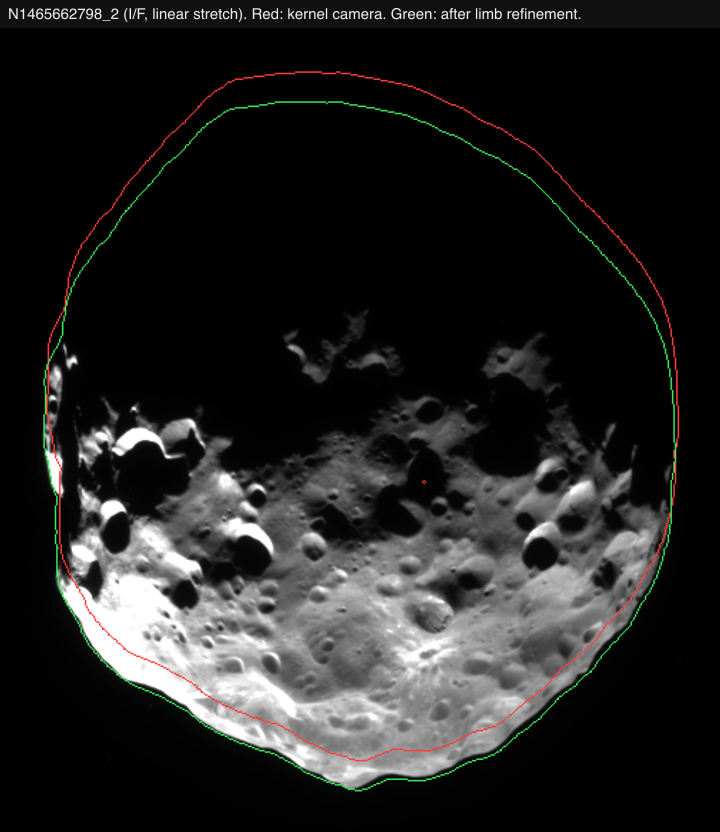
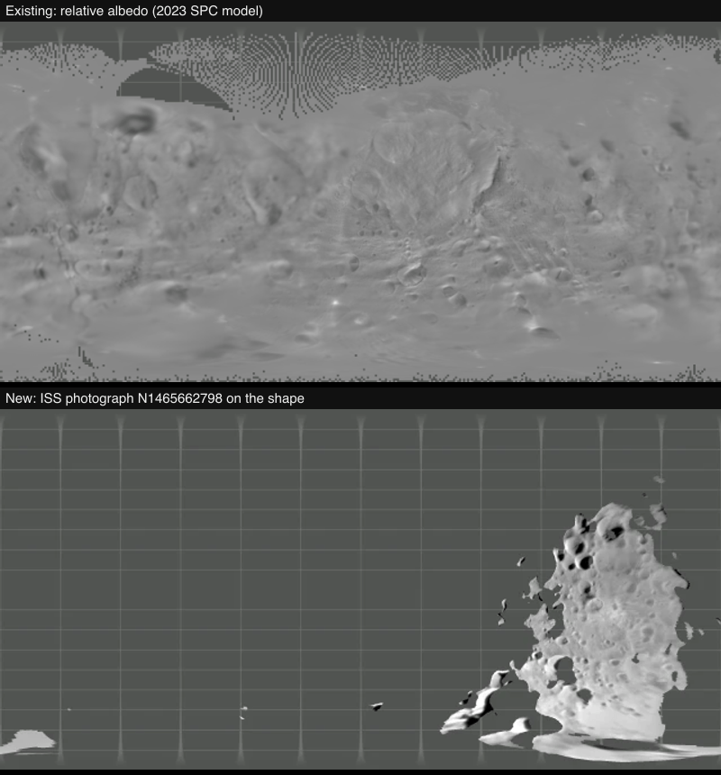

# Phoebe

## Sources

| Views | Source and quantity |
| --- | --- |
| Relative albedo and Radial height | [Weirich et al. 2023](https://doi.org/10.26033/3k3c-5713), from Cassini's 2004 encounter. The default albedo is modeled relative brightness; Radial height is Q512 radius minus a 106.5 km sphere. |
| Maplet resolution and Image count | The same SPC release: best contributing maplet spacing per 1° cell and all 0–87 image counts, including 3,278 zero-image cells. These are coverage diagnostics, not error estimates or confidence probabilities. |
| Infrared and Ice absorption | [Nantes Cassini VIMS archive](https://vims.univ-nantes.fr/), 11 June 2004, observation IR 1465671822_1. False-color infrared channels and continuum-relative near-2.02 µm absorption use 41 accepted native pixels. |
| Named features | [IAU/USGS Gazetteer of Planetary Nomenclature](https://planetarynames.wr.usgs.gov/Page/PHOEBE/target) Phoebe centre-point export, snapshot 2026-09-11, public domain. IAU-adopted names with centre, diameter, extent and name origin; labels appear at the closest zoom only, and a selected feature stays labelled. |

Source selections, recorded trials and open questions are in the [investigation ledger](investigations.json).

## Evidence

The [2023 geometry check](source/validation/2023-geometry-qualification.json) separates solver estimated error from independent barycentric samples; scientific uncertainty remains spatially variable.

The [B9 qualification report](https://github.com/layoutit/cssEarth/blob/8666462797772dc50bbebecd8618014f5e7bd16c/docs/moons/b9-cassini-ice-surfaces/QUALIFICATION.md) records exact source-map replay and selected package and interaction checks.

The [Phoebe visual review](https://github.com/layoutit/cssEarth/blob/cc01831f595e0b73ab6699d6235cf7b466f76cfc/docs/moons/b9-cassini-ice-surfaces/VISUAL-REVIEW-PHOEBE.md#final-main-integration-review) covers six serial captures of the normal, infrared and ice views at DPR 1 and 2, reviewed on 2026-09-10. [Reports and images](https://github.com/layoutit/cssEarth/blob/cc01831f595e0b73ab6699d6235cf7b466f76cfc/docs/moons/b9-cassini-ice-surfaces/evidence/README.md) identify capture base `80e19c51349f713c9a9a64b8ef1cbb78917f0fc7` plus the then-modified source, prepared and served-file pins. The same qualification report records failed broader suites and an incomplete full build.

## Known problems

Named features: the IAU/USGS Gazetteer of Planetary Nomenclature centre-point shapefile for Phoebe (retrieved 2026-09-11, public domain per its FGDC metadata) is pinned under `source/features/`. Preparation verifies the archive, reads the attribute table and datum, drops the albedo-feature type code, folds repeated rows, and converts each positive-east centre into the body-fixed frame the radial terrain sampler uses for this mesh (longitude 0 toward the mesh +y axis, 90° E toward +x, north +z), then casts that direction through the prepared hit mesh so every anchor and outline point sits on the shape model rather than on a reference sphere. Craters and faculae trace a rim circle, other types their published extent box. Outlines are not published nomenclature boundaries. The frame was confirmed on Mimas and Phobos, where Herschel and Stickney fall at local minima of the shape radius.

Feature notes: 1 of the labelled names carry a caption note, the lead summary of their English Wikipedia article (CC BY-SA 4.0, retrieved 2026-09-12), joined through Wikidata's Gazetteer id property and pinned with the article link and revision in `source/features/notes.json`; the caption credits Wikipedia beside the IAU naming year.

- **SPC albedo and height:** Finite Q512 values include unsupported interpolation. Display requires at least five images and valid finest-maplet spacing no worse than 1500 m/vertex. This conservative policy is not a published truth mask; image count does not establish independent viewing angles. Relative albedo is not natural color, geometric albedo or composition.
- **VIMS coverage and placement:** Both views cover about 1.84% of reference-sphere solid angle, not physical mesh area. Registration is coarse, with several-kilometer placement uncertainty; the fitted origin offset is not an author-supplied vector. IR 1465670650_1 is withheld for systematic independent holdout bias.
- **VIMS interpretation:** Neither view measures ice abundance. No photometric correction or cross-observation level matching is applied. Illumination, viewing angle, grain size, noise and archive filtering affect the signal.
- Native VIMS gaps remain missing. Bilinear/WebP packing can soften infrared mask edges, and the fixed 3500-face terrain shows coarse lighting facets. More display texels do not add measurements.
- The retained rotation phase has no new qualification in these records. The separate SBIB regional RGB candidate still has no qualified registration to the revised shape and center.

[Inputs](source/manifest.json) · Provenance (`prepared/provenance.json`) · [Delivered files](inventory.json) · [Credits](NOTICE.md)

## Methods and source notes

Detailed source survey, assumptions and preparation

## Paired 2023 products

The four SPC views use PDS bundle `urn:nasa:pds:satellite-phoebe.cassini.shape-models-maps::1.0`. Original OBJ, numeric ISIS cubes, detached labels, image/kernel inventories and product/assessment documentation are pinned beside the body. The 2023 release date is not a new spacecraft encounter. Relative albedo is normalized near mean one and is not a directly photographed texture. Radial height converts the paired Q512 radius from meters to km before subtracting the reference sphere.

The Radial height −15 to +15 km scale covers the retained source values. This is not a geoid, independent altimetry, or an assertion that the 1.195 km Q128 displayed geometry resolves the ~301 m raster. Fixed cartographic relief is separate from the directional Shadows control.

Maplet resolution array values are 125, 250, 300, 500, 750, 1000 and 1500 m/vertex, with 6,714 missing cells whose literal value is 99999. The product prose says 9999; all 64,800 source cells were checked, and none contain 9999. The recipe withholds the actual 99999 sentinel.

## Grid, frame and geometry

The native Q512 radius/albedo cubes are 2222 × 1111 Real LSB ISIS3 pixels at 301.26023555494 m; quality maps are 360 × 180 at 1858.775653374 m. The source specifies SimpleCylindrical, planetocentric latitude, PositiveEast, center longitude 180°, and a 106500 m sphere. Both longitude limit keywords are absent. A narrow explicit loader option verifies the native global pixel footprint from the exact origin/resolution/dimensions. It preserves the albedo/radius edge padding to 360.1296596434412° and −90.06482982171792° rather than resizing or inventing label fields. Numeric sampling and support masks use nearest source pixels. Outside the geographic sphere and valid support mask is withheld. Display raster size does not add source resolution.

The paired official OBJ has 99,846 vertices and 196,608 triangles in km. Its +X axis is 0° longitude and +Z the positive pole. The release documents the same source images and SPICE kernels as the older model, minor processing changes, and a 1.03 km shift to the center of figure. The exact published XYZ coordinates are retained, without an inferred compensating translation. The source-preserving display uses 3500 faces with a closed, consistently wound single-component topology (Euler 2). Source GSD and these rendering approximation checks are not absolute mapping accuracy.

The retained source-model orientation is RA 356.90°, Dec 77.88°, W = 178.58° + 931.639° per day from J2000. The 2023 release does not publish a replacement pole solution; its image/kernel identity and paired body coordinates are explicit. Physical radius and orbit continue to use the JPL-backed astronomy package.

## Retired mounted view and unresolved alternatives

The original Cassini/DLR monochrome PDS mosaic and older Gaskell Q128 input remain acquisition-pinned historical references. The earlier Monochrome lens is deliberately replaced by the paired 2023 Relative albedo default: the old image map has not been registered to the changed center and shape, and blindly draping it would mix source frames. This is an explicit view change, not a claim that modeled albedo is a new photograph.

The SBIB regional RGB candidate uses a different reference ellipsoid/shape convention; its calibrated RED channel confirms resolved imagery exists, but that product has no qualified RGB-to-shape registration. Published VIMS absorption figures also remain distinct from a reusable, registered numerical release. B9 derives the regional maps below from one qualified original cube; it does not qualify these alternative products as global color or composition.

## Reproduction and qualification

`source/manifest.json` and `source/preparation/acquisition.json` retain original URLs, lengths and SHA256s. Source-owned numeric recipes produce surfaces, atlases, minimaps and a regenerated radial navigation context ahead of runtime. Native data fixtures check all four cube arrays, the literal missing sentinel and low/zero-count geographic samples. Separate NumPy ray intersections test the six cardinal directions of the exact official OBJ.

Methods: Cassini VIMS calibration, masking and registration

## Cassini ISS photograph

**ISS photograph** casts one Cassini narrow-angle clear-filter photograph, `N1465662798_2`, taken on 11 June 2004 at 16:09 UTC from 77,935 km during the approach, onto the 2023 SPC shape. The frame is CISSCAL-calibrated I/F from the PDS Ring-Moon Systems Node. Its camera is derived from Cassini SPICE kernels in the shared bank: reconstructed attitude `04161_04164ra.bc` and trajectory `041014R_SCPSE_01066_04199.bsp`, which carries both Cassini and Phoebe, with `pck00011` for Phoebe's orientation. That orientation (Dec 77.80°) differs by 0.08° from the source model's recorded 77.88°, about 150 m at Phoebe's radius and below one 466 m pixel. The camera is refined to the lit limb by a 0.0095° rotation (21 pixels). Brightness is disk-normalized with an empirical Lommel-Seeliger law; it is not measured albedo. The frame is at 86° phase, so only the sunlit half of the disc is used and the lens covers 14.6% of the surface.

Before refinement, the unrefined kernel camera put the projected limb 4 to 26 pixels from the photographed one in eight approach frames. That is about 7 to 10 km on Phoebe in the sky plane, consistent with a target position offset rather than pointing. Replacing Phoebe's position with JPL's full-mission `sat441` ephemeris doubled the offset, because the 2004 trajectory kernel's Cassini and Phoebe positions are solved together, so it is not used.

### Registration

<!-- registration-report:begin -->
Measured by the registration stage when the body was last prepared; the numbers are read from `prepared/surfaces.json`, not typed.

| Lens | Frames | Scored | Limb RMS | Noise floor | Systematic | Reference | Decisive | Median offset | Relief | Refined | Seams | Verdict |
| --- | --- | --- | --- | --- | --- | --- | --- | --- | --- | --- | --- | --- |
| `iss` | 1 | 0 | — | — | — | none (one frame and no reference observation) | 0 of 0 | — | 1 of 1 | turn declined: the relief reference is not decisive over 3 frames | — | no verdict |

Limb columns: the position-angle residual between the projected limb and the photographed contour over the frames whose outline is elongated enough to define one, the floor set by exposures minutes apart, and what remains after removing that floor in quadrature. Reference columns: each frame turned about the pole against the named reference, the frames whose peak clears both mirrors (by the strong rule, or by standing four times above them), and their median offset from the stated camera, stated only over three or more decisive frames. Relief: the same sweep against the mesh's own shading with no map and no other frame, decisive frames and their median offset. Refined: the turn a named reference applied to every camera of the lens, or why it declined; the other columns then measure the turned lens. Seams: the largest brightness ratio left between overlapping frames after level matching, and the frame groups no accepted overlap joins, whose relative brightness is unmeasured. Verdict: registered when every measurement that reached one (the outline over three scored frames, the reference or the relief over three decisive frames whose offsets agree with each other to within three degrees) is within three degrees; a sweep whose decisive offsets disagree by more reaches no verdict, because its median is a location rather than a measurement. A conflict ships only when named in the known conflicts of `report-registration.test.mts`, or when the lens ships on its paper’s comparison figure, which its observer-cameras record names.
<!-- registration-report:end -->

## Cassini VIMS infrared and water-ice maps (B9)

The original calibrated RC19 C cubes, matched navigation N cubes and original PDS QUB detector/background data are retained beside the body. The [recipe](source/cassini-ice/prepare.json) and [manifest](source/manifest.json) pin exact wavelengths, source masks, calibration arithmetic, observer timing and prepared source maps.

Infrared assigns native channels near 2.02, 1.59 and 1.28 µm to red, green and blue, with a common per-body stretch and gamma 2.2. Ice absorption is `1 - R(near 2.02 µm) / continuum(near 1.82 µm, near 2.20 µm)` using a linear continuum at the exact per-cube wavelengths. Calibrated float32 I/F and derived depth values retain valid negative measurements; only display colors saturate at the authored legend/stretch limits.

Native detector apertures and sampled exposure geometry define support. Original saturation, special values, missing background and their archive-filter dependencies are excluded per band; finite calibrated values alone do not establish detector validity. Numerical maps do not interpolate gaps into measured coverage. The 1440 × 720 output grid adds no native resolution. Exact observation/source-pixel companion TIFFs preserve ownership. Infrared uses the existing photographic bilinear/WebP packing; ice absorption uses nearest scalar sampling. The maps use the existing preparation and unchanged mesh and retained scene.

The source camera and frame transfer map the 41 accepted pixels onto the unchanged 3500-face mesh. A two-angle fit has seven untouched limb checks with a maximum residual of 0.704 fast sample. Nine exposure poses, incidence/emission, closest-hit visibility, self-shadow and radial ambiguity checks constrain output support. These are sampled sensitivities, not a continuous pointing bound or integrated detector PSF. The rejected IR 1465670650_1 fit remains separate evidence and does not inherit the accepted observation's correction.

The final 1440 × 720 grid supersedes the historical 720 × 360 source trial. That earlier trial remains identified in the B9 source review.

The [body registration record](source/cassini-ice/evidence/registration.md), [preparation receipt](source/cassini-ice/preparation-receipt.json) and [B9 source review](https://github.com/layoutit/cssEarth/blob/cc01831f595e0b73ab6699d6235cf7b466f76cfc/docs/moons/b9-cassini-ice-surfaces/source-review/phoebe.md) contain source-selection and independent-check evidence. The [B9 report](https://github.com/layoutit/cssEarth/blob/cc01831f595e0b73ab6699d6235cf7b466f76cfc/docs/moons/b9-cassini-ice-surfaces/README.md) gives reproduction commands and the shared measurement definitions.

