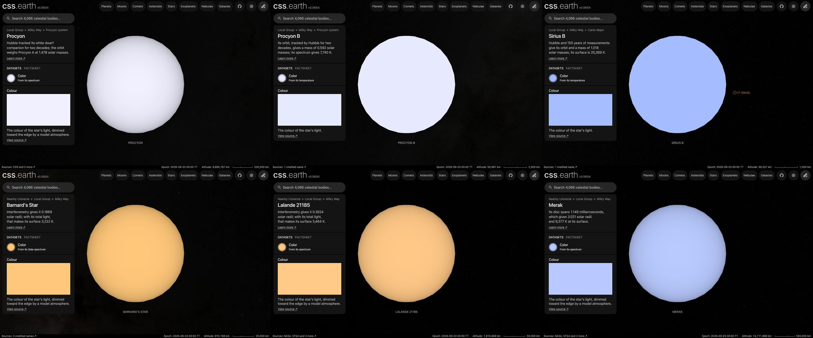

# Procyon

## Sources

Hubble tracked its white dwarf companion for two decades; the orbit weighs Procyon A at 1.478 solar masses. It is also HD 61421, HR 2943, HIP 37279. The introduction is generated from Bond et al. (2015), ApJ 813, 106's published values; the sections below are the data's own.

**Star.** Placement: Anderson & Francis (2012), Astronomy Letters 38, 331 (XHIP), Hipparcos astrometry, VizieR V/137D/XHIP row HIP = 37279 (SIMBAD Procyon); placed by that row, not by a Gaia source, distance 3.51 pc from Bond et al. (2015), ApJ 813, 106, Table 9: adopted absolute parallax 0.2850 +/- 0.0007 arcsec, the weighted mean of three measurements, inverted. Radius 2.031 +/- 0.013 solar radii from Aufdenberg, Ludwig & Kervella (2005), ApJ 633, 424, Table 7: radius 2.031 +/- 0.013 solar radii from the limb-darkened angular diameter and the parallax (https://doi.org/10.1086/452622). Mass 1.478 +/- 0.012 solar masses from Bond et al. (2015), ApJ 813, 106, Table 10: dynamical mass 1.478 +/- 0.012 solar masses (https://doi.org/10.1088/0004-637X/813/2/106). Temperature 6,543 K from Aufdenberg, Ludwig & Kervella (2005), ApJ 633, 424, Table 7: effective temperature 6543 +/- 84 K from the angular diameter and the bolometric flux. log g 3.99 from the mass and radius.

**Color.** Pulkovo spectrophotometric catalogue, table 5 (320-1080 nm, 2.5 nm steps, 10 nm resolution, absolute flux in W m^-2 m^-1): Alekseeva et al. (1996, 1997), Baltic Astronomy 5, 603 and 6, 481; VizieR III/201. Procyon is HR 2943., cross-checked against Kiehling (1987), spectrophotometry of 60 bright F, G, K and M stars, 320-880 nm in 1 nm steps as normalised magnitudes: Kiehling (1987), A&AS 69, 465; VizieR III/124. * alf CMi is HR 2943. (6 levels apart at most, the threshold is 12), through the CIE 1931 2° observer: #f0f0ff. Routes tried in order: stis-ngsl: HD 61421 is not in the library; gaia-xp: the star is placed by a catalogue row, so no Gaia DR3 source is read for it; kharitonov: found, not needed after the color and its cross-check; burnashev: found, not needed after the color and its cross-check; pulkovo: used.

**Limb.** The disc is dimmed toward the limb by the quadratic law Claret & Bloemen (2011), A&A 529, A75 compute from ATLAS model atmospheres for the Johnson V band at 6,543 K and log g 3.99 (u1 0.347, u2 0.315): a model, because no fit of this star's limb is used.

## Evidence

Generated 2026-10-02 by [new-object-cli.mts](../../../packages/telescope-cli/src/new-object/new-object-cli.mts) from VizieR V/137D/XHIP and the archives named above; each choice was read with the dataset's own reader.

- The color's cross-check differs by 6 levels at most in any channel (threshold 12); [object-package-consistency.test.mts](../../../packages/telescope-cli/src/new-object/object-package-consistency.test.mts) recomputes it after preparation.

## Known problems

- **Assumptions of the frame.** The axis's position angle and the rotation phase are conventions.
- **Model limb.** The limb darkening is a model atmosphere at the catalogued temperature and gravity, not a measurement of this star.

[Investigation ledger](investigations.json) · [Inputs](source/manifest.json) · [Preparation](source/preparation) · [Delivered files](inventory.json) · [Credits](NOTICE.md)
