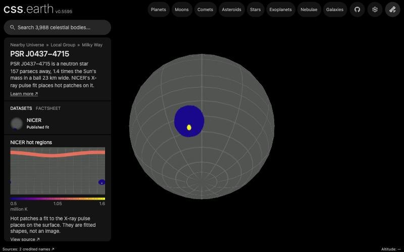

# PSR J0437−4715

## Sources

PSR J0437−4715 is a neutron star 157 parsecs away, 1.4 times the Sun's mass in a ball 23 km wide. NICER's X-ray pulse fit places hot patches on it. No telescope resolves it: at 157 parsecs its disc is 9.7e-7 milliarcseconds across. Every value here is cited, and the map is a published fit.

**Star.** Position, proper motion and distance (156.98 ± 0.15 pc): Reardon et al. (2024), ApJL 971, L18, Table 1, PPTA-DR3 column: RA 04:37:15.9284042(4), Dec -47:15:09.303700(4) (J2000) at reference epoch MJD 55486, proper motion 121.4420(6), -71.4717(7) mas/yr. Mass 1.418 ± 0.044 solar masses: Reardon et al. (2024), ApJL 971, L18, Table 1, PPTA-DR3: pulsar mass from the Shapiro delay. Radius 11.36 ± 0.95 km: Choudhury et al. (2024), ApJL 971, L20, Table A.1: equatorial radius 11.36 +0.95/-0.63 km (68% credible interval) from NICER pulse-profile modelling. Radial velocity -75 km/s: Reardon et al. (2024), ApJL 971, L18, Table 1, PPTA-DR2e: derived from the spin frequency's second derivative assuming no excess timing noise contributes to it; with another noise model the same paper finds -24 +/- 40.

**Hot regions.** [science/choudhury-2024/hot-regions.json](source/science/choudhury-2024/hot-regions.json) transcribes Choudhury et al. (2024)'s fit to NICER X-ray pulse profiles of 2017 to 2021, one table cell per number. The `published-hot-region-map` format ([hot-region-map.ts](../../../packages/bake/src/objects/raster/hot-region-map.ts)) draws the circles as the paper's own software defines them and refits nothing.
- `primary`: centred 83.6° north, 157.7° east, radius 32.1°, 1.19 million K, with a middle of radius 19.3° that does not emit (a ring).
- `secondary`: centred 47.1° south, 12.2° west, radius 1.5°, 1.58 million K, inside a circle of radius 10.1° at 0.53 million K.

**Spin.** 173.6879456649439 turns a second; the north pole is 137.506° from the line of sight (Reardon et al. (2024), ApJL 971, L18, Table 1, PPTA-DR3: spin frequency, and the orbital inclination 137.506(16) degrees that Choudhury et al. (2024) use as the spin axis's inclination). Longitude 0 is the meridian facing Earth at the fit's phase zero. The star is drawn at that instant and does not turn.

## Evidence

Generated 2026-10-01 by [pulsar.mts](../../../packages/telescope-cli/src/new-object/pulsar.mts) from the spec kept in [new-object.json](source/preparation/new-object.json).

- [hot-region-map.test.mts](../../../packages/bake/src/objects/raster/hot-region-map.test.mts) reads the record and checks it against what the paper says of its own fit.
- The page as it opens, seen from Earth at the fit's phase zero. The paper's [Figure 11](https://arxiv.org/abs/2407.06789), left panel, draws the same view: the two-temperature spot just west of the Earth-facing meridian in the south, the ring out of sight around the north pole.

## Known problems

- **A fit, not an image.** The regions are the shapes the model allows: circles, rings and overlapping circles, each at one temperature. Their sharp edges are the model's.
- **No temperature elsewhere.** The fit gives the rest of the surface no temperature; it is drawn as the gray no-data grid, not as cold.
- **Assumptions of the frame.** The axis's position angle on the sky is a convention. The bending of light by the star's gravity and its rotational flattening are not drawn.
- **Not shown.** Its companion, a 0.22 solar-mass helium white dwarf on a 5.74-day orbit (Reardon et al. 2024), is not drawn.
- **Not shown.** The maximum-likelihood regions are drawn, as in the paper's Figure 11; the same fit's radius for that single vector is 13.17 km, and the sphere uses the posterior median 11.36 km.

[Investigation ledger](investigations.json) · [Inputs](source/manifest.json) · [Preparation](source/preparation) · [Delivered files](inventory.json) · [Credits](NOTICE.md)
