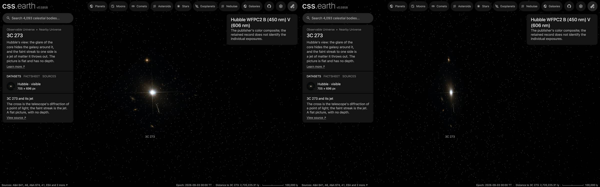

# 3C 273 picture

A published picture of 3C 273 stands at its place and distance as one flat image facing the Sun. It is a picture
of the sky: nothing in it has depth, and seen from the side it is a line.

## Sources

| Selected source | Input and meaning |
| --- | --- |
| [ESA/Hubble potw1346a](https://esahubble.org/images/potw1346a/) | [Record](../../sources/esahubble-potw1346a.json). Hubble WFPC2, two filters: blue light at 450 nm and visible light at 606 nm. The publisher's file, 705 × 696 px (`source/source.jpg`, made by [`picture-source.mts`](../../../packages/bake/authoring/far-destinations/picture-source.mts); not tracked). [CC BY 4.0](https://esahubble.org/copyright/), credit: ESA/Hubble & NASA. A display composite, not calibrated photometry. |
| [Gaia Collaboration (2023), Gaia Data Release 3, A&A 674, A1](https://doi.org/10.1051/0004-6361/202243940) | [Record](../../sources/gaia-2023-dr3.json). Position 187.2779°, 2.0524°: SIMBAD 3C 273: RA 187.27791594049°, Dec 2.05238823055°, coordinate reference 2020yCat.1350....0G (Gaia EDR3). |
| [Koss et al. (2022), BASS XXII: The BASS DR2 AGN Catalog and Data, ApJS 261, 2](https://ui.adsabs.harvard.edu/abs/2022ApJS..261....2K) | [Record](../../sources/doi-10-3847-1538-4365-ac6c05.json). Redshift 0.1576: SIMBAD 3C 273: redshift 0.15756751 ± 0.0005, reference 2022ApJS..261....2K. |
| [Planck Collaboration (2020)](https://arxiv.org/abs/1807.06209) | [Record](../../sources/planck-2018-cosmology.json). The cosmology that turns the redshift into a distance: comoving distance 672 Mpc, light travel time 2.04 billion years, age of the universe then 11,750 million years (Astropy 8.0.1, `Planck18`). |

## The picture

- **Placement:** The file's embedded tags, used as they are: 0.09967 arcsec per pixel, north 159.6° right of vertical, centre 187.277387°, 2.052926°. They place the catalogue position on the bright core, 11 px from the frame's centre. Not measured against Gaia: the frame holds too few stars.
- **Plane:** the picture's own tangent plane, facing the Sun. The picture's centre is the one its tags give, a few arcsec from the object. The recipe's small inclination is not a measurement: the bake needs a plane with some depth along the sight line. This is where a sky picture lies, not a measured orientation of the object.
- **Size:** 1.17 arcmin across, 228.9 kpc × 226.0 kpc at the object's comoving distance (the angle times the distance). The page frames 113.0 kpc, half the picture's short side.
- **Sky:** light below 8 of 255 is taken as sky and left transparent, so the universe's own dots show through it. The floor is a presentation value set just above the frame's own background (its 75th percentile), so the frame does not show as a grey square; faint light below it is lost.
- **Edges:** the outer 4% of the frame fades out, so the picture has no hard rectangular edge.
- **Bytes:** one image at 705 px on its long side (WebP quality 70, alpha quality 80), as the Milky Way's backing image is.

## Evidence

The 3C 273 page in headless Chromium at 1440 × 900, device pixel ratio 2, on this branch on 2026-10-02: the default
arrival and the camera turned part of the way round.

## Measured, chosen and inferred

| Value | Kind |
| --- | --- |
| Position 187.2779°, 2.0524° and redshift 0.1576 | Measured: the papers above |
| Distance 672 Mpc | Derived: the redshift's comoving distance in the Planck 2018 cosmology |
| Field, scale and rotation of the picture | The publisher's or the service's own geometry, as the Placement note says |
| Flat plane facing the Sun | The geometry of a sky picture; no depth is measured or drawn |
| Window, sky floor, edge fade, 1,024 px, framing radius, 0.001° inclination | Presentation |

## Known problems

- The picture is flat: seen from the side it is a line, and from behind it is mirrored.
- Everything in the frame stands on the object's plane, whatever its own distance. The whole published frame. The four spikes are the telescope's diffraction, not part of the quasar. A display composite, not calibrated photometry.
- The size is a comoving size: the angle times the comoving distance. The object's proper size at its redshift is smaller by 1 + z.
- The page opens with ecliptic north up, as every page does, so the picture arrives turned from the publisher's orientation.
- A flight from another page keeps the travelling camera's angle, so it can arrive seeing the picture from an oblique angle or
  nearly from the side. Opening the page directly faces the picture.
