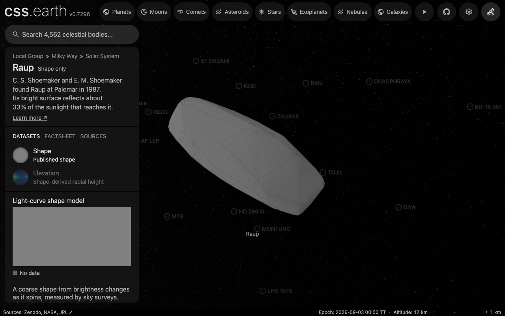

# (9165) Raup

Raup is a small asteroid of the inner main belt that turns once in about 54 days.

Shape-only views use the shared neutral gray (#808080 sRGB). This is a display convention, not a measurement of surface color or albedo; gaps within photographic and scientific datasets retain the missing-data grid.

## Sources

| Input | Selected source |
| --- | --- |
| Shape and spin | [Ďurech & Hanuš (2026), model 1 of (9165) Raup](https://doi.org/10.5281/zenodo.22812438) |
| Physical scale | [Masiero et al. (2012), ApJL 759, L8](https://doi.org/10.1088/2041-8205/759/1/L8) ([record](source/reference/calibration.json)) |

The shape is `shape_models/model_9165_1.tri` from `shape_models.tar.gz` of the [Zenodo deposit](https://doi.org/10.5281/zenodo.22812438) (version 2026-09-17, CC BY 4.0) of [Ďurech & Hanuš (2026)](https://arxiv.org/abs/2610.06082). It is a convex mesh fitted to sparse brightness measurements from sky surveys (Catalina, Mt. Lemmon, Pan-STARRS, ZTF, USNO, ATLAS, ASAS-SN, TESS and Gaia). The original 574 vertices and 1144 triangular faces are the source input. Its large-scale shape is inferred from how the asteroid's total brightness changes as it spins; concavities, craters, surface texture and the current rotation phase are not resolved.

The deposit's spin table gives the J2000 ecliptic pole λ = 285.6°, β = 56.9° and the sidereal period 1303.393531 h. It lists no second solution. It replaces DAMIT model 5835 (pole 269°, 87°; period 46.22 h), whose period the paper lists among those it corrects (its Table 2) and which the LCDB period of 1320 h already contradicted.

Adopted diameter: **4.839 ± 0.167 km**, meaning NEATM effective spherical diameter at the observing geometry, from [Masiero et al. (2012), ApJL 759, L8](https://doi.org/10.1088/2041-8205/759/1/L8). The reference-sphere radius is 2.4195 km. A thermal effective spherical diameter from NEOWISE, given to the mesh volume as an approximate display scale; its quoted fit error excludes about 20% systematic uncertainty.

[Model fields, mesh measurements and comparison](source/reference/survey-model.json).

## Evidence

Checked 2026-10-06 against the deposit's files.

- Mesh: positive signed volume (1.000000031 source units cubed), every edge used once in each direction, Euler characteristic 2.
- Period: the model's 1303.393531 h is 1.3% from the 1320 h the JPL Small-Body Database quotes from the Lightcurve Database ([pinned record](source/reference/sbdb.json), `rot_per`). The model this package showed before, DAMIT 5835, had 46.22 h; Table 2 of the paper lists it among the DAMIT periods it corrects.
- Pole: the new solution (285.6°, 56.9°) is 30° from DAMIT 5835's (269°, 87°). Nothing independent measures the pole.
- Proportions about the spin axis: 2.217 × 0.958 × 1 (longest extent across the axis, the extent at right angles to it, the extent along it).
- Display shape: the fewest faces the error allowance permits, 264 of at most 800, from the source's 1144. The farthest sampled point of the source lies 42.7 m from it, inside the 48.39 m allowance (2% of the radius).
- Browser: the default view below, in headless Chrome 1280 × 800 from the local site after the bake, with every image loaded and no page error.

## Known problems

- One pole solution is listed and no other measurement checks it. A period this long is in the range where the paper finds larger fit residuals and suspects tumbling for many bodies; the model assumes rotation about one fixed axis.
- The thermal diameter is an effective spherical diameter at its observing geometry, with about 20% more systematic uncertainty than its quoted fit error. Giving it to the mesh volume is an approximate display scale.
- No registered surface imagery exists for this shape; it shows the shared neutral gray. Convex inversion leaves concavities and fine relief unresolved.
- Elevation is false color for model radius minus a reference sphere, not gravitational height or independent terrain.
- The displayed rotation phase is arbitrary and not propagated from the model epoch. Orbit context is fixed at 2026-09-03 TT.

[Investigation ledger](investigations.json) · [Inputs](source/manifest.json) · [Preparation](source/preparation) · [Delivered files](inventory.json) · [Credits](NOTICE.md)

## Methods and source notes

Physical scale

The source's signed tetrahedral volume integral gives a volume-equivalent diameter of 1.24070099459 source units. The preparation conversion is:

`metersPerUnit = D_km × 1000 / (2 × cbrt(3 × V_source / (4 × pi)))`

For this input, `metersPerUnit = 3900.21449253489`. The raw mesh coordinates and connectivity are unchanged.

Orientation and time

Converted with obliquity 23.439291111°, the equatorial pole is α = 280.20°, δ = 34.01°. Model longitude zero is an inversion convention, not an observed landmark. JPL Horizons command "9165;" supplies the osculating elements and vector fixtures at 2026-09-03 TT; this is a fixed-date context, not a real-time trajectory or surface attitude.

