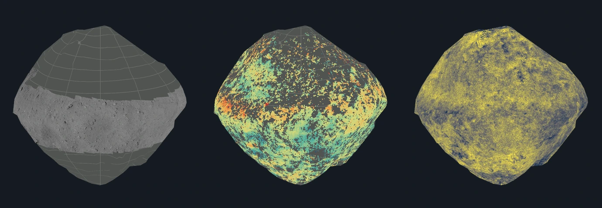

# Ryugu

## Sources

| View or property | Source and interpretation |
| --- | --- |
| V-band reflectance | JAXA ONC v06 corrected numeric map. Its 0–0.035 display is distinct from the brightness-matched color composite. |
| Color composite | [Hirata et al. 2026 ONC mapping release](https://doi.org/10.7910/DVN/WW3IH0). Channels p/v/ul are false color, not natural color. |
| Shape and Elevation | [March 2020 SPC DSK](https://data.darts.isas.jaxa.jp/pub/pds4/data/hyb2/hyb2_spice/spice_kernels/dsk/ryugu_shape_spc_200k_v20200323.bds), selected for registration. Elevation is radius minus 448 m, not gravitational height. |
| Equatorial close-up | [JAXA JADE2 ONC I/F mosaic](https://jlpeda.jaxa.jp/en/product/archive/detail_02/), acquired during MASCOT deployment on 3–4 October 2018. It is a spacecraft photograph mosaic, not a lander photograph. |
| Thermal inertia | [JAXA JADE2 numeric map](https://jlpeda.jaxa.jp/en/product/archive/detail_02/), based on [Shimaki et al. (2020)](https://doi.org/10.1016/j.icarus.2020.113835). Model-derived resistance to heating and cooling, in J m⁻² K⁻¹ s⁻½. |
| Spectral slope | [JAXA JADE2 b–x map](https://jlpeda.jaxa.jp/en/product/archive/detail_02/), from ONC normal albedo and the distribution reported by [Kameda et al. (2021)](https://doi.org/10.1016/j.icarus.2021.114348). Units are µm⁻¹; it is neither terrain slope nor a mineral identification. |

## New surface datasets

Left to right: equatorial close-up, thermal inertia and spectral slope. These are **offline shape previews**, generated with the existing `renderRadialSnapshot` helper from this branch’s prepared maps and unchanged mesh, at 90° E, 12° N, with illumination disabled. They show interpretation and coverage; they are not browser screenshots or evidence of app interaction.

The unmodified GeoTIFFs are pinned in [the source manifest](source/manifest.json) and restored by [the acquisition recipe](source/preparation/acquisition.json). [JADE2’s terms](https://jade2.darts.isas.jaxa.jp/terms) direct scientific-data reuse to the ISAS Open Data Policy. See [credits and modifications](NOTICE.md).

| Dataset | Native grid and validity | Display |
| --- | --- | --- |
| Close-up | 10000 × 1681, float64 I/F; 0.036° per pixel; origin 0° E, 28.6462° N; lower edge −31.8698°; NoData −1 | Linear 0–0.035 stretch; original 2 × 2 photographic texel sampling. Native equatorial spacing is 0.28149 m/pixel; the retained display is coarser. |
| Thermal inertia | 3600 × 1800, float32; 0.1° per pixel; origin 0° E, 90° N; NoData −9999 | Nearest source cells; false color 0–400, with higher values clamped to the upper display color. Source range 10–800. |
| Spectral slope | Same numeric grid; metadata NoData −9999, although no raster samples use it | Nearest source cells; false color −0.148 to +0.148 µm⁻¹, matching the producer’s legend endpoints. Saturated −1 and +1 samples are conservatively withheld using the existing quality mask. |

All three grids declare a 448 m Ryugu sphere, angular degrees and zero prime meridian. The [close-up PDS label](source/reference/hyb2_onc_20181003_MSC_l3dm_v06.lblx) explicitly records planetocentric latitude, positive-east longitude, I/F, native dimensions and pixel spacing. Its grid is retained without a mirror, longitude shift or latitude stretch. Published body-fixed map coordinates are sampled on the existing March 2020 SPC display mesh. This does not establish subpixel registration or give the simplified shape sub-metre accuracy.

The thermal map contains 2,550,811 valid grid samples; their unweighted arithmetic mean is 225.779 thermal-inertia units. This is a decoding check, not an independent estimate of Ryugu’s global mean. [The mission’s account of Shimaki et al.](https://www.hayabusa2.jaxa.jp/en/topics/20200626_Icarus/) reports 225 ± 45 and underlying TIR sampling of roughly 4.5 m/pixel. The released 0.1° grid is finer than that observational sampling. Small colored islands and gaps are already present in the producer’s map.

The spectral source has 102,934 samples at −1 and 5,281 at +1. The TIFF does not identify these endpoints as NoData, so the mask is an explicit conservative display exclusion, not a recovered detector-quality flag. Other polar distortions and anomalies remain. We retain the published values; we do not reconstruct the spectral-slope formula from RGB quicklooks. The provider’s legend establishes µm⁻¹; its prose wavelength summary differs from its b–x band naming.

## Evidence

### Checks for this change

Prepared on `ebd16155a` plus this branch’s Ryugu recipes and geographic-reader change. Source verification passed for all 37 pinned entries. The package check passed with six lenses and 790 native PolyCSS `u` raster faces. Camera, runtime tree and surface-hit data match the base exactly. All 38 existing non-feature runtime assets match their base SHA-256; the daily USGS feature export was refreshed because the old ZIP pin no longer downloads, retaining 14 displayed places. The 35 KB native export is now checked in so a later upstream refresh cannot break this snapshot.

All 50 runtime assets were published through the existing content-addressed asset publisher and installed into an empty temporary destination: 29,095,665 bytes, 50 downloads, zero reused files. The three added lenses contribute 12.45 MB of prepared files. This is scene-asset installation evidence; it excludes shared shell assets and browser network traffic. The temporary install was removed after verification.

The new geographic-reader fixture checks north/south and east/west cell order, negative values, real zero, NoData, bounds, masks and rejection of changed units/georeferences. Independent Python `struct` reads of native TIFF strips checked thermal cells (column,row) (300,900)=280, (900,450)=−9999, (1800,900)=230 and (2700,1350)=200. Spectral cells at those same indices are −0.03278164193, 0.04955266789, 0.04545980319 and 0.01099606510; ONC cell (1800,900) is I/F 0.01780111507. These checks validate numeric decoding and map orientation, not the scientific model’s uncertainty.

`pnpm typecheck:preparation` passed. Source/catalogue checks: 68 passed, one unrelated Moon prepared-factsheet mismatch failed, and one unrelated missing-reference test was skipped. The raster checks passed except the existing Ceres test’s missing preparation recipe. The focused Ryugu package and geographic-reader checks passed.

**Browser qualification is pending.** The existing server at port 4278 returns HTTP 500 because main requires missing Helix prepared lenses. No nebula reconstruction, extra server or headed browser was started. Earlier Ryugu browser evidence below applies only to the older three views. Close zoom, polar/coverage boundaries, all lighting states and mobile interaction still need inspection for the new lenses before this PR is ready to merge.

### Earlier evidence

The photographic atlas now samples each pinned original grid directly with a 2 × 2 texel footprint. It retains the source frame, coverage policy and fixed-epoch lighting. [The shared preparation guide](../../../docs/surface-preparation.md#preserve-photographic-detail-through-preparation) explains the sampling and encoding controls.

| View | Original grid | Both lighting images, before → current |
| --- | --- | --- |
| normal | 1800 × 900 | 1.01 → 1.42 MB |
| enhanced | 3600 × 1800 | 3.91 → 5.83 MB |

Each atlas remains 2048 × 6400 pixels, with 790 retained faces. The scene bytes match [the previous main version](https://github.com/layoutit/css.earth/tree/3efdf2c9ed9047c72409b2730e879123f8c3b9d2/src/planets/ryugu/prepared). WebP quality is 95; decoded texture size is unchanged. Sampling details and output hashes are recorded in the prepared surface metadata (`prepared/surfaces.json`). Source resolution, gaps and existing registration limitations still apply.

An independent check used trimesh 4.8.3 closest_point_naive to measure 3,200 equal-area radial samples from the full source against every simplified triangle. Mean / 95th percentile / sampled maximum nearest-surface distances were 2.775 / 7.243 / 19.166 m. This is a one-direction sample, not an exhaustive Hausdorff bound. Radial distance alone is misleading near undercuts because the nearest ray intersection can switch surfaces.

The earlier source notes report Headless Chrome 152 checks of the then-selected lenses with Shadows off and on at DPR 1 and 2, plus opposite/polar poses and close zoom.

[Source anchors](../../../tests/objects/unit/anchors/asteroid-calibration.json) checked by the shared [calibration runner](../../../tests/objects/unit/asteroid-calibration.test.mts).

## Known problems

Named features: the IAU/USGS Gazetteer of Planetary Nomenclature centre-point shapefile for Ryugu (retrieved 2026-09-13, public domain as USGS-produced data; the export ships no FGDC record, so the pin cites the USGS Copyrights and Credits statement) is pinned under `source/features/`. Preparation verifies the archive, reads the attribute table (no projection file or metadata: the authored radius scales outline sizes), drops the albedo-feature type code, folds repeated rows, and converts each positive-east centre into the body-fixed frame the radial terrain sampler uses for this mesh (longitude 0 toward the mesh +y axis, 90° E toward +x, north +z), then casts that direction through the prepared hit mesh so every anchor and outline point sits on the shape model rather than on a reference sphere. Craters and faculae trace a rim circle, other types their published extent box. Outlines are not published nomenclature boundaries.

Landing sites: 1 spacecraft landing, touchdown or impact sites are labelled beside the IAU names (`source/features/sites.json`). Each coordinate quotes the NASA NSSDCA, PDS, LROC, agency or paper page it was read from, with the stated latitude kind and longitude convention; sites are unsized points ranked like a 20 km feature and the caption shows the quoted source sentence with its publisher.

Earlier named-features run of 2026-09-12: the catalogue labels 13 IAU names on the hit mesh (nothing skipped); `tests/objects/unit/surface-features.test.mts` verifies the pinned bytes, the body-frame anchors and the hit-mesh radius band, and a headless Chrome probe (`output/probe-spheres.mts`, ignored scratch) mounted the page, selected every lens and pinned Urashima from the sidebar search with no console errors or failed requests.

Fine triangle-edge artifacts remain visible in smooth areas, particularly Itokawa elevation. They persisted in a flat-color diagnostic and existing PolyCSS overlap variants; they are a rendering limitation, not source terrain.

The 64-bit JAXA v-band map uses geographic degrees (0.2 degrees/pixel), a 448 m reference sphere and -1 no-data. Its displayed reflectance stretch is 0–0.035. Missing coverage, residual photographed shadows and longitude seams remain visible; the color mosaic is a separately corrected and brightness-matched product.

[Investigation ledger](investigations.json) · [Inputs](source/manifest.json) · [Preparation](source/preparation) · Provenance (`prepared/provenance.json`) · [Delivered files](inventory.json) · [Credits](NOTICE.md)

Methods and source notes

**Preparation and interpretation**

The source shape uses kilometers, right-handed body-fixed axes and east longitude. The shared preparer converts positions to meters and scales them by the independently sourced 0.448 km radius. Original connectivity is welded at exact position duplicates and simplified by meshoptimizer 1.2.0 before texture and lighting baking. The target is 800 native PolyCSS u triangles with 128 px raster cells and a 16 m library error allowance. A regularized error estimate is not a guaranteed maximum surface deviation. The output has 790 faces; meshoptimizer reports 12.922 m estimated error. Exact coincident, oppositely wound pairs left by collapses are removed (10 faces), then every edge must have two opposite incidents. The result has one connected component and Euler characteristic two.

The shared frame is fixed at 2026-09-03 TT. Horizons osculating elements approximate TDB as TT; these conics are not long-term perturbation models. Rotation follows the pinned mission PCK. Shadows use prepared diffuse lighting in that body frame, not runtime physics. Elevation is radial height above the 448 m sphere, not height above a gravitational equipotential. No geometry or image is synthesized at runtime.

**Reproduction**

Archive members are extracted unmodified from a separately pinned ZIP. Regenerate the checked gzip OBJ with `python tools/objects/acquisition/export-dsk.py src/objects/ryugu/source/shape/ryugu_shape_spc_200k_v20200323.bds src/objects/ryugu/source/shape/ryugu_shape_spc_200k_v20200323.obj.gz` using spiceypy==7.0.0. CSPICE preserves all source vertices and plates.

Elevation atlas colors use the nearest point on the full source triangle surface in three dimensions, with a maximum source-to-display distance of 16 m. The radius, barycentric position and facet normal belong to that same source surface; the height subtracts the stated reference-sphere radius. The distance allowance is enforced per prepared atlas texel, independently of meshoptimizer’s estimated error. Equidistant distinct surfaces or projections beyond the bound are withheld with the shared gray grid. No orientation heuristic substitutes a farther source branch. Raster bleed clamps to its retained triangle edge before projection.

The flat longitude/latitude preview cannot represent more than one source surface on a center ray, so ambiguous sample cells and their interpolation footprints are withheld. The three-dimensional Elevation atlas is baked directly from source-surface correspondence and does not paint this preview onto the body. Cartographic relief uses the matched source facet normal in a local east/north/up frame; optional Sun lighting uses that same normal. Full source connectivity is retained before simplification. Photographic/albedo datasets keep their original mapping and are not recalibrated by this scalar correction.

`node --test tools/objects/terrestrial-layers/source-surface.test.mts` checks exact pinned-source facet regressions for Itokawa, Ryugu, Eros and Bennu. `python3 tools/objects/terrestrial-layers/verify-source-surface.py ryugu` (NumPy required) independently verifies the fixture against every triangle of the full original source using planar projection plus closest edges. These numerical checks establish scalar correspondence; they do not replace browser visual qualification.

**Qualification limits**

Included: the JAXA ONC v06 corrected v-band map, the controlled global ONC color mosaic associated with Hirata et al. (2026), and the March 2020 SPC shape family used by the new mapping work. The color channels are p/v/ul, not natural color. The author’s more strongly enhanced PNG and nine-band GeoTIFF are retained as source candidates but do not add duplicate views. The 2018 SfM OBJ release was considered; the newer SPC model is chosen for registration. Local landing-site maps, global resolution maps, and geological shapefiles were previously surveyed and excluded. This change adds the separately published equatorial MASCOT-operation mosaic and two numeric JADE2 science maps. The numeric v-band map remains distinct from the brightness-matched composite.

- [Mapping release](https://doi.org/10.7910/DVN/WW3IH0)
- [Shape](https://data.darts.isas.jaxa.jp/pub/pds4/data/hyb2/hyb2_spice/spice_kernels/dsk/ryugu_shape_spc_200k_v20200323.bds)
- [Mission facts](https://global.jaxa.jp/projects/sas/hayabusa2/index.html)
- Pole and spin: [ryugu_v10.tpc](https://naif.jpl.nasa.gov/pub/naif/pds/pds4/hyb2/hyb2_spice/spice_kernels/pck/ryugu_v10.tpc)

