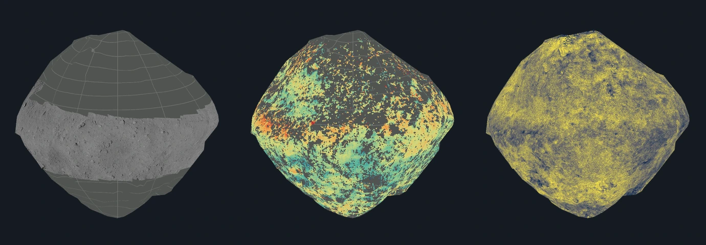

# Ryugu

The asteroid Ryugu on the March 2020 SPC shape, with Hayabusa2 ONC reflectance and color maps, an equatorial
close-up mosaic, thermal inertia, spectral slope and elevation.

## Sources

| View or property | Source and interpretation |
| --- | --- |
| V-band reflectance | JAXA ONC v06 corrected numeric map. Its 0–0.035 display is distinct from the brightness-matched color composite. |
| Color composite | [Hirata et al. 2026 ONC mapping release](https://doi.org/10.7910/DVN/WW3IH0). Channels p/v/ul are false color, not natural color. |
| Shape and Elevation | [March 2020 SPC DSK](https://data.darts.isas.jaxa.jp/pub/pds4/data/hyb2/hyb2_spice/spice_kernels/dsk/ryugu_shape_spc_200k_v20200323.bds), selected for registration. Elevation is radius minus 448 m, not gravitational height. |
| Equatorial close-up | [JAXA JADE2 ONC I/F mosaic](https://jlpeda.jaxa.jp/en/product/archive/detail_02/), acquired during MASCOT deployment on 3–4 October 2018. It is a spacecraft photograph mosaic, not a lander photograph. |
| Thermal inertia | [JAXA JADE2 numeric map](https://jlpeda.jaxa.jp/en/product/archive/detail_02/), based on [Shimaki et al. (2020)](https://doi.org/10.1016/j.icarus.2020.113835). Model-derived resistance to heating and cooling, in J m⁻² K⁻¹ s⁻½. |
| Spectral slope | [JAXA JADE2 b–x map](https://jlpeda.jaxa.jp/en/product/archive/detail_02/), from ONC normal albedo and the distribution reported by [Kameda et al. (2021)](https://doi.org/10.1016/j.icarus.2021.114348). Units are µm⁻¹; it is neither terrain slope nor a mineral identification. |

Pole and spin come from [ryugu_v10.tpc](https://naif.jpl.nasa.gov/pub/naif/pds/pds4/hyb2/hyb2_spice/spice_kernels/pck/ryugu_v10.tpc);
facts from the [mission page](https://global.jaxa.jp/projects/sas/hayabusa2/index.html). Named features come from the
IAU/USGS Gazetteer of Planetary Nomenclature (public domain), and one landing site is labelled from
`source/features/sites.json`, with its quoted source. [JADE2’s terms](https://jade2.darts.isas.jaxa.jp/terms) direct
scientific-data reuse to the ISAS Open Data Policy. See [credits and modifications](NOTICE.md).

## Processing

**Shape.** The source shape is scaled to the independently sourced 0.448 km radius and simplified by meshoptimizer
1.2.0 to 790 native PolyCSS faces (estimated error 15.945 m), one closed component. Regenerate the source OBJ with
`python packages/bake/src/objects/acquisition/export-dsk.py src/objects/ryugu/source/shape/ryugu_shape_spc_200k_v20200323.bds src/objects/ryugu/source/shape/ryugu_shape_spc_200k_v20200323.obj.gz`
using spiceypy==7.0.0.

**Elevation.** Each atlas texel takes its height from the nearest point on the full source surface, at most 16 m away.
Where two surfaces are equally close or the bound is exceeded, the texel keeps the gray grid, so undercuts do not pick
the wrong surface.

**Reflectance and color.** The v-band map is 0.2 degrees/pixel with -1 as no-data, stretched 0–0.035. The color
mosaic is a separately corrected, brightness-matched product. The 2018 SfM shape was considered; the newer SPC model
was chosen for registration.

**JADE2 maps.** The GeoTIFFs are pinned in [the source manifest](source/manifest.json) and restored by
[the acquisition recipe](source/preparation/acquisition.json). All three grids declare a 448 m sphere and are sampled
on the SPC mesh without mirroring, shifting or stretching; the [close-up label](source/reference/hyb2_onc_20181003_MSC_l3dm_v06.lblx)
records the coordinate conventions.

| Dataset | Native grid and validity | Display |
| --- | --- | --- |
| Close-up | 10000 × 1681, float64 I/F; 0.036° per pixel; origin 0° E, 28.6462° N; lower edge −31.8698°; NoData −1 | Linear 0–0.035 stretch; original 2 × 2 photographic texel sampling. Native equatorial spacing is 0.28149 m/pixel; the retained display is coarser. |
| Thermal inertia | 3600 × 1800, float32; 0.1° per pixel; origin 0° E, 90° N; NoData −9999 | Nearest source cells; false color 0–400, with higher values clamped to the upper display color. Source range 10–800. |
| Spectral slope | Same numeric grid; metadata NoData −9999, although no raster samples use it | Nearest source cells; false color −0.148 to +0.148 µm⁻¹, matching the producer’s legend endpoints. Saturated −1 and +1 samples are conservatively withheld using the existing quality mask. |

## Evidence

Left to right: equatorial close-up, thermal inertia and spectral slope, as offline shape previews at 90° E, 12° N
with lighting off. They show interpretation and coverage, not browser output.

- Over 3,200 equal-area samples, the distance from the full source to the simplified mesh has mean 2.775 m, 95th
  percentile 7.243 m and sampled maximum 19.166 m.
- The thermal map's 2,550,811 valid samples have an unweighted mean of 225.779. The
  [mission's account of Shimaki et al.](https://www.hayabusa2.jaxa.jp/en/topics/20200626_Icarus/) reports 225 ± 45,
  from TIR sampling of roughly 4.5 m/pixel, coarser than the released 0.1° grid.
- Independent reads of the native TIFFs agree with the decoder at four cells in each map, which checks decoding and
  orientation, not scientific uncertainty.

## Known problems

- There is no hydration map. Hayabusa2's NIRS3 spectrometer found the 2.72 µm OH band everywhere on Ryugu, at 7–10%
  depth ([Kitazato et al. 2019](https://doi.org/10.1126/science.aav7432)), but no one has released a map of that depth.
  We tested making one from the [released spectra](https://doi.org/10.17597/isas.darts/hyb2-01600). Its small
  differences do not repeat between global scans unless surface temperatures also match, so a map would mostly show
  leftovers from removing the heat glow. The measurements are in the [investigation ledger](investigations.json)
  (`nirs3-hydration-band-depth`).
- The spectral map has 102,934 samples at −1 and 5,281 at +1. The TIFF does not mark these as NoData, so withholding
  them is a display choice, not a recovered quality flag. Other polar distortions remain.
- The thermal map's small colored islands and gaps are already present in the producer's map.
- Missing coverage, residual photographed shadows and longitude seams remain visible in the v-band map.
- Fine triangle-edge artifacts remain visible in smooth areas. They are a rendering limitation, not source terrain.
- The close-up, thermal inertia and spectral slope views still need browser inspection of close zoom, polar and
  coverage boundaries, lighting states and mobile interaction.
- The simplified shape does not have sub-metre accuracy, and map registration is not established to subpixel level.

[Investigation ledger](investigations.json) · [Inputs](source/manifest.json) · [Preparation](source/preparation) · [Delivered files](inventory.json) · [Credits](NOTICE.md)
