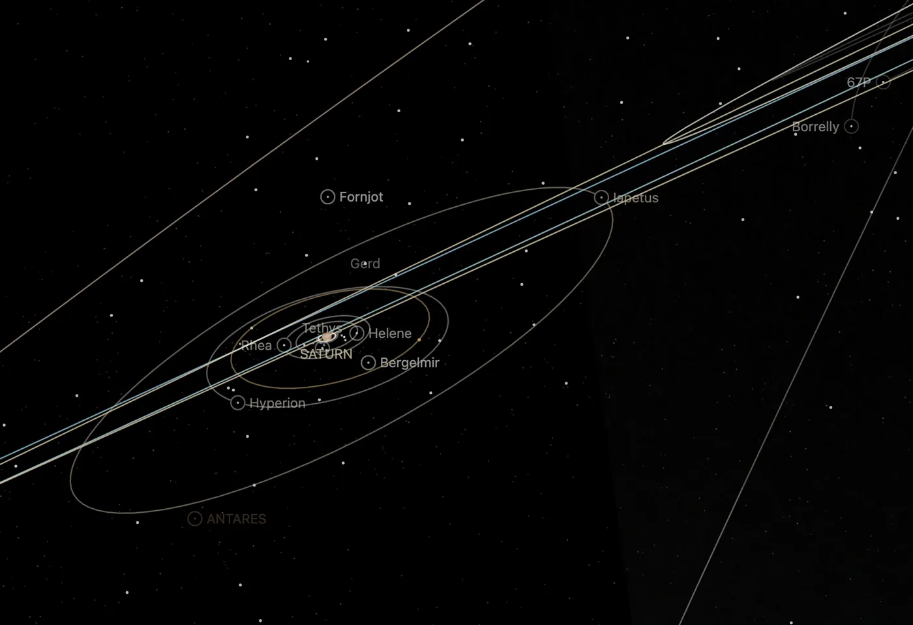

# Saturn's moons without a page

The 245 confirmed moons of Saturn that have no page of their own, one dot each, drawn while Saturn or one of its moons is selected. With the 46 moons that have pages, 291 of Saturn's 293 confirmed moons show.

## Sources

| Source | Measurement used |
| --- | --- |
| [JPL Horizons](https://ssd.jpl.nasa.gov/horizons/) | Each moon's geometric position relative to Saturn's centre at the world's epoch, JD 2461286.5 TT (2026-09-03), ICRF axes, kilometres. Horizons answered from its satellite solutions SAT455 (128 moons), SAT457 (79), SAT456 (20) and SAT459 (18), each merged with DE440. |
| [JPL satellite discovery table](https://ssd.jpl.nasa.gov/sats/discovery.html) | Which moons are confirmed, and each one's Horizons code, through [Saturn's retained catalogue](../saturn/source/moons/saturn-moons.json). |

[Inputs](source/manifest.json) · [Recipe](source/dots/points.json)

## Processing

1. [`positions.mts`](../../../packages/bake/authoring/saturn-minor-moons/positions.mts) takes every moon in Saturn's catalogue that has no object package and has a Horizons code, and asks Horizons for its position, one request at a time. It writes [`positions.csv`](source/dots/positions.csv).
2. `packages/bake/cli/prepare-body-points.mts` writes the positions as a point bank whose origin is Saturn's own prepared world position: 245 dots, 4 KB.

The dots are the app's catalogue dots: not clickable and not named. A moon with a page keeps its own marker.

## Evidence

A headless capture of this version's Saturn system overview. The bank reported 96 of its 245 dots inside this view and 25 inside Saturn's default view. The positions run from 4.7 to 36.9 million km from Saturn.

## Known problems

- S/2009 S1 and S/2009 S2 have no Horizons ephemeris and are not drawn.
- A dot's grey and its size are not measurements. The moons are a few kilometres across and would be invisible at scale.
- At this size and colour the dots are hard to tell from background stars.
- The positions hold for the world's one epoch; the dots do not move.
