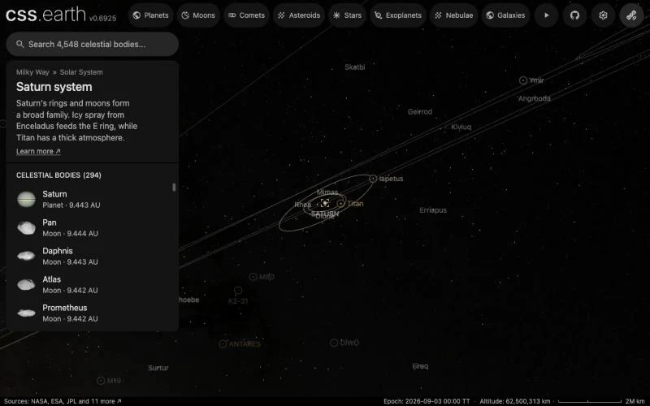

# Saturn's moons without a page

The 266 confirmed moons of Saturn that have no page of their own, one dot each, drawn while Saturn or one of its moons is selected. With the 25 moons that have pages, 291 of Saturn's 293 confirmed moons show.

Twenty-one of the dots had a page until 2026-10-05: twenty outer moons drawn as an ellipsoid from a light-curve elongation limit and an assumed albedo, and Anthe, drawn as a nominal sphere. Nobody has measured their shape, so the pages were retired ([a scene needs a measured shape](../../../.agents/skills/celestial-skill/references/scientific-faithfulness.md#a-scene-needs-a-measured-shape)). Their names still show as captions ([moon lists](../../../docs/moon-catalogues.md)).

## Sources

| Source | Measurement used |
| --- | --- |
| [JPL Horizons](https://ssd.jpl.nasa.gov/horizons/) | Each moon's geometric position relative to Saturn's centre at the world's epoch, JD 2461286.5 TT (2026-09-03), ICRF axes, kilometres. Horizons answered from its satellite solutions SAT455 (128 moons), SAT457 (79), SAT456 (40) and SAT459 (18), each merged with DE440, and SAT415 merged with DE437 (Anthe). |
| [JPL satellite discovery table](https://ssd.jpl.nasa.gov/sats/discovery.html) | Which moons are confirmed, and each one's Horizons code, through the [pinned moon catalogue](../../../site/source/moon-catalogues.json). |

[Inputs](source/manifest.json) · [Recipe](source/dots/points.json)

## Processing

1. [`positions.mts saturn`](../../../packages/bake/authoring/minor-moons/positions.mts) takes every moon of Saturn in the catalogue that has no object package and has a Horizons code, and asks Horizons for the position of each one the table does not hold yet, one request at a time. It writes [`positions.csv.gz`](source/dots/positions.csv.gz).
2. `packages/bake/cli/prepare-body-points.mts` writes the positions as a point bank whose origin is Saturn's own prepared world position: 266 dots, 4 KB.

The dots are the app's catalogue dots: not clickable and not named. A properly named moon also gets a caption from the [moon lists](../../../docs/moon-catalogues.md). A moon with a page keeps its own marker.

## Evidence

A capture of this version in the app, zoomed out from Saturn to 62.5 million km. The moons with a page keep a ringed marker (Ymir, Iapetus, Titan). The retired moons in view (Skathi, Kiviuq, Erriapus, Ijiraq) show as plain captions, like Geirrod, Angrboda and Surtur, which never had a page. The 266 positions run from 0.2 million km (Anthe) to 36.9 million km from Saturn; without Anthe the nearest is at 4.7 million km.

## Known problems

- S/2009 S1 and S/2009 S2 have no Horizons ephemeris and are not drawn.
- Every dot is `#9a9a9a`, the one neutral gray the app gives a body without a measured color (`NEUTRAL_CATALOGUE_COLOR`): the bank has one color, and no group or family coloring is applied. Ten of the moons do have a published whole-disc color that is not drawn (Albiorix, Tarvos, Erriapus, Paaliaq, Kiviuq, Ijiraq, Skathi, Thrymr, Suttungr and Mundilfari: [Grav and Bauer 2007, Table 2](https://doi.org/10.1016/j.icarus.2007.04.020)).
- The 2 px dot size is a display choice, picked so the moons stand out from background stars. The moons are from under 1 km to about 30 km across and would be invisible at scale.
- The positions hold for the world's one epoch; the dots do not move.
