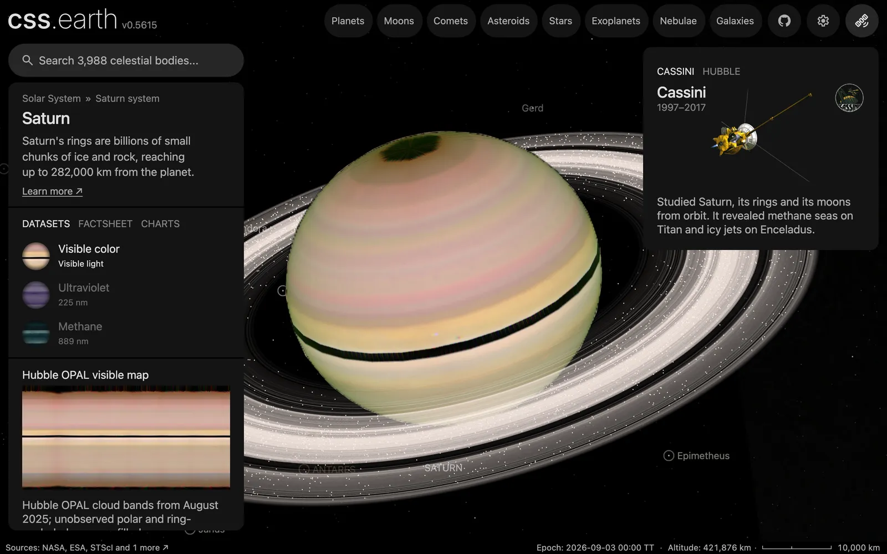

# Saturn's ring particles

4,000 dots across Saturn's rings, drawn over the ring image while Saturn or one of its moons is selected. Their density follows the measured ring profile. The position of a single dot is not a measurement.

## Sources

| Source | Measurement used |
| --- | --- |
| [Cassini UVIS alpha Virginis occultation, 2006 day 285](https://pds-rings.seti.org/holdings/volumes/COUVIS_8xxx/COUVIS_8001/data/UVIS_HSP_2006_285_ALPVIR_I_TAU01KM.LBL) (PDS `COUVIS_8001`; Colwell, Jerousek, Becker and Esposito) | The normal optical depth of the rings in 1 km bins from 66,900 to 140,612 km: the same table [Saturn's ring image](../saturn/README.md#rings) is prepared from. |

[Inputs](source/manifest.json) · [Recipe](source/dots/points.json)

## Processing

1. [`positions.mts saturn`](../../../packages/bake/authoring/ring-particles/positions.mts) reads the occultation table. It keeps the 60,648 bins that are clean (note flag 0) and have a measured optical depth above zero.
2. For each dot it picks a bin in proportion to the bin's opacity, 1 − exp(−τ), times its radius, which is the bin's share of the ring's lit area. Gaps get no dots and the B ring gets the most.
3. The dot's place inside its 1 km bin and its longitude come from a seeded generator (mulberry32, seed 20061012), so the same dots come out on every machine. Nothing else is authored: no wakes, spokes or clumps.
4. The dots lie in Saturn's equatorial plane, from the IAU pole at the world's epoch, JD 2461286.5 TT. It writes [`positions.csv.gz`](source/dots/positions.csv.gz).
5. `packages/bake/cli/prepare-body-points.mts` writes the positions as a point bank at Saturn's prepared world position: 4,000 dots, 42 KB.

The dots are the app's catalogue dots: not clickable and not named.

## Evidence

A headless capture of this version's Saturn default view.

## Known problems

- **No dot is a measured particle.** Nobody has measured where single ring particles are; they are centimetres to metres across and uncounted. Only the radial density of the dots is measured. Their longitudes are drawn from a seed.
- The 4,000 dots and the 1.5 px size are display choices.
- The dots take the ring image's color, #fff1ea: white under the same solar tint. No ring color is measured.
- Bins the occultation flags as corrupted get no dots, though the ring image interpolates across them.
- The dot layer sits behind the planet. Where the near side of the rings crosses in front of Saturn's disc, the ring image shows but its dots do not.
- The dots do not orbit; the positions hold for the world's one epoch.
