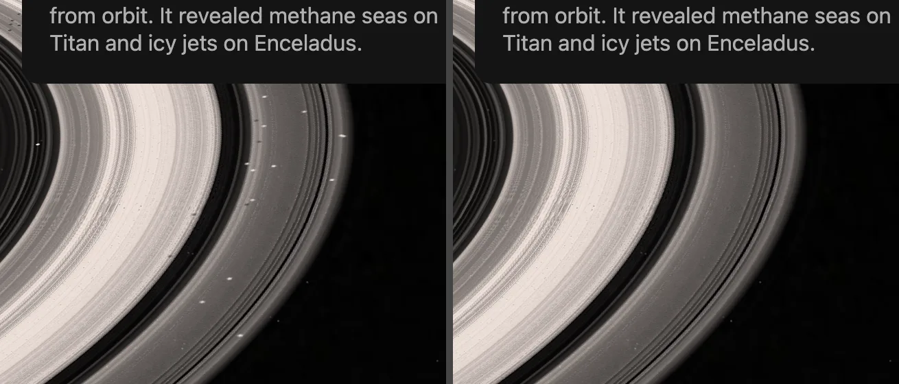
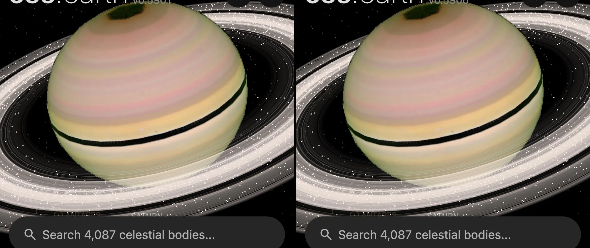
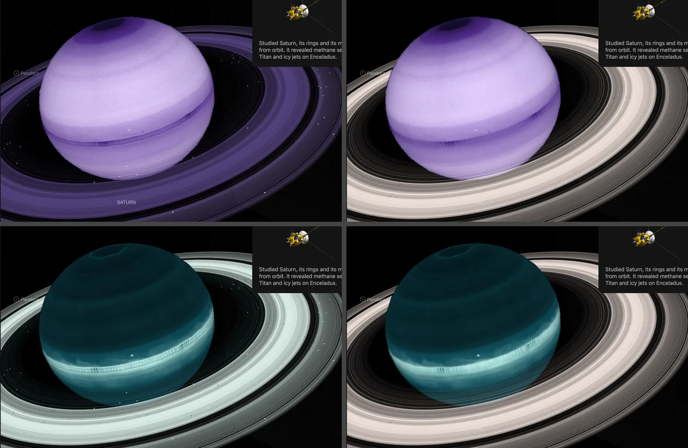
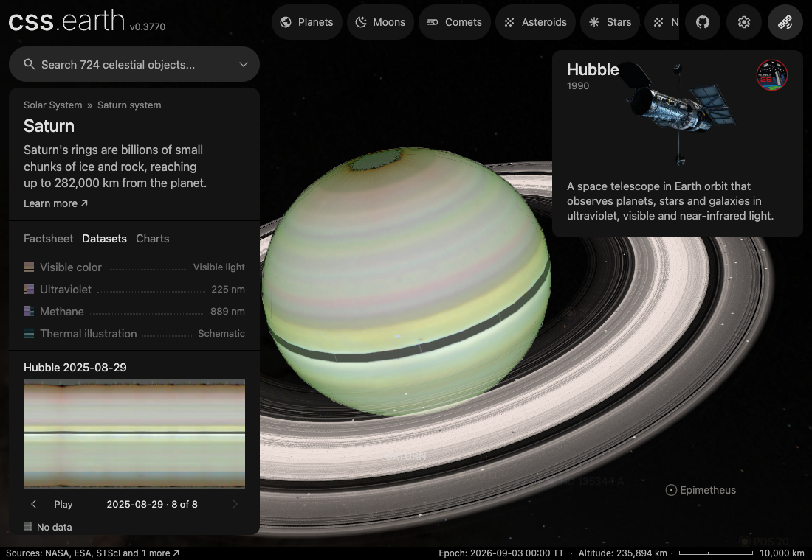
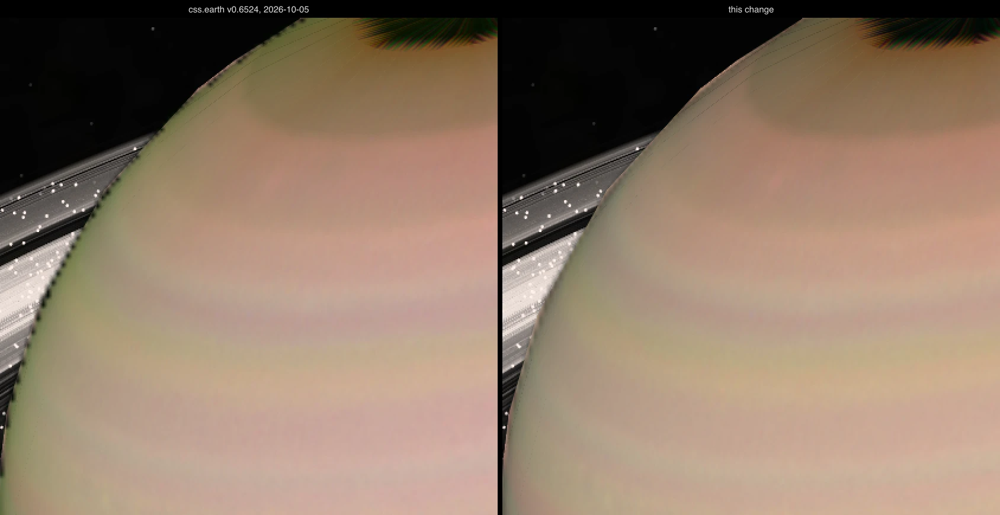
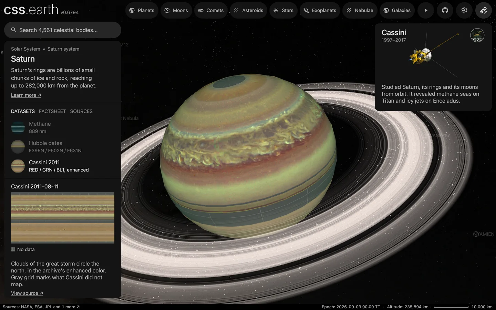

# Saturn sources

Saturn combines a Hubble OPAL visible body map, Hubble spectral maps, a Cassini
map of the 2011 storm clouds, a Cassini UVIS ring opacity profile, and modeled
atmosphere charts.

Source selections, recorded trials and open questions are in the [investigation ledger](investigations.json).

## Sources

| View or quantity | Source |
| --- | --- |
| Visible body | [Hubble OPAL Cycle 32](https://archive.stsci.edu/hlsp/opal/opal-saturn-cycle-32) rotation-A F395N/F502N/F631N global map, 2025-08-29; unobserved polar and ring-occluded rows are filled during preparation |
| Visible body color | [Karkoschka (1998)](https://doi.org/10.1006/icar.1998.5913) full-disc albedo spectrum, [PDS `1995LOW.TAB`](https://pds-atmospheres.nmsu.edu/PDS/data/gbat_0001/data/1995low.lbl) (ESO, July 1995, rings edge-on) |
| Ring opacity profile | [Cassini UVIS HSP alpha Virginis occultation, 2006 day 285](https://pds-rings.seti.org/holdings/volumes/COUVIS_8xxx/COUVIS_8001/data/UVIS_HSP_2006_285_ALPVIR_I_TAU01KM.LBL), 1 km bins, PDS CO-SR-UVIS-HSP-2/4-OCC-V3.0 |
| Ultraviolet and methane bands | [Hubble OPAL Cycle 32](https://archive.stsci.edu/hlsp/opal/opal-saturn-cycle-32), 2025 |
| Ring boundaries and motion | [PDS ring statistics](https://pds-rings.seti.org/saturn/saturn_rings_table.html) and JPL SAT441 |
| Interior | [Mankovich and Fuller (2021)](https://doi.org/10.1038/s41550-021-01448-3) and [Movshovitz density profiles](https://doi.org/10.7291/D1P07G) |
| Atmosphere charts | [NASA Planetary Spectrum Generator](https://psg.gsfc.nasa.gov/), modeled 29 August 2026 |
| Dated visible maps | Eight [OPAL](https://archive.stsci.edu/hlsp/opal) rotations, 2018 to 2025 (table below) |
| Storm clouds of 2011 | [Cassini ISS global color map](https://doi.org/10.17189/rkkb-6y30), contrast-enhanced, 2011-08-11 (NASA PDS Atmospheres Node; [Wang et al. 2025](https://doi.org/10.1038/s41597-025-04392-3)) |

[Inputs](source/manifest.json) · [Recipe](object.json) · [Credits](NOTICE.md) · [Contributor guide](../README.md)

The recipe binds Saturn's settings to the shared
[material-composition preparer](../../../packages/bake/src/objects/layers/material-composition/object.ts),
which uses the shared radial, cutaway, sky and content preparation modules.

## Visible body

The body map is the OPAL Cycle 32 rotation-A global map of 2025-08-29
(1,800 x 900, NASA, ESA, STScI and the OPAL team). Its latitudes are
planetographic, with 360 degrees System III west longitude at the left edge
([OPAL Cycle 32 readme](https://archive.stsci.edu/missions/hlsp/opal/cycle32/saturn/hlsp_opal_hst_wfc3-uvis_saturn-2025_all_v1_readme.txt)).
The map never observed three row ranges: north of 82.8 degrees, 3.8 to 1.0
degrees north (behind the rings) and south of 87.4 degrees. The geometry
recipe names those rows, and preparation fills them by linear interpolation in
latitude before resampling to a 2,880 x 1,440 grid. The fill supplies no
measured cloud detail.

The equatorial range is wider than the mask: 4.8 degrees north to 0.4 degrees
south. The rows beside the mask are not clean surface. Its edge is ragged along
longitude, and south of it the row median falls from 233 to 5 of 255 over seven
rows, so a fill between the mask's own neighbors stayed black. The range ends
north at the first row with no texel more than 25 % off its row's median in any
channel, and south at the first row within 1 % of the level beyond it. The
polar ranges stay at the mask, so the ragged dark rows beside each pole show as
the map has them. The polar caps are projected from the nearest
observed rows.

Color. The OPAL readme calls the color TIF "arbitrarily scaled", so its
channel balance is not a measurement. Preparation ties it to Karkoschka's
full-disc albedo of Saturn, times a 5,772 K Planck spectrum, through the CIE
1931 observer into linear sRGB: `#ceb794`, recorded in
[`source/photometry/karkoschka-1998-whole-disc-color.json`](source/photometry/karkoschka-1998-whole-disc-color.json).
The tie allows for the limb law, so the flood-lit disc integrates to
Karkoschka's color. The map then gets back its untied luminance with one
factor on all three channels, 1.239, and a soft shoulder keeps bright texels
from clipping. Spatial color differences stay the map's own. An independent
spectrum agrees: Payne et al. (2026) gives green/red 0.863 and blue/red 0.589,
where Karkoschka's spectrum gives 0.863 and 0.593.

Lighting. The material overlays put back the limb darkening OPAL removed. The
Cycle 32 readme gives one Minnaert coefficient per filter: 0.40 in F395N, 0.86
in F467M, 0.65 in F502N, 0.80 in F631N and 0.85 in F763M. A display channel
shows a range of wavelengths, so each channel takes those coefficients weighted
by the light it shows: Saturn's spectrum in sunlight through the CIE 1931
observer, the computation behind the whole-disc color. Between two filters the
coefficient is interpolated in wavelength, a join that is ours, and the
methane-band filters FQ727N and FQ889N are left out. The result is k 0.798 for
red, 0.698 for green and 0.728 for blue, written by
[`display-limb.mts`](../../../packages/bake/authoring/saturn/display-limb.mts)
to `source/photometry/opal-2025-minnaert-display-*.json`. A weighted sum of
Minnaert laws is not a Minnaert law: the recorded power laws depart from the
weighted profiles by at most 0.004, 0.0001 and 0.028 of the disc-centre
brightness. Until 2026-10-05 each channel took its nearest filter (0.80, 0.65
and 0.86): green darkened least and the limb turned olive.

The law is held at the edge of its data, 86.3 degrees of emission, and under
flood light the incidence is held with it. Until 2026-10-05 the 256-pixel
frame floored a grazing texel's emission at one texel but not its incidence,
so the law was held on one angle only and fell to black on scattered texels of
the outermost ring. A texel is 8 screen pixels at 2x, and those texels read as
dark dashes along the limb. Past the silhouette the overlay loses its color,
so over space it only darkens; a texel the silhouette crosses keeps its color
by the share of it that lies inside.

A `#fff1ea` solar multiplier, from the 5,772 K photosphere of NASA's
[Sun fact sheet](https://nssdc.gsfc.nasa.gov/planetary/factsheet/sunfact.html),
is multiplied into the surface during preparation.

## Rings

The ring opacity is the Cassini UVIS high-speed photometer occultation of
alpha Virginis on 2006 day 285 at 1 km radial bins (PDS `COUVIS_8001`,
Colwell, Jerousek, Becker and Esposito). Of the 73,713 bins between 66,900
and 140,612 km, 60,886 carry a measured normal optical depth, 4,518 are below
the detection floor and count as empty, and 8,309 are flagged corrupted and
are interpolated. The Encke and Keeler gaps, the Cassini division and the F
ring come from the occultation. No qualified radial color dataset exists, so
the ring color is uniform white under the solar tint. Boundaries are
cross-checked against the PDS
[Saturn ring statistics](https://pds-rings.seti.org/saturn/saturn_rings_table.html).
Nothing is drawn inside 66,900 km, where the profile starts.

[Saturn's ring particles](../saturn-ring-particles/README.md) draws 4,000 dots over the ring image. Their radial
density follows this same profile; the position of a single dot is drawn from a seed and is not a measurement.

For readability, 29 named narrow features (5 dark gaps and 24 bright hairlines)
get a minimum width of 6 texels in the 4,096-pixel ring image, and the bright
ones an opacity gain. Their radii and the rest of the profile are unchanged.

Nothing is drawn on the rings beyond that profile, and every dataset shows the
same rings: no ring brightness is measured here in ultraviolet or at 889 nm.
Until 2026-10-01 four spinning plates added 190 seeded dots, grouped into
authored wake arcs and spokes; no source placed them, so they were removed
(left before, right after). The same change removed ring images recolored per
dataset with hand-set band gains.

The ring image is also published 1,024 and 2,048 pixels wide, and the size of
Saturn on screen picks which one is drawn: an arrival waits for the rings, and
at 4 Mbps the 4,096-pixel image (5.3 MB) held the flight from Earth for 15.3 s.
With the levels the same flight takes 7.4 s and 0.93 MB of Saturn's images
(a phone-sized view, 2026-10-02). Left the full image, right the level a phone
picks.

The mutual shadows of body and rings are prepared from one fixed light and keep
the ring gaps. They are cross-checked against NASA's
[Saturn shadow on the rings](https://science.nasa.gov/photojournal/saturns-shadow-upon-the-rings/)
and [ring shadows on Saturn](https://science.nasa.gov/photojournal/rings-and-shadows/).

## Geometry and motion

The radii are 60,268 km, 60,268 km and 54,364 km (IAU values in NAIF
`pck00011.tpc`); the ring plane is bound to NASA/NAIF's `sat441.bsp`. NASA's
[ring-seismology rotation result](https://science.nasa.gov/solar-system/scientists-finally-know-what-time-it-is-on-saturn/)
gives a rotation of 10 h 33 min 38 s, mapped to 72 visual seconds and shared
by body and rings. NASA's
[Cassini mission reference](https://science.nasa.gov/wp-content/uploads/2023/09/cassini.pdf)
gives cloud-top periods, recorded on 16 latitude bands.

## Other views

The ultraviolet and methane views use OPAL Cycle 32 F225W and FQ889N maps.
Preparation keeps rotation A, fills the same unmeasured rows and applies a
false-color palette. No visible-light detail is added.
Since 2026-10-05 both maps and their pole atlases are written in the
[lossy lane](../../../docs/surface-preparation.md#the-lossy-lane): the maps went from
5.92 and 3.77 MB to 0.23 and 0.14 MB with 0 and 3 of 12.8 million pixels flagged by
pixelmatch at threshold 0.1, the atlases from 0.39 and 0.35 MB to 0.04 MB each with
none flagged and their alpha exact. Decoding a lossless map took 130 to 141 ms inside
the frame of a dataset switch on an iPad; a switch to either view is now 93 to 105 ms
(was 193 to 233).
The FQ889N identification follows the
[WFC3 UVIS filter reference](https://hst-docs.stsci.edu/wfc3ihb/chapter-6-uvis-imaging-with-wfc3/6-5-uvis-spectral-elements).
There is no thermal view: no measured global thermal raster of Saturn is
qualified here, and the earlier schematic one was removed.

The cross-section view is parked: its sources and preparation stay, but the page
no longer offers it. It is a schematic model of the diffuse core of
[Mankovich and Fuller](https://doi.org/10.1038/s41550-021-01448-3), out to
about 60 percent of Saturn's radius, cross-checked against the CC0
[Saturn density profiles](https://doi.org/10.7291/D1P07G).

The sidebar spectrum is a 253-sample PSG model of disk reflectance from 0.35 to
1.0 micrometers. The temperature-pressure chart plots its 60-layer profile from
10 bar to 2 nanobar.

The retained catalogue records the 293 Saturn moons listed by JPL, from the
[satellite discovery table](https://ssd.jpl.nasa.gov/sats/discovery.html)
and [mean elements](https://ssd.jpl.nasa.gov/sats/elem/); S/2009 S2 uses the
orbit in [MPEC 2026-M19](https://minorplanetcenter.net/mpec/K26/K26M19.html).
Forty-six moons are separate object packages; 245 more are drawn as plain dots
at their JPL Horizons positions by [Saturn's moons without a page](../saturn-minor-moons/README.md).

## Hubble dates

The dataset stepper selects 8 dated OPAL visible-color maps, one rotation per
observing cycle.

| Observation starts (UTC) | Rotation | Release |
| --- | --- | --- |
| 2018-06-06 | 2018a | [Cycle 25](https://archive.stsci.edu/hlsp/opal/opal-saturn-cycle-25) |
| 2019-06-19 | 2019a | [Cycle 26](https://archive.stsci.edu/hlsp/opal/opal-saturn-cycle-26) |
| 2020-07-04 | 2020a | [Cycle 27](https://archive.stsci.edu/hlsp/opal/opal-saturn-cycle-27) |
| 2021-09-12 | 2021a | [Cycle 28](https://archive.stsci.edu/hlsp/opal/opal-saturn-cycle-28) |
| 2022-09-21 | 2022a | [Cycle 29](https://archive.stsci.edu/hlsp/opal/opal-saturn-cycle-29) |
| 2023-10-22 | 2023a | [Cycle 30](https://archive.stsci.edu/hlsp/opal/opal-saturn-cycle-30) |
| 2024-08-22 | 2024a | [Cycle 31](https://archive.stsci.edu/hlsp/opal/opal-saturn-cycle-31) |
| 2025-08-29 | 2025a | [Cycle 32](https://archive.stsci.edu/hlsp/opal/opal-saturn-cycle-32) |

They are restored by [the acquisition recipe](source/preparation/acquisition.json).
These are publisher mosaics with contrast enhancement and arbitrary channel
scaling, not calibrated color comparisons between years. [The observation
recipe](source/preparation/observations.json) fills no missing coverage: a gray
graticule marks it. The dates reuse the visible scene's rings and lighting.

## Cassini 2011

The Cassini dataset is the contrast-enhanced color map of the PDS bundle
[Cassini ISS Global Maps of Jupiter and Saturn](https://doi.org/10.17189/rkkb-6y30)
(Li, West, Jiang and Knowles, 2023), described by
[Wang, Li, Jiang and West (2025)](https://doi.org/10.1038/s41597-025-04392-3).
Fifteen wide-angle frames of 2011-08-11, five each in the RED, GRN and BL1
filters at 161 km per pixel, were mapped on a 0.1 degree grid of planetocentric
latitude and west longitude. The band of disturbed clouds around the north is
what the [great storm first seen on 5 December 2010](https://science.nasa.gov/resource/great-disturbances-2/)
left behind.

It is a dataset, not the default body. Its detail is finer than the Hubble
map's: north of the equator the fine detail's correlation length along
longitude is 0.14 to 0.18 degrees, against 0.23 to 0.33 for Hubble's 2025 map.
But 17.7 % of the map holds no data, its values are 8-bit display levels
stretched per color, not natural color, and it shows 2011.

Preparation checked the file before using it:

- **Row order.** The first stored row is 90 degrees north, though the `LAT_C`
  card reads `-90:0.1:90`. The storm, in the north, and the rings' shadow, in
  the south with the Sun 10.7 degrees north, fix the order.
- **Longitude direction.** Stored column c is west longitude 0.1 c degrees,
  though the `LON_W` card reads `360.0:-0.1:0.0`. Raw frame `W1691726068_1`,
  projected with the geometry the
  [PDS Ring-Moon Systems Node](https://opus.pds-rings.seti.org/opus/#/opusid=co-iss-w1691726068)
  gives for it (sub-spacecraft longitude 297.1 degrees west), correlates 0.62
  with the prepared dataset's storm band and 0.23 with its mirror image.
- **A blank column.** The first stored column is zero on 1,595 of 1,801 rows.
  The recipe crops it and takes the 0 degree meridian from the last column.
- **No data.** The file is zero from 79.0 degrees north and from 82.1 degrees
  south to the poles (planetocentric), on a line at the equator where the
  rings crossed the disc, and from 5.4 to 17.1 degrees south, where the rings'
  shadow fell. The recipe names those rows and the dataset draws the gray grid
  there. The rows from 1.9 to 5.3 degrees south are dimmed by the same shadow
  and are shown as archived.

[The observation recipe](source/preparation/observations.json) reads the
cube's three planes as red, green and blue, moves its rows from planetocentric
latitude to the mesh's own and changes no color. The columns are point
samples drawn as cells, 0.05 degrees east of their stated longitude. The
dataset is lit with the default map's limb law: the archive removed the
frames' own shading with an empirical method and publishes no coefficients.

## Evidence

Source inspection found every dated map correlates more strongly with its
component FITS rows in stored order than after a north/south flip.

On 2026-10-05 the default view was captured in headless Chrome with a GPU, at
1440 by 900 and 2x pixel density, on css.earth v0.6524 and on this version,
and measured on the same rays through 32 degrees of the upper-left limb. Dark
dips deeper than 12 levels, 3 pixels inside the edge, went from 29 to 3;
Jupiter has none. Five pixels inside the edge, green/red went from 1.02 to
0.89 and blue/red from 0.55 to 0.66. Left before, right after, at screen
pixels:

The Cassini dataset in the app:

## Known problems

- Ultraviolet and methane views contain filled rows, and their rings are the visible-light opacity profile.
- The visible map has no measured cloud detail from 4.8 degrees north to 0.4 degrees south, where the rings hid the planet. Those rows are a latitude gradient between the rows beside them.
- Interior layers are illustrations.
- Narrow ring features are widened and brightened for readability; they do not establish optical depth or fully resolved ringlets.
- Rotation is accelerated. The camera, shadows and background orientation are presentation choices, and source observations come from different dates.
- The visible map's color balance is tied to one whole-disc spectrum from 1995; the 2025 map's own cloud colors are kept, but a seasonal change in Saturn's overall color since 1995 would not show. The tie sets channel ratios only; the map's overall brightness is still the archive TIF's arbitrary scale, kept at its untied mean, and its brightest 5 % of texels are compressed by a soft shoulder.
- The map's blue channel is F395N (violet) data, displayed as sRGB blue. Each display channel's limb law is a weighted mean of OPAL's per-filter coefficients, interpolated between filters. The navigation portrait and context image still crop the untied TIF.
- The visible map is Hubble's, 1,800 pixels around the planet. At the default view on a 2x screen one source pixel covers 1.8 screen pixels, against 0.9 on Jupiter, so Saturn is softer. A 4,096-pixel body image showed 4 % more fine detail than the shipped 2,048 in a composed default view (2026-10-05) and was not shipped.
- The Cassini 2011 dataset is the archive's contrast-enhanced color with no calibration, lit with the Hubble map's limb law under the present scene's rings.
- The limb overlay's frames are 256 pixels wide and drawn 4 times larger. The dashes along the limb were measured and fixed under flood light; with shadows on, the outermost ring was not measured.
- The material overlay has one color and alpha per texel, so the per-channel limb law is exact for the prepared surface's mean color and approximate for colors far from it ([planet limbs](../../../docs/surface-preparation.md#planet-limbs-from-published-laws)). OPAL's coefficients are for near-zero phase; directional frames use them at every phase.
