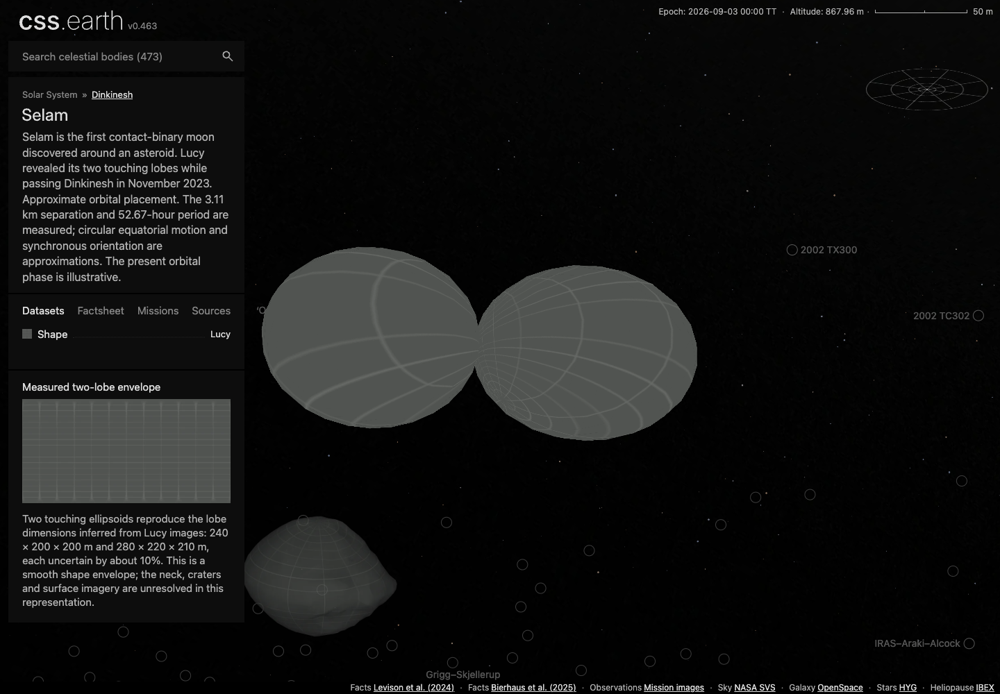
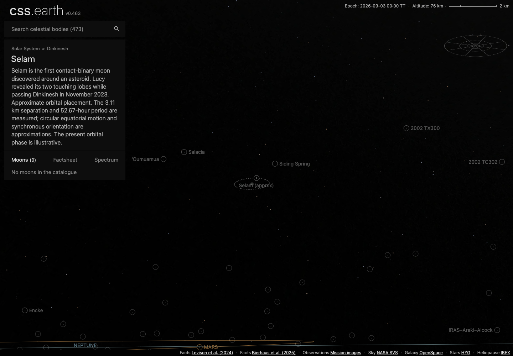

# Selam

Shape-only views use the shared neutral gray (#808080 sRGB). This is a display convention, not a measurement of surface color or albedo; gaps within photographic and scientific datasets retain the missing-data grid.

Selam is the first contact-binary moon discovered around an asteroid. Lucy revealed its two touching lobes while passing Dinkinesh in November 2023.

## Representation

Two touching ellipsoids reproduce the lobe dimensions inferred from Lucy images: 240 × 200 × 200 m and 280 × 220 × 210 m, each uncertain by about 10%. This is a smooth shape envelope; the neck, craters and surface imagery are unresolved in this representation.

Approximate orbital placement. The 3.11 km separation and 52.67-hour period are measured; circular equatorial motion and synchronous orientation are approximations. The present orbital phase is illustrative.

The shared missing-imagery grid covers the surface. The body uses the existing generic object adapter, one shared world camera and retained PolyCSS geometry. The selector detail is **Lucy**.

## Scientific sources

[Investigation ledger](investigations.json): recorded source decisions, evidence and conditions for revisiting them.

- [Levison et al. (2024)](https://doi.org/10.1038/s41586-024-07378-0): Lobe dimensions, separation and mutual period.
- [Bierhaus et al. (2025)](https://doi.org/10.3847/PSJ/ae1968): Later geology and limits of the Selam shape evidence.

[Measurements and source selection](source/measurements.json) · [Exact source pins](source/manifest.json) · [Reuse terms](NOTICE.md).

The two lobes touch at one point. Equal density defines the model origin; this is not a measured center of mass or a recovered neck mesh. Neither the contributed Celestia texture nor the earlier uncontrolled camera fit is used.

### Photographic source check, 13 September 2026

Lucy images resolve both lobes, but the present ellipsoid envelope does not
establish a three-dimensional surface or camera registration for that imagery.
[Jackson et al. (2025)](https://doi.org/10.3847/PSJ/ade23c) explicitly reported
that a Selam shape model had not been derived at the time of their analysis.
The later [Bierhaus et al. (2025)](https://doi.org/10.3847/PSJ/ae1968) paper
describes Selam's morphology from the images and a revised model for Dinkinesh;
the initial source check did not locate a measured Selam mesh and matched cameras.
A subsequent inspection recovered
[`selam_two_lobes.stl` from TEMPEST's public history](https://github.com/duncanLyster/TEMPEST/blob/7df4c88063ebe811cbdd25b97c19f85559607459/data/shape_models/selam_two_lobes.stl):
186,688 bytes, 506 distinct vertices and 1,004 triangles. Its SHA-256 is
`ba4ce642df6624c84130b981c9edb1f0ad8da6d4aae4cd809bb54165e7666b84`.
Inspection shows smooth lobe geometry; it does not establish recovered terrain
or image registration. The file's existence corrects the acquisition account,
but is not a reason to replace the present source-constrained ellipsoid envelope.
The [Dinkinesh source check](../dinkinesh/README.md#lucy-photographic-source-check-13-september-2026)
records the inspected archives and the L'LORRI geometric-header timing issue.
No surface texture, inferred neck terrain, or new landmark placement was prepared.

The [14 September source check](evidence/registration/source-check.json)
retrieved the later Bierhaus paper and checked its Selam-specific methods.
Section 3.1 explicitly measures Selam in the **unprojected** image
`lor_0752129590_03608` because it has no shape model. The archived
[`selam_placeholder_v00.tpc`](https://naif.jpl.nasa.gov/pub/naif/pds/pds4/lucy/lucy_spice/spice_kernels/pck/selam_placeholder_v00.tpc)
also identifies its pole as a placeholder. Its single ellipsoid cannot serve as
measured registration for our two lobes. The mission-document v2 delta adds a
Donaldjohanson coordinate-system document; its v1 predecessor was checked too.
These specific records do not provide the missing Selam controls. This is a
targeted source check, not an exhaustive claim that no such release can exist.

## Orbital placement

[Source parameters](source/orbit/published-parameters.json) separate published constraints from assumptions. The illustration places zero mean anomaly at JD 2461286.5 TT (3 September 2026), rather than extrapolating an uncertain encounter phase. A dashed orbit and circular selected marker distinguish this approximation. No uncertainty region, confidence interval or exact current phase is claimed. The fixed-epoch loader rejects other epochs.

## Evidence

The [browser conformance report](evidence/selam-conformance.json) passed desktop/mobile input, picking, wheel/pinch zoom, lighting, single-scene lifecycle and retained identity at DPR 1/2. Its [DPR 1 video](evidence/selam-dpr-1.webm) and [DPR 2 video](evidence/selam-dpr-2.webm) retain the input sequences. These were captured at `514f6b497`; body geometry, asset banks and input/lifecycle code remain unchanged in the final renderer at `66448c17d`. The production check below repeats the navigation and presentation affected by later changes.

The [Shadows-on view](evidence/selam-shadows-true.png) was also inspected. These production captures use Chrome 152.0.7977.84, 1440 × 1000 at DPR 1, renderer commit `66448c17d` and browser-review commit `437ecb0b2`. Documentation-only moves preserve the original report and image bytes. They show the adopted shape with the missing-imagery grid; they do not establish photographic registration or mission-model parity.

The [production navigation check](../dinkinesh/evidence/galileo-lucy/production-review.json) verifies visible **(approx)** labels, dashed paths, the standard **1 px** circle/orbit stroke, and selection of Dinkinesh with one mounted scene. Alternating existing retained segments carry the dashes; approximate circles omit the ordinary selected-body thickening. [Integrated checks and their limits](../dinkinesh/README.md#integrated-validation) cover the combined catalog.

## Preparation

[Reproduction instructions](../../../tools/objects/source-authoring/galileo-lucy/README.md). The canonical prepared mesh contains 1024 triangles, independent of device DPR. Sources, conversion and reduction happen before runtime.
