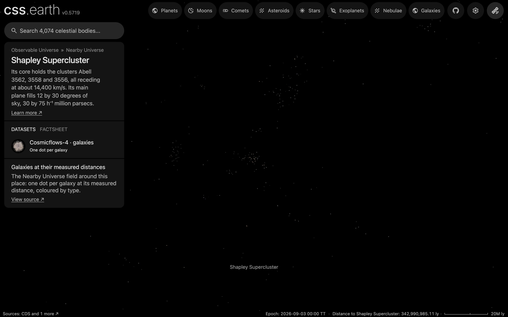

# Shapley Supercluster

The Shapley Supercluster as an object of the world: its place, its card and its list marker. It has no surface and no dots of its own: arriving shows its galaxies in the [Nearby Universe galaxy field](../nearby-universe-galaxies/README.md), whose README holds their sources, processing and known problems.

## Sources

| Source | Measurement used |
| --- | --- |
| [Proust et al. (2006)](https://arxiv.org/abs/astro-ph/0509903) | What the supercluster is: a core of Abell 3562, 3558 and 3556 near 14,400 km/s, and a main plane filling 12 by 30 degrees of sky (30 by 75 h⁻¹ Mpc). |
| [MCXC-II, Sadibekova et al. (2024)](https://cdsarc.cds.unistra.fr/viz-bin/cat/J/A+A/688/A187) | The position it is placed at: the X-ray centre of Abell 3558 (row MCXC J1327.9-3130 of the [tracked table](../galaxy-clusters/source/mcxcii.dat.gz)), and that cluster's redshift, 0.048. |
| [Cosmicflows-4, Tully et al. (2023)](https://cdsarc.cds.unistra.fr/viz-bin/cat/J/ApJ/944/94) | The distance it is placed at: Abell 3558's group (table 3, DMzp of group 47202: 189.8 Mpc), where the field draws the group's 65 galaxies. |

## Processing

1. The [astronomy record](../../../packages/astronomy/data/bodies/shapley-supercluster.json) places it at RA 201.9897°, Dec -31.5025° (J2000), 189.8 Mpc away, and says where each number comes from.
2. `node packages/bake/cli/prepare-object.mts shapley-supercluster` prepares its scene through the standard authored lane. The [recipe](object.json) declares no surface, so the scene is the camera, sky and world frame; the page frames it at 21.4 Mpc ([solar-system.json](source/presentation/solar-system.json)): half the 30 h^-1 Mpc short side of the main plane Proust et al. (2006) measured, with h = 0.7.
3. Its one dataset shows the Nearby Universe galaxy field, the bank the world already draws at this scale; `node site/build/prepare/companion-context.mts shapley-supercluster` draws the list marker from that bank.

## Evidence

The page's opening view in the app's renderer (1440 by 900 at device pixel ratio 2). A clump at the centre: 100 of the bank's dots lie within the framing radius, against a median of 8 in the same sphere at the same distance in 200 other directions. The counts are of the prepared bank (`src/objects/nearby-universe-galaxies/prepared/dots.bin`, 39,903 dots), every zoom level together.

## Known problems

- A supercluster has no single centre. Placing it at Abell 3558 is a choice: that cluster is in the core Proust et al. describe, and it is a row of MCXC-II with a Cosmicflows-4 group distance.
- The framing radius, 21.4 Mpc, is a presentation value: half the 30 h⁻¹ Mpc short side of the published main plane, with h = 0.7. The long side (75 h⁻¹ Mpc) does not fit the frame.
- The galaxy field ends at 200 Mpc and thins toward its edge, so the far side of the supercluster (the published main body spans 13,000 to 18,000 km/s) is not drawn. The view shows its near side and core.
- The renderer draws a share of the field that falls with the camera's distance from the Sun beyond 100 Mpc (100 Mpc over that distance), so the arrival view shows fewer dots than the bank holds here.
