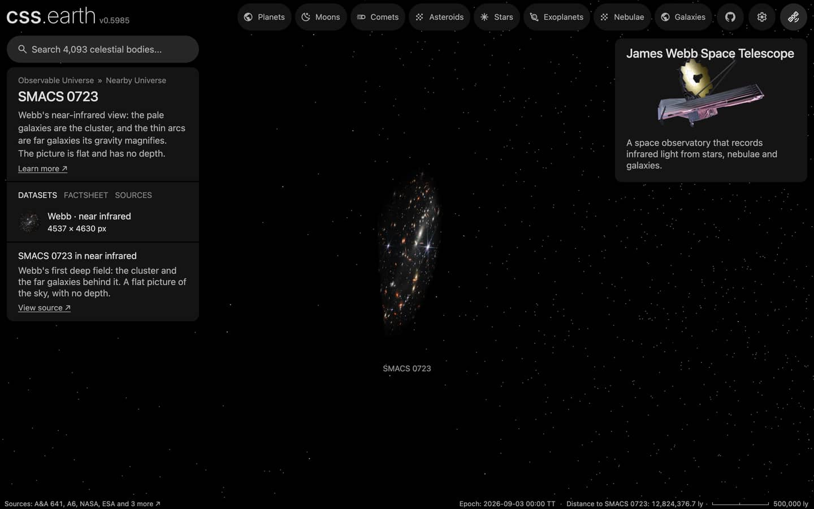

# SMACS 0723 members

The member galaxies of SMACS 0723 that a published catalogue flags, one dot each, drawn while the cluster is selected, with its [picture](../smacs-0723-layers/README.md). The cluster's place, distance and card are the [SMACS 0723](../smacs-0723/README.md) package's.

## Sources

| Source | Measurement used |
| --- | --- |
| [Amrutha et al. (2025), A&A 699, A105](https://cdsarc.cds.unistra.fr/viz-bin/cat/J/A+A/699/A105) | [Record](../../sources/amrutha-2025-smacs-0723-redshifts.json). Table `table1`, 193 galaxies in the cluster's field: J2000 positions, a magnitude and a membership flag. The 93 rows with ClMem = 1 (cluster member; the paper's members lie within its caustic curves) are drawn; the 100 rows with ClMem = 0 are left out. |
| [Planck Collaboration (2020)](https://arxiv.org/abs/1807.06209) | [Record](../../sources/planck-2018-cosmology.json). The comoving distance of the cluster's redshift 0.391, 1,568 Mpc: the distance every member is placed at. |

## Processing

1. The table is a CDS TAP query (`source/dots/points.json`, `table.origin`; not tracked): it keeps the flagged rows and writes the cluster's distance into each row.
2. `node packages/bake/cli/prepare-catalogue-points.mts src/objects/smacs-0723-members dots` places every member at the cluster's distance, spread in depth as widely as the members spread across the sky, and tones it by its magnitude ([recipe](source/dots/points.json)): 93 dots.

## Evidence

A headless browser capture of this version at 1440 × 900, device pixel ratio 2, on the SMACS 0723 page with the camera turned part of the way round the picture.

## Measured, chosen and assumed

| Value | Kind |
| --- | --- |
| Sky positions, membership and magnitudes | Measured: Amrutha et al. (2025), A&A 699, A105 |
| Distance 1,568 Mpc | Derived: the redshift's comoving distance in the Planck 2018 cosmology |
| Depth of each member within the cluster | Assumed: as deep as the members are wide on the sky; not measured |
| Tone scale, dot size, white color | Presentation |

## Known problems

- A member's depth is assumed, not measured, so seen from the side the dots form a ball around the flat picture.
- The survey is wide: its members span about 1.6° by 0.34°, far beyond the 2.3 arcmin picture, so most dots lie outside it.
- A member inside the picture's frame is also a galaxy in the picture, so from the Sun's side its dot lies over its own galaxy.
- The tone scale subtracts the distance modulus of the comoving distance from the observed magnitude. It is a display scale, not a rest-frame luminosity.
- No types or colors are in the table, so every dot is white.
